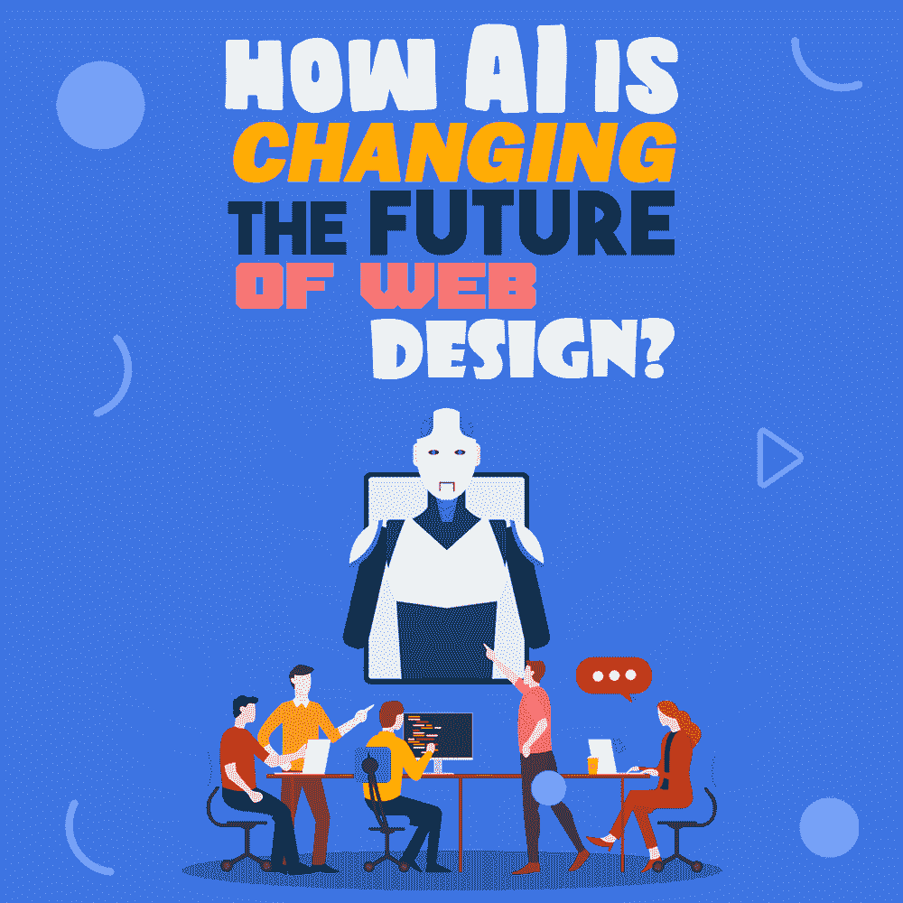
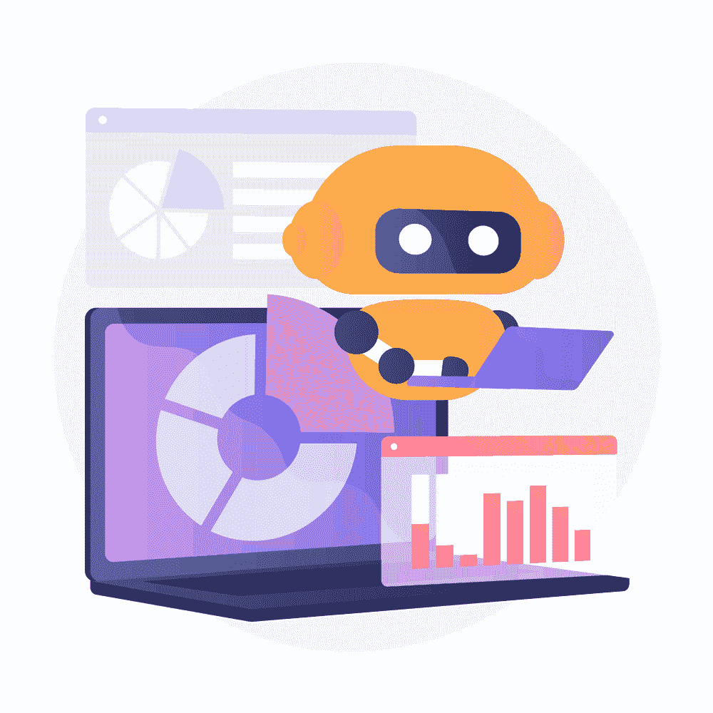

# 人工智能如何改变网页设计的未来？

> 原文：<https://simpleprogrammer.com/how-ai-future-of-web-design/>

From the moment you wake up till the end of the day when you go to bed, AI has simplified our way of living and made things easily accessible. For example, when you wake up in the morning, your phone unlocks the screen through facial recognition; or when booking a cab, you are provided with an estimate about the ride-time arrival and cost. All these elements include AI to ease out our daily chores.

对于不可预测但技术娴熟的未来，人工智能在网页设计中发挥着主导作用。如今，借助这一革命性技术的功能，大多数垂直行业都变得更加精确、经济、快速。以下是显示人工智能潜力的统计数据:

*   根据福布斯发布的一份报告，近 84%的企业认为人工智能将使他们获得并保持对竞争对手的优势。
*   [普华永道美国的研究显示](https://www.pwc.com/CISAI?WT.mc_id=CT1-PL52-DM2-TR1-LS4-ND6-BPA1-CN_CIS-AI-AIsocial)大约 72%的企业主要决策者承认人工智能让人类专注于有意义的任务。
*   根据《经济学人》发表的一篇文章，超过 [79%的高管相信](https://eiuperspectives.economist.com/technology-innovation/artificial-intelligence-real-world-0)他们的公司可以在人工智能的帮助下得到提升。

在本帖中，我们将看看人工智能如何改变网页设计的未来。作为一名开发人员或设计师，你可以利用人工智能的潜力来调整你的网页设计和开发任务，并增加你将目标用户转化为潜在客户的机会。

## 网页设计诊断

一般来说，人工智能有助于改善用户体验以及网页设计和开发的功能。然而，凭借其功能和改进，它也可以用作高度精确的诊断工具。

此外，在这个现代互联世界中，网页设计趋势随着搜索引擎标准的不断发展而迅速变化。这使得一个好的网站设计成为你生意成功的关键部分。

即使你已经有了一个好看的网站，你仍然需要通过运行定期测试来确保它得到适当的管理。借助基于人工智能的分析工具，如[书签](https://www.bookmark.com/?utm_source=BlogAdextAI)、 [Adext AI](https://www.adext.ai/) 、 [Uberflip](https://www.uberflip.com/site-engager/) 、[蜡笔](https://www.crayon.co/)等，您可以轻松地实时跟踪您网站的各种指标，如设计质量、跟踪竞争对手的活动、确定您广告的正确受众，等等。

## 计算机化推理

当你配置网站的用户界面时，你需要集思广益。它通常从一个空白的白板开始，负责 web 应用程序设计和开发的权威人士在白板上分享他们的想法。

一旦板上有了可以理解的结构，就可以捕捉照片，开始制作页面的静态 HTML 版本。这也是网页设计改进的过程。有各种各样的[工具可以帮助改进 web 开发](https://simpleprogrammer.com/7-tools-improve-web-development-workflow/)。

改进阶段需要几次努力，这使得在最初计划的过程中容易出现错误和延期。在人工智能在网页设计中的帮助下，企业可以简单地将绘制的结构转移到技术中，并立即获得设计的模型网站。

## 增强用户界面

人工智能的不断进步使得[在自适应技术和深度学习的帮助下优化和设计移动用户界面](https://appinventiv.com/blog/how-to-use-ai-for-better-user-interface-design/)成为可能，这些技术和深度学习允许他们自己做出重要的基于设计的决定。

首先，这个程序被训练来理解一个好的设计的各种原则，并观察一个网站的当前页面。这使得人工智能可以通过模仿独立的思想，在你的网站设计中进行功能性的改变，而无需任何人类的努力。

[Web 应用开发](https://appinventiv.com/web-app-development/)Wix 等设计平台在利用 ADI 实现 UI 管理自动化方面表现出色。他们的算法通过培养数十亿个设计组合并从中制作出独特的界面来工作。

## 影响购买决策

市场上的许多技术解决方案在社交证明的帮助下提供基于人工智能的产品推荐，这进一步有助于影响用户的购买决策。当潜在客户与您的网站交互时，这些工具开始根据他们的查询提供信息见解。

此外，通过合并插件和扩展，您还可以跟踪潜在客户的商店历史，并根据他们过去的购买情况提供建议。它也被世界上几家大型公司所使用。

例如，作为主要的视频流媒体服务提供商之一，网飞利用人工智能，根据用户之前观看的内容和搜索查询，向用户推荐新的电影和电视节目。

## 人工智能优化工具

AI has the ability to change manual UI design directly from something as simple as an image to a valid [HTML markup](https://www.amazon.com/dp/B01DXV1T8O/makithecompsi-20) code that looks after itself. Here, the AI can regularly control the entire content of your web design, that is, from visual components and typography to animations and other graphical data.

当特定网站需要设计决策时，这变得特别有价值。例如，当你有一个获得大量报价请求(RFQs)的电子商务网站时，你可以在它与客户的定期联系上使用相关的基于人工智能的工具和服务来增强它。

由于大多数网站所有者需要新的计划来增强他们的产品发布或即将到来的活动，在幕后工作的人工智能是保持更新和保持市场竞争力的理想解决方案。

人工智能通过收集网站分析、用户群、产品列表和其他关键方面的数据来工作。当信息完成后，人工智能将从你那里获得最终的指导方针，如主题、内容和颜色偏好，以制作完全独特的网站设计。

## 人工智能和人类——无人问津的交叉

在当今时代，[人工智能主要依靠人类](https://www.amazon.com/dp/1492036579/makithecompsi-20)来接收命令和学习新事物。此外，即使在这样一个科技发达的时代，很多人仍然不能贬低人情味的重要性。

因此，如果不使用人类的创造性智能，人工智能在鼓励创造力方面的作用大体上是一个有争议的问题。然而，创新如何帮助解决这一问题仍有待观察。

而且，在谈论 AI 接管工作的时候，很长一段时间都不会发生。目前，人工智能被证明是开发人员最好的朋友，使他们的工作更快，更易管理，更容易。这使得人类可以从事更复杂的任务，并将重复性工作留给机器人。