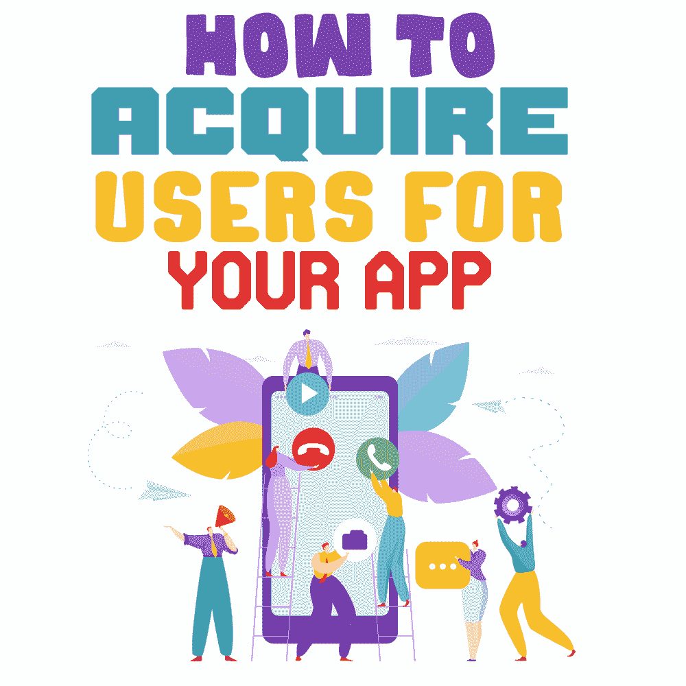
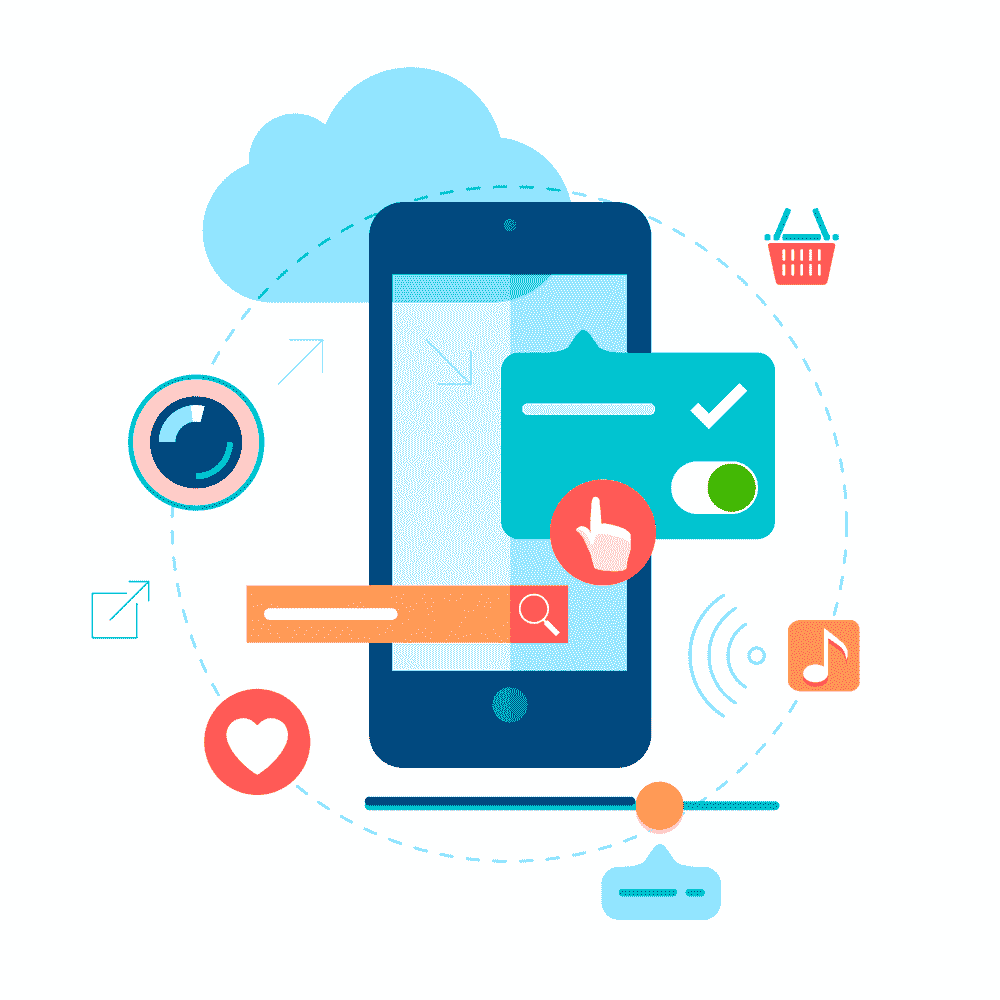

# 如何为你的应用获取用户

> 原文:[https://simple programmer . com/how-to-acquire-users-for-your-app/](https://simpleprogrammer.com/how-to-acquire-users-for-your-app/)

With over [2.8 million apps in Google Play Store](https://www.statista.com/statistics/266210/number-of-available-applications-in-the-google-play-store/) and [1.8 million apps](https://financesonline.com/number-of-apps-in-apple-app-store-in-2019-2020-demographics-statistics-and-predictions/) available in Apple’s App Store as of March 2020, the app market is growing at an exponential rate.Smartphone users are using mobile apps for different professional, personal, and entertainment purposes. But with so many apps being published every day, is your app competent enough to acquire users?

如果不是，你为什么要投入这么多时间和金钱来制作一个不能帮助你的客户的应用呢？

成功的应用程序不是一天建成的。要制作一款吸引用户的应用，需要一个精心策划的策略和大量的时间。这就是有效的应用程序用户获取策略发挥作用的地方。

获取 app 用户并非易事。吸引用户并保持他们的兴趣很有挑战性，这就是为什么一个好的应用策略很重要。

虽然这可能并不容易，但你可以将一些行之有效的策略运用到你的营销策略中，为你的应用获得新用户。我们开始吧！

## 确定你的目标受众

确定目标受众是为你的应用获取用户的最好方法之一。这是 **[最成功的营销策略](https://www.amazon.com/Mobile-App-Marketing-Monetization-thousands-ebook/dp/B00N14RSNY/ref=sr_1_3)** 之一，它将帮助你根据受众的喜好定制你的信息和电子邮件。

考虑你的目标的心理信息。想知道什么是心理学？这基本上是一种定性的方法，用来描述一个人的个人特征。其中包括:

*   个性
*   态度
*   价值观念
*   兴趣/爱好
*   生活方式
*   行为

确定你的应用程序如何服务于你的目标受众的兴趣，如何适应他们的生活方式。了解你的目标受众将如何使用你的应用，以及哪些功能对他们有吸引力，将有助于你获得更多用户。当你知道谁是你的目标市场时，你就能更好地推广你的应用。

让我们来看看全球最大的汽车共享服务公司 Zipcar 的营销策略。Zipcar 应用程序让用户只需轻点几下就能在全球范围内找到并预订 Zipcar。此外，该应用程序允许用户按时间、型号或类型对汽车进行分类。

以下是 Zipcar 的品牌定位声明。如您所见，陈述的第一部分定义了目标受众。

> “对于居住在城市、受过教育、精通技术、担心后代会继承环境的消费者来说，Zipcar 是一种汽车共享服务，让你省钱并减少碳足迹，让你觉得你做出了一个明智、负责任的选择，展示了你对保护环境的承诺。”

在推广其品牌的同时，Zipcar 并不打算针对所有人。他们也不是针对所有没有车的人。他们的目标人群是:

*   住在城市地区。
*   对科技感到舒适。
*   关心环境。
*   都是合格的受过教育的。

通过研究用户的兴趣和行为，Zipcar 通过社交广告和其他营销渠道专门针对其用户。这种分析有助于设计公司的社交媒体营销策略，以吸引更多用户使用他们的应用程序。

## 发送个性化电子邮件

发送个性化信息和电子邮件可以让你的用户知道你的应用对他们有多大用处。一旦你确定了你的目标受众，你就可以开始向你的客户发送个性化的信息。

你的信息应该能够抓住你的客户的注意力，并吸引他们下载你的应用程序。让你的用户知道你的应用与其他应用有什么不同，以及它的用途。此外，确保你的应用程序的功能符合你的业务目标，并在你的沟通中向你的客户传达你的品牌信息。

很有可能你的应用程序所解决的问题并不是唯一的，但是你的业务需要一个应用程序的原因绝对是唯一的。

例如，公司“A”开发了一个应用程序“Y”，公司“B”开发了一个应用程序“Z”。Y 和 Z 是帮助用户在线购买杂货的杂货购物应用程序。他们都解决了一个相似的问题。他们让用户不用出门就能在家门口买到食品杂货。

虽然 Y 和 Z 解决了类似的用户问题，但 A 公司和 B 公司需要该应用的原因完全不同。公司 A 是一家超市零售商，他们想要一款应用程序来与市场上已经推出其杂货应用程序的其他大品牌竞争。

公司 B 是一家小杂货店，正在寻找增加客户群的方法。有了自己的杂货应用程序，B 公司计划吸引更多用户来增加业务收入。

这里有一个疯狂之眼的案例研究，它帮助一家小型移动应用程序公司转化了更多的线索。

[疯狂眼球营销](https://www.crazyeyemarketing.com/)帮助小企业和企业家规划和建立销售和营销战略，以实现销售线索转化。

该公司向不同用户发出了 4，897 封电子邮件。在发出这些电子邮件后，该公司分析了哪些实际可行，哪些不可行，以增加该应用的客户群。

总体计划包括创建五个不同的电子邮件系列，然后将它们发送给数百人，看看哪一个效果最好。在分析了回复之后，最好的邮件被发送给了其他所有人。

当大量电子邮件被发送到不同用户的电子邮件 id 时，人们发现一些电子邮件地址甚至不存在。它们是假的。使用名为 [Kickbox.io](https://kickbox.io/) 的工具，该公司避免了发送 2000 多个“不良”电子邮件地址。

最后，这个策略奏效了，公司给用户发了邮件，其中一些变成了潜在的线索。通过这种方式，该公司能够借助发送给潜在客户的个性化电子邮件来扩大其用户群。

## 设计有效的预发布策略

One of the ways to acquire users for your app is to design **[effective mobile app marketing strategies](https://www.resourcifi.com/resources/ebooks/marketing/mobile-app-marketing-complete-guide/)** in the pre-launch stage. There are many pre-launch ideas that can help you generate some buzz around your app.

仔细浏览应用商店的指南。然后，确保您的应用程序遵循指定的准则，以便您成功启动应用程序。

你可以开展营销活动，引入推荐计划，以增加你的应用程序的用户群。奖励和激励吸引用户，激励他们下载你的应用。

另一个让你的应用获得更多用户的方法是创建一个吸引人的应用界面。一个具有直观用户界面的优秀应用程序有助于产生轰动效应。

创建交互式应用程序设计后，您可以推广您的应用程序的登录页面。收集所有对你的应用感兴趣的人的电子邮件地址，这样你就可以和他们保持联系。

以下是荷兰皇家航空公司如何创建一个有效的营销策略来增加其在线预订。荷航发起了为期三周的活动。在此次活动中，使用移动预订引擎的用户可以轻松获得移动优惠券。

这些优惠券帮助乘客在订票或点小吃和点心时打折。优惠券在苹果用户的存折和安卓用户的谷歌钱包中提供。用户会及时收到基于位置的通知，提醒他们兑现优惠券。

由于这一有效的营销策略，荷兰皇家航空公司的移动网站流量增加了 17%。这帮助 T2 的在线预订量增加了 34%，T4 的移动收入增加了 38%。

## 为你的应用获取并留住用户

创建一个应用程序并不容易。你肯定不愿意投入时间和金钱去开发一个失败的应用。

获取新用户的方法有很多，吸引新用户的正确方法也不只有一种。确保你检查了不同的营销渠道，以确定哪一个最适合推广你的应用程序。关注你的应用的评论和评级，探索提高你的移动应用评级的[方法](https://www.resourcifi.com/blog/improve-mobile-app-ratings/)。

虽然知道如何获得新的应用程序用户至关重要，但记住留住他们也同样重要。你需要一个客户保持策略，这样客户才会对你的应用着迷。留住客户有助于你的客户获取策略获得回报，因为留住一个客户总是比找到一个新客户更便宜。