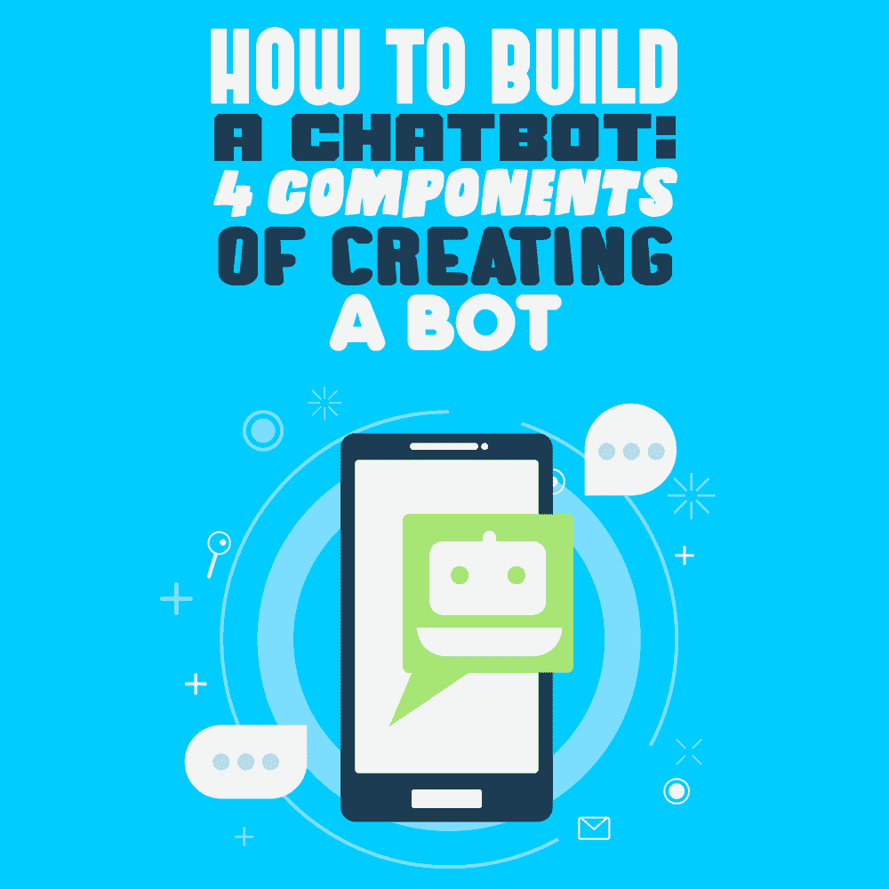
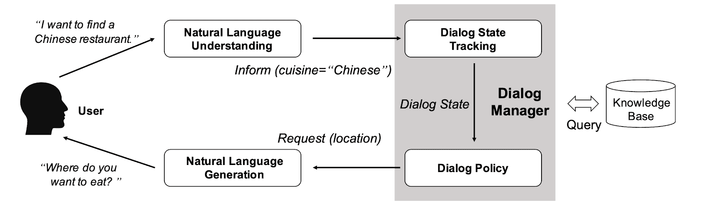
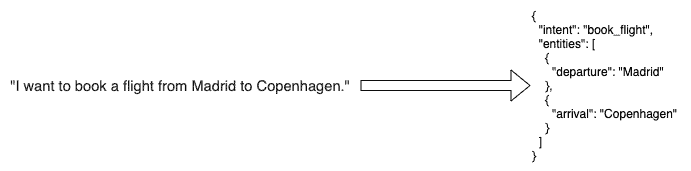

# 如何构建聊天机器人:创建机器人的 4 个组成部分

> 原文：<https://simpleprogrammer.com/how-to-build-a-chatbot/>

As a programmer, [I wanted to learn how to develop a chatbot](https://simpleprogrammer.com/artificial-intelligence-software-engineer/) by creating my own. I focused on the following components of developing a bot: the Natural Language Understanding (NLU) component, the Dialog Manager (DM), the Natural Language Generation (NLG) component, and the Modularized, or end-to-end, approach.

要构建一个成功的聊天机器人，需要考虑用户的观点。首先，用户向机器人写一些东西。机器人处理消息并生成响应。然后，响应被发送回用户。

这些步骤无限重复，直到其中一个对话者决定完成它。让我们更深入地研究一下上面描述的对话过程，让我们更详细地分析它们，以理解它的实际复杂性。

在这篇文章中，我将向你展示制作聊天机器人的要素，以及每个步骤所涉及的细节。聊天机器人在很多场合和商业中被使用，知道如何实现聊天机器人对于你的开发人员职业生涯来说是非常重要的。

## 构建聊天机器人的要素

当用户写东西时，机器人需要处理它。由于机器人不理解人类语言，我们需要一种方法来从我们的自然和非结构化语言翻译成机器可以处理和理解的任何结构化数据。

这一步叫做[自然语言理解](https://www.kdnuggets.com/2019/07/nlp-vs-nlu-understanding-language-processing.html) (NLU)。从用户消息到结构化数据的转换被称为“语义框架”

一旦处理了用户消息并产生了语义框架，机器人就可以分析这些结构化数据，以寻找接下来要采取的最佳行动，包括生成响应。

在这一步，机器人可能需要记住对话中的数据，所以它*不会一次又一次地问同样的问题*。这个过程由一个名为对话管理器(DM)的组件执行，它跟踪对话状态并选择与特定策略相关的操作。

最后，机器人选择的动作包括对用户的响应或要为该响应生成的数据。这些数据被传递给一个组件，该组件处理这些数据并将其翻译成人类语言的响应，然后显示给用户。这个过程被称为自然语言生成(NLG)。

图一。对处理对话所涉及的元素的可视化描述。

这些是构建机器人过程中涉及的要素。下面分别说一下。

## NLU 组件

如前所述，NLU 组件从用自然语言编写的消息中产生语义框架。这个帧通常由一个*意图*和一组实体组成，前者代表用户发送消息的意图，后者代表用户在消息中给出的数据。

例如，“我想预订一张从马德里到哥本哈根的机票”可以转换成如下图所示的结构:

图二。*NLU 组件。*

为了完成这种翻译，人们可以使用[经典自然语言处理(NLP)方法](https://www.amazon.com/-/es/Natural-Language-Processing-Python-spaCy/dp/1718500521/ref=sr_1_1?__mk_es_US=%C3%85M%C3%85%C5%BD%C3%95%C3%91&dchild=1&keywords=natural+language+processing+with+python+and+spacy&qid=1595932257&sr=8-1)或更多使用深度学习(DL)的[高级方法。](https://www.amazon.com/Practical-Natural-Language-Processing-Pragmatic/dp/1492054054/ref=pd_sbs_14_7?_encoding=UTF8&pd_rd_i=1492054054&pd_rd_r=d81406a8-ac73-4354-8215-073854d44421&pd_rd_w=ZIiyD&pd_rd_wg=zJ98b&pf_rd_p=bc074051-81d1-4874-a3fd-fd0c867ce3b4&pf_rd_r=ZS5KZDQF4MYM6PEZY0FA&psc=1&refRID=ZS5KZDQF4MYM6PEZY0FA)

通常，经典方法在数据很少或没有数据时使用，因为 DL 方法需要大量数据才能很好地执行。然而，在这种情况下，随着预训练模型的出现，人们可以选择 DL 方法，并使用自定义数据对模型进行微调，即使可用的数据很少。

## 对话管理器

这个部分是最关键的部分，因为谈话的成败很大程度上取决于它的肩膀。当然，对话过程中隐含的所有片段都非常重要。尽管如此，对话的连续性*和流畅度*很大程度上取决于这个组件在记忆(通过填充的槽)和动作选择方面的表现。

这就是为什么这件作品通常由两个子组件组成:

*   对话状态跟踪器(DST)
*   对话策略(DP)

DST *跟踪对话历史的*、槽以及与对话上下文相关的所有信息。提到的槽是*内存单元*，填充了通过语义框架、数据库调用、webhook 响应等接收到的实体。

DP 是负责*选择下一个动作*的子组件，基于语义框架、对话历史或所选动作的可信度。

让我们通过一个例子来理解这个组件必须处理的复杂性:

(1)用户:“我想从我的银行账户中提取 50 美元。”

(2) Bot:“哪种账户:活期还是信用？”

(3)用户:“我的信用账户上有多少钱？”

(4) Bot:“你的信用账户里有 100 美元的余额。”

(5)用户:“太好了！那我就从那个拿吧。”

(6) Bot:“好的，所以你想从你的信用账户中提取 50 美元。是这样吗？”

(7)用户:“好的，请。”

….

在(1)NLU 组件中，推断的意图可能是“取款 _ 金钱”,其中实体“金额”填充有$50。假设机器人已经知道用户，因为它是一个登录用户，并从数据库获取信息，获得两个帐户“当前”和“信用”，这填充了槽“可用 _ 帐户”。

DP 决定机器人需要知道用户想要从哪个账户中取款，因此下一个动作是在(2)中询问用户应该从哪个可用账户中取款。在(3)中，用户改变了目标，现在想要知道他们的信用账户中的余额。

DM 必须足够聪明，在目标改变后继续对话，但保留已经通过老虎机记住的信息。在(5)中，用户返回到初始目标，引用过去的数据而没有明确地指定它。

机器人必须关联这些信息，并且在(6)中，机器人在执行所需的动作之前基于或要求确认收集的数据。

如你所见，这不是一件容易的事；学术界和企业正在对这一过程进行大量研究。根据目标，人们可以选择更直接的方法或更复杂的方法。

最简单的实用方法也是最不灵活的方法是将对话建模为有限状态机(FSM ),其中每个状态代表一个动作，边代表意图。槽可以保存在键/值数据结构中。

更灵活的方法是将有限状态机与基于框架的系统结合起来，就像 GUS 在 1977 年描述的框架驱动的对话系统一样。

一种更复杂的方法——但同时也更复杂——是将对话建模为 ML 的分类问题，其中对话的历史、过去选择的动作和槽是特征，动作是要预测的类别。

## NLG 组件

自然语言处理将人类语言转化为非结构化数据，NLU 通过语法理解数据，而 NLG 从结构化数据中生成文本。

NLG 可以比作一个分析师，他解释数据并将其转换成单词、句子和段落。这个组件的主要好处是它创建了一个上下文化的叙述，键入隐藏在数据中的含义并进行交流。

一旦机器人知道下一步该做什么，应该会向用户生成一个响应，以便他们可以获得某种反馈。在用户收到反馈后，他们可以决定他们是否有足够的信息，是否可以完成交互，或者提出进一步的问题。

这里有*两个主要的解决方案:*最简单的一个是在模板中预定义响应，在生成响应时用占位符替换实际数据。另一个解决方案是动态句子生成，稍微复杂一点，在注入一些数据后，使用深度学习自动生成响应。它可以用于创建复杂的模板系统。

预定义响应解决方案的示例如下所示。这种模板可用于将数据直接翻译成文本。

“我找到了从{ { from_city} }到{ { to_city} }的机票。”占位符为{ { from_city} }和{ { to_city} }，替换为对话过程中收集的实际数据，给出这样的回应:“我找到了马德里到哥本哈根的机票。”

谁知道呢，也许 [GPT-3](https://www.zdnet.com/article/what-is-gpt-3-everything-business-needs-to-know-about-openais-breakthrough-ai-language-program/) 会给你这个组件的答案！

## 模块化方法或端到端方法

到目前为止，在本文中，我已经展示了构建聊天机器人的三个模块或组件:NLU、DM 和 NLG。然而，有一种不同的方法正在研究中，这意味着只有一个组件接收用户消息并生成响应。

用户可以说:“我想飞往哥本哈根”= >生成响应的 E2E 黑匣子= >周一和周二有航班。

这是端到端的方法，非常有趣，但目前它只存在于学术领域。不过，看起来很有希望！

这种方法的主要好处是，它允许您控制每个模块中的 NLP 过程，训练它，并单独改进它。另一个好处是单一责任原则，每个模块只负责一件事，方便代码维护。

## 为您的项目选择正确的方法

Up to this point, we have surfaced different techniques and approaches to developing a dialog system. Depending on your project’s needs, it *could be fine* to use a simple NLU using classical NLP methods together with an FSM-based dialog manager if the needed bot is very simple.

如果您正在研究 ML 提供的可能性，您可以选择模块化方法，每个模块使用不同的 ML 技术，或者您可以使用端到端方法。另一种选择是将它们结合起来——例如，将基于 ML 的 NLU 模块与基于框架的对话管理器和基于模板的 NLG 结合起来实现。

有许多可能性，极限是我们的想象力。我鼓励那些对构建 bot 感兴趣的人更深入地研究本文中讨论的不同选项，以发现哪个选项适合您的项目。