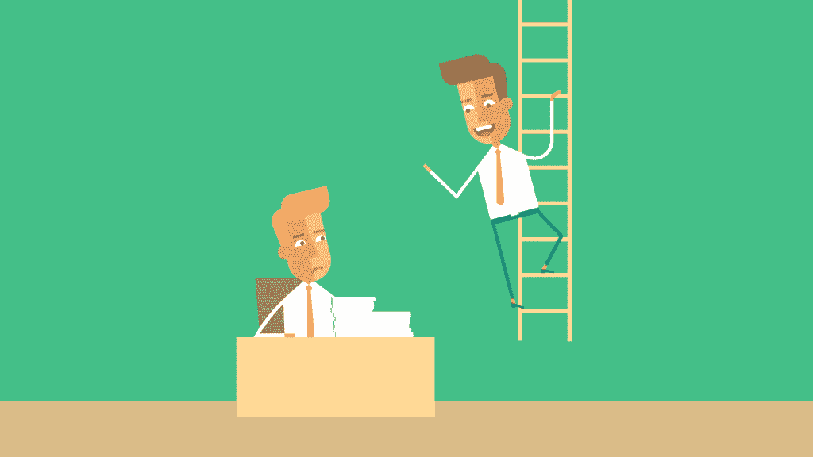
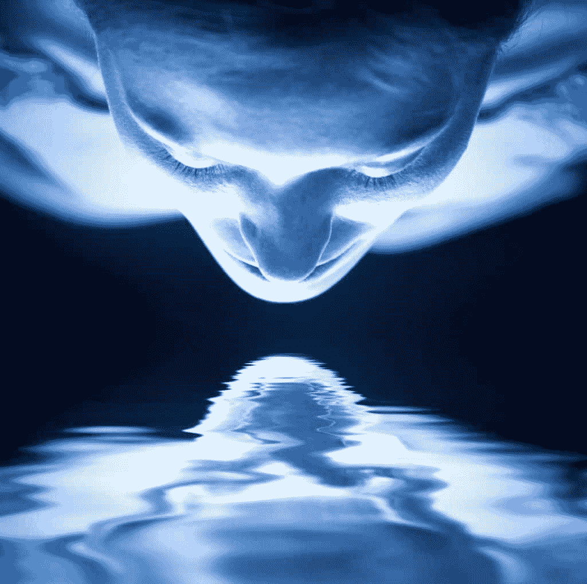
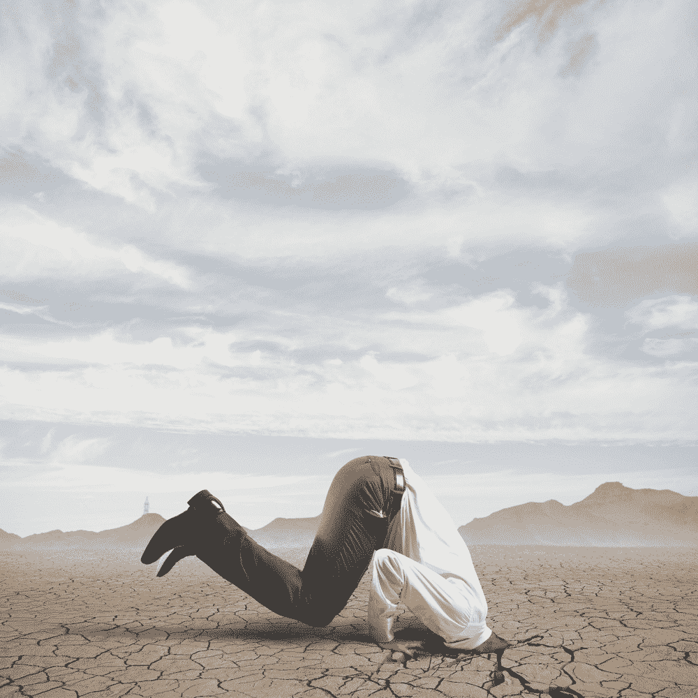
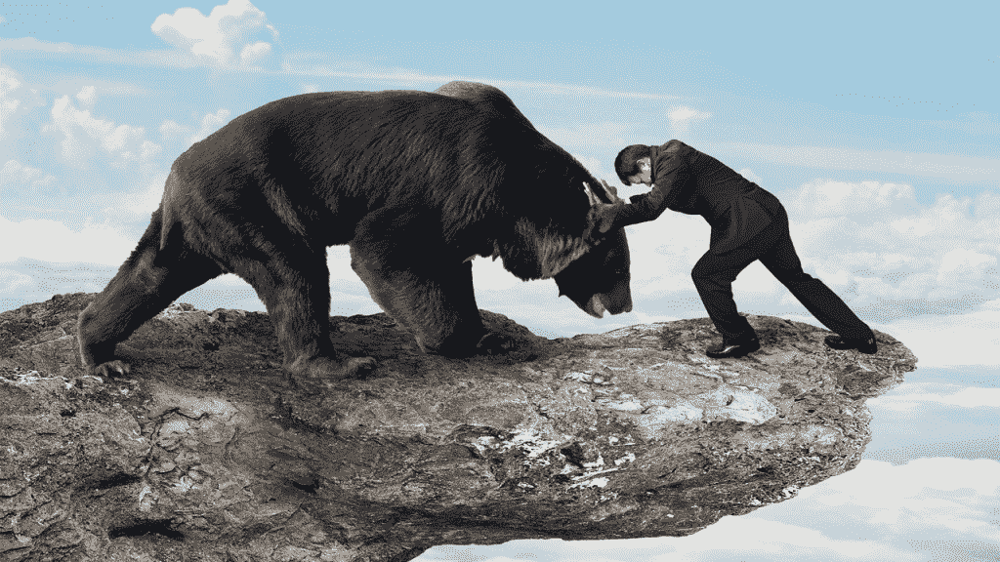

# 如何改变你的生活

> 原文：<https://simpleprogrammer.com/how-to-change-your-life/>

你一直梦想成为什么样的人？

你羡慕过谁？

如果你突然获得力量去做你认为不可能的事，并真正从生活中得到你想要的，你的生活会有什么变化？

今天，我要给你那种力量——我不会给你，但我会告诉你如何得到它——如果你愿意付出代价的话。

现在，你很可能甚至不相信你的生活有可能彻底改变…所以它不会。

但是每当你看到有人拥有你想要的东西，过着你想要的生活，成为你希望成为的人，你应该问自己，“为什么不是我？”

## 为什么不是我？

这是一个强有力的基本问题。

除了一些非常小的遗传和环境差异，**没有理由不应该是****——****为什么不能是****——****你。**T10。med rectangle-4-multi-110 { border:none！重要；显示:屏蔽！重要；浮动:无！重要；行高:0；边距-底部:15px！重要；左边距:0！重要；右边距:0！重要；margin-top:15px！重要；最大宽度:100%！重要；最小高度:250px 最小宽度:250 像素；填充:0；文本对齐:居中！重要}

我知道差距可能看起来很大，但事实并非如此。

是的，我们都是不同的。是的，我们在生理和心理上都不一样。是的，我们中的一些人有所谓的经济或社会优势。我们中的一些人甚至可能有没有完全毁了我们的父母。

但最大的区别——最重要的区别，真正重要的是回答了这个问题，“为什么不是我？”—是我们选择感知世界的方式，这最终决定了我们与世界互动的方式。

我们给自己设置的所有精神障碍、恐惧和限制都是阻止我们成为我们能够成为的人的原因。

再加上缺乏自律和不愿意感到不舒服，我们往往无法真正深入，咬紧牙关，尽一切努力完成工作，并把自己变得更好。

如果我们知道我们可以达到我们想要的结果，我们大多数人都会愿意投入工作，但我们中的许多人却没有。我们很多人都知道要去我们想去的地方需要付出什么，但我们就是不愿意去做。

好吧，我既不能保证你有一个结果，也不能强迫你走这条路，但我能做的是给你指明道路——至少是我发现的道路。

## 从诚实地评估自己所处的位置开始

好好的，努力的，诚实的照照镜子，第一次真正的看到自己。

摘下假发，摘下面具，光着身子站在那里，不把肚子吸进去。

面对关于自己的真相，大多数人会做两种事情之一:他们要么把头埋在沙子里，无视现实；要么他们**对自己撒谎，以便让自己感觉更好。**

无知可能是福，谎言可能会让你感觉不到现实冷酷无情的真相，但它不会帮助你成长或找到你想要的东西。

你可以有一张完美的地图，但如果你不知道你从哪里开始，你就无法知道到达你要去的地方的路径。在某种程度上，你甚至不知道目的地应该是哪里。

这就是为什么对自己完全诚实很重要——要认识到现实就是现实，任何一厢情愿的想法或无知都不会改变它。有些道理很难，但还是要面对。

大多数人永远不会面对真相；他们甚至不会去找它。他们害怕会发现什么。他们宁愿幸福地生活而不被察觉——睡觉。

你必须战胜这种冲动。你必须撕下创可贴，愿意打开那些锁着的门，面对它们背后的任何恶魔，不管它们有多可怕。

你必须愿意承认你最大的恐惧，看到你最大的失败，粉碎任何阻止你观察现实的幻想。

会很痛苦。

它会像*地狱*一样*伤害*！

然而，这是成为你所能成为的人，改变你的生活的必要的第一步。来回答这个问题，“为什么不是我？”伴随着响亮的“为什么不？”

既然你已经仔细照了照镜子，是时候改变你所看到的了。

## 表现得“好像”

This isn't a popular viewpoint. Plenty of people will tell you to be yourself and not try to be something you're not.

很多人会说你虚伪，告诉你接受真实的自己。

他们说对了一半。在你变得更好之前，你确实需要接受你自己——在你发挥出你的潜力之前——但是如果你在镜子前认真地审视了自己，你已经做到了。

马上闭上你的眼睛；我想让你看到你想成为的那个人。

理想化版本的自己是怎样的？你希望自己更自信一点，或者更迷人一点吗？你希望自己看起来更好，更有个性，也许更有钱，穿着更好，有时尚感吗？

也许你希望自己更聪明，或者更有名。或者你只是想要成功，不管你怎么定义它，或者更多的钱。

让你的想象力自由驰骋。想象一下那个完美的你。

或者如果你在这方面有困难，想象另一个完美的人。你的终极榜样。你想成为的人，但认为你永远不可能成为。

现在，我想让你尝试一下。

想象你就是那个人。冒充那个人。

我希望你能真实地看到自己走路、说话，甚至吃午餐，就像那个人一样。

这是持久改变的关键:表现得好像。

这是一个非常强大的概念。在你成功之前都是假装的。

而是选择扮演这个角色，直到你成为这个角色。

这很有效。

我知道。

现在可能看起来不是这样，但是我曾经是一个非常害羞、内向、懒惰和害怕的人。

我过去一点也不健康。

我曾经完全缺乏自信。

但是有一天，我早上醒来，不知出于什么原因，宇宙决定在我的脑海中植入一个想法，也就是我今天与你分享的想法。

## 改变生活的想法

改变我生活的想法是，我可以变成我想要的任何东西。为什么不是我？

我意识到没有什么根本的原因让我不能成为我想成为的那种人。

我意识到唯一阻止我成为我想成为的人的是采取简单的行动。

我意识到，如果我表现得像我想成为的那个人，那么在某个时候，我会停止表演，而只是做那个人。

这不是突然发生的。

我还在成长，越来越成为我想成为的那个人。甚至这个定义也在改变，因为我发现了关于我自己和整个世界的更深层次的真相。

但我已经上路了。与 20 年前相比，我是一个完全不同的人。我与五年前完全不同，甚至在更大程度上，与一年前也完全不同。

我正在做以前从未想过可能的事。我过着我从未想过的生活，这一切都是因为一个简单的想法:为什么不是我？

啊，但要是有那么简单就好了。

当然，我们可以照照镜子，看到令人厌恶的现实。

当然，我们可以想象我们理想中的自己，我们甚至可以假装是我们脑海中的那些人。

但是在这个梦想和实现它之间还有很大的差距。

## 这种差距就是恐惧

是的，恐惧。

在生活中，恐惧比其他任何东西都更能阻碍我们。

恐惧是自我完善道路上的守护者，他手持燃烧的剑，将我们逐出天堂。

恐惧有多种形式，从身体上对自我毁灭或痛苦的恐惧，到精神上对失败、艰难或拒绝的恐惧，以及对恐惧本身的真实恐惧。

我们不能因为害怕而表现得像自己想成为的人。我们害怕别人会怎么想或说我们。我们害怕被拒绝，害怕彻底失败。

我们害怕走出舒适区，做让我们不舒服的事情。

我曾经认为恐惧最终会自己消失。我曾经以为有一天我会变得自信或勇敢，我会彻底战胜恐惧。

我曾经认为我可以平息恐惧。我可以让它在这里或那里拥有我生活中的一点点——比如，我会开车而不是坐飞机——而它不会想要剩下的。

恐惧不是那样的。当你给恐惧一个最小的立足点时，它会越来越大，越来越多地占据你的生活。

你无法安抚它。

你不能忽视它。

它不会消失。最终不会消失。

必须面对它。

我们必须去感受，去面对，去克服。

我想告诉你我是如何学会克服恐惧的。

## 我是如何克服恐惧的

我曾经是一个非常害怕的人。我曾经完全缺乏勇气。

我记得小时候，当别人告诉我要去打针或钻牙时，我会跑出医生或牙医的办公室，把自己锁在车里。

我害怕在迪士尼乐园乘坐小飞象。就连彼得潘之旅也让我害怕。

我害怕和人说话。我害怕黑暗。我害怕外星人会在半夜趁我睡觉的时候把我带走。

我特别害怕和女孩说话。

作为一个成年人，我的恐惧只会增加。我永远不会去坐过山车。我对飞机产生了强烈的恐惧，以至于在我应该乘坐飞机之前的几个月里，我都害怕旅行，并且会利用一切人类已知的借口来逃离飞机。我经常在我应该飞的那天取消一次旅行，并吃掉机票费用。

然后有一天，这一切在一系列恐慌发作中达到高潮。

我当时在工作，突然感觉呼吸困难。

它没有消失。我一直觉得需要深呼吸，咳出肺部看不见的痰。

我觉得我要死了，我很害怕。

两个星期以来，我几乎一直处于这种状态。我勉强拖着自己去上班，然后大部分时间坐在浴室的马桶上，等着时间一分一秒地过去，这样我就可以回家睡觉了——这是我恐惧的唯一解脱。

我以为我的整个生活都要被毁了。我会失去工作、婚姻和理智。

我尝试了各种方法来克服恐惧。首先，我试图忽略它，假装它没有发生在我身上，或者用别的东西分散自己的注意力，所以我不能专注于它。

那没用。我越想忽视它，它就变得越糟糕。

然后，我试图合理化它了。我做了各种肺活量和呼吸的测试。我出来时非常健康，但这并没有让我感觉更好。

有一天，我在网上偶然看到一个视频，是关于如何应对恐慌症发作的，作者谈到了这样一个练习，在这个练习中，你没有试图屏蔽恐惧，而是选择充分体验恐惧。

这个想法是，你只是坐在那里，尽可能把强度调大，不要挡住任何东西。

你强迫自己感受每一次恐惧，每一次心跳，每一次呼吸。你拥抱它。

我没什么可失去的，所以我试了一下。

几乎立刻就见效了。

当我允许自己充分体验恐惧并直面它时，我意识到没有比这更糟的了，这甚至还不算太糟。

## 我的生活完全改变了

我开始把这个技巧应用到我所有的恐惧中。

首先，我开始与人交谈，把自己放在那里。

然后，我开始驾驶飞机。我不再戴上耳机，试图分散自己对湍流的注意力，我找了一个靠窗的座位，强迫自己在看着窗外的时候，感受那种对起飞毫不分心、毫不放松的恐惧。

就在几周前，我开车去了六旗魔法山，在公园里坐了八次最恐怖的过山车。

我不会就此罢休。我每天都在战胜新的恐惧。

我过去认为勇气是没有恐惧，但现在我认识到它是不顾恐惧而行动。

## 你呢？

所以现在是时候问自己:你害怕什么？

是什么阻碍了你？

你知道你在哪里。你知道你想去哪里，但是桥上拖你后腿的龙是什么样子的呢？

你害怕你会失败吗？

你害怕自己看起来像个白痴，或者让自己尴尬吗？

你害怕你会被拒绝吗？

你害怕自己不够好吗？

也许你只是害怕所涉及的工作量。也许你害怕你将要经历的痛苦，无论是身体上的还是精神上的。

不管那种恐惧是什么，你必须愿意面对它。不是明天，不是下周，不是当它消失或你准备好的时候，而是现在。

这不是彩排。

此时此刻，你正在过自己的生活——很可能是你一生中唯一的一次。

所以，这取决于你是否决定充分享受生活。

我曾经害怕死亡，但后来我意识到有多少人在真正有机会生活之前就死去了。

不要让那成为你。