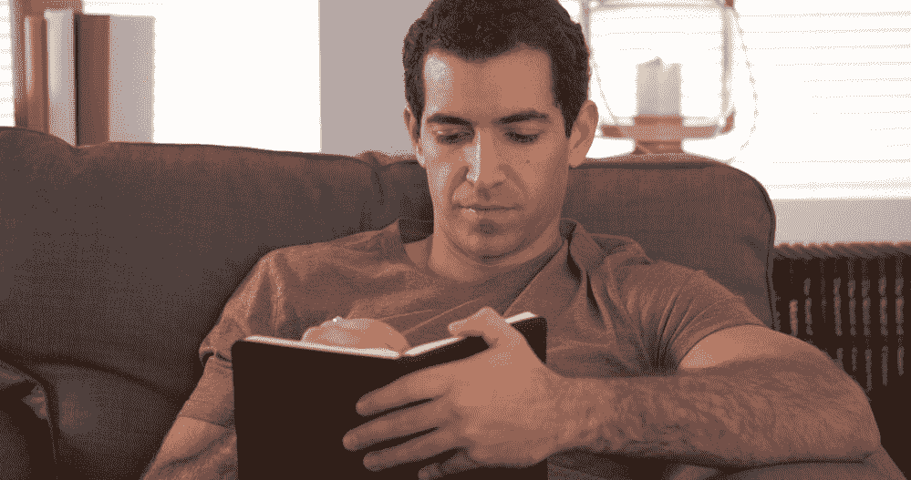
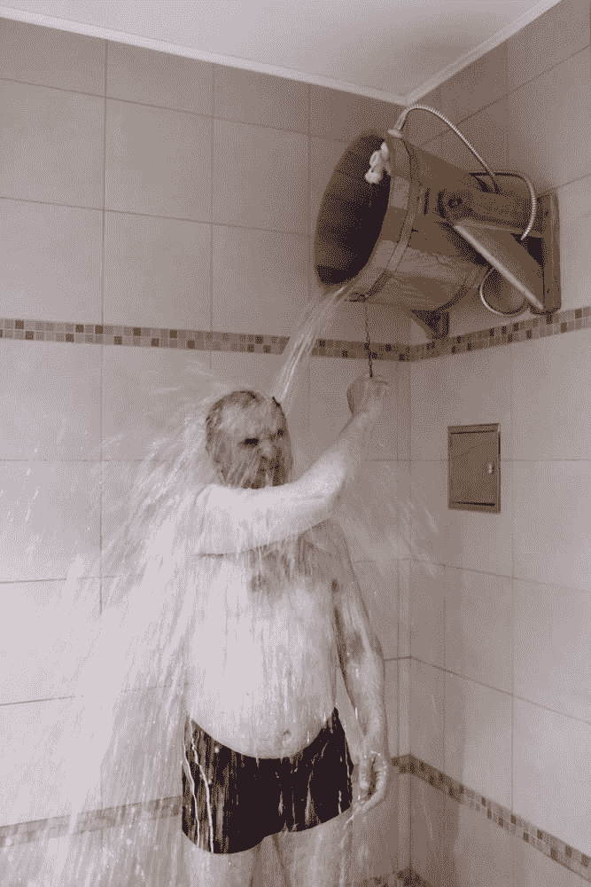
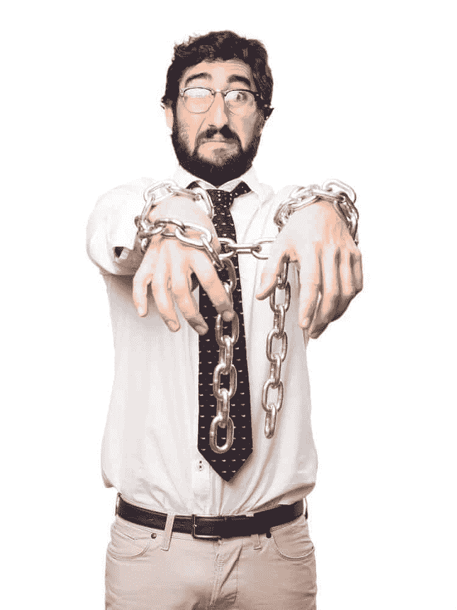

# 如何更好地掌控自己的生活

> 原文:[https://simple programmer . com/how-to-gain-more-control-over-your-life/](https://simpleprogrammer.com/how-to-gain-more-control-over-your-life/)

我们大多数人都缺乏实际行动和实现目标的能力。

是真的。我们知道我们应该做什么，我们知道我们想做什么——但是我们的大脑太虚弱了，无法控制我们的身体，让它们屈服。

想象一下，如果你能学会控制自己，你会拥有什么样的力量。

想象一下，如果你能在必要的时候强迫自己走上更艰难的人生道路，你会实现什么样的梦想和目标。

我们很少有人缺乏预见自己想要什么的能力——我们只是缺乏得到它的自律。

即使是现在，当你坐下来阅读这篇文章时，你可能会因为忽略了一些为了实现你的目标而必须做的事情而感到内疚。

然而你无法强迫自己采取必要的行动。

一次又一次，你失败了。你没有坚持节食。

你没能去体育馆。你没有花时间进行自我教育，而你曾向自己承诺过要这样做。

你没有做你想做的事，反而做了相反的事。

我怎么知道这个？

因为我也被困在了这个陷阱里。

我知道无法掌控自己的生活是什么感觉。

除非我们明确地采取行动和步骤来重新控制我们的生活，否则这就是我们的默认状态。听天由命，我们都会缺乏自我控制所需的自我控制和自律。

在我的上一篇文章中，我展示了缺乏自律是如何直接导致你和我的生活失去控制的。

我谈到了我们当中很少有人能真正掌控自己的生活，以及强加给我们的危险。

在这篇文章中，我想告诉你如何做些什么。

## 从设定目标开始

在你能够获得自我控制和控制你的生活之前，你需要有你想要实现的目标——否则你将不知道该瞄准什么方向。

不知道自己想要什么，就很难得到。

没有目标和明确的方向，你更容易受到任何干扰的影响。

你可以拥有世界上所有的自律，但是如果你不知道你实际上应该做什么，你将无法完成它。

大多数人对我们想要在生活中完成的事情有一些模糊的想法，但是我们还没有足够的思考来把它们变成具体的目标。

我们内心深处知道我们想要更健康，我们想要更成功或赚更多的钱，我们努力朝着这个总的方向前进。但是我们绝望地失败了，因为我们真的不知道我们应该做什么。

我希望你能明白，这种生活方式与掌控自己的生活截然相反。

如果你不知道你要去哪里，那你哪里也去不了。

所以在你得到你想要的东西之前，你必须知道它是什么。

你真正的目标是什么？

你想减 10 斤吗？

你想得到某个职称吗？

赚到一定的钱？

学习一项新技能？

不管是什么，决定，并开始朝着那个方向前进。

(关于设定目标的一些具体建议，请查阅我的书《软技能:软件开发人员的生活手册 》中的第三章，我会更深入地讨论这个话题。)

## 开发一个系统来提醒你检查和重新评估你的目标

设定目标是一回事，坚持到底又是另一回事。

在我之前的文章中，我谈到了如果我们不能捕捉想法并提醒自己我们真正想要完成的事情，我们会如何让生活中的控制线从我们的手指中溜走。

不止一次，我有一个崇高的想法或计划，但我从来没有实施，因为我只是忘记了它。

每隔一段时间，生活都会给我们一个清晰的时刻，让我们能够比以前更清楚地看待事物；启发我们的短暂的洞察力。

这些时刻很珍贵，也很少。如果我们在这些时刻不立即采取行动，为我们自己建立一些方法来保持这些火种不灭，我们就有可能永远熄灭它们。

这就是为什么对你来说，不仅要记录你的想法和抱负，而且要不断提醒自己，评估自己的进展，这是至关重要的。

有许多方法可以创建这样的设置。

[这是我使用的确切系统](https://simpleprogrammer.com/2014/10/09/plan-week/)——随便偷。

但是你的系统是什么并不重要，只要你有一个。

至少，您的系统应该允许您:

1.  捕捉新的想法和目标
2.  自动提醒你回顾那些想法和目标

这可以简单到在文本文档中包含一个列表和一个周期性的日历提醒，也可以像我开发的这个一样复杂。但是，如果没有任何一种系统，你的生活将受到随机机遇的支配，并且将自己限制在一天内可以完成或想到的事情上。

## **培养自律**

没有具体的目标和系统来提醒你，你就像一台只有内存而没有硬盘的电脑。每次重新启动时，你都会丢失所有的数据，因此永远不会取得任何真正的进展。

然而，仅仅拥有永久的存储并不足以真正成功并对你的生活施加有意义的控制。

要真正控制自己，你需要自我控制，而这只有通过自律才能实现。

自律不是一项容易掌握的技能，但它绝对可以通过时间和奉献来培养。

当我坐在这里写这篇文章时，我很饿。正如我在之前的文章中提到的，[我每天禁食到下午 5 点](https://www.youtube.com/watch?v=UAScRmlcHaE)。我已经做了一年多了。

我每天早上醒来，要么去健身房，要么跑步，很少错过一天。

五年多来，我每周至少写一篇博文。

我能够强迫自己做一些我并不总是想做的事情，但我并不总是这样。

我过去非常懒惰。

我过去常常缺乏自控、自律和任何意志力的表现。

我小时候甚至被医学诊断患有多动症，其中两个主要症状是缺乏冲动控制和无法集中注意力。

但现在我有钢铁般的意志。我下定决心要做的事情很少是我自己无法完成的。

我并不完美——远非如此——但我已经通过有意识的自律实践学会了自我控制的艺术,你也可以。

## **控制自己**

在我们谈论如何获得自律之前，我们必须多谈一点什么是自律。

简单来说，我把自律定义为“做自己想做的事情的能力。”

如果你能专心于一项任务并完成它，你就有了自律。

如果你不能，你就缺乏自律。

有自律的人会在早上醒来说:“我今天要做 x，y，z”，他们就会去做。

没有自律的人什么都不会做，只会为所有的事情找借口。

简单明了地说，如果你不能做你想做的事情，你就没有自律。

## **心甘情愿地忍受苦难**

这似乎有点极端，但是培养自律的最好方法之一就是心甘情愿地让自己经受各种各样的困难。

通过有目的地体验一些精神和/或身体上的不适并克服它，你能够[增加你的精神韧性](http://www.amazon.com/exec/obidos/ASIN/0062358294/makithecompsi-20)，这是发展自律的重要部分。

举一个我前面提到的例子——每天禁食到下午 5 点。起初，这似乎并不重要，但请这样想:如果你可以每天下午 5 点之前不吃任何东西，你认为做其他可能会让你感到不适的不太费力的事情会变得容易多少？

事实上，这个想法一点也不新鲜。古罗马的斯多葛派经常实践通过自愿的不适进行训练的想法，作为变得更强壮的一种方式。

我在网上非常尊敬的一个人，乔尔·鲁尼恩，竟然提倡每天早上洗 5 分钟冷水澡。

现在，我不得不承认，我自己还没试过。但我肯定会的。

我再次意识到，这整个想法可能看起来有点疯狂和自虐，但我从个人经历中知道，通过让自己承受一些不适，我变得更加坚强和自律。

作为一个额外的奖励，当你让自己不舒服时，你会更有准备去处理随机的曲线球，失望，以及生活自己给你的偶尔的耳光。

如果你不想让自己挨饿，不想走过热煤，不想洗冷水澡，但是你仍然想练习一些自愿的不适，从一些简单的事情开始。比如，承诺每天在特定的时间去跑步，早起，甚至每天写 1000 字。

我每天都试着做一件我不喜欢的事情。

它让我不至于过于安逸和自满，并坚定了我的决心。

心理韧性是自律的核心。如果你强迫自己做让你不舒服的事情，你就不会成功地掌控自己的生活。

## **养成良好的习惯**

减少自愿做不愉快事情的精神负担的一个方法是让它们成为一种习惯。

我不知道有谁喜欢刷牙，但对我们大多数人来说，这是一种习惯，我们很少或根本没有意识到努力或不适。

创造新习惯最困难的部分是开始，这个时候这个习惯实际上需要很大的意志力来执行。(之前其实根本就是一种习惯。)

但是一旦你能够度过形成习惯的最初阶段，习惯本身就可以非常接近自动驾驶，不再消耗你有限的意志力。

我不想陷入习惯的细节以及如何养成习惯，但是我有几本关于这个过程的非常好的书可以推荐。

首先，关于这个话题的一本书是查尔斯·杜希格的《习惯的力量》 。这本书讲述了习惯是如何形成的，以及如何改变现有的坏习惯，把它们变成好习惯。

另一个真正好的是 *[习惯超人](http://www.amazon.com/exec/obidos/ASIN/1503295591/makithecompsi-20)* 。在这本书里，Tynan，一个我个人非常尊敬并长期关注的人，谈到了习惯的形成，并提供了一些关于如何培养不同类型习惯的建议。

当然，我在自己的书里有一章专门讨论习惯的养成， [*《软技能:软件开发人员的生活手册*](https://simpleprogrammer.com/softskills) 》。

“我们就是我们反复做的事情。因此，优秀不是一种行为，而是一种习惯。”

*—威尔·杜兰特(总结亚里斯多德)*

## **提前做决定(避免判断判断)**

任何时候我们必须对某事做出决定，都需要做出判断。

我们做出的每一个判断都会削弱我们的意志力。

因此，我们每天做出的判断越少，就越能更好地控制我们的行为，最终控制我们的生活。

我已经能够通过简单地提前做决定来对我的生活施加巨大的控制，所以我不必当场做出判断。

想要一个好的例子？

当我在训练减肥和从完全的胸肌撕裂中恢复后恢复体型时——哎哟——我提前计划了一周的所有膳食，所以我知道会发生什么。

通过提前做出这些决定，我不必像决定在一周内的每一餐都尝试做出健康的选择时那样，花费太多的意志力来吃得健康。

我已经提到过[我如何计划我的一天和一周](https://simpleprogrammer.com/2014/10/09/plan-week/)，但那是同一技巧的另一个应用。如果我确切地知道我在一天中的任何特定时间应该做什么，我就不太可能做出糟糕的判断，开小差或拖延。

我还经常准备在不同情况下如何应对的决定。

如果我要出去吃饭，我会试着提前决定我的饮食计划。我可以喝酒吗？如果可以，喝多少？我可以点甜点吗？

尽可能多地准备决定总是最好的，因为这样你更有可能从逻辑的角度而不是情绪的角度来做决定。

## **去除诱惑**

不管你有多强，如果你反复接触诱惑，你会更容易崩溃。

如果你想更好地掌控自己的生活，你就应该关注那些更容易掌控的事情。

抵制诱惑就像试图踢开一扇钢筋加固的门。当然，你可能会成功，但是当你可以从后窗溜进去的时候，为什么要让自己面临可能的失败呢？

与其直面诱惑，不如一开始就摆脱它。

吃太多甜食有问题吗？把它们从你的房子里拿走。

你每次坐下来想做些工作的时候都会拖延吗？使用像[冷火鸡](http://getcoldturkey.com/)这样的程序来禁止任何可能会让你偏离目标的网站。

然而，变得意志坚强仍然是个好主意，这样你就可以在需要的时候抵制诱惑。但是没有必要让事情变得更难。

## **训练身体和头脑**

我已经谈到了为了增加精神和身体的韧性而心甘情愿地让自己经受磨难的好处，但是直接训练身体和心灵也可以对自我控制和自律产生积极的影响。

有规律的锻炼和锻炼你的身体的习惯建立了身体和精神上的耐力，使你更容易维持自己并实现你的目标。

我个人注意到，一旦我开始养成定期跑步的习惯，我的自律性就有了巨大的提高。

跑步是锻炼身体和大脑的好方法。虽然跑步是体力上的，但是当你无聊或疲惫的时候，坚持下去需要精神上的力量。

你可以通过强迫自己长时间不间断地集中注意力来单独训练大脑。

这种训练对帮助我处理我的多动症倾向和学习变得非常有效率非常有价值。

你的工具越强大，你使用它们的效率就越高。

如果你想有效地指导你的生活，拥有强壮的身体和坚强的意志将帮助你实现这个目标。

## **永远完成**

当我成为一名终结者时，我的生活才真正开始改变。

大多数人不会完成他们已经开始的事情。

大多数人都有一个装满破碎梦想的抽屉和一个满是灰尘、未完成项目的壁橱。

坚持并完成你已经开始的事情需要很大的勇气，但是回报是很多的。

通过完成你开始的事情，你实际上从你所做的事情中获益。

大多数时候，90%完成的项目和 10%完成的项目一样没有价值。当你真正完成某件事时，你会从你投入的时间中获得收益。当你有未完成的事情时，你可能已经完全浪费了那段时间。

你的生命只有这么多时间，所以你浪费的时间越多，你就越不能有效地控制你的整个生活。Kapeesh？

完成也成为一种习惯，强迫自己完成你开始做但不再感兴趣的事情教会你如何在没有动力的情况下工作——这是自我掌握道路上的一项必备技能。

## **你生来就是奴隶**

我想我应该以告诉你你生来就是这个世界的奴隶来结束这篇文章。

是真的。我们都是。

我们每个人都有控制自己生活的错觉，但实际上我们被以下因素所控制:

*   我们自己的情感
*   他人的操纵
*   社会规范
*   害怕
*   我们自己的弱点

这个清单还在继续…

挣脱束缚你的枷锁取决于你自己。

没有人会为你做这件事。

如果你没有坚强的意志来掌控自己的生活，决定自己想要的方向，那么无论命运之风将你抛向何方，你都会被抛向何方。

这可能是一条漫长的道路，但不要担心，如果你继续努力，你会到达那里。

现在的关键是迈出第一步。

那么，你的第一步是什么？

在下面的评论中公开承诺吧。