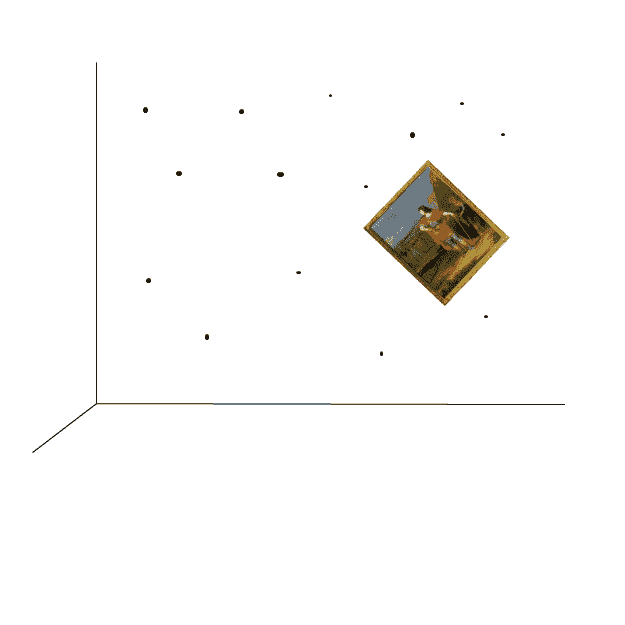

# 如何挂一幅画:敏捷用户故事

> 原文:[https://simple programmer . com/how-to-hang-a-picture-agile-user-stories/](https://simpleprogrammer.com/how-to-hang-a-picture-agile-user-stories/)

有多少次我们完成了一个敏捷用户故事或者待办事项，却以这样的事情结束？

墙上的洞，在冲刺阶段我们在那里改变了 10 次需求；图片是歪的，因为那是最终需求所说的；照片没有放在墙的中央，因为我们已经在那里的石板上打了太多的洞。

我们实话实说吧。如果你雇了一个人来你家在你的墙上挂一幅画，他最后做了一个和上面一样的工作，你不会认为这是你的错。您的用户或业务人员也不知道。他们寻找那个带着傻笑拿着锤子的人。

从他的角度来看，这是有道理的。在他看你的墙之前，他让你画一幅你的客厅的画。他让你告诉他你想挂的那幅画的确切尺寸。他甚至问你挂这幅画的准确高度和水平距离。你不能给他提供任何这些东西，所以你给他最好的描述你的客厅，画的大小和挂在哪里。说完，他尽力把画挂在了墙上。直到他“完了”，你才再听到他的消息(他公司的某个陌生人甚至过来用卷尺测量了一堆，检查了钉子的强度和一堆其他测试，最后还声明已经完成。)

你看看这个作品。很好地固定在墙上，尽可能保持水平，准确地固定在错误的位置。你对这项工作有点吹毛求疵。他拿出他的录音机，回放你对这个地方的准确描述，以及你希望这幅画如何悬挂。当他回放时，他指出他是如何按照你的要求做的。在某种程度上，他是对的。他所做的和你所说的一致，唯一的问题是你所说的可以有几种解释。他解释的方式不是你想要的；他应该问更多的问题。当你看到这幅画的位置时，你意识到原来的高度，他实际上是正确的，不再是你想要的了，现在你可以看到墙上的画了。

你再试一次，这次试着更具体地说明你的要求。他问了很多问题，如果没有看到这个项目，你很难回答。最后，过了一段时间，你们就应该如何做达成了一致，他开始撕掉旧画，重新挂起来。在“完成”之前，你不会再听到他的消息这个过程不断重复，墙上的洞越来越多，你的话回放得越来越多。他真诚地试图做好工作，你真诚地试图告诉他你认为你想要什么，但这很难提前。

最后你就以上图结束了。你的墙上有很多洞，一幅画挂错了地方。这不是你想要的，但是你不想再经历这个过程，你决定你可以“让它工作”

## 你发现问题了吗？

如果你只是在指责任何一方，那你还不够努力。

问题是，你绝不会这样挂一幅画。如果你要雇人挂一幅画，你会站在客厅里，而他们会在不同的高度和位置把画挂在墙上。在附近听的人可能会听到:

“高一点，高一点……好了，现在停下来。再低一点等着。向左一点怎么样？嗯，我觉得不太直。好了，现在是了。是的，看起来不错。亲爱的，你怎么看？”

## 你呢？

那么，你是如何开发你的待办事项或者用户故事的呢？你会像第一个例子那样做吗？在第一个例子中，你会先询问所有的需求，然后构建你认为业务人员想要的东西。或者，你是否像第二个例子一样，在构建解决方案时与客户一起工作，而不是在你知道你已经构建了用户想要的东西时才在墙上钉钉子？

作为开发人员，特别是如果我们来自瀑布背景，我们倾向于想要预先得到所有的需求。通常很难弄清楚如何与客户一起构建解决方案，而不是简单地收集需求，然后进行工作。您的组织中也可能存在阻碍您这样做的障碍。

以下是一些帮助客户参与的技巧:

*   共处一地。最好的沟通方式是面对面。如果你必须发电子邮件、发信息或给你的业务人员或客户打电话，你就增加了开销，这使得事情不太可能发生，也更加困难。
*   保持业务问题的故事，而不是解决方案。这将迫使您稍后与客户讨论解决方案。
*   不要试图为故事做一个预先的设计。取而代之的是，在进行过程中进行小型设计会议。
*   一旦你有东西要给客户看，就给客户看，即使它在你自己的开发工作站上，即使它是你用马克笔画的一幅画。
*   让客户与进行测试的团队或人员一起开发或共同开发测试用例。开发人员应该构建通过这些测试用例的东西。
*   弄清楚谁是真正的顾客。你可能无法控制这么多，但有时假装客户的人并不是真正使用产品的人。如果是这种情况，你必须找到一种方法来解决这个问题，或者很好地代表真正的客户。