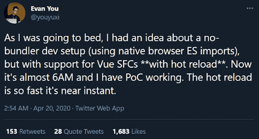
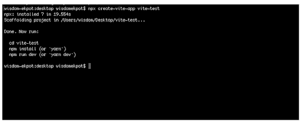
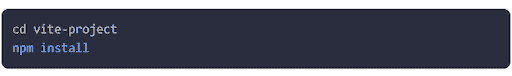
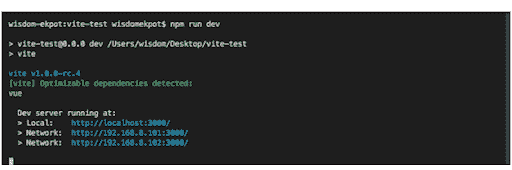
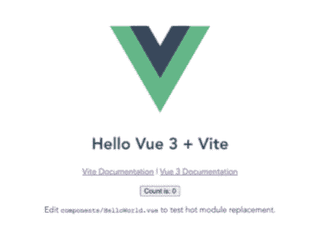
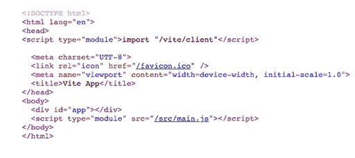

# 如何安装下一代前端工具 ViteJS

> 原文：<https://simpleprogrammer.com/how-to-install-vitejs/>

回到 2020 年 4 月，开发者社区开始从尤雨溪(流行的 JavaScript 框架 Vue.js 的创造者)那里得到新开发服务器的暗示。这是他分享的关于他正在研究的想法的第一条推文。

ViteJS 的最初目标是通过提供比 Vue CLI 更快的开发服务器来改善 Vue 应用的开发体验。但是这个新的构建工具远不止于此。2021 年 2 月，Vite 2 作为其第一个稳定版本推出，Evan 很快宣布这款 next-gent 前端构建工具将成为未来面向 Vue 的工具的基础。

因此，如果你来自 JavaScript 领域，并使用 Webpack、Gulp、Grunt 和其他传统工具来创建和捆绑整个应用程序代码库，那么对你来说有一些新东西: [ViteJS](https://vitejs.dev/) 。这个先进的[前端工具](https://simpleprogrammer.com/front-end-tools-web-development/)可以在眨眼之间刷新开发服务器，大大减少开发时间。

够有趣吗？无论你是一个有经验的程序员还是一个新手，这个指南将帮助你理解 ViteJS 是如何工作的，如何安装和设置它，用它创建一个 SPA，等等。

## ViteJS 是如何工作的？

在开始阅读安装指南之前，了解 ViteJS 的工作原理是很重要的，这样您就可以正确地使用这个工具，不会有任何困惑。

通常，Vue 开发人员在开发和生产期间使用 Vue CLI(内部包含 Webpack)来设置软件项目。但是这个过程伴随着一些开发团队经常要面对的问题:

*   如果你想开始开发，你得先捆绑整个 app。因此，冷服务器启动非常慢，尤其是对于大型项目。
*   热模块替换(HMR)在大型项目中也可能非常慢。

ViteJS 通过按需编译代码减轻了这些缺点。它只编译当前屏幕上导入的代码，因此 HMR 的性能与模块总数无关。这意味着，无论你的应用程序大小如何，HMR 更新都会变得很快，页面会在一瞬间重新加载。

## ViteJS 安装入门

作为使用 ViteJS 的第一步，您需要[在您的系统](https://radixweb.com/blog/installing-npm-and-nodejs-on-windows-and-mac)上安装 Node 的副本。

我选择 Node 是因为它是构建实时 web 应用程序的最佳工具之一。它提供跨平台应用程序，可以在任何网络上轻松运行。此外，作为开发人员，我们不需要任何额外的东西来执行节点应用程序。

此外，Node.js 提供了一组内置模块，无需进一步安装即可使用。我们可以根据应用需要从 NPM 安装一些定制模块。因此，Node 是安装 ViteJS 的合适而可靠的选择。

一旦完成该过程，执行命令 *`npm init @vitejs/app`* 。然后，您可以选择项目名称和模板。以下是您在写作时可以选择的选项:

*   `vanilla`
*   `vue`
*   `vue-ts`
*   `react`
*   `react-ts`
*   `svelte`
*   `svelte-ts`
*   `preact`
*   `preact-ts`
*   `lit-element`
*   `lit-element-ts`

重要的文件，如 lit-element-tsstyle.css、favicon.svg、main.js、index.html 和许多其他文件都用于 Git 和 npm。package.json 文件只包含作为依赖项的 ViteJS，以及一些用于设置开发环境和启动构建的脚本。

这里使用了 Git 的一些其他文件。Git 是一个用于源代码管理的 DevOps 工具。这是一个免费的开源版本控制系统，用于处理各种规模的项目。此外，Git 用于跟踪源代码中的变化，使多个开发人员能够一起进行非线性开发。

现在是时候移动到一个目录路径，打开一个终端，运行 *`npx create-vite-app`*

成功调用该命令后，使用 cd 命令移动到您的项目目录。您必须通过编写和运行命令`npm install`来安装应用程序依赖项。

通过执行上述命令，您将在 VS 代码中打开应用程序。

然后，您可以使用 *`npm run dev`* 命令启动开发服务器并执行应用程序。

您将能够在 [http://localhost:3000/](http://localhost:3000/) 访问和查看该应用程序。如果您需要编辑任何项目文件，屏幕会立即反映所有的更改。

现在，在你的显示屏上会看到类似上面图像的东西。

到目前为止，您的应用程序应该运行良好。

## 热模块替换(HMR)在 ViteJS 中的工作原理

为了理解 ViteJS HMR 是如何工作的，让我们使用组件文件夹中的组件`Hello.vue`。

下面是执行后的代码的样子:

`<template>`
`<h5>{{ msg }}</h5>`
`<button @click="count++">count is: {{ count }}</button>`
`
`
`Edit`
`<code>components/Hello.vue</code> to test hot module replacement.`
`
`
`</template>`
``

ViteJS 的重新加载时间比典型的 VueJS 应用快很多；因此，您对代码所做的任何更改都可以在屏幕上看到。

在 Vuejs 中，`main.js`文件在幕后运行。如果需要通过菜单在浏览器上查看代码，它会调用`main.js`文件作为模块。

该模块的外观如下:

正如你所看到的，ViteJS 提供了模块，而不是一个包，这使得整个应用程序非常快。

现在你的 Vue.js 代码已经准备好可以流畅运行了！

## 设置 ViteJS Vue 路由器

您可能想知道为什么需要安装和设置 Vue 路由器。原因是它是使用 Vue.js 和创建 Vue 应用程序的官方路由器。学习如何用 ViteJS 安装和设置 Vue 路由器肯定会对你的 ViteJS 项目有所帮助。

要开始安装，您需要首先在您的 ViteJS 应用程序上安装`vue.js`包。

运行 *`npm i --save vue-router@v4.0.0-alpha.11`* 命令，安装最新版本的 Vue 路由器。

接下来，您必须创建一个`router.js`文件。以下是您应该如何定义路线:

*T2`import { createWebHistory, createRouter } from "vue-router"; import Home from "./components/Hello.vue"; const history = createWebHistory(); const routes = [{ path: "/", component: Home }, ]; const router = createRouter({ history, routes }); export default router;`*

成功执行代码后，就可以通过调用以下命令用`main.js`文件注册`register.js`文件了:

*T2`import { createApp } from 'vue' import App from './App.vue' import './index.css' import router from "./router"; createApp(App).use(router).mount('#app')`*

下一步是更改 App.vue 文件中的根组件，以呈现所有组件。

`<template>`
``
`<Hello msg="Hello Vue 3.0 + Vite" />`
`<router-view />`
`</template>`
``

现在，您可以选择任何其他自定义路线并无缝注册。

## 设置单页应用程序(SPA)

想知道 ViteJS 是否适用于单页应用程序？

让我们试着和 Vue 建立一个。

运行 *`npm init @vitejs/app`* ，然后选择你选择的 Vue 模板。你会得到 Vue，ViteJS，和一个编译 Vue 的 Vite 插件。

开发一个水疗中心将需要你处理路线。所以，你得安装 [Vue 路由器](https://www.npmjs.com/package/vue-router)。

然而，ViteJS 在这个过程中并没有真正的帮助。有了基本的 Vue 设置，我们必须小心我们插入 Vue 的内容。尽管 ViteJS 对于创建多个页面也很有用，正如文档中的[多页面应用](https://morioh.com/redirect?l=https%3A%2F%2Fvitejs.dev%2Fguide%2Fbuild.html%23multi-page-app)所概述的，但是您必须调整 ViteJS 的汇总配置。

但是，好的一面是，我发现了一个由社区制作的相当新的插件: [vite-plugin-vue-router。](https://morioh.com/redirect?l=https%3A%2F%2Fwww.npmjs.com%2Fpackage%2Fvite-plugin-vue-router)就像 Nuxt 一样，它会根据你的文件路径创建一个路由器。

鉴于 Vue-Vite 社区的专业知识，我们可以肯定地期待有人将很快为 ViteJS 创建一个 Vue+Vue 路由器+Vuex 模板。但是说实话，它比 Nuxt 更好的可能性更小。这同样适用于具有 Svelte 和 SvelteKit/super、React 和 NextJS 的场景。这些是 [web 应用程序开发](https://www.amazon.com/Web-Application-Development/s?k=Web+Application+Development)的顶级框架，为复杂的应用程序和它们自己的库提供一致的优化。

如果你选择的[编程语言](https://simpleprogrammer.com/top-programming-languages-2021/)没有经过战斗和时间考验的 web 应用框架，ViteJS 绝对值得一试，尽管它仍然需要一些配置。

## 与 ViteJS 的后端集成

有些代码库不支持 Jamstack，而是使用 PHP 或。NET 作为后端。ViteJS 高效地提出了一个[后端集成页面](https://morioh.com/redirect?l=https%3A%2F%2Fvitejs.dev%2Fguide%2Fbackend-integration.html)，它将引导你创建改进的 CSS 和 JavaScript 包。

在 ViteJS 遵循指令之后，它生成一个清单文件，该文件包含关于所创建的包的所有信息。这个文件将帮助您分别为 JavaScript 和 CSS 包构建 *<脚本>* 和 *<链接>* 标签。

每个导入都成为一个 main.js 文件，除了被捆绑到单独的包中的动态导入。

## ViteJS，改进的机会

在科技行业工作了十多年，我已经为数百个项目使用了多种构建工具。无论是 Webpack、Gradle 还是 Gulp，大型项目总是需要一两天的时间来建立并确保一切正常运行。然后是优化构建时间、改进包优化和修复 bug 的任务。

相比之下， [ViteJS 是一个快如闪电的前端工具](https://radixweb.com/blog/vite-js-latest-front-end-development-tool)。有了流畅的前端开发体验，我在开发和生产环境中节省了大量时间，否则会影响我的效率和生产力。毫无疑问，它紧跟在过去十年统治前端开发世界的所有其他构建工具之后。

虽然大量的改进和修复正在进行中，但 ViteJS 仍然为您提供了一个机会，让您可以灵活运用自己的编码技能，成为一名熟练的前端开发人员。