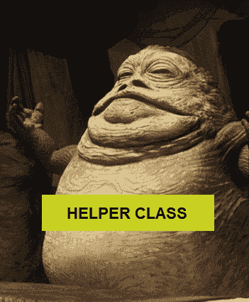

# 如何重构助手类

> 原文:[https://simple programmer . com/how-to-refactor-the-helper-class/](https://simpleprogrammer.com/how-to-refactor-the-helper-class/)

在我之前的帖子中，我提出了一个问题[我应该离开那个助手类](https://simpleprogrammer.com/2010/04/12/should-i-leave-that-helper-class/)吗？希望我已经说服了您，您不应该离开，而是应该重构 helper 类。

现在，我将详细介绍一些我用来消除遗留代码中助手类的技术。

**首先，让我们设定一个基本规则:**我们不会直接跳到遗留代码中，为了好玩而删除助手类。为什么？

1.  对于你花在做这件事上的时间来说，它没有很好的投资回报(ROI)。
2.  你的经理或总霸王可能会皱眉看着你，因为你没有给产品增加任何有形的价值。
3.  如果你破坏了一些东西，你会给重构一个坏名声，并被其他开发人员避开。你将不得不戴上一个大红的“R”。
4.  一点也不好玩。我的意思是，它不应该是有趣的…让我这样说吧。如果这种事情对你来说很有趣，那么我有一堆其他“有趣”的东西，你可以在我的房子周围做。

那我们接下来要做什么？当我们修改助手类或者向其添加功能时，我们将把助手类重构为真实的类或者现有的类。让我们开始吧…

## 修改方法

如果你必须修改一个助手类中的方法，第一步就是将逻辑**移动到一个我们可以为其编写单元测试的具体类中。这里有一个例子:**

看这个例子，我们需要做的第一件事是弄清楚这个助手类的方法属于哪个真实的类。(这里有一个小提示:请注意，正在讨论的 helper 方法还使用了另一个 helper 类。现实世界中很可能就是这种情况。)

我用来解决这个问题的一个技巧是查看这个 helper 方法使用了什么数据。在这个简单的例子中，很明显，它所操作的数据属于*个人*，即使该方法传入的是 *MonsterObject。* **通常，移动辅助方法的正确位置是您将最大化该方法中使用的*****运算符数量的地方。***

*在这种情况下，让我们将 helper 方法移到 person。以下是完成后的样子:*

*注意到我们在这里做了什么吗？*

*   *我们消除了传入的参数。*
*   *我们用这个点代替了一堆电话。*
*   *我们将该方法设为非静态和私有的。*
*   *当然，我们把它移到了属于它的人身上。*

*我们仍然有一个对它最初调用的 helper 方法的引用，但是我们可以在以后的工作中消除它。如果这个逻辑最终变得复杂，我们可能会有一个*dependent counter*类，它接受一个关系列表，我们的 Person 方法实例化并调用该列表以获得人员计数。*

*我们的下一步是编写一个测试当前功能的单元测试，然后签入我们的代码。最后，在我们完成了这些之后，我们可以编写一个单元测试，它会因为我们想要对方法进行的更改而失败，然后修改方法。*

*这样做要干净和容易得多，而且我们刚刚在一个助手类中消除了一个方法！*

## *添加方法*

*向助手类添加方法要容易得多。就是不做！！！相反，要弄清楚该方法将要操作什么数据，并将其移动到包含该数据的类中。*

*如果您要添加的功能很大，并且似乎有自己的职责，那么继续创建一个新类。*

*当您修改代码并将帮助器方法引入真正的类中，或者在类中添加新方法时，按照惯例，这些方法应该在帮助器类中，您可能会开始看到这些方法被移入 grow 中的一些类。没关系，你会发现你需要更多的课程。对于那些你不想放入它们实际所属的类中的长方法，助手类不是溢出类。相反，合适的做法是基于责任解散班级。*

*继续当前的例子，想象一个 *Person* 类，上面有一些关于钱的数据。也许有一个私人变量叫做*现金存量*。当你加入这个班级时，你可能最终会带来他们的储蓄账户数据，他们的未偿贷款。您可以引入对他们的储蓄账户信息和手头现金进行操作的方法。发现*人*成为一个独立的东西，而不是一个人的财务数据，这很好。这时，你可以创建一个名为 *Financials* 的类，人们可以引用它。*

## *重构助手类是关于找出事物的归属。*

*这就像清理你厨房里的垃圾抽屉一样。你必须仔细检查每一件物品，找出它真正的家应该在哪里。如果没有，你可以自己做一个。*

*如果一个方法对一段数据进行操作，那么它应该尽可能地靠近该数据。不要试图一下子解决这个庞大的助手类，而是在你改变或添加功能时一点一点地消除助手类。*