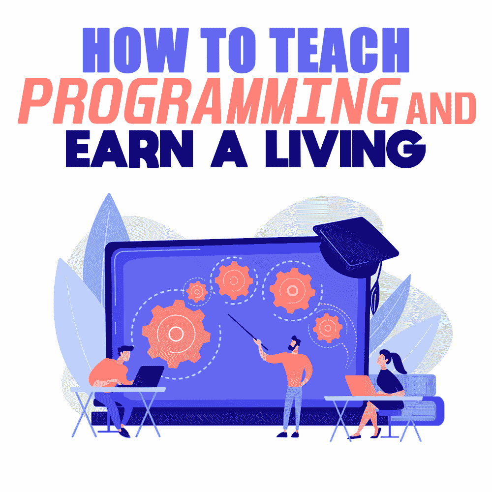

# 如何教编程谋生

> 原文：<https://simpleprogrammer.com/how-to-teach-programming/>

For many software developers, starting freelancing or a personal business seems intimidating. The competition in the market is so high, and many skilled developers are offering their freelance services very cheaply.

对于一个想要开始自由职业的软件开发新手来说，获得最初的几个客户是一个很大的障碍。新手没有他们做过的丰富的项目组合。

那如何进入自由软件开发市场呢？真的不可能吗？让我给你介绍一个成为自由软件开发者的简单方法。它只不过是向客户教授软件开发。

如果你已经克服了所有这些最初的障碍，并成为一名非常优秀的软件开发人员，你就会有一些隐藏的力量为他人服务。每天都有成千上万的人开始编程，他们都经历了许多学习编码的挑战。

当他们找不到问题的答案时，他们会怎么做？他们中的一些人可能会寻找文章或视频教程来寻求帮助。他们中的一些人可能会去像 Stack Overflow 这样的论坛提问。然而，许多人无法通过自己的研究解决他们的问题。他们需要有人在旅途中引导和帮助他们。

如果你有足够的软件开发经验，你可以伸出援手。很多人认为自己不够资格教编程。你不需要成为一名专业的程序员。你只需要比寻求帮助的人高一步。

## 教学的价值

教学是一项伟大的服务，任何程序员都可以做到这一点。我所说的教学，并不是指站在教室前面。学生不需要一个想炫耀自己知识的无聊教授。他们需要一只援助之手与他们坐在一起，理解他们的问题，并引导他们走向正确的方向。你可以用笔记本电脑和互联网连接来完成。

许多成功人士的生活中都有伟大的导师或指导者。我们知道当我们陷入困境时帮助我们的朋友的价值。你也可以成为这样一个乐于助人的朋友，为有抱负的程序员提供服务。

我是在看了约翰·松梅兹写的 *[软技能](http://www.amazon.com/exec/obidos/ASIN/1617292397/makithecompsi-20)* 和 *[完整的软件开发人员职业指南](http://www.amazon.com/exec/obidos/ASIN/0999081411/makithecompsi-20)* 两本巨著后才意识到教学的价值的，书中他提到了教学对于软件开发人员的意义。

很多人连一个“hello world”程序都不会写。他们甚至不知道学什么编程语言，怎么学。有些人被困在学校的编码作业中。如果你是一个程序员，你已经知道这些东西了。你只需要分享你的知识，并在他们的旅程中指导他们。

通过教书，你解决了其他人的问题，为这个世界提供了价值，你也可以赚些钱。

## 教学如何帮助你成为一名软件开发人员

教学不仅能帮助学生，还能帮助你巩固知识。教学会给你一些责任，你会做一些额外的研究来填补你的知识空白。

当你教学时，你的大脑会重新收集你所获得的关于该主题的所有信息，并按正确的顺序排列。教学会逐渐让你成为这方面的专家。

另一个显著的好处是，教学将提高你的沟通技巧。仅有技术技能不足以推动你的职业发展。作为一名软件开发人员，良好的沟通等软技能对你的成长至关重要。

当我开始作为兼职自由职业者的职业生涯时，很难找到一个好的编码项目。因此，我在网上寻找一些辅导机会，并在各种在线平台上创建了我的个人资料。那时我才意识到获得客户是多么容易。与自由职业者相比，这个领域的竞争并不激烈。

还有，这工作一点也不无聊。当你帮助别人时，你会对自己的工作感到快乐和满意。

## 如何通过教编程挣钱

有很多在线平台可以让你找到教编程的客户。一些最受欢迎的在线教学平台是 Wyzant、Codementor、Takelessons 和 TeacherOn。

这些在线平台遍布世界各地。但是如果你能找到你所在国家最受欢迎的平台，你会有更多的机会亲自授课。

For me, [TeacherOn](http://You can go to one of those platforms and create a tutor profile. You can mention all your experiences and skills there. If you’ve worked on some personal projects or client works, you can mention all that there. Even if you don’t have much experience, you can write about your programming journey.) was the most popular platform in my country. So, I prefer it more than the other options.

当我所在地区附近的人申请家教时，我可以联系他们并亲自与他们见面进行教学。在美国， [Wyzant](https://www.wyzant.com/) 是一个受欢迎的平台。你可以做一些研究，找到你所在地区最受欢迎的平台。

你可以去其中一个平台创建一个导师档案。你可以在那里提到你所有的经历和技能。如果你做过一些个人项目或客户工作，你可以在那里提到所有这些。即使没有太多经验，也可以写写自己的编程之旅。

你可以指出你犯过的错误，以及如何帮助人们避免这些错误。创建档案时，重要的是你应该把重点放在客户身上。试着从他们的角度去思考。你应该让他们觉得你可以帮助他们。别忘了附上一张你自己的漂亮照片。

然后你需要设定一个教学时薪。看看平台周围，看看其他人在收费什么，然后你就可以决定你的初始费率应该是多少。一开始每小时 30 美元是一个不错的价格。渐渐地，随着客户越来越多，你可以随心所欲地提高时薪。

你可以使用视频分享平台，如 Skype，与你的学生联系。然后你可以分享你的屏幕，解释一切。这很简单。

如果能找到需要编程帮助的本地客户，那就更好了。你可以亲自见到学生，非常有效地教他们。

当然，如果你想走传统的课堂路线，如果你有足够多的本地客户，你也可以这样做。通过这样做，你可以同时帮助很多人。但大多数在线客户更喜欢一对一的辅导，这样他们的具体问题可以得到更好的解决。

## 如何更上一层楼

一旦你有了几个客户，你可以把他们列在你的作品集里，你也可以添加他们的反馈和评价。现在你的投资组合不是空的，你将很容易成为自由职业者。large-mobile-banner-2-multi-119 { border:无！重要；显示:屏蔽！重要；浮动:无！重要；行高:0；边距-底部:15px！重要；左边距:0！重要；右边距:0！重要；margin-top:15px！重要；最大宽度:100%！重要；最小高度:250px 最小宽度:250 像素；填充:0；文本对齐:居中！重要}

你已经知道如何接待客户，如何进行谈判，等等。因此，从事真正的自由职业应该是小菜一碟。如果你真的想开始自由职业，你可以利用像 Upwork.com 和 Freelancer.com 这样的流行平台。

如果你围绕你的技能建立了一个个人品牌，你就可以将你的服务扩展到更广泛的受众。创建博客或 YouTube 频道，甚至播客来分享你的知识。你可以在 Simple Programmer 注册[免费博客课程来促进你的职业发展。如果你能建立一个受众群，那么你就可以推出一门课程或一个数字产品。这将有助于你的收入成倍增长。](https://simpleprogrammer.com/lp/create-your-blog-1/)

参加聚会和会议，与其他软件开发人员交流。寻找在会议上发言的机会。有很多方法可以让你的技能更上一层楼。

## 是时候采取行动了

我们非常幸运地生活在一个充满成熟机会的时代。你需要意识到这些机会，并最大限度地利用这些机会。

世界上大部分人是消费者，不是生产者。如果你已经读到这里，你应该采取一些行动，成为这个世界的价值创造者。去看看我现在提到的所有平台。如果你不采取任何行动就走了，你不会从阅读这篇文章中获得任何好处。帮助他人，给予他们价值。我可以向你保证你会得到回报的。

无论你做什么，你的座右铭应该是帮助他人。正如许多成功人士所说，当你帮助更多的人时，你会赚更多的钱。

我敦促你尽力帮助尽可能多的人。如果你这样做了，我相信通过帮助别人在事业上取得成功，你一定会在事业上取得成功。