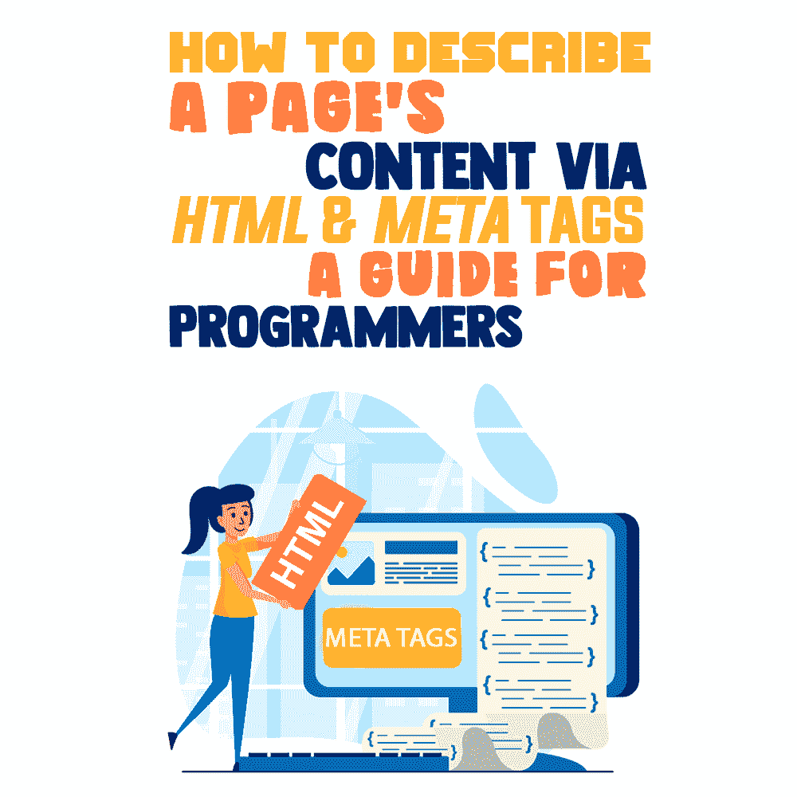
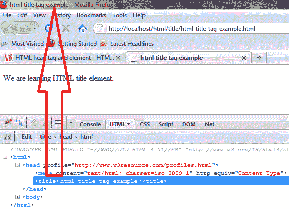
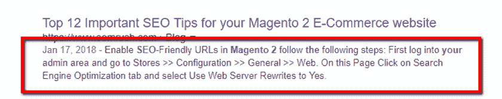
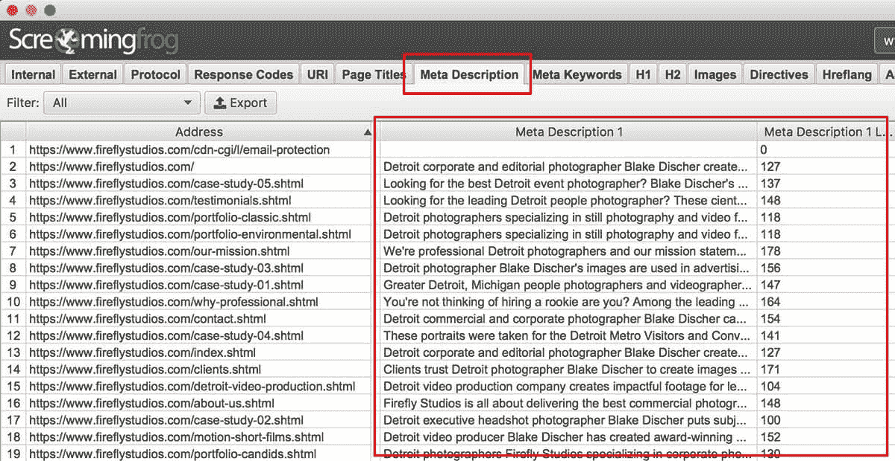
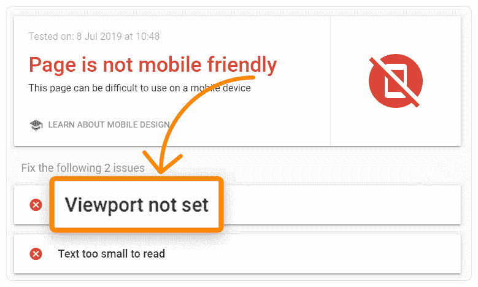
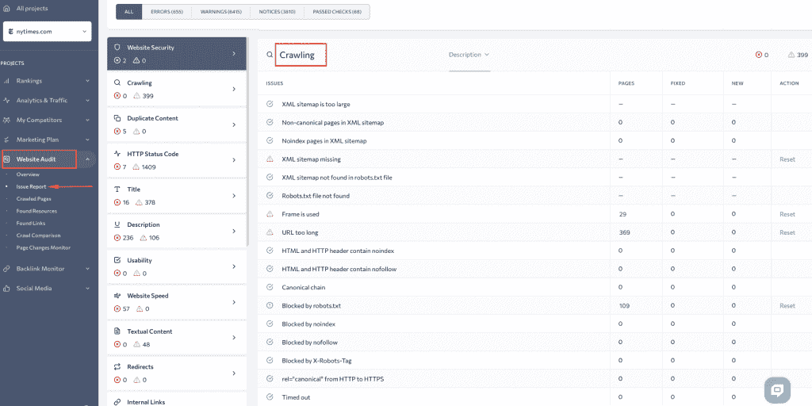
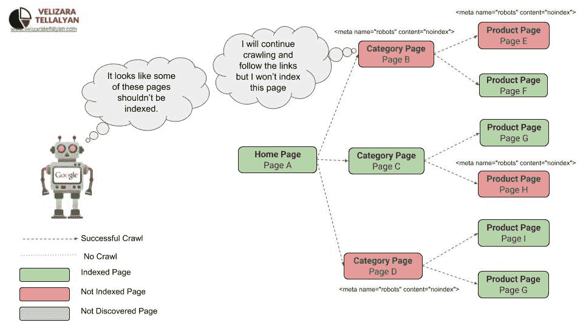
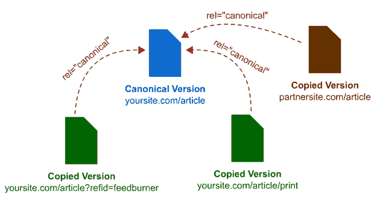
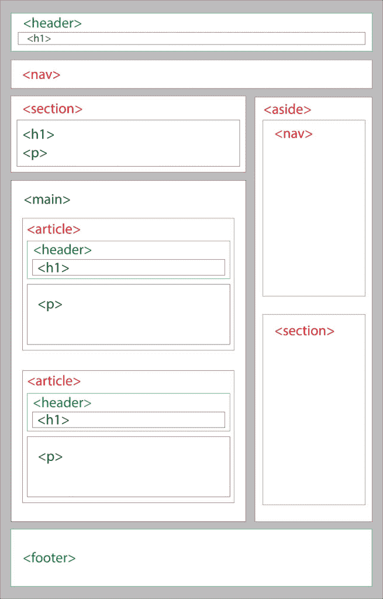

# 如何通过 HTML & Meta 标签描述页面内容[程序员指南]

> 原文：<https://simpleprogrammer.com/html-meta-tags-guide-programmers/>

There's so much to keep track of when it comes to meta tags, HTML, and SEO. Some tags can affect the website’s search results and how high it appears in the results list.

了解和理解程序员提高搜索引擎优化所需的标签类型是向搜索引擎和用户提供关于页面的有用数据的重要方法之一。

在这篇文章中，我将向你提供所有你需要知道的关于 HTML 和 meta 标签的知识，这样你就可以确保你设计的页面是为搜索引擎优化的。这提高了您的工作质量，从而提高了您作为专业开发人员的地位。

## 什么是元标签？

很快，程序员可能会对元标签的确切含义和作用感到困惑。Meta 标签是描述网页的短文本字符串，但它们通常不会出现在页面上，尽管它们会影响页面在搜索结果中的显示。相反，程序员可以在页面的源代码中看到 meta 标签。

每个标签本质上是一个小的内容描述符，告诉搜索引擎页面的要点。有时，编码者会在某些网站上看到标签，如博客或社交媒体网站，但这些标签和元标签并不相同。用户可以看到的标签通常有助于网站的导航，但是元标签可以帮助搜索引擎抓取内容。

说到标记，meta 的意思是“元数据”它们只存在于 HTML 中，通常在页面的元素中，用户看不到它们。元标签为搜索引擎提供关于网站信息的数据。

除了元标签之外，HTML 还使用不同类型的标签，这可能有点令人困惑。基本上，元标签只影响搜索引擎，常规的 HTML 标签，如、

或，影响用户在页面上看到的内容。网站设计者也将使用 CSS、Bootstrap、Javascript 或其他语言来改变内容在页面上的外观或表现。

## 程序员应该如何使用 Meta 标签？

现在你知道什么是元标签，你应该如何使用它们？让我们从基础开始。特定的 HTML SEO 标签会影响网站的排名，但不是所有的标签都会影响排名。专业程序员应该明白哪些标签会影响排名。

### Meta Tags

Meta 标签描述了与元数据相关的所有标签，每个标签都必须使用标签。程序员可以在标签中包含不同的属性，告诉浏览器和搜索引擎关于网页的不同信息，以帮助网站在搜索结果中脱颖而出。这些信息可以是字符集、各种元关键字、作者、描述等等。

### Meta Title

这是一个重要的标签，一些 SEO 专家声称这是最关键的元素。标签在搜索结果页面上显示为可点击的标题，所以它通常是用户看到你网站的第一件事。这也是用户在查看浏览器选项卡时看到的内容，定义了页面的标题。这是对 HTML 文档的要求。

要正确编写这种类型的标记，需要记住一些事情。你需要使用少于 55 个字符，因为如果你的标题太长，浏览器和搜索引擎可能会把它删掉。确保你网站上的每一页都有一个独特的标题。

如果程序员有任何主元关键字，他们应该在 title 标签的开头使用它们，并把他们公司的名称放在末尾。当编码人员编写元标题时，他们需要记住目标客户和用户。

### 元描述

元描述标签类似于元标题标签，因为它也出现在搜索引擎的结果页面上。你的用户将会直接在谷歌或其他搜索引擎的结果中的标题和 URL 下看到它，而不是看到一个可点击的链接。

尽管一些专家声称元描述不像其他元标签那样直接影响 SEO，但是专业程序员仍然应该包含它们；好处是元描述标签对点击率有很大影响，而点击率*对 SEO 有直接影响。*

搜索引擎关注一个页面的点击量，这影响了一个网站的排名。这意味着任何影响 CTRs 的事情都是重要的。元描述中使用的关键字也以粗体显示，这有助于引擎选择页面是否匹配查询。

对于页面的描述，保持在 125 到 155 个字符之间。确保描述准确反映了页面的内容。程序员应该使用描述来快速向用户推销页面，让他们更有可能点击链接并访问他们的网站。

如果您愿意，您可以使用元描述生成器来帮助确定描述应该是什么。这些网站可以帮助集思广益，它们可以显示你的描述在谷歌或其他搜索引擎的搜索结果页面上的外观。

[尖叫青蛙](https://www.screamingfrog.co.uk/about/)是执行高级技术网站审计和现场优化的强大工具。该工具还通过计算页面标题和元描述的像素宽度来分析站点的元数据。

([来源](https://go-seo.com/wp-content/uploads/screaming-frog-meta-description.jpg))

### Meta Viewport

理解元视口依赖于理解什么是视口。视窗与用户可见页面区域的大小有关，视设备而定。手机的视窗比电脑和笔记本电脑小。

定义网站的视区可以让您控制页面的尺寸和缩放比例。您需要指定内容宽度和比例。通过这样做，编码器告诉页面使用设备的屏幕宽度来改变内容的宽度。

虽然看起来不像，但视口属性影响 SEO，因为搜索引擎更喜欢响应式设计和移动友好网站。此外，视区属性指导浏览器如何控制页面的缩放和尺寸。

([来源](https://ahrefs.com/blog/wp-content/uploads/2020/02/16-mobile-friendly-viewport-1.png))

### 元机器人

这个标签是你的 SEO 策略的另一个关键标签，它告诉搜索引擎是否索引或者跟随一个页面。一般搜索引擎都会默认索引和跟随页面，所以程序员不需要告诉他们这么做。

然而，向搜索机器人表明他们希望他们在结果页面(SERP)上索引页面并跟随它可能不是一个坏主意。搜索引擎优化专家也可以手动请求谷歌使用“抓取为谷歌”工具重新抓取页面。

如果你想“分配”一个特定的用户代理，使用标准标签并用一个爬虫如 Googlebot 的名字替换“机器人”。

有时，搜索引擎优化专家想告诉搜索引擎不要索引或跟随一个页面。在这种情况下，它们会指示特定的指数化控制参数:

*   索引–默认情况下，搜索引擎会在没有添加 meta 标签的情况下对页面进行索引。
*   no index–搜索引擎不索引页面。
*   跟踪——爬虫跟踪一个页面上的所有 URL，并把公平传递给链接的页面。
*   nofollow——爬虫不跟随一个特定的链接或传递任何链接权益。请注意，这并不妨碍页面被完全抓取。因此，应该将它标记为“noindex nofollow ”,以完全隐藏它，使其不被索引。

为了跟踪你的 HTML 标签，需要运行一个[常规站点分析](https://www.amazon.com/dp/0470130652/makithecompsi-20)。它将保持你的网站的推广和及时发现错误的有效性。您可以通过 SE 排名轻松执行[技术网站审计](https://seranking.com/website-audit.html)，并获得包含 noindex、hreflang、rel="canonical "和 rel="alternate "标签的每个页面的详细报告，包括 XML sitemap 中指定的子域和页面。

程序员不必使用 meta robots 标签，但是在他们不想显示在结果页面上的页面上使用它是一个好主意。对用户没有什么帮助信息的薄页面、感谢页面、产品发布和推广页面会对你的 SEO 产生负面影响，除非你用机器人属性隐藏它们。您可能还想在结果页面中隐藏管理页面。

([来源](http://www.velizaratellalyan.com/wp-content/uploads/2020/11/no-index-tag-crawling.jpg))

### 规范元

这一部分可能会让事情变得有点混乱，尤其是对新程序员来说。谷歌和其他搜索引擎不喜欢[重复的内容](https://developers.google.com/search/docs/advanced/guidelines/duplicate-content)，当他们抓取相似内容的网址时，你可能会看到你的 SEO 坦克。这是因为搜索引擎不知道将哪些版本添加到他们的索引中，应用哪些链接指标，或者如何对不同版本的搜索结果进行排名。

有时候，尤其是在[电商网站](https://simpleprogrammer.com/e-commerce-development-web-test-automation/)上，程序员会发现重复(重复)的内容。这是因为许多电子商务网站将出售相同的信息相同的产品。例如，制造商可能会向销售其产品的网站发送基本描述。许多网站不会改变这些信息，导致许多不同网站上的确切细节。

规范元标签(又名“rel canonical”)可以解决网站上重复或相似内容可能导致的问题。这个标签通知搜索引擎哪个版本的 URL 应该出现在搜索结果中，并且它消除了由于多个 URL 具有相同或相似的信息而导致的 SEO 问题。

([来源](https://cultofweb.com/blog/wp-content/uploads/2018/02/canonical_url.gif))

### 元内容类型

meta 标签的这一部分是为你的网页声明一个字符集所必需的，你应该在网站的每一页上都有它。排除它会影响您的页面在其他人的浏览器中的加载方式。

比如你可能会看到这样的东西:。在这种情况下，内容属性定义了搜索引擎的字符集。

包含这个标签对于浏览器理解一个网页是至关重要的。虽然实际的字符集不会影响排名，但完全省略标签可能会影响排名。如果编码器不包含这个标签，浏览器将无法正确解码网站，并且会显示错误的文本。

## SEO 内容的核心 HTML 标签有哪些？

虽然一个典型的 HTML 文档包含几个部分，但大多数 HTML 标签都在正文中，那么 SEO 内容的核心标签是什么呢？让我们来看看组织内容、放置链接、优化图片的一些要点，以及一些符合最佳实践的标签。

### 标题

编码人员主要使用标题标签来说明网页的主题并组织其内容。标签的范围从 h1 标签到 h6 标签，h1 是页面上最重要的标签之一。

人们经常混淆标题和题目。标题强调页面的各个部分，title 标签定义了搜索引擎结果中页面的标题。使用 h1 标签作为用户的页面名称，使用 title 标签作为搜索引擎的页面名称。您还可以对不同的部分或段落使用 h2-h6 标签。

当搜索引擎机器人查看您的页面时，标题标签会在您的 SEO 中发挥作用。这些标签告诉爬虫页面上的内容是关于什么的，h1 标签告诉爬虫你文章的关键主题。其他标题标签有助于爬虫理解段落和章节的内容。程序员可以随时在[谷歌网站管理员工具](https://www.google.com/intl/en/webmasters/#?modal_active=none)中查看[抓取统计](https://support.google.com/webmasters/answer/9679690?hl=en&__hstc=20629287.e9c6b91ff69618581dd3f4d91fdf0d9b.1615374103336.1628502964113.1628579472835.84&__hssc=20629287.1.1628579472835&__hsfp=929598573&visit_id=637641766738952357-1807915408&rd=1)。

这些标签还有助于促进内容的可扫描性，允许用户快速理解您的内容，从而增强他们的用户体验。设置标题标签还可以提高网站的可访问性和可用性，这是 SEO 的一个因素，因为谷歌和其他搜索引擎更喜欢可访问的网站。

### 链接和锚

如果一个 SEO 专家需要链接到另一个页面，他们使用带有 href 属性的

对于搜索引擎优化，确保锚文本是搜索引擎优化友好的，使其简短和相关的网页链接。搜索引擎将使用外部锚文本来反映其他网站如何看待你的网页以及你的网页可能是关于什么的。如果有足够多的网站认为你网站上的一个页面对于一组单词来说是必不可少的，那么这个页面将会因为这些单词而排名靠前，即使它们没有出现在页面的内容中。

### Alt Text

Alt 属性是或图像标签的重要组成部分，对于有视觉障碍的人尤其有用。如果图像无法加载，Alt 属性将出现在图像容器中。程序员不需要使用它们，但实际上他们应该使用。

搜索引擎爬虫阅读你包括的 alt 文本，因为他们不能像人类那样看到图像。为了遵循最佳实践，请确保您的文件名和替代文本易于阅读，并包含重要的关键字。

### HTML5 语义标签

还有一些其他的语义标签也在 SEO 中扮演着重要的角色。让我们一个一个地简单看一下。

*   **<表头>** 。header 标签代表一个用于介绍性内容或导航链接的容器。虽然编码人员可以用它来代替 h1 标签，但这不是最佳实践，而且可能会对 SEO 产生负面影响。
*   **<导航>** 。nav 标签是用于导航链接的，并不是每个链接都应该在这个元素中。它只适用于主要的航行。屏幕阅读器、浏览器和搜索引擎爬虫将使用该元素来判断是否需要改变内容的初始呈现。
*   **<主>** 。你应该使用这个标签来告诉爬虫网站的主要内容是什么，并且它应该是页面所独有的。不要在这个区域放置任何类似边栏或导航的信息，也不要在一个页面上使用一个以上的<主>元素。
*   **<条>** 。这个标签应该包含任何自包含的内容。文章本身应该有意义，独立于网站的其他部分。它们可能包括博客帖子或新闻故事。在 SEO 方面，像 Google 这样的搜索引擎可以给这个标签中的内容更多的权重。这也有助于减少您使用< div >标签的次数。
*   **<图>** 。figure 元素有点类似于 image 标签，但是它只指定自包含的内容，如插图、照片、代码或图表。为了最大化你的搜索引擎优化，在图元素旁边使用<图标题>标签。这样，您可以向内容中添加更多信息。
*   **<页脚>** 。页脚标签通常出现在网站的底部，它可以包含版权、联系方式或网站地图等信息。对于 SEO，页脚标签可以告诉搜索引擎公司信息等信息。
*   **<标注>** 。与其他标签相比，这个标签相对简单。它所做的只是定义需要标记或突出显示的文本。
*   **<暂且不说>** 。side 标签类似于 section 标签，但是这些标签只关注与周围内容相关的次要内容。它们通常用于文档中的侧边栏，没有 CSS 它们不会做什么特别的事情。一篇新文章、一篇帖子或一个行动号召可能是使用旁白标签的好理由。

下图显示了这些元素如何在网页上共存的示例。

([来源](https://i.pinimg.com/originals/12/9c/54/129c5480493ee9da20c43b6771e03a2d.jpg))

### 不良做法

程序员可以使用一些标签，比如在其他标签中使用和

例如，样式标签允许您编辑页面的 CSS，而无需切换到内部或外部样式表。然而，[内联 CSS](https://www.freecodecamp.org/news/inline-css-guide-how-to-style-an-html-tag-directly/) 并不是最佳实践，在大多数情况下应该避免使用它，尤其是如果有多个开发人员在一个项目上工作，或者有多个具有相同内联样式的页面。

Span 标签充当内联容器而不是内联样式，当一个人在另一个标签中使用它们时，编码者可以给它们分配一个类来改变 CSS。在大多数情况下，span 标签并不被认为是最佳实践，因为编码者可以使用 blockquote、cite 或*标签来代替它。*

## 小小的选择会有所不同

说到 Google 和 SEO，有很多方面需要牢记。许多不同的元标签会影响网站的排名，有时很难遵循最佳实践。确保程序员在正确的地方使用正确的标记是一个很好的起点。

所以请记住，当你建立你的网页时，考虑搜索引擎机器人的偏好以及人类的眼睛。确保适当放置跟随和不跟随标签，以最大化您的爬行预算，并使用适当的<h>标签来增加可读性。</h>

这可能看起来很难理解，但是通过足够的实践，你将能够通过编写专业优化的 SEO 代码在搜索结果中排名更高。