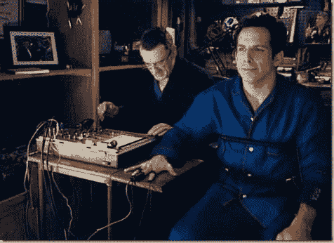

# 我是一名职业发展者，这没关系

> 原文：<https://simpleprogrammer.com/im-a-career-developer-and-thats-ok/>

有时候我觉得自己像《见家长》里的格雷格·福克尔。

电影中有一个场景是格雷格去早餐桌上接受他女朋友的姐姐的未婚夫鲍勃医生和他同样是医生的父亲的问候。

他们问他是做什么的，他说他是护士。起初他们认为他是在开玩笑，但后来他们意识到他是认真的。他们认为 MCATs 太难了，但他告诉他们他更喜欢护理，因为他可以在医学的几个领域工作，而不必像医生那样处理官僚主义。

“你是程序员？”

“是的”

"你不想继续前进，成为一名建筑师或经理吗？"

“不，我喜欢写代码和解决难题。我也不想和那些建筑师或者管理者必须面对的官僚主义打交道。我只想写代码，并在这方面不断进步。”

## 到底什么是职业发展者？

我们最接近这个头衔的是软件工匠，但这似乎有点冒昧。我不介意被称为职业发展者。

这意味着我不认为高级是写代码以外的事情。成为一名经理或者一名高级建筑师并不是我认为的职业发展。

甚至成为一名技术领导者也不是我个人发展的目标。领导力是一种永远无法分配的东西，但总是通过声誉和帮助他人的意愿来赢得。

这意味着我认为进步就是更好地编写代码，学习更多的最佳实践并实现它们。我根据软件开发领域知识的广度和深度以及完成工作的能力来衡量进步。

职业开发人员通常重视学习和提升编程和软件开发技能的过程，而不是头衔，不幸的是，在很多情况下，是报酬。

虽然，这并不意味着职业发展者的工资不会很高，只是意味着你很难找到合适的公司来认可你能带来的价值并相应地支付你工资。

## 为什么？

我不能代表所有人，但对我来说，这是关于保持我最初进入编程的原因。当你意识到你可以让计算机做你想做的事情时，这是一种纯粹的惊奇和兴奋的感觉。

看到所有的单元测试都变绿的满足感是难以比拟的，因为知道你是在编写代码之前编写这些测试的。

没有哪本小说能比得上阅读清晰揭示其意图的优秀代码的乐趣。就像书中的人物一样真实。最大的快乐是当它是你自己的代码时。

没有什么比面对看起来不可能解决的难题更令人兴奋的了，不知道你是否真的能够解决它，直到你最终把它分解成小块，当你低头看着你的盘子时，你会发现问题突然消失了，你胜利了！

还有什么能以如此多的方式刺激心灵？还有什么活动能像编程一样挑战你的智力？还有什么其他的创造行为能让你把几乎什么都不带，把它变成真实的东西？

除了在博客里，你还能在哪里夸大其词呢？

是的，也许我走得有点远，但有时我上面说的是完全正确的，至少对我来说是这样。这正是我选择继续写代码的原因。我在寻找我的下一个编程高潮。

## 不要让那个人让你沮丧

努力进入管理层或更高层次的架构没有错，但你必须自己做出选择，而且你不应该轻率地做出选择。

现实世界中的一个问题是，没有多少公司意识到甚至有职业发展者这种东西。它没有一个真正的头衔。高级软件工程师不太适合。外面有很多这样的人。

如果你选择职业发展者的道路，不要气馁。确实有公司认识到拥有 10 年经验的开发人员的价值是拥有 1 年经验的开发人员的 10 倍。有很多公司想雇佣那种只想做程序员的程序员，并且会给他们高薪。

我很幸运找到了这样一家公司。我很高兴我做到了。