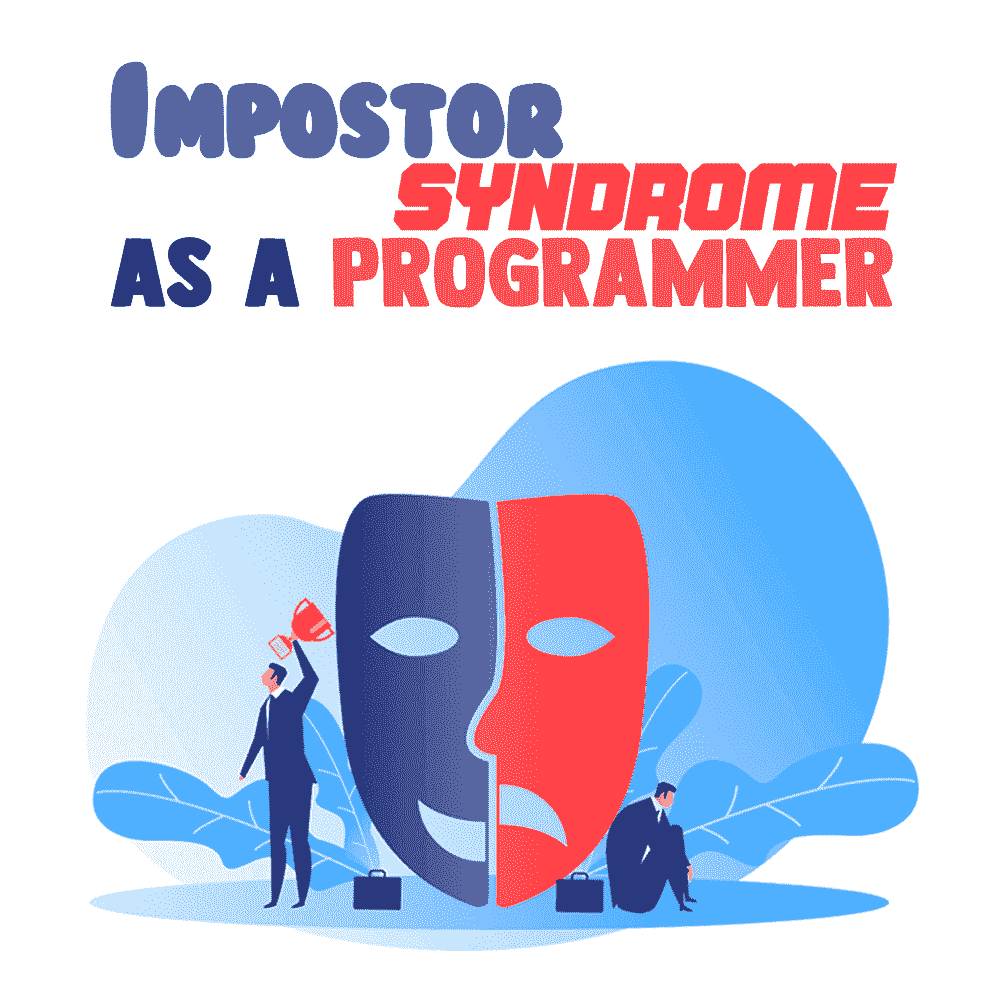

# 作为程序员的冒名顶替综合症

> 原文：<https://simpleprogrammer.com/impostor-syndrome-programmer/>

Believing that you’re somewhat unqualified for your job is a problem faced by the best of us. When those thoughts creep into your head, they’re hard to shake off.

患有冒名顶替综合症会让你觉得自己做得不够多，学得不够快，或者觉得自己根本配不上现在的职位——即使你已经不知疲倦地工作到了现在的位置。

冒名顶替综合征的特征是在工作场所感到不称职，导致害怕被发现是个骗子。这就像慢性自我怀疑。

在这篇文章中，你会发现你需要知道的关于冒名顶替综合症的一切。它是如何表现的，它如何影响你的程序员生涯，以及你如何处理它。我也将分享我自己关于冒名顶替综合症的经历，以及我克服它的步骤。

## 我是如何发现自己患有冒名顶替综合症的

这种想法总是存在的。这是内心的声音，告诉你在聪明人说话时保持安静，你的意见太不重要了，不能公开。这就是冒名顶替综合症的由来。

就我而言，我认为我一直拥有它。我总是选择接受简单的任务，而不是艰难和更具挑战性的任务。我告诉自己，如果我尝试一个超出我知识范围的新项目，我会失败得很惨。

我不知道“冒名顶替综合症”这个术语，但我想知道为什么我逃避我想学的东西，或者当我试图获得新技能时感到迟钝。我谷歌了一下我的问题，最终找到了一个与我的困境相匹配的症状列表，包括:

*   我觉得我配不上现在的职位，因为我不够好。长期的自我怀疑是我非常亲密的伙伴。
*   我怀疑自己的成就，并把它们归因于外界的帮助或运气。
*   我专注于我的[错误和失败](https://simpleprogrammer.com/perfectionism-kills-programmers-productivity/)，并允许它们支配我的智力极限。
*   当我意识到自己并不知道所有该知道的事情时，我怀疑自己的技能。
*   我认为有些项目超出了我的能力范围，我甚至不应该去尝试。
*   当我从其他开发人员那里听说他们的技能和经验时，我认为我永远无法达到他们的水平，他们都比我更聪明、更有才华。
*   我拒绝交流我的想法。
*   由于不充分的感觉，我感到焦虑和压力。

我发现的这些症状都和冒名顶替综合征有关。

当我在 2019 年第一次对编程产生兴趣时，我现在知道为什么我不能学习编程。我从 HTML 开始，它看起来不错。

很好，我能做到。

然后我打开 JavaScript，它真的击中了我。自我怀疑悄然而至。

你想欺骗谁？你为什么会认为你能处理好这件事？你认为编程是一个笑话，任何人都可以进入其中吗？你数学很差，一遇到问题就感到沮丧，你认为编程是你的下一件事？你在自欺欺人。

那一刻，我觉得自己完全是个骗子。就像如果我得到了一份编程的工作，那也是用假证书。

## 冒名顶替综合症如何影响程序员

如果你和我提到的这些症状有关，你可能也有冒名顶替综合症。

它阻碍了程序员从事不同于他们通常从事的项目，阻碍了他们在工作中发表意见和提出想法，也阻碍了他们建立自己的公司。

通常，开发人员会辞职，因为他们觉得自己不适合这个角色。他们甚至可能转到一个全新的职业，认为自己跟不上科技行业的工作。

拿我来说，我把学习如何编码推迟了三年。我开始创业，然后最终进入增长型营销。我最终学会了如何管理我的自我怀疑，并重新开始编程，但我已经失去了很多时间。

你可能也在考虑辞职，因为你不相信自己或自己的能力。也许你的自我怀疑正在活生生地吞噬你，而你就是无法克服它。

冒名顶替综合症会减缓你作为程序员的职业发展。这会降低你的工作效率，这是我们不能容忍的。你对科技领域的发展非常重要，我不能让你退出。首先分享我辛苦赚来的骗子综合症管理技巧！

## 我是如何学会管理我的冒名顶替综合症并重返编程的

After three years of wasted dreams (literally), I got a growth marketing internship. I had very little in terms of skills, but I still applied and got the job. I dedicated myself to learning the necessary skills to excel at the job, and it has been going well so far.

在那段时间里，我也重新开始编程。我更致力于学习新语言和开发项目，以便最终准备好完全过渡到编程并开始申请工作。

在那段时间里，一定发生了什么变化。我不再感到那些自我怀疑的暗示。我对自己的技能更加自信，这帮助我在工作中脱颖而出，并更好更快地学习编程语言。

那么，什么改变了？

嗯，我找到了解决我的冒名顶替综合症的方法，现在我不再仅仅因为我的大脑告诉我任务或项目对我来说太大或我无法处理它而放弃它。我甚至不需要[外界的动力](https://simpleprogrammer.com/programming-is-hard-and-i-feel-unmotivated/)来让我坚持下去。

以下是我做的一些帮助我摆脱自我怀疑的事情。你可能想自己尝试一下，这样你就能更好地管理冒名顶替综合症。

### 养成不舒服的习惯

我第一次放弃学习如何编码，主要是因为我对它感到不舒服。这完全超出了我的舒适区，与我所学的内容无关。当我感受到不适的重量时，我决定退出，放下我的激情。这就是自我怀疑如何将你的梦想变成无用的野心。

所以，为了重新开始编程，我必须适应我的不适。每当我觉得编程超出了我的能力范围，好像我在冒充一个真正聪明的程序员，或者好像我是一只披着羊皮的狼，我就不会停止学习。我坐在那里，沉浸在那种不适中。

作为一个程序员，你应该已经知道你想要什么，并且有目标去得到它。不适不应该让你偏离轨道，远离成功。

### 不要让专业人士胁迫你

程序员通常喜欢在社交平台上发布他们的工作，这样其他人就可以查看了。炫耀你的工作是建立你的品牌的重要一步，这样你就可以得到高薪的工作。

我一直做的一件事是将自己与专业人士的工作进行比较。我会看着他们的代码，大脑立刻冻结。

这些都是什么？为什么我还不明白这些？

问题是，这些人是专业人士。他们多年来一直在写代码。他们开发了几十个项目，远远优于你正在开发的天气应用。如果你继续拿自己和他们比较，你会开始觉得你做得不够，你不够聪明，或者你不是程序员，你只是在欺骗自己。

当你完成你的小项目并发布它时，一些专业人士和更有经验的程序员可能会明确地告诉你，与他们正在做的相比，你做的很少，或者你不应该费心开发看起来更困难的项目，因为你刚刚发布的这个项目是不合格的。

不用担心不如他们。你没时间了。更加努力地工作，过滤掉噪音，你很快就会发现自己在做他们说你做不了的事情。

### 拥抱冒名顶替者，知道你不可能永远是最好的

作为一名程序员意味着总有新的东西要学——新的语言、概念、语法等等。我不得不认识到我不可能一直掌控一切。要成为一名伟大的程序员，我必须不断地致力于学习。

当你患有冒名顶替综合症时，你会怀疑自己的能力，只是因为你不知道如何使用这个热门的新工具，或者你不容易掌握每个人都在谈论的语言。在这一点上，你会感受到自我怀疑的巨大压力，你可能想要放弃一切。

然而，一旦你接受了你不可能知道关于编程的所有事情，你不可能成为世界上最好的，你就可以接受像一个骗子的感觉，并把它作为一个学习新东西的机会。

最好的程序员不是什么都知道的人，而是愿意在需要的时候学习新东西的人。

### 答应做你还不知道怎么做的事情

我在工作中做这件事，我答应执行我一无所知的任务。当我不知道如何做某事时，我不会说，“哦，对不起，我不知道那是什么，也不知道怎么做，所以我不会。”

我只是说，“当然。”

在那之后，我会立即开始研究如何做那件特定的事情，然后我会找出如何做得更快。在我意识到之前，我就完了。我完成了我一无所知的任务，并在这个过程中学到了一些东西。

成功的程序员不会拒绝一个新项目，仅仅因为他们以前从未做过，或者因为他们的大脑告诉他们不能做。这就是冒名顶替综合症的作用。它让你远离任何挑战，所以你永远不会离开你的舒适区。如果你想成为一名更好的程序员，不再觉得自己是个骗子，你就必须挑战自己，做那些你认为自己做不到的事情。

很快，那些自我怀疑的感觉对你来说将不再有任何意义，因为你已经直面挑战，并将继续这样做。

### 记录你的成就

成就是对你能力和价值的巨大提醒。随着你成为一名程序员，自然你会开始在越来越高的层次上工作。你可以记录下你的成就，这样你以后就可以回头看看它们，并为你已经取得的成就拍拍自己的背。这很好地提醒了你的成长。

我一般都是在观念 app 里给自己设定任务。我会写一份我正在做的项目的描述，我希望在做这些项目的时候学到什么，以及我打算用来完成它们的工具或语言。当我完成项目并把它们移到已完成的项目列表中时，它们总是在那里，让我回顾并表扬自己。

你也可以记录下你解决的新问题(那个几乎要了你命的可怕错误或者你是如何破解一些面试问题的)。这些将有助于你以后对自己和自己的技能更加自信。

## 你能行的！

To wrap this up, I’d like to reiterate that as a programmer, especially when you’re transitioning into programming from another discipline or you don’t have a computer science degree, it is completely normal to feel like an impostor or a fraud. You are not alone—a lot of programmers go through it. I have, and I have also learned how to best manage it.

以下是一些可以帮助你管理冒名顶替综合症的要点:

*   养成不自在的习惯。
*   不要让专业人士胁迫你。
*   拥抱冒名顶替者，要知道你不可能永远是最好的。
*   对你还不知道怎么做的事情说好。
*   记录你的成就。

我在这篇文章中分享了我的经验，以及一些可行的步骤，你可以采取来管理自己的冒名顶替综合症。我希望他们能帮你搞定这个阴险的家伙！！