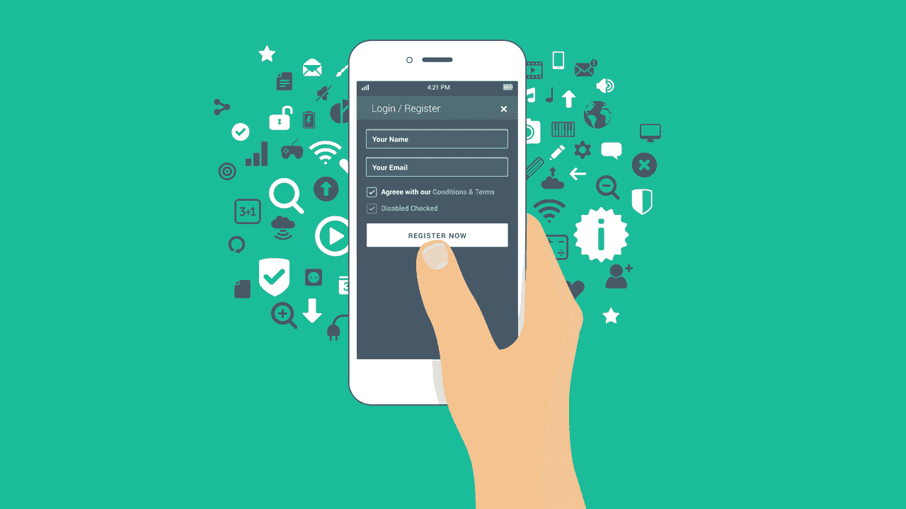
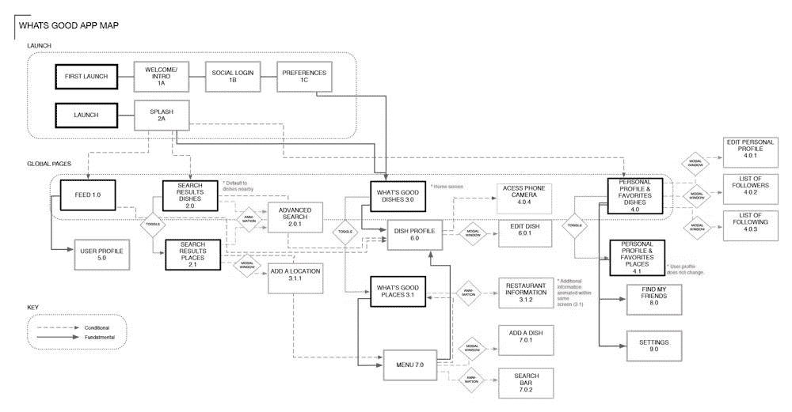

# 如何提高移动网页的可访问性

> 原文:[https://simple programmer . com/improve-mobile-we B- accessibility/](https://simpleprogrammer.com/improve-mobile-web-accessibility/)

全球有超过 10 亿人患有某种形式的残疾。例如，根据世卫组织(世界卫生组织)的一份报告，大约有 2 . 85 亿人患有视觉障碍。有了这么多的残疾人，[移动网络](https://simpleprogrammer.com/2012/04/23/predicting-the-mobile-future/)变得更容易被残疾人使用是很重要的。

已经采取并实施了一些措施。由万维网联盟开发的现有网页可访问性倡议定义了包括“移动可访问性”在内的可访问性标准。虽然 W3C WAI 仍在为移动设备的可访问性进一步开发更具体和更新的标准和指南，但它解决了使用各种互联网设备(包括手机、平板电脑和电视)的人们的可访问性问题。

随着技术的突飞猛进，与世界联系和互动的愿望变得越来越强烈。简单的任务，如预订餐厅、购买电影票和完成日常任务，已经发展到要求个人在线或具有在线身份。[移动辅助功能](http://www.amazon.com/exec/obidos/ASIN/1847193439/makithecompsi-20)对于残疾用户来说更为重要，因为使用他们的手机连接互联网不应该有任何限制。

残疾用户应该尽可能地体验互联网的最大潜力。发现并实施可行的解决方案来实现这一目标，这使得移动网络的可访问性比以前认为的更有价值。

## 为什么移动可访问性如此重要？

我们现在所处的时代，仅在美国就有 1.25 亿消费者拥有移动设备，并(依靠它们来购物)。对于大多数人来说，手机是为了完美地满足他们的需求而制造的，但是作为开发者，我们不能忽视或忽略这样一个事实，即有些人的残疾使他们无法最大限度地使用手机。

经验丰富的移动应用程序设计者和开发者将 web 实践融入他们的移动网站，这些习惯与趋势和新兴技术是并行的。然而，这些工程师中的一些人仍然犯着十年前 web 开发人员犯的同样的错误，比如为特定类型的手机品牌设计网站，而不是迎合普遍的受众。只专注于一个移动品牌是不可取的，因为越来越多的人现在使用他们的移动设备来访问互联网，并且有各种各样的移动品牌使用自己的操作系统，例如使用 iOS 的 iPhone 和其他使用 Android 作为其操作系统的移动品牌。开发者意识到他们的网站需要被广泛的用户访问；通过这种方式，残疾用户可以轻松地将他们的手机作为设备来帮助他们[体验虚拟的 3D 环境](http://redstagfulfillment.com/virtual-reality-drastically-enhancing-ecommerce-shopping-experience/)。

利用跨品牌移动可访问性最佳实践的移动网站与可访问性增强网站具有相同的目标和优势。这些包括以下特征:

*   网页设计必须适度，有一个直观的单栏界面，遵循相同的导航和布局，通常可以在他们的移动网站或应用程序上看到；
*   内容必须简明扼要；
*   网站页面必须避免使用大图片，以改善加载时间；
*   在网站上导航不能依赖鼠标悬停点击；和
*   如果可能的话，内容必须在地理上与访问者的位置相关。

## 如何让你的网站更易于移动访问

这里有 9 个建议，你可以遵循，以确保你创建一个可访问的网站。

### 1.检查您当前的移动网页可访问性

可以使用屏幕和可视阅读器测试来检查您当前的移动网页可访问性。您的[清单](https://www.boia.org/blog/5-tips-to-improve-mobile-accessibility)中的关键问题可能包括以下内容:

*   有增加文本大小的选项吗？
*   你的应用程序是否有进一步的可访问性选项，或者收集用户关于可访问性选项的反馈和评论的方法？
*   你的应用程序在纵向和横向屏幕上都可以工作吗？
*   您的应用程序中是否有帮助或更多信息的链接？
*   有没有与颜色有关的说明或重要特征？
*   你的按钮或图标是否足够大，足够宽，让用户在按下它们的时候不会不小心按错？
*   在测试屏幕阅读器时，你的应用能理解正在朗读的单词吗？
*   在测试屏幕阅读器时，是否可以在不看屏幕的情况下轻松执行操作？

### 2.制作并发布可访问性声明

可访问性陈述提供了关于网站可访问性目标水平的精确信息，以及为实现所述目标而制定的流程。

您制作和发布可访问性声明的原因是为了表明您对此的承诺。虽然这不是强制性的，但建议在你的网站上包含这一点，因为这一声明定义了你的承诺，即让所有可能的用户群体都能访问你的应用程序。

说明你正在进行[改进应用程序功能和部件的可访问性](http://www.amazon.com/exec/obidos/ASIN/1449370195/makithecompsi-20)和可用性，你要对你需要做出的改变和解决方案进行分类、优先排序并创建一个列表。向用户征求反馈将有助于你收集改进所需的信息。

你的[可访问性声明](http://www.onevoiceict.org/first-seven-steps-accessible-mobile-apps/publish-accessibility-statement)必须基于网页内容可访问性指南 [WCAG 1.0](https://en.wikipedia.org/wiki/Web_Content_Accessibility_Guidelines#WCAG_1.0) ，并且它也应该是你在 app store 上应用描述的一部分。

可访问性声明的一个例子是:“这个(网站)致力于提供一个各种受众都可以访问的网站，而不管他们的能力或他们使用的技术。”…等等。

它应包括:

*   声明您的应用程序已被设计和开发为可访问的。
*   应用程序中可提高其可访问性的功能。
*   链接到能够描述硬件和操作系统功能的文档，这些功能可用于提高可访问性。
*   你的应用程序的可访问性的限制。
*   供用户提交反馈的链接。

### 3.网站颜色、对比度和视觉层次的重要性

视觉层次描述了网站上哪些元素最能吸引观众的注意力。

你对配色方案的[选择至关重要的主要原因是，有些人患有色盲或视力不佳，这些情况会降低他们对某些颜色的敏感度以及不同颜色之间的对比度。](https://www.justinmind.com/blog/prototyping-accessibility-in-web-and-mobile-ui-design/)

你必须创建一个网站或一个应用程序，通过巧妙的使用颜色，使其易于阅读。用颜色突出信息和细节。链接显示其预期目的也很重要。

为了视力不好的用户的利益，使用粗体和下划线的链接将更容易被他们看到。此外，色盲的人需要颜色之间有足够的对比度，所以将亮的元素放在暗的背景下，使它们突出。

### 4.采用更多交互式 UI(用户界面)元素

从用户那里获得反馈的一种有效方式是通过使用交互式 UI(用户界面)元素，例如清晰度和上下文，以及手势和提示。UI 元素的外观必须不同于屏幕上显示的静态内容。这改善了那些看不到他们的人的用户体验，以及那些由于手臂和手受损而可能遇到问题的人，这些问题使得在[移动应用](https://www.clockshark.com/Tour/mobile-time-tracking)上完成某个动作所需的移动变得不可能。

在原型阶段测试这些手势是网络和移动开发的关键部分。有很多原型制作工具，如 Sketch、Invision、UX 大头针、Noun Project 和 Pixate，可以为您提供各种效果。这些工具允许您实现动画和过渡，以帮助您向应用程序添加功能。

### 5.确保你有一个网站地图

图片来源:http://alexmolloy.com/projects/1032/

确保你包含一个网站地图，以有效地提高网站的可访问性和可用性。网站地图提供了网站逻辑结构的全面概述。它还以序列化的形式包含了所有重要的链接和部分。

网站地图也让用户更容易浏览你的网站。此外，拥有一个网站地图不仅可以帮助你的用户找到他们的路，还可以通过提高你的网站在互联网上的可见性来促进搜索引擎的优化。

### 6.屏幕阅读器的体验应该是清晰和相关的

屏幕阅读器是一种软件程序，它可以识别屏幕上显示的元素，然后通过语音或盲文输出设备向用户重复这些信息。

依靠口述文字与设备交互的屏幕阅读器必须清晰且相关。通常在屏幕上看到的信息，如描述、滑块、按钮、图标和其他对象，必须符合逻辑顺序。

此外，屏幕阅读器还将数字文本转换为语音，这使用户能够使用键盘导航和收听您的网站内容。这有助于您的视力受损用户，并允许他们像其他人一样高效地参与您的网站。

### 7.利用语义标记

语义标记或语义 HTML 是图像的文本等价物，它还创建有意义的命名链接。它帮助视障用户使用文本到语音转换软件或文本到盲文硬件。

使用语义标记将有助于您更容易地编写和描述代码。你需要记住，在网站中使用语义标记是至关重要的，因为显示的内容和它的结构非常重要。确保你的 [HTML(超文本标记语言)](https://websitesetup.org/html-tutorial-beginners/)既实用又有效只是一件事，通过使用正确的标签，你可以帮助你的网站内容变得与浏览器和搜索引擎更相关。

开发人员必须牢记 web 移动可访问性需要解决的需求，如视觉、运动、移动和听觉障碍。

您的网站和移动应用程序辅助工具将极大地受益于语义标记。你的用户的浏览器可以更好地理解最好的内容应该如何呈现给他们。这对于需要屏幕阅读器帮助的用户来说非常有用。

### 8.嵌入的视频应该有字幕

[https://www.youtube.com/embed/RNgO2_fY5-M](https://www.youtube.com/embed/RNgO2_fY5-M)

Providing captions for embedded videos on your website and mobile app is a vital tool for accessibility. [It provides real-time content for users with disabilities, such as hearing impairments](http://usabilitygeek.com/guidelines-improve-usability-accessibility/), or who otherwise don’t have access to audio.

您的字幕必须与嵌入的视频内容完全同步。此外，确保提供与音频轨道上的内容相同的信息，为媒体准备一份抄本，最重要的是，让所有数字设备都可以访问它。

声音字幕有两种形式，即公开字幕和隐藏字幕。开放式字幕直接嵌入到视频内容中，而隐藏式字幕可以选择打开和关闭，并作为轨道单独包含在一段视频内容中。

### 9.执行用户测试

在这个过程中的每一个重要步骤，你都必须记住进行用户测试，你可以对你的网站的移动辅助功能如何工作进行测试。它将帮助您确定和理解用户可能遇到的各种功能限制和缺陷；你知道他们可能在处理什么样的问题是很重要的。

了解用户的最有价值的方法之一就是与他们互动。在设计过程的原型阶段开始时使用用户测试，可以让您更好地了解目标用户的能力，尤其是那些有视觉、听觉和行动限制的用户。

移动设备不同于计算机，因为它们没有默认键盘，并且具有较小的屏幕作为输入设备。这些功能在用户如何与他们的移动设备以及最终与你的网站交互方面给你的用户带来了挑战。这也是为什么用户测试对于实现更好的移动网络可访问性很重要的原因。

也许你的家人和朋友从移动网络访问中受益。或者，在移动网络可访问性方面，你自己也想体验进一步的改进。

移动网页可访问性也有助于增强网站高效和成功的在线展示的方方面面，包括但不限于转化优化、流量增加和用户参与。

提高移动网页的可访问性是获得卓越的、经过验证的用户体验的基础。创建一个桌面计算机、笔记本电脑和移动电话都可以访问的网站将有助于残疾用户最大限度地利用他们的移动电话。

随着移动技术在社会中的普及，您的电子商务业务的可访问性非常重要，因为它彻底改变了消费者使用网络的方式，尤其是对于使用移动设备使他们购物更容易、更方便的残疾消费者来说。