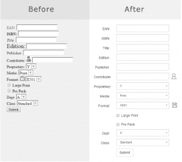

# 如何改进你的应用程序的用户界面和 UX，为什么它很重要

> 原文：<https://simpleprogrammer.com/improve-ui-ux-application/>

我想你正在读这篇文章的事实意味着你有点关心你的应用程序的 UX 和用户界面，并且知道它们不是一回事。对于那些持观望态度的人，我们来做一个快速练习。

假设你正在面试求职者。当一个男人穿着一件脏兮兮的 t 恤，没有刮胡子，头发也没有梳理，你的第一印象是什么？

我敢打赌，你的第一个问题大概是这样的:“招聘人员在把这个人交给你之前，审查过他吗？”你为什么这么想？因为你在做假设。你在假设这个人不认真对待他的工作，如果你雇佣了他，他可能不会做一份体面的工作。

你在想，如果他对自己的外表很马虎，那他可能对自己的工作也很马虎。你为什么这么想？因为经验告诉你，大多数时候是真的。不总是，但是大部分时间。

你应该根据封面来判断一本书吗？不，当然不是，但我们都是。这主要是因为我们没有时间深入挖掘。有多少次你是根据标题来决定是否阅读一封邮件的？你有多少次因为缩略图而点击了一篇文章？

希望这些标题和缩略图是内容的相关描述。但关键是，你不读它就不会知道。你不会阅读你收到的每一封邮件和每一篇文章。相反，你要根据你掌握的一点点信息做出判断。

这就是为什么应用程序的 UI 很重要。当用户第一次看到你的应用程序时，你要把他们争取过来。你想在面试中胜出。你希望他们给你一次机会。这是你的第一印象，在很多情况下，它将决定你是否有机会获得第二印象。

在这篇文章中，我将谈到 UI 和 UX 的区别[以及为什么它很重要](https://youtu.be/WnZpenxb4uA)。到目前为止我一直在谈论 UI。现在这个术语已经有了很多含义，从技术上来说，它意味着“用户界面”,所以它有点涉及到你看到的任何东西，但是当我在这里谈论它时，我指的是你的应用程序的外观。

UI 之所以重要，主要是因为人们会做出快速判断。如果你的申请很难看，人们会认为它很糟糕，不会去尝试去发现其他的东西。同样，如果你的应用程序看起来很棒，人们会认为它能正常工作。最终，外观只能带你走这么远，所以它仍然必须是一个好的应用程序。然而，如果它看起来也不错，那么让人们尝试它就没那么有说服力了。

如果你花时间让你的应用程序看起来不错，人们会认为你花时间确保它运行良好。

## 如果你的应用是用户别无选择只能使用的内部应用怎么办？

外表仍然很重要。请记住，这是关于人们对应用程序的快速判断。你想打动的人无处不在。他们甚至在你自己的公司里，如果你给他们留下深刻印象，你就能保住下一份工作。

事实上，在很多情况下，它的影响甚至更大，因为很多人对应用程序几乎没有实际操作经验，所以在他们的情况下，他们会根据应用程序的外观来判断应用程序。

假设我说服了你。这仍然留下了如何改进 UI 的问题。毕竟你不是设计师。知道 UI 很重要是一回事，但知道如何让它看起来更好是另一回事。好消息是有一些轻松的胜利，我稍后会谈到它们，但在此之前，我想谈谈 UX 并解释一下 UX 和 UI 之间的区别。

## 什么是 UX，它与 UI 有什么不同？

我们已经说过，用户界面的外观是为了给人留下良好的第一印象。就像工作面试一样，你的外表让你有了良好的开端。但那只是开始，那只是让你度过最初的阶段，进入真正的面试。

按照面试的比喻，UX 就是你张开嘴，开始说话，并进行互动。UX 就是感觉你喜欢这个人，你们互相理解，你会喜欢和他们一起工作。

简而言之，就是体验。这就是 UX 的“X”代表的意思:用户体验。

创造积极的用户体验的最基本的部分是确保用户能够在尽可能少的培训下知道如何使用你的应用程序。

用户越是能够快速完成他们想要的东西，而不需要询问他人或查找，就越好。这才是真正的核心。

换句话说，您的应用程序必须是直观的:

### 在图中

使用或基于一个人感觉真实的东西，即使没有有意识的推理；本能。

很好，但是你怎么知道什么是直觉？这是设计 UX 最好的部分，你不能。上面的定义甚至说“没有意识推理”。你不能“知道”它，但你可以发现它。

相信我，一旦你学会了，你就会忍不住去看。它会跳出来给你看。

在大多数地方，交付特性的过程是这样的:

一个功能会持续一段时间。完成后，用户会被告知该特性、其工作原理以及使用方法。

在某些时候，用户会尝试一下。如果他们不理解某些东西，这是大多数情况下，他们会向从事该功能的人寻求帮助。他们谈论和摆弄，直到用户得到它。在某些情况下，这种循环甚至会对同一特征发生多次。

现在说到底，这个没有错。用户获得了一个新特性，并且最终能够使用它。假设这个特性从一开始就是有价值的，那么每个人都是赢家。

仅仅因为这个特性有效并不意味着它提供了一个好的 UX。总会有 UX，用户总会有某种“体验”。在上面的例子中，用户的体验是:他们得到一个演示文稿，他们与几个人交谈，经过大量的交谈和修改，他们终于知道如何使用该功能。

我刚才描述的体验和“好的 UX”概念之间的区别在于，“好的 UX”将学习使用该特性所花费的时间、人力和总体努力减到最少。

作为客户，我们都经历过“好”和“坏”的 UX。你在商店买了东西，带回家，开箱后它就能完全按照你预期的方式工作。苹果正是在这一经历的基础上建立了自己的帝国。

我们也都有过完全相反的经历。我们把产品带回家，试着让它工作，按下每一个按钮，转动我们能找到的每一个旋钮。如果那不起作用，我们求助于手册。我们甚至没有看完整本手册，只是足够回去按更多的按钮。如果还是不行，作为最后的手段，我们打电话支持。如果还是不行(上帝保佑他们)，我们再也不会从他们那里买产品了。

我认为很明显，任何产品的理想体验都是你得到了它，它完全按照你期望的方式工作，并且它提供了你想要的结果。很好，UX。

你越接近这一点，用户就越高兴，这对你有实际意义:更少的支持电话、更少的培训和满意的用户。如果你的市场上有竞争产品，这甚至可以成为竞争优势。

对于所有这些好处，你只需要学习一些 UI/UX 技能，它们将永远为你服务。

## 如何改进你的用户界面

有几个快速简单的技巧可以让你的 UI 变得更好。ui 最常见的问题是视觉混乱。大多数情况下，最有帮助的是对齐和减少。

对齐会让你的用户界面看起来整洁，同样的道理，整理房间，收起餐厅的椅子，对齐门口的欢迎垫会让你的房子看起来整洁。

我所说的减少，并不一定是指从屏幕上移除控件；不过，如果可以的话，这是你绝对应该考虑的事情。我指的是任何视觉元素的数量，如使用的颜色数量，或文本样式的数量，如粗体和斜体——基本上是任何你可以看到和识别出不同的东西。

你拥有的“东西”越多，它就显得越忙、越杂乱、越复杂。

以下是一些你可以做的事情:

为了接近而对齐

*   对齐控件和内容的开始和结束

为了简单而减少

1.  减少颜色的数量
2.  减少图标的数量
3.  使用颜色较少的图标
4.  减少文本装饰的数量(例如，粗体、斜体、不同的字体大小)
5.  使用“清晰边缘”字体(例如，不是 Times New Roman)
6.  用浅色或深色代替原色(例如，用深色或浅色代替纯红色)
7.  使用平面设计(例如，消除视觉“噪音”/额外的东西，如斜面阴影)
8.  使用空格而不是空白占位符(例如“…”或“-”)
9.  组合控件(例如，使用“链接”代替旁边有按钮的标签)
10.  使用在悬停或点击时显示额外视觉元素的控件

就像生活中的所有事情一样，在你的情况下，做上面的改变并不总是正确的事情，但它们会在大多数时候适用。

## 如何提高你的 UX

与 UI 不同，UX 不能简单地归结为应用程序的一系列常见变化。好的 UX 更多的是以一种非常特殊的方式关注使用你的应用程序的人。

上面，我举了一个例子，说明特性通常是如何提供给用户的。让我们再看一遍，并把它分解开来，看看我们如何能以不同的方式做事。同样，典型的流程如下所示:

1.  一个功能会持续一段时间。
2.  当功能完成后，用户被告知该功能、其工作原理以及如何使用。
3.  在某个时候，用户尝试。
4.  如果在尝试的时候，用户不理解某些东西，他们会联系开发这个特性的人。他们喋喋不休，直到用户觉得他们明白了。

这里的问题是，改进 UX 的机会被完全错过了。还记得我们查直觉的定义吗？当某样东西按照用户期望的方式运行时，它就是直观的。

在这个过程中，我们从来没有检查过用户的期望是什么。当然，你可以说这是在收集特性需求时完成的。但很可能不是。

在需求收集过程中可能讨论的是特性实现的不同方式。也许用户得到了选项，并被要求选择他们最喜欢的方法。

问题是，设计师认为用户知道什么对他们来说是直观的。正如我之前提到的，他们没有。直觉的定义值得重复:直觉不是一种有意识的行为。你不能问别人对他们来说什么是直觉。

那么如果你不能知道，也不能问，你如何发现什么是直观的呢？你要求他们执行任务，但不告诉他们如何执行。面对如何完成任务的问题，他们会求助于直觉。他们的本能反应。

他们会开始点击应用程序的不同部分，可能是以你意想不到的方式。当他们这样做时，你可以问他们:"你为什么要去那个菜单?"你为什么点击那里？当你做 X 的时候，你期待会发生什么？

如果他们完全被卡住了，不要感到惊讶:*这种情况经常发生*。如果你和我一样，看到他们艰难地使用你辛辛苦苦创造的功能，你会很难过。别往心里去。

最重要的是，抵制帮助他们的冲动。这比听起来难多了。

如果他们转身问你如何做某事，把问题转回给他们，问他们认为他们应该如何做。如果他们认为你很残忍，在嘲笑他们，解释说你在努力让界面变得更好，他们的困惑不是他们的错，这个会话对你来说非常有价值。

在某些时候，这个过程可能会变得非常无用，因为他们可能根本无法使它工作。

此时，您有几个选择。您可以要求他们执行不同的任务，以便您可以评估不同的功能，或者您可以给他们一个提示，让他们更深入地了解该功能，以便您可以评估它的其他方面。只是不要过早地屈服于这种冲动。

当这一切发生时，你需要记录下他们点击的所有地方，他们尝试的所有事情，以及他们尝试这些事情的想法和理由。

这个过程的好处在于，毫无疑问，你会带着几个关于如何[提高 UX](http://www.amazon.com/exec/obidos/ASIN/1449372864/makithecompsi-20) 的想法离开这个会议。只要确保你不会落入不测试你的解决方案的陷阱。在您对 UX 进行调整之后，您应该再次经历这个过程，最好是使用不同的用户。

我保证如果你这样做了，至少你的 UX 会好很多。