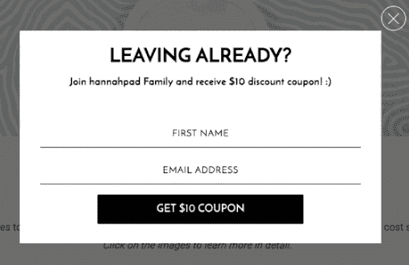
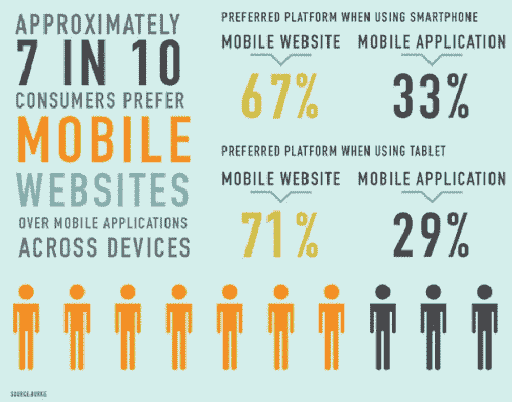
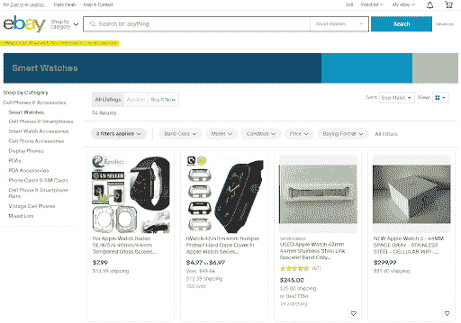

# 提高你的电子商务网上商店 UX 的 10 个高级策略

> 原文：<https://simpleprogrammer.com/improve-ux-online-store/>

The world of e-commerce is no longer an alienated part of retail chains. On the contrary, most would argue that it is the future of the modern retail industry. According to some recent studies, e-commerce is likely to reach [nearly $4.28 trillion in sales](https://www.statista.com/topics/871/online-shopping/) and attain almost 22% of the total retail sales in 2021.

希望进入这个不断增长的市场的新兴电子商务公司需要加快步伐，为客户提供独特的购物体验。如果预测到 2040 年 95%的零售购物将在网上进行的话，电子商务零售商还有很长的路要走。随着电子商务[的平均转化率在 3%到 4%之间](https://www.invespcro.com/blog/the-average-website-conversion-rate-by-industry/)，公司需要更加积极主动地创造独特的用户体验。

因此，如果你想知道如何在你的网站上[改善客户体验](https://simpleprogrammer.com/improving-ux-design/)，这里有一些行之有效的方法，你可以考虑:

## 1.利用内容交付网络(cdn)

与电子商务网站相关的加载速度和内容显示效率决定了在线商店的性能。实现这一点的一个好方法是通过高效的[内容交付网络(CDN)](https://www.bigcommerce.com/ecommerce-answers/what-is-a-cdn-content-delivery-networks-and-ecommerce/) 。cdn 被定义为分布在世界各地的服务器集群，存储用户在网络上访问的内容。

使用内容交付网络，电子商务公司可以无缝地交付集成到其网站中的图像和多媒体文件，而不必担心滞后。你所需要做的就是启用内容交付网络，该网络将缓存你的网站内容，然后在用户每次试图访问同一网页时交付缓存的版本。

## 2.使用退出意图弹出窗口

利用[退出意图弹出窗口](https://www.omniconvert.com/what-is/exit-popup/)的最有效方法之一是增强用户体验。此外，这种吸引网站访问者的常用策略提供的好处会让用户想在网站上停留更长时间。在您的购物或浏览过程中，您很有可能至少遇到过一次退出意图弹出窗口。

关于上下文，请看下面的例子:

[来源](https://www.omnisend.com/blog/exit-intent-popup-examples-small-online-businesses/)

当您知道用户将要退出网站时，您可以启用这样的退出意图弹出窗口来提示用户。这将是一个绝佳的机会，你可以提供任何独家折扣、优惠或赠品来留住网站用户。你知道吗[购物网站](https://www.oberlo.in/statistics/shopping-cart-abandonment-rate)69.5%的购物车都是废弃的？在这方面，退出意向弹出窗口可能是降低购物车放弃率的理想工具。

## 3.创建以客户为中心的 CTA

创造一流用户体验的目标总是增加转化率和销售额。考虑到这一目标，行动号召(CTA)按钮是购买过程中的关键要素。当有效整合时，CTA 可以引导用户完成购买之旅，并激励他们在你的网站上购物。

恰当地安排 CTA 可以有效地引导客户通过销售漏斗，并向他们明确今后应该采取的行动。以客户为中心应该是你在设计 CTA 时应该考虑的最重要的参数。除此之外，你应该使用对比色来突出按钮，并创建可操作的文本来使 CTA 元素更加有效。

## 4.加大移动商务的力度

在建立强大的电子商务网站时，你需要考虑的一件事是让你的网站更适合移动设备。在移动设备上提供流畅的用户体验对在线市场来说是相当有益的。事实上，根据 eMarketer 最近的一项研究，[超过 59%的电子商务购买](https://www.emarketer.com/articles/topics/retail-ecommerce)是在移动设备上进行的。

[来源](https://kinsta.com/blog/ecommerce-statistics/)

移动商务兴起的最大原因之一是人们倾向于随身携带移动设备，这让你更容易将他们的购买决定转化为购买行为。更重要的是，数字支付也通过移动设备变得无缝。

## 5.启用语音和视觉搜索

说语音搜索和视觉搜索是未来的人没有说谎。随着语音助手的日益普及，语音搜索的需求和需要也在不断上升。事实上，如果你认为你还有时间适应语音搜索趋势，你知道吗[近 20%的谷歌搜索](https://www.shopify.com/partners/blog/ecommerce-trends)已经是由语音驱动的——这要归功于手机。

更重要的是，随着智能扬声器的增长和普及，以及现有需求的增长速度，语音商务不会太落后。因此，启用语音搜索将使你领先于你的竞争对手，并在可预见的未来给你一个明确的优势。

视觉搜索被定义为通过扫描产品或产品图像而不是使用传统的文本搜索查询进行的搜索。在这种情况下，许多已经利用该技术的电子商务零售商可以在购买过程中为他们的客户提供更好的建议和指导。此外，在你的网站上启用视觉搜索将意味着客户可以更容易地在你的在线商店上找到他们正在寻找的确切产品。

## 6.保持内容的准确性和质量

作为一个电子商务商店，你应该已经广泛关注于提升你的内容的准确性和质量。超过 82%的营销人员对内容进行了大量投资。内容营销是每个电子商务卖家都应该利用的工具，考虑到与其他传统和广告方法相比更高的回报和更低的投资。

在这方面，你的主要关注点之一应该是你的产品描述。他们需要详细、简洁、清晰地向客户传达信息，并且需要有针对性地进行转化。同样，你需要不断地监控和更新你的内容质量，这样用户就可以很容易地找到他们想要的东西。

请记住，保持内容的准确性与及时更新信息以及确保网站上的所有信息将客户引向正确的方向有很大关系。

## 7.留下面包屑

如果你有一个大型网站，有一个全面的产品目录和大量的产品，有一个很好的机会，客户可能会迷失在你的网站。可以理解的是，这不仅会妨碍您想要提供的用户体验，还会使它变得更加复杂。

面包屑可以通过让客户知道他们在网站上的确切位置来解决这个问题。有效实施时，面包屑可以降低跳出率，鼓励浏览网站，并提供显著的 SEO 好处。要了解这如何帮助你在搜索引擎优化方面做得更好，请参考[在线搜索引擎优化指南](https://supple.com.au/guides/magento-seo-guide/)来帮助你完成这个过程。

让我们看看易贝是如何做到的:

[来源](https://www.ebay.com/)

## 8.整合微观互动

与电子商务网站相关的一个突出的基本规则是，你永远不应该认为你的网站的交互性和参与性是理所当然的。就这一点而言，你应该努力抓住机会，让客户能够与你设计的界面互动。

微互动在创造产品时刻方面发挥着重要作用，为客户提升了产品的外观和感觉。微互动最受欢迎的例子之一是脸书上的“喜欢”按钮。由于该按钮使用户能够与 UI 进行交互，因此它强调了参与度，进而强调了用户体验。

你可以将微交互整合到你的网站中，方法是制作可以悬停的动画，或者在产品或登录页面上添加反馈图标，从而增加用户体验的情感吸引力。

## 9.体验增强现实

增强现实(AR)通过将技术与现实相结合，彻底改变了现代购物体验。通过集成 AR，电子商务商店可以允许用户在购买前试用产品。超过 35%的消费者表示，如果他们可以虚拟试用产品，他们会更愿意在网上购物。

AR 可以通过促进更明智的购买来增强用户体验，从而降低跳出率。一个很好的例子是宜家通过 IKEA Place 整合的应用程序体验，顾客可以虚拟地摆弄产品，定制产品，并将其放置在自己的环境中。该应用程序旨在向客户展示产品在他们周围的外观。

## 10.放置适当的过滤器和分面搜索

过滤器是决定在线商店整体用户体验的重要因素。它允许用户更容易地找到他们正在寻找的东西，并让他们个性化他们的选择。虽然大多数商店都提供过滤选项，但他们缺少的是多方面的搜索选项。

分面搜索选项基本上允许您包含不同过滤器的组合，以便您在拥有大量产品的网站上购物时可以显著缩小搜索范围。

无论如何，电子商务公司应该从添加基本的过滤选项开始，并朝着多面搜索选项努力。此外，确保不要用太多的过滤器淹没你的用户；否则，它会产生与你想要的完全相反的效果。

## 包扎

用户体验(UX)是网上商店成功的最重要的决定因素之一。高效和设计良好的用户体验不仅可以降低网站的跳出率，还可以转化为更多的转化率和收入。一流的电子商务用户体验需要数百种元素和功能来组合并创造独特的购买之旅。通过这些策略，你可以确保你的商店[成功提供完美的用户体验](https://spdload.com/blog/why-is-user-experience-a-more-important-ranking-factor-than-you-think/)。