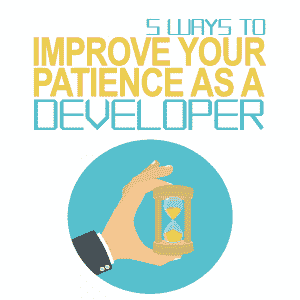

# 提高开发人员耐心的五种方法

> 原文：<https://simpleprogrammer.com/improve-your-patience-developer/>

As a developer, there are many skills that no amount of coding talent and education can teach you. Patience is one of them. You will be forced to deal with not only coding issues, but also the opinions of other people, such as your co-workers on a project or users of your application, and that can try anyone’s patience.

作为一名开发人员，如果耐心是你一直在挣扎的事情，或者如果你只是在寻找进一步提高你的耐心的方法，那么这五个方法应该会让你走上正轨，成为你的团队中最冷静、最有耐心、最善解人意的开发人员。

## 1.提高你的同理心

作为一名开发人员，您对您的代码如何工作、它为什么会这样做以及您在项目工作时如何做出决策有着深入的了解。这不一定适用于你的同事或用户，无论是在公司内部还是外部。所有这些人都来自各种各样的背景，有着自己独特的观点和技术知识水平。作为一名开发人员，你需要对任何使用你的应用程序的人表现出同理心，试着从他们的角度来看问题。最终，他们会给你提供你自己从未想过的洞察力。

仅仅因为某人有不同的知识并不意味着他们不能给你的编码增加价值。当然，他们可能不知道如何编码，但是他们可能有你需要的知识来使你的编码项目对最终用户来说是完美的。

但是如果你不接受别人对你的代码的想法和感受，你会显得很不耐烦，对他们说的话很抵触。相反，带着这样的知识去倾听，他们可能会有一些有价值的东西来使你的项目变得更好。

在一天结束的时候，这就是一切。你们都在朝着同一个目标努力，所以听听你的同事的意见，并意识到他们所拥有和知道的可能会为你的项目增加价值。

## 2.多思考，少说

我肯定你希望我多听少说，但是请听我说完。虽然我不想强调在从事编码项目时倾听他人意见的重要性，但这更像是在你开口评论之前，用你的大脑解决所有的问题。

我的意思是，你需要倾听他人，真正思考和考虑他们所说的话。毕竟，如果你花点时间听听他们要说的话，并认真考虑，你可能会明白他们的观点，甚至认识到一些你以前看不到的关于你发展的东西。

工作场所的编码通常是一项协作工作。您可能只处理一个大型项目的一个方面，其他许多人编写应用程序的其他部分，还有其他人负责管理项目或想出在应用程序中包含什么的想法。每个人都有自己的角色，都有潜力为项目带来巨大的价值。

虽然你可能喜欢控制自己的角色，但在评论别人要说的话之前，要虚心听取别人的想法，并仔细考虑他们的立场。真的，我是说对你的评论不要那么反动；相反，依靠你的大脑去思考他们所说的和你正在做的事情之间的关系，你不仅会表现得很有耐心，你也会有那种感觉。

## 3.放慢速度，仔细考虑你的项目

在开发人员的世界里，通常有严格的截止日期。在进入下一个阶段之前，项目的一部分必须被编码和完成。最重要的是，你通常会让经理和用户检查你的编码何时完成。

All of this pressure can cause you to rush and hurry through your project. While you may believe this helps you work faster, you are mistaken. In most cases, rushing through your project will only make things worse. You will make more mistakes, which will only work to raise your frustration levels and make you feel even more impatient for both your project and your co-workers around you.

相反，放慢速度，花些时间来正确评估你的项目。通过正确地[评估你的编码](https://simpleprogrammer.com/coding-problem-solving-skills/)，你可以一行一行地完成它，减少错误。当然，你可能会花更多的时间来写代码，但是你会花更少的时间来解决为什么它不能工作的问题。

这对你来说意味着什么？这意味着您可以更快地完成您的项目，而不会因为应用程序无法正常工作而感到沮丧。当你减少了对一个项目的总体挫折感，你将很容易增加你处理工作中可能出现的任何其他事情的耐心。

## 4.享受你的休息时间

我从未见过懒惰的程序员。我不是说它们不存在；我只是说，以我的经验来看，程序员似乎工作太多了。

这通常是因为他们喜欢编码。他们在工作和家里都这样做。我甚至认为，如果可能的话，有些人会在洗澡的时候写代码。虽然热爱自己的工作很好，但你的大脑需要其他类型的参与。

一个把所有时间都花在编码上而不做其他事情的程序员通常会显得矮小、粗鲁和没有耐心。这是因为他们的大脑从不放松。你的大脑需要分心和放松的时间。通过参与你的其他兴趣，你可以给你的大脑时间充电，这样你就可以专注于你的项目。

作为一个开发者，你想做好自己做的事情，但这并不意味着你不能热爱和做其他的事情。发展其他兴趣对改善你的整体心理健康大有帮助，快乐的开发者是有耐心的开发者。

## 5.练习每天的例行公事来减少你的不耐烦

如果你想提高你的耐心，你需要一件事，那就是练习。将日常生活融入到日常生活中来帮助你提高耐心，对于改变你对许多情况的反应有很大的帮助，不仅在编码方面，在你的整个生活中也是如此。

For starters, remember the pointers we discussed above, but try to work on other daily habits such as slower breathing and relaxation methods to help keep you calm. The next time you feel your temper flaring, try counting slowly to 10\. While you count, focus your breathing and make yourself breathe slower. This will calm you and give you a moment to collect your thoughts so you can provide a more rational response to whatever set you off in the first place.

每个人都知道你对你正在做的项目充满热情，这种热情经常会让你不耐烦。但是有可能对你正在做的事情充满热情，甚至强烈捍卫你的项目是什么和如何做，同时保持完全的冷静和对他人的耐心，即使他们对你正在做的事情持批评态度。

通过关注一些你可以控制的事情，比如你的呼吸和强迫你的大脑放松你的身体，你可以更容易地应对潜在的压力，同时保持冷静、冷静、耐心和控制。

## 培养耐心

当你编码的时候，保持耐心是很困难的。从你在应用程序不工作时遇到的不可避免的挫折，到所有不同的人和个性对你正在做的事情发表意见，当你工作时可能会有很多压力。这种压力会让你看起来甚至对周围的每个人都不耐烦。

通过放慢节奏，练习声音镇定技巧，花几分钟时间设身处地为他们着想，你应该能够提高你的耐心，无论你正在做的项目发生什么事情，你都能够保持冷静。