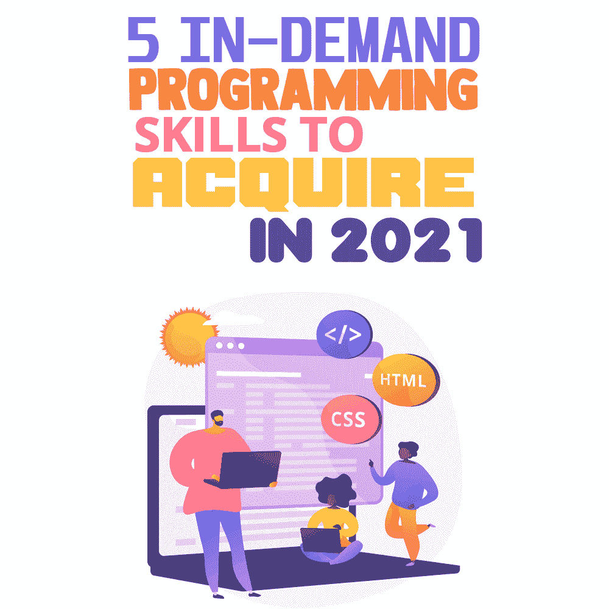
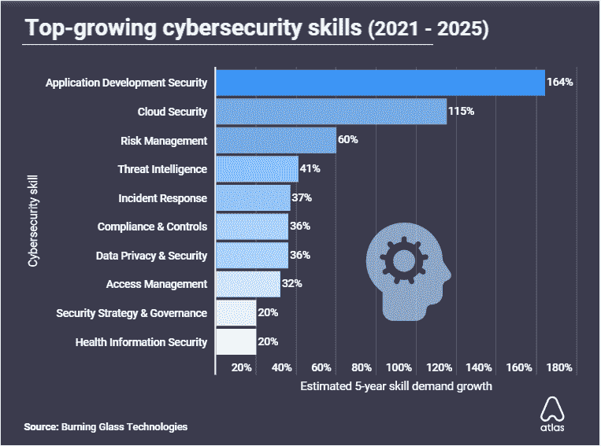
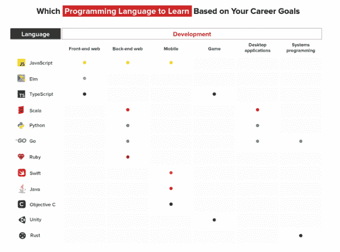

# 2021 年需要掌握的 5 项热门编程技能

> 原文：<https://simpleprogrammer.com/in-demand-programming-skills-2021/>

As we progress into 2021, a quick glance at the [most in-demand tech jobs](https://www.cio.com/article/3235944/hiring-the-most-in-demand-tech-jobs-for-2021.html) reveals that security professionals are at the top, with approximately $213,000 annual income for the 95th percentile. This job market is reflective of the evolving technology landscape that offers lucrative opportunities for fresh graduates or even experienced programmers who want to learn the latest trends.

尽管科技市场在不断增长，但由于技能不匹配，获得理想工作的机会可能很小。不匹配的主要原因是[求职者没有提供雇主寻找的技能](https://www.businessinsider.com/new-survey-tech-skills-gap-virtually-nonexistent-2018-12)。

为了克服这一挑战，年轻的专业人士应该致力于培养自己特定领域的技能，而不是试图在所有方面都出类拔萃。开发一套量身定制的技能将更有助于获得一份最适合你能力的工作。

那么 2021 年你应该在哪些技能上努力，才能找到适合自己的职业道路呢？由于趋势不断发展，市场需求也在不断变化。然而，学习业内最新的技能能让你保持相关性，增加你被雇佣的机会。这个博客将帮助你发现今年最需要学习的五种编程技能，以及如何在这些技能中脱颖而出的技巧。

## 云的网络安全

由后疫情时代的在家办公引发的云采用预计将在 2021 年增加。不幸的是，向云的过渡并非一帆风顺。

数据泄露和监管合规风险导致企业提议增加网络安全实践的预算。随着时间的推移，威胁的增加以及公司内部信息技术(IT)专业知识的缺乏只会证实网络安全威胁将变得更糟。

然而，好消息是，网络安全是你未来职业抱负的一个重要领域。网络安全被称为 IT 的一个迷人分支，是喜欢挑战的人的理想选择。网络安全工程师需要的不仅仅是一个 IT 学位。

一个熟练的网络安全工程师对 C++、PHP、Python 和 Pearl 等编程语言有很强的掌握。有防火墙和终端安全的功能、操作和维护经验者优先。

专业提示:如果你拥有出色的编程技能，并且擅长在快节奏的环境下工作(在压力下阅读)，那么网络安全就是你的领域。

随着 2021 年全球网络犯罪的成本上升到[6 万亿美元，](https://cybersecurityventures.com/cybercrime-damages-6-trillion-by-2021/)对网络安全专业人员应对威胁的需求也大幅增加。据《T2 纽约时报》报道，2021 年，全球预计有 350 万个网络安全职位空缺。看起来很有希望，对吧？

来源:[atlaspvn](https://atlasvpn.com/blog/app-development-security-is-the-most-wanted-cybersecurity-skill-in-2021)

尽管网络安全是最受欢迎的编程技能之一，但该领域仍然缺乏训练有素的专业人员。你很幸运，获得这些工作的认证并不难。有几个有价值的认证可以让你有资格进入网络安全职业道路。

第一个是[CompTIA Security+](https://www.newhorizons.com/article/the-best-cybersecurity-certifications-to-boost-your-career-in-2018)——一个适合刚接触网络安全的 IT 专业人士的入门级培训。接下来是认证信息系统安全专家(CISSP)课程。CISSP 培训要求三到五年的工作经验，对于那些希望提升技能的严肃程序员来说，这被认为是一种薪资助推器。

## 人工智能(AI)和机器学习(ML)

根据 Burning Glass Technologies 的一项调查，2021 年薪酬最高的两个技术工作是 IT 自动化和人工智能，今天有 197810 个职位空缺。AI 和 ML 的快速扩展可以主要归因于大流行后的工作环境。随着企业在数字战线上的连接，许多组织已经在至少一个功能中采用了人工智能。

毫无疑问，人工智能和大联盟将在 2021 年大放异彩。这对程序员群体来说只意味着一件事:令人兴奋的学习机会。为了进入人工智能和人工智能领域，你应该对当前的趋势了如指掌。

最大的转变将是走向工作场所人工智能，在那里，公司已经选择人工智能来减少办公室和家庭工作者的不足。此外，为了防止不必要的行动，企业只会承诺与有道德的人工智能实践的合作伙伴合作。

对于人工智能爱好者来说，通往成功职业生涯的道路需要坚持不懈的承诺。如果你刚刚开始你的研究生学习，那么你的目标是选择计算机科学和数学学位，重点是流行的编程语言。

成为一名人工智能工程师需要很好地掌握技术和非技术技能。虽然技术知识涵盖了像 R、Python 和 Java 这样的编程语言，但非技术方面侧重于行业知识和沟通技巧。

除了新的学习者，AI 和 ML 行业也是当前软件工程师的一个有吸引力的选择。作为一个拥有所需技术背景的人，你已经在战场上领先一步，加上简历上的一些额外课程，你将有资格申请人工智能领域的工作。你可以注册顶级在线资源的课程，如[谷歌学习](https://ai.google/education/)和 [Udacity。](https://www.udacity.com/course/intro-to-machine-learning--ud120)

一个快速发展的行业可能会提供大量的就业机会，但这完全取决于你如何提高自己的编程技能和知识。记住，通往美好未来没有捷径——相反，在你的旅程中努力工作并保持动力。

## Rust 编程语言

每个软件工程师都对 Python 和 JavaScript 等流行编程语言有很好的了解。原因是这些语言有广泛的应用，并且已经使用了很多年。

但是 2021 年为有抱负的程序员准备了新的东西。Stack Overflow 在 2020 年进行的一项开发者调查发现，Rust 连续第五年成为最受欢迎的编程语言。

来源:[富栈学院](https://www.fullstackacademy.com/blog/nine-best-programming-languages-to-learn)

在过去的几年里，Rust 变得越来越突出，因为它声称是系统编程需求的 C++的合适替代品。为此，Rust 是开发人员在开发大规模应用程序时寻找问题解决技术的绝佳选择。对于高效编程，Rust 通过帮助开发人员消除 C++导致的错误来提供高性能。

由于开发人员花了大量时间开发这种语言，Rust 被认为是用户友好的，不像其他语言。这是一个很大的加分点，对于希望在未来几年学习一门新语言的程序员来说是一个很好的选择。

随着对安全和结构的关注，Rust 很可能在未来主导市场，所以如果你正在考虑学习 Rust，不要再推迟了。有一个完整的[网站](https://www.rust-lang.org/learn)致力于帮助新开发人员学习 Rust，有三个主要选项可供选择。第一步是根据 Rust 编程语言手册。

对于那些寻找更实用方法的人来说，项目中有一个[生锈课程](https://github.com/rust-lang/rustlings/)可以提供实践经验。第三个选项是 [Rust by Example guide](https://doc.rust-lang.org/stable/rust-by-example/) ，它阐述了对 Rust 最重要的概念。好消息是所有这些资源都是免费的。因此，没有理由不学习未来的语言。

## 开发运营

根据定义， [DevOps 是一套旨在简化软件开发和 IT 运营的实践](https://www.geeksforgeeks.org/top-10-devops-skills-to-learn-in-2021/)。凭借缩短软件开发生命周期和运行高质量软件的能力，DevOps 正迅速受到欢迎。降低成本、提高灵活性和快速产品交付的竞争推动了对 DevOps 的需求。由于其创新性，预计从 2020 年到 2027 年，DevOps 市场将增长 [22.9%。](https://www.globenewswire.com/news-release/2021/01/11/2156412/0/en/Global-DevOps-Market-to-Reach-up-to-23-362-8-Million-and-Rise-at-a-CAGR-of-22-9-from-2020-to-2027-207-pages-Informative-Report-by-Research-Dive.html)

如果你想为未来的技术做好准备，DevOps 绝对是 2021 年要学习的一项令人兴奋的技能。职业方面，DevOps 工程师拥有用于组织各种数字平台的自动化工具的知识。

由于非常关注自动化，DevOps 工程师需要掌握 Python、Java、Perl、Ruby 和 PHP 等语言的编码和脚本。如果阅读这篇文章让你想了解更多，那么把 DevOps 添加到你今年需要掌握的编程技能列表中。

无论您是新的软件开发人员还是有多年操作经验的人员，现在都是开始过渡到 DevOps 的最佳时机。对开发工具的深刻理解已经让你在成为 DevOps 工程师的道路上有了一个良好的开端。你不需要马上离开现在的工作；相反，提高你的技能，直到你找到你想要的工作。

作为一个问题解决者，批判性思维将帮助你在 DevOps 领域走得更远。学习，进化，最重要的是不要忘记提问。如果你对开始你的 DevOps 工程师生涯充满热情，你可以随时获得专业认证。

## 响应式网页设计

2021 年的观众使用多种小工具访问在线内容。为了增强用户体验，响应式网页设计是必须的。由于大多数消费者使用他们的移动设备来浏览网站，不关注网站适应性的公司将会失败。

创建一个响应迅速的网站意味着跟上市场的最新趋势。关键是吸引观众，让他们停留更长时间，体验智能滚动。

2021 年，视差动画因其与现实的共鸣，有望得到普及。2021 年的下一个趋势预计是新形态——极简现实主义。随着网站上对 3D 图标的大肆宣传，neumorphism 可能会产生影响，并让观众感到敬畏。

学习响应式网页设计实践绝对是对一个前端开发者编程技能的升级。任何在各种平台上使用的网站都需要有超强的响应能力。因此，如果你是一名前端开发人员，正在努力为用户创造无缝的 UI 体验，那么响应式 web 设计就是你需要的技能。

响应式用户界面不再是可有可无的，如果公司希望成功地建立他们的在线形象，这是一个必须满足的要求。如果你不太了解响应式设计，不要紧张；你可以从今天开始。有各种各样的[可操作的工具](https://simpleprogrammer.com/7-tools-improve-web-development-workflow/)可以帮助你改进 web 开发，从而提高客户体验。

对于希望从零开始的开发人员来说，总有广泛课程的[选项。即使你获得了认证，最好的经验还是来自观察。去看看著名的 UI/UX 设计师是如何工作的，他们使用了什么技术。一旦你知道了什么是可行的，你就可以根据你公司的需求来采用它。](https://www.coursera.org/specializations/website-development)

## 为了更好的未来，提升你的编程技能

2021 年对科技行业来说充满希望。有许多高薪职业道路可供开发人员选择，所以选择你感兴趣的。如果你想转行或者在简历中增加一项新技能，那就马上开始吧。报名参加一门新课程或报名参加一个项目以获得一些实用知识永远都不晚。

The future is automation, which means that robotics and AI will eventually take over most tasks. A highly automated industry signals for differentiation of strengths. One way to establish your skills is to focus on a specific tech area or field like cybersecurity.

通过这种方式，你将能够增加自己的经验，使自己有资格获得更高层次的职业道路。100%投资于一个单一的利基市场可能比 10%投资于 10 个不同的行业更有回报

此外，为了进一步提高你的技能，试着专攻需要人类素质的领域，如创造力、批判性思维和同理心。这些品质被归类为软技能，对于希望在科技行业取得进步的开发人员来说同样重要。

化繁为简的关键是制定你今年的目标和目的，然后设计一个路线图来实现它们。不要忘记添加截止日期并获得反馈。最后，不要对自己太苛刻。你不必总是第一次就赢——保持专注和一致来实现你的目标。