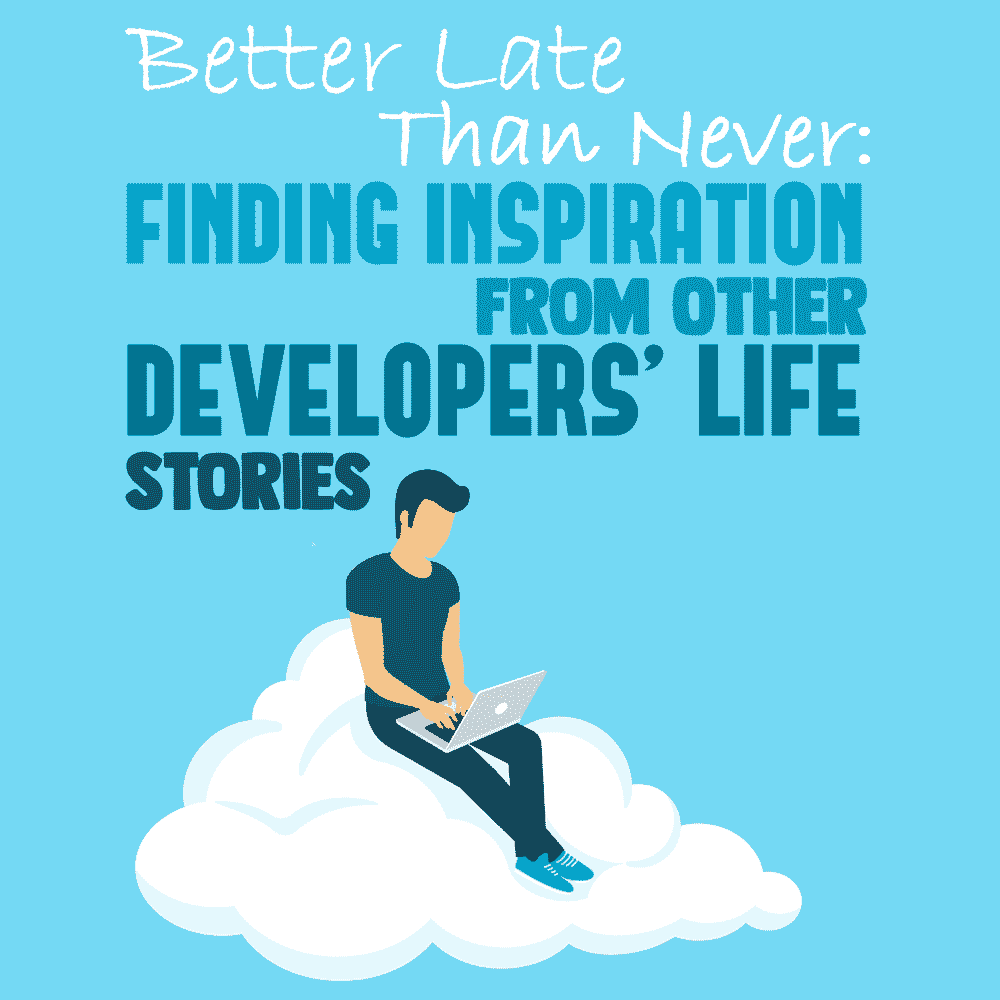

# 迟到总比不到好:从其他开发者的生活故事中寻找灵感

> 原文：<https://simpleprogrammer.com/inspiring-developer-story/>

<figure class="alignright is-resized">

</figure>

社交媒体和互联网让这个世界变得越来越小。我们在网上遇到各种各样的人，做着各种各样的工作，过着非常不同的生活。

作为一名软件开发人员，我在网上遇到了许多有才华的程序员。他们的成就和成功故事足以激励你或威胁你。这些程序员有的甚至 6 岁就开始编程了！当我发现这一点时，我立即想到，“这不是我们国家发生的事情。”在印度，没有随心所欲的文化。事实是，孩子们没有被培养成能自己决定他们想要的职业。相反，这种文化是追随潮流。

印度一半的计算机开发人员之所以存在，是因为计算机科学很时髦，而不是因为这是他们的激情所在。这就是孩子们没有动力早点开始的原因。

不过，我有点不同。听到程序员从年轻开始的故事激励了我。有两种方法可以获得这样的成功案例:

1.  你可能会被**吓倒**

*或*

2.你可能会受到**的启发**

我选择了后者，正如罗伯特·弗罗斯特所说，“这让一切都不同了。”看到成功的开发人员在我内心点燃了一把火，让我变得和他们一样，而不是逃避他们。

在其他人成为程序员的[旅程中有很多力量——你可以学到毅力、勤奋和动力。阅读别人解决问题的方法可以为你提供独特的工具来处理类似的情况。](https://simpleprogrammer.com/pragmatic-programmer)

让我和你们分享一下我成为一名程序员的故事。这样，我希望能激励你不仅从我的错误中学习，也从我后来的明智决定中学习。

## 关注你真正的目标

我 16 岁的时候就知道自己想成为一名计算机工程师(在印度是这么叫的)。计算机工程师是最初被教授工程所有领域的人，然后*被教授计算机。*

很困惑，对吧？嗯，在印度就是这样。

唯一的问题是我不知道如何开始。我一点头绪都没有，甚至没想过要去谷歌一下。我只是做了其他人都在做的事情——我为全印度工程大学入学考试做准备。我想，然后，我会开始学习电脑。

老实说，当时我甚至不知道什么是编程。我只知道我必须在工程测试中取得好成绩才能被大学录取。

回想起来，如果有机会的话，我会改变很多事情。第一件事是我决定为那个工程测试无休止地学习，而不是把我的精力和努力集中在我打算在余生做的事情上:编程。

你可以从我的故事中学到的第一件事是:**永远关注你的*****实际目标，你真正想要的，而不是你猜测可能会让你达到的目标。你可能甚至不知道如何达到你的目标，但是在这个时代，缺乏指导不应该成为借口。有了网络，有了目标，你就能直击靶心。***

## *你不一定像其他人一样熟练，这没关系*

*在我的学校，我们有机会在大学前的两年里选择两个科目中的一个:信息技术(IT)或体育(PEd)。PEd 更容易得分，所以我选择了它。是的，讽刺的是…我知道。*

*我没有接受我努力要达到的目标。我想:“没事，我大学再学。”我在全印度工程预科考试中取得了足够好的成绩，得以进入一所不错的大学学习计算机科学课程，但生活才刚刚开始。*

*我仍然记得我的第一堂计算机编程课，我们被要求写一段简单的 C 代码:*

*   ***问题 1:** 这是什么代码块？*
*   ***问题二:**这个 printf 是什么？*
*   ***问题三:**C 又是什么？*

*我们班有一半人有 IT 背景，而我在 PEd 选择了踢足球。结果，他们轻而易举地写出了给我们的代码，而包括我在内的另一半，则是一脸茫然。我们对课堂上发生的事情一无所知。*

*我一生中从未如此尴尬过。*

<figure class="alignright is-resized">

**

</figure>

*在你的编码生涯中，*也会面临类似的情况。不可避免地，总有一天别人会知道一些你不知道的事情。这可能会让你失去自尊。这可能会让你失去升职的机会。它甚至可能让你丢掉工作。**

*但是你在这样的失败之后所做的事情才是真正重要的。*

## *学会反弹*

*第二天，我在 YouTube 搜索框中输入以下查询:“C 语言初学者”我找到了纽博斯顿的一门课程，在接下来的几天里，我把自己锁在房间里学习基础知识。*

*我不会撒谎，这很难。这是我以前从未做过的事，但我只知道我必须做这件事。我的同学比我有优势，我知道我还有很长的路要走。这实际上成了我开始努力快速学习的动力。*

*在接下来的四年大学生涯中，我每天都在学习——我说的每天，真的是每天都在学习。在那四年结束的时候，我比我的大多数同学都过得好。*

*这包括那些事先学过编程的人！*

*是什么让我走了这么远？是什么让这个第一天上课连一个键都不会按的家伙，在[位置](https://simpleprogrammer.com/developers-setting-career-goals/) [i](https://simpleprogrammer.com/developers-setting-career-goals/) [比他的同龄人好得多](https://simpleprogrammer.com/developers-setting-career-goals/)？我可以把它分解成三件重要的事情:**努力**(没有努力你不会成功)**勇气**以及——真正重要的是——**坚持。***

## *你的年龄不重要，但一致性很重要*

*现在，我再强调这一点也不为过:在你的编码生涯中，最重要的成功工具是**一致性。你可能非常有天赋，或者在一两个月内非常努力地工作，但是如果你真的想大大增加你成功的机会，那么坚持不懈地工作——日复一日，月复一月。***

*大学结束时，我的同学们在我身上花的两年时间都消失了，因为我有更强的进取心，并且始终如一。现在，这不仅仅是关于那两年——这只是一个例子。正如我告诉你的，我遇到过 6 岁就开始编程的人！*

*如果你早点开始，那很好，我肯定会建议每个人早点选择自己的道路，并专注于此。然而，也有伟大的开发者是从 30 多岁甚至 40 多岁开始的。虽然我认识一些 6 岁就开始工作的程序员，但我也见过一些 37 岁就开始工作的程序员，他们比那些受过多年正规教育的人做得更好。*

*我自己并没有很早就开始，关于晚开始，我要告诉你的是，没关系，你在一个年龄无关紧要的领域。*

*它永远不会，只要你始终如一。*

*不要被比你更有经验的同龄人压垮；这不是世界末日。你可以被他们激励，但不要被他们的成功吓倒。也许他们早到了，但这并不意味着你迟到了。事实是，永远不会太晚。*

*在印地语中，有这样一句谚语，“Jab jaago tabhi savera”，意思是“无论何时醒来，都是早晨。”所以，永远不要后悔在晚年开始做某事。总是把它当成一个挑战，就像我说的，这是关于一致性，而不是年龄。*

## *学习是一个永无止境的过程*

<figure class="alignright is-resized">

**

</figure>

*多年来，人们常说的一句话是“从别人的错误中吸取教训……你不可能活到自己犯所有错误的那一天！”*

*这可能是开玩笑的，但并不意味着这不是真的。从错误中可以学到很多东西，无论是我们自己的还是别人的。每个故事都可以启发我们重新思考我们的优先事项或重新调整我们的努力。*

*出错的尴尬只会持续几秒钟。从中学习可以是永远的。*

*读故事很棒，不是吗？你知道什么更好吗？创造你自己的。请记住，你不会在一夜之间或几周内获得成功，这需要时间和大量的努力。但是相信我，当我告诉你这些的时候，“果汁是值得压榨的”。*