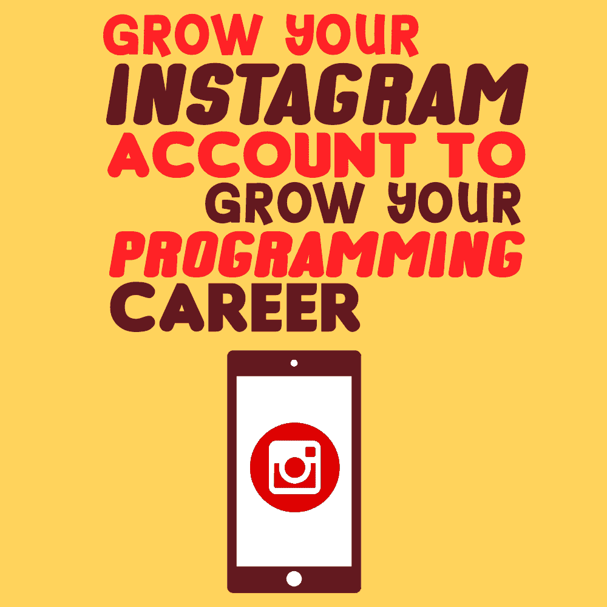

# 扩大您的 Instagram 帐户，发展您的编程事业

> 原文:[https://simple programmer . com/insta gram-account-programming-career/](https://simpleprogrammer.com/instagram-account-programming-career/)

If you’re running an agency or working as [a freelancer](https://simpleprogrammer.com/freelancing-business/), you know that it can be hard to stand out when pitching to clients. You have low-priced development talent from across the globe vying for small jobs, and then you have large agencies with years and years of experience competing with you for large projects.

许多年轻的程序员和企业家正在努力通过增加他们在社交媒体上的追随者来使自己与众不同并增加他们的可发现性。没有比在 Instagram 上更容易、更明显的了。

虽然 Instagram 上确实充斥着模特的照片和陈旧的模因，但也有一个充满活力、高度参与的程序员和用户界面/用户体验(UI/UX)设计师社区分享他们的照片和评论。

Instagram 不同于 Twitter、脸书或 LinkedIn，因为你必须提升你的视觉游戏来引起粉丝的兴趣。该平台依赖于通过标签和“发现”页面的可发现性。这意味着您可以通过提供一个展示您的工作的窗口，以直接、个性化的方式参与编程社区。

开始使用 Instagram 很容易，但要找到好的参与方式和合适的图片类型需要一些练习。一旦你有了一个活跃的、引人入胜的 Instagram feed，你会发现建立和参与一个社区很容易，这会给你带来新的职业机会。

为了帮助你开始，这里有一个指南，告诉你应该在你的 Instagram 账户上发布什么，以及如何增加你的粉丝数。

## Instagram 给程序员带来的好处

当你在 Instagram 上浏览热门程序员账号时，你会经常看到他们的简历是一种推广工具。一些 Instagrammers 推广他们的网络开发机构，一些推广他们的 YouTube 频道，还有一些推广他们开发的软件。

通过利用他们的 Instagram 关注，这些程序员可以迅速将**免费**流量带到他们正在推广的任何东西上。这是一个伟大的长期客户获取战略，也是建立专业品牌的好方法。

一个例子是 Andres Vidoza (@andresvidoza)，一个来自加拿大的网页开发者。

在短短两年内，他已经拥有了超过 55000 名用户，并在这种人气的基础上建立了一个品牌代理机构。当潜在客户浏览他们的搜索页面或他们最喜欢的 Instagram 标签时，他经常会接触到他们。尽管他还是一名大学生，但他已经在 UX 和电子商务领域拥有了一份令人印象深刻的客户名单。

> 在 Instagram 上查看此贴
> 
> 【网络开发者(@andresvidoza) 于 <time style="font-family:Arial,sans-serif;font-size:14px;line-height:17px" datetime="2020-04-18T16:25:15+00:00">2020 年年四月 18 日上午太平洋时间 9:25</time>分享的帖子
> 
> T45】

@andresvidoza 因在帖子中创造性地使用涂鸦而闻名。

在 Instagram 上分享你的编程照片的另一个好处是支持和多样化的社区。与 Reddit 或 Stack Overflow 等网站不同，Instagram 编码社区对其他成员非常积极向上。经常看到开发人员分享他们的一个朋友取得的突破，一起分享视频通话的截图，在其他编码人员的帖子上留下激励性的评论。

Dhanish Gajjar (@dhanishgajjar)帮助创建了 Instagram 的 hashtag [#buildupdevs](https://www.instagram.com/explore/tags/buildupdevs/) 。这个标签和倡议的目的很简单:鼓励和提升其他开发者。

更好的是，让自己成为这个社区的一员是如此简单。

只需将标签#buildupdevs 添加到您的帖子中，并随时对社区中的其他帖子发表积极而有帮助的评论。就像这样，你是一个由成熟的开发者组成的网络的一部分，当你需要的时候，他们可以帮助你！

## 你应该在 Instagram 上发布什么？

Instagram 是关于视觉的，所以发布你的工作设置、完成的项目或自拍的照片都是很好的内容。你的观众在寻找一扇窗户，让你了解是什么让你成为如此伟大的程序员；你可以分享你的常规、技巧和建议，开始一场精彩的讨论。

这有助于在帖子中尽可能多地注入你自己的个性，但也有一些视觉技巧和趋势，你可以用它们来快速获得喜欢和评论。

### Epic Setups

桌面系统长期以来一直是游戏和技术社区的主要组成部分，但程序员的做法略有不同。Instagram 的程序员不喜欢疯狂的霓虹灯(尽管仍然有一些)，而是专注于干净、简约的设置，主要关注功能。

几年前，你会看到很多带有三个或更多显示器的编程设置。现在，充满代码的超宽屏幕是一种趋势。巨大的屏幕被证明是吸引人的磁石。将超大屏幕与绝佳视野相结合？你得到了一个热门帖子。

> 在 Instagram 上查看此贴
> 
> [Mia(@ Mia)代码)](https://www.instagram.com/p/B_xu082gTzk/?utm_source=ig_embed&utm_campaign=loading)分享的一个帖子 <time style="font-family:Arial,sans-serif;font-size:14px;line-height:17px" datetime="2020-05-04T19:06:03+00:00">2020 年年 5 月四日下午 12:06 PDT</time>

*尽管在 Instagram 上相对来说还是个新人， [@mia.codes](https://www.instagram.com/mia.codes/) 因其美丽的景色和桌面布置获得了数千个赞。*

### 规划你的背景

科技网站 YouTuber [Mike Wat](https://www.youtube.com/channel/UCtLeAG6s7go34Y2SUsH88_g) 说，桌面照片的秘密可以归结为一张好的壁纸。如果你不想买一个昂贵的超宽显示器，或者你只是喜欢在多个屏幕上工作，只需在谷歌上找到一个有吸引力的壁纸，并在所有不同的屏幕上使用相同的壁纸。照片看起来一致性很好。

> 在 Instagram 上查看此贴
> 
> 【t 于<time style="font-family:Arial,sans-serif;font-size:14px;line-height:17px" datetime="2020-04-30T14:37:17+00:00">太平洋时间 2020 年四月 30 日上午 7:37</time> 分享的帖子
> 
> T45】

*图片作者[@ themikewat](https://www.instagram.com/themikewat/)T3】*

### 增加对外围设备的兴趣

另一个快速简单的方法是给你的照片添加一些有趣的玩具或收藏品。魔方，动作人物，甚至限量版的汽水罐都给热门帖子注入了一些个性。

> 在 Instagram 上查看此贴
> 
> 琥珀罗伯茨分享的一篇文章？？‍?(@天文学家 _ 琥珀)<time style="font-family:Arial,sans-serif;font-size:14px;line-height:17px" datetime="2018-07-17T19:21:23+00:00">太平洋时间 2018 年七月 17 日下午</time>
> 
> 12:21

*[@天文学家 _ 琥珀](https://www.instagram.com/astronomer_amber/)用她以太空为主题的书桌配件保持很好的品牌形象*

另一件需要记住的事情是，Instagram 算法会奖励那些获得大量评论的帖子。产生这些评论的一个方法是展示一个没人见过的鼠标或键盘。人家势必要问你推荐不推荐！

> 在 Instagram 上查看此贴
> 
> 【t 分享的帖子 <time style="font-family:Arial,sans-serif;font-size:14px;line-height:17px" datetime="2020-05-08T13:25:28+00:00">2020 年年 5 月 8 日美国太平洋时间</time>早上 6:25

*[@girlknowstech](https://www.instagram.com/girlknowstech/) 用自己的站立式人体工学鼠标发帖总是会产生很多评论。*

### 点亮你的工作站

极端的 LED 照明是从 PC 游戏社区借鉴来的想法(查看#RGBallthethings 社区可以看到这一点做到了极致)。Nanoleaf 生产完全可定制的照明带，被许多流行的 YouTubers 和科技 Instagrammers 所使用。

> 在 Instagram 上查看此贴
> 
> 【t 在<time style="font-family:Arial,sans-serif;font-size:14px;line-height:17px" datetime="2020-01-01T18:58:18+00:00">太平洋时间 2020 年一月一日上午 10:58</time> 分享的帖子
> 
> T45】

*视频 via[@ spegiu](https://www.instagram.com/spegiu/)T3】*

### 了解你的角度

如果你真的想让你的 Instagram 游戏更上一层楼，你需要超越仅仅用 iPhone 拍照。@chau_codes 在他的家庭办公室里安装了一个摄影设备，这样他就可以拍一些令人印象深刻的高空照片。凭借这些独特的角度，他的账户关注量增长非常快，他的帖子已经在 Instagram 上分享。

> 在 Instagram 上查看此贴
> 
> 【t 自考 Dev (@chau_codes) 分享的帖子<time style="font-family:Arial,sans-serif;font-size:14px;line-height:17px" datetime="2020-03-11T14:33:32+00:00">太平洋时间 2020 年 3 月 11 日上午 7:33</time>

*[@chau_codes](https://www.instagram.com/chau_codes/) 付出额外的努力来获得这样独特的角度。*

### 进入框架

最后，为了获得更多的参与，把自己放在镜头里。把自己的自拍发到网上可能会觉得有点不舒服，但这毕竟是 insta gram——自拍被证明是管用的！当人们看到用户名后面的人时，他们更有可能与你互动。

> 在 Instagram 上查看此贴
> 
> 罗伯特 韦德(@coding_rob) 分享的一个帖子 <time style="font-family:Arial,sans-serif;font-size:14px;line-height:17px" datetime="2020-05-04T09:41:33+00:00">2020 年年 5 月四日太平洋时间</time>凌晨
> 
> 2:41

*[@ coding _ rob](https://www.instagram.com/coding_rob/)T3】*

## 如何快速增长你的 Instagram 账户

想要进一步加快您的[账户增长速度](https://later.com/blog/get-more-instagram-followers/)？付出一点额外的努力，运用这些行之有效的方法来增加你的追随者。

### 参与社区活动

Instagram 是双向的。如果你想让别人关注你的帖子，你需要关注别人的帖子。著名企业家加里·维纳查克支持他的“”模式:每天在 90 个帖子上留下你的两分钱(反馈或意见)，你很快就会看到结果。

利用 Instagram 账户、与你相关的热门话题，甚至是名人，来激发你的灵感。留下深思熟虑的评论，可以开始一场对话，而不只是像“照片不错”这样的泛泛之谈仔细考虑你的评论。

Instagram 对机器人和低效率的帖子有意见，所以只要花一点时间和精力参与进来就能产生巨大的影响，人们会很快注意到这一点。

### 使用 Instagram 故事

Instagram Stories 是短暂的视频，在 24 小时后从平台上消失。因为这些帖子是临时的，所以在这里你可以更随意一些。分享你工作时吃的零食，或者你最喜欢的编码音乐。你可以通过多个故事帖子讲述一个你正在从事的令人兴奋的项目的“故事”。你的 Instagram 用户越了解真实的你，他们就越会继续使用你的账户。

> 在 Instagram 上查看此贴
> 
> T3 分享的一篇文章解释了这一切(@ estefan niegg)2020 年四月 3 日<time style="font-family:Arial,sans-serif;font-size:14px;line-height:17px" datetime="2020-04-03T21:31:18+00:00">太平洋时间</time>下午 2:31

*[@estefanniegg](https://www.instagram.com/estefanniegg/) 最近用她的 Instagram 故事鼓励其他 Instagram 制作者也参与进来，制作 3D 打印的面罩并捐赠给一线医护人员。*

### ＃符号

花些时间研究标签，让你的帖子曝光率更高。像#programming 这样明显的标签经常被来自世界各地的低质量内容淹没。你通常会从专业标签中获得最好的曝光率，这需要多花一点时间去发现。

发现伟大标签的最好方法是浏览 Instagrammers 使用的其他程序。评估每个标签下发布的内容:相关吗？帖子质量高吗？整理一个好的相关标签列表，用于你自己的每篇文章。

一个很好的例子是#100daysofcode。人们用这个标签来记录 100 天的学习旅程。在 100 天里，他们每天都记下他们所学到的东西，以及他们在这个过程中遇到的任何困难。许多完成了#100daysofcode 旅程的 Instagrammers 发现，当他们到达第 100 天时，他们已经有了几千名粉丝。

### 一致性

正如任何值得做的事情一样，一致性是增加 Instagram 粉丝的关键。仅仅发布 10 篇帖子，你不会拥有 5 万名其他程序员的追随者。你需要持续发布高质量的照片，与社区中的其他人互动，并真正享受成为社交媒体世界的一部分。

发帖频率的最佳经验法则是，在不降低内容质量的情况下，尽可能多地发帖。对一些人来说，每天三次；对其他人来说，每周一次。

## 今天就开始增加你的 Instagram 吧

每个月，拥有全新 Instagram 档案的程序员都在建立声望并获得关注。没有理由你不能做同样的事情。随着你在 Instagram 上的曝光率增加，你的职业网络和职业机会也会增加。

拍摄有趣、高质量的图片，并持续发布。使用经过充分研究的相关标签，积极参与在线编程社区，你就能看到你的账户每周都在增长。

你将获得一个支持的网络，结交一些新朋友，你甚至可以利用你的社会影响力来获得新客户或获得一份新工作。Instagram 很有趣，可以让你的职业生涯受益，所以去创建一个帐户，拍一些设置照片吧！