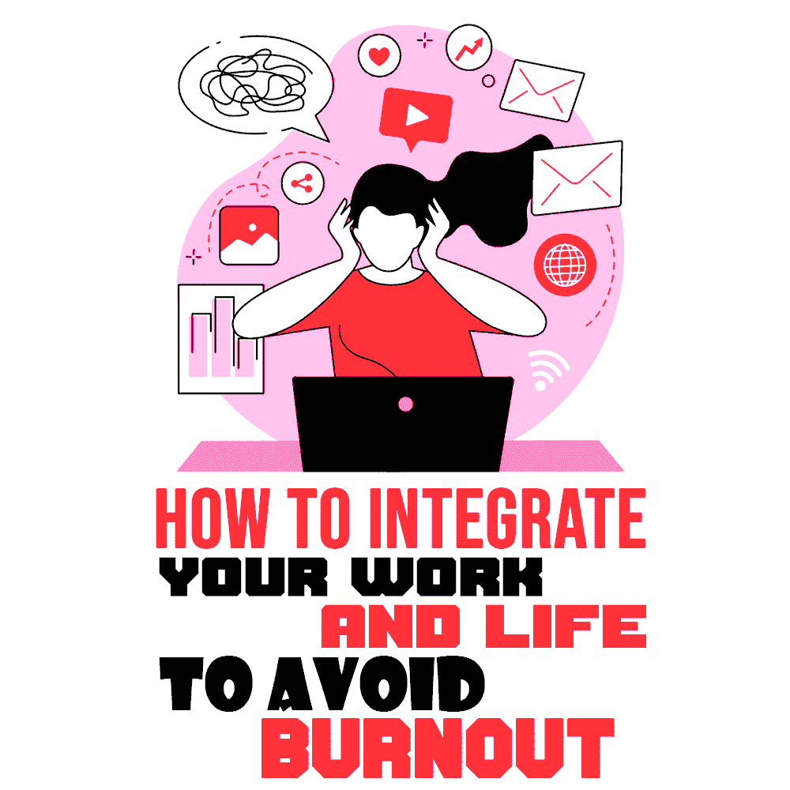
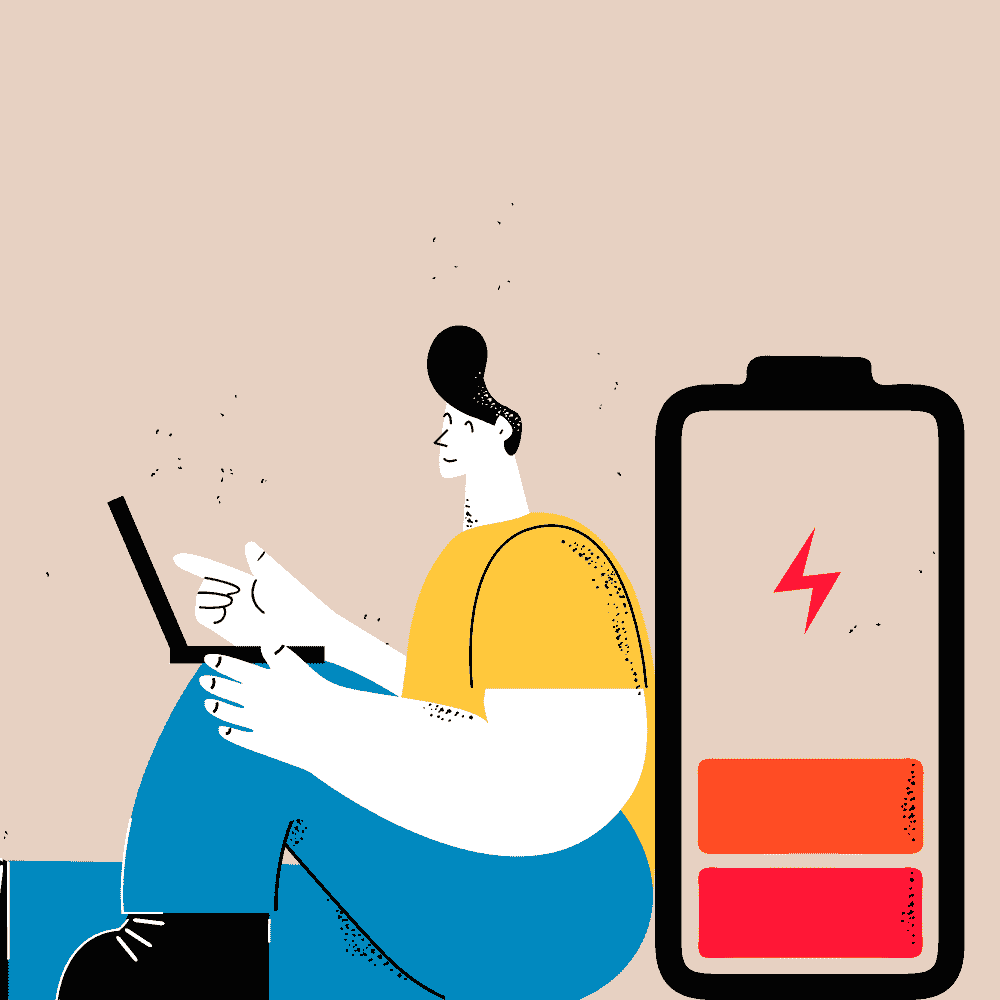
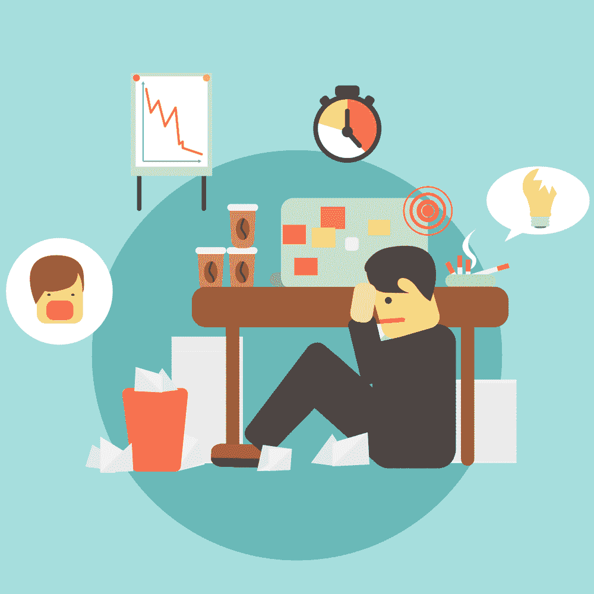
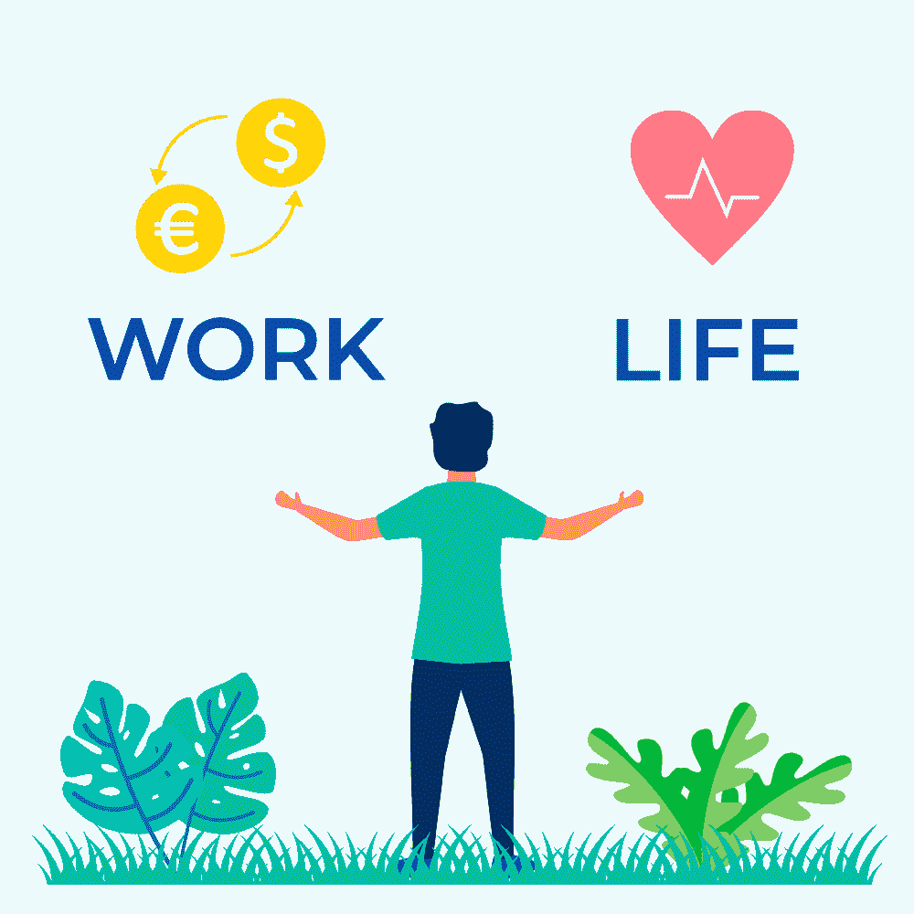

# 如何整合你的工作和生活以避免倦怠

> 原文：<https://simpleprogrammer.com/integrate-your-work-life-balance/>

We’ve all heard of work-life balance and how companies promise it, but what about work-life integration? As a software engineer and technical writer who graduated during the pandemic, I know that work-life balance has never been a promise for the entry and junior positions but is essential when it comes to hiring for those senior roles.

作为一个在两种截然不同的环境中工作过的人，我想知道:如果我们把事情都看错了呢？

人们希望从工作中得到的不是工作与生活的平衡，也就是你权衡各种选择的时候。相反，你可能真正寻求的是工作与生活的融合，工作和生活并不相互排斥。

在这篇文章中，我将向你展示如何两全其美，既避免精疲力尽，又将你热爱的事情与你的职业结合起来。

## 疫情时间表

当我还是一名学生的时候，在我为期一年的作为计算机科学课程一部分的软件开发顶点项目中，疫情击中了我。毕业后，我很幸运地得到了一份实习工作，继续在实验室工作。

虽然我的生活包括试图找到一份全职工作，但我没有时间约会或建立持久的联系。当这个职位结束时，我能够找到一个不可持续的工作与生活的平衡，在那里我可以回去重新审视想法、项目和改进。最后，我接受了一家公司的邀请，这家公司有着独特的文化，通过工作与生活的融合来促进发展。

### 工作

2020 年 6 月毕业后，我打了两份兼职实习，基本上是全职工作，每周 40+小时。有趣的是，我是一个内向的人，所以我想既然它很偏僻，我会没事的。男孩，我错了。

我找不到任何时间来寻找一份合适的全职工作，到 2020 年 11 月，我意识到我需要从这些兼职工作中挑选一份。最后，我选择了我更感兴趣的项目:为一个研究实验室工作，以减少停电和野火的影响，这在加州太常见了。

随着时间的推移，我感觉远程工作已经耗尽了我和我的同事们的精力和精神健康。原因很多，但这里有一些最重要的。

问题的主要原因是会议。每个人都有不同的时间表和他们生活中发生的事情。此外，我们之前的敏捷计划采用了基于共识的解决方案[规划扑克](https://www.mountaingoatsoftware.com/agile/planning-poker)，这在网上很难做到。面对面的时候，这种方法很有效，所以计划会议并没有花太长时间，但是在网上达成共识比预定时间多花了一到两个小时，而且要找到一个所有人都有空的时间简直是一场噩梦。总的来说，这种经历并不有趣，当会议远远没有按计划结束时，还会降低士气。

这导致了天坑效应。花在会议上的时间比花在研究和润色上的时间要少。由于所有的会议，新功能的出现非常缓慢，因此很难通过减少干扰来最大限度地提高生产力并进入"[深度工作](https://simpleprogrammer.com/programmer-productive-mental-state/)的状态。回想起来，我希望我们有一个更好的工作平衡来找到时间在网站上添加动画，而不仅仅是交付一个静态的网站。

除了与人相处的时间，还有开拓创新的时间，尤其是在研发领域(R&D)。这个领域的大部分是未知的，这意味着当我们是新领域的先驱时，我们不可能都是专家。需要个人研究来加深你的知识，但是在所有的会议中你什么时候有时间做它？

### 生活

从 2020 年 3 月到 2021 年 8 月，我找工作的第一年半时间里，收获并不多。我从《疫情》最开始的时候就开始寻找，但为时已晚，因为没有得到暑期实习机会，我浪费了大三的时光。

由于我有足够的单元来完成两门课程，我在最后一个季度成为了一名网上兼职学生，希望在找工作(生活)和继续学业(工作)之间找到平衡。

在此期间，我申请了工作，寻找一个软件开发员的职位。当时，我不明白开发人员和工程师之间的区别，后来发现我更像是一名工程师。

My first offer letter as a “full-time software developer” had strict requirements. First, I had to relocate to a bootcamp where we were paid their state’s minimum wage to work on client projects, as on-the-job training. Second, we had to relocate and travel “at will” without sufficient support between living and expenses. Third, we had to stay for at least two years with no benefits.

我差点就签了这个合同，但是经过朋友和家人的一番挖掘和支持，我们得知了它的真实意图，没有签。我知道随意旅行和被束缚两年，加上缺乏对长途通勤的支持，包括飞行，不会给我提供任何生活时间或我的爱好和兴趣。简而言之，无论报酬如何，我都无法快乐地过着这种令人窒息的生活。

这次经历给我上了宝贵的一课，适用于所有求职者。永远要了解公司招聘的动机。阅读录取通知书，准确理解你将会得到什么！检查小字和合同终止条款，不要害怕征求意见。

### 保持平衡

2021 年 8 月期间，我正式失业。我知道我在实验室的时间最终会结束，因为如果我想继续在研究实验室工作，我必须注册成为研究生。

工作时，我没有平衡，我的时间表包括会议、计划和设计，没有足够的时间来发展。失业解放了我的时间，因为我平衡了个人发展和找工作。如果我没有很好地理解潜在工作所需的框架，现在是学习它的最佳时机。

在此期间，我继续了一个暂停的项目，这个项目是我从 2021 年 1 月开始就渴望做的，作为我的新年决心。我在学习 Jekyll 之后创建了一个个人网站，部署在 Github 页面上。里面有我的简历、博客和作品集。这发展成了一边学习一边记笔记的习惯，并在我的博客上写一篇短文。

写完博客后，我在 LinkedIn 上看了伦敦 App Brewery 学习自学 Flutter 之后，写了关于技术技能的文章。借助 Flutter 知识，我深入研究了一个名为 Tetanggaku 的辅助项目，在印尼语中是“我的邻居”的意思，该项目专注于为印度尼西亚 COVID relief 创建一个平台。

在生活方面，我写下了我的日常生活，无论是调查迈尔斯·布里格斯还是参加在线 DevWeek 会议。这两次经历对我都很有启发，帮助我了解自己和技术进步，特别是增强现实(AR)集成和网络游戏化。

虽然很奇怪，但失业后我感觉到了工作和生活之间的平衡。我有很多想做却没有时间去做的想法。但当然，22 岁就过“提前退休”的生活对我来说是不可能的，所以我开始寻找一家公司，让我探索新技术，并很好地实现平衡。

之前，我为了寻求平衡而焦头烂额，直到我发现一种公司文化可以为我提供我一直在寻找的解决方案。

## 整合之路

我对工作与生活融合的理解和体验源于我在 Mage 的第一份全职工作，在一个创业环境中工作。我感觉到他们的团队文化与我工作、生活或平衡时是多么的不同。

我理想的生活方式不是挑三拣四，而是像一个更像家庭的公司一样生活在一起。工作与生活的融合清楚地反映在流程、工作分配、会议或与员工的互动中。

### 过程

我申请了 Mage 做全栈工程师，技术面试没通过。几天后，我收到了 CEO 发来的消息，说想看看我的个人博客。我们在电话屏幕上讨论了这个问题，我把链接发给了他。

值得庆幸的是，他喜欢它，并给我发了一份成为技术作家的试用。我有一周的时间来写我的第一篇关于回归度量的公开文章。我热爱角色扮演，并把它结合在文章里讲故事；一个简短而有趣的故事。

这篇文章很受欢迎，加上支持的工作人员创造了我所见过的最好的图像。它告诉我，内容最好与图像一起提供，而不是所有的教育书面材料都必须是博士论文、谷歌学者文章或教科书。我通过了试用，现在是一名全职技术作家。

### 工作

My role as a technical writer means I’ll be pushing out quality content and continue my journey in becoming an expert. One of Mage’s core virtues is that “our roles don’t define our responsibilities.” As such, it’s structured in a way that is easy to wear multiple hats; take on risks and responsibilities by trying new things.

从那时起，我的活动已经发展到从事搜索引擎优化和社区拓展，以开发品牌，提供一个神奇的体验。此外，我们有一份入职阅读清单，表明我们有不同的想法，更倾向于集成。

我最新的神奇创造是我们的 [Discord Community](https://mage.ai/chat) ，在这里，我们试图将企业和社区之间的界限与 RPG 功能(如关卡和解锁技能)融合在一起。

## 综合

在我目前的工作场所，我们遵循一种混合方法来平衡工作与生活。例如，在疫情期间，我们都很遥远，但每个月都会在 Airbnb 聚会一次，以增强团队凝聚力。此外，我们把我们的爱好和兴趣带到工作中，所以会议不仅仅是一个机器人问“你做了什么，你在做什么，你将做什么？”

整合反而会问“你过得怎么样？你有什么有趣的事？在这里工作有什么让你不自豪的事吗？我们能做些什么来帮助你步入正轨？”

这些问题让我们知道什么进展顺利，什么受阻，以及他们做了什么，但不要太直接或缺乏同情心。

### 消极的

被动整合很简单，它是关于与团队建立一种联系，这种联系可以用来理解你的团队的感受，而不是你的团队已经完成了什么。

一个很好的方法是开展破冰活动，让我们在无私的家庭范围内了解彼此，更多地了解彼此，话题包括“你梦想的工作是什么？”到“你有过最恐怖的经历是什么？”

也可以通过推荐书籍。我们团队的最爱之一是 *[简单得令人疯狂:推动苹果成功的痴迷](https://www.amazon.com/dp/1591846218/makithecompsi-20)* ，它教会我们如何保持会议简短，以减少疲惫和不必要的出席。它很小，但与几乎没有互动的强制性会议相比，意义重大。

另一本书是尼尔·加布勒的《华特·迪士尼:美国想象力的胜利》 ,这本书展示了当一切都联系在一起时是多么成功。有鉴于此，我相信我们可以把它应用到我们的日常生活中。

### 活跃的

理想的主动融入是生活离工作不太远的时候。远程工作的一个承诺是，它消除了通勤，但也消除了社区。有了工作与生活的融合，你可以愉快地短途通勤到公司办公室，还可以参加集体活动，比如吃晚饭、看电影，还有我个人最喜欢的，玩棋盘游戏。

但并不仅限于此；整合包括通过建议更多的小众爱好，如爬山、跆拳道和乒乓球，向他人展示如何拓展他们周围的世界。至于我，我渴望打羽毛球！

我相信 Mage 的成功和[成长](https://techcrunch.com/2021/10/19/mage-aims-to-be-the-stripe-for-ai-raises-6-3m-for-developer-tools-to-build-ai-into-apps/)归功于他们工作生活一体化的实践。你可能听说过“努力工作，尽情娱乐”，但是整合让它更上一层楼。

不管是在线还是离线，关心员工并给予他们同等的回报是很重要的，因为他们付出的努力表明了他们的价值。我的一个同事是迪士尼迷，所以为了亲自庆祝，公司去了洛杉矶，休息一天，作为一个团队在迪士尼乐园进行 VIP 旅行。

### 超出平衡的债券

被动和主动之间的细微差别在于，被动集成可以远程完成。远程活动仍然有将团队聚集在一起的力量，比如看书、玩游戏、在线看电影，或者简单地问一句“你周末过得怎么样？”

我个人认为，每个人都喜欢受到欢迎的感觉。不要只是在工作需要的时候去找他们，而是和他们聊天，了解他们。主动是一种更强的整合形式，因为它需要面对面的活动，但倾向于构建更具体的联系。

花点时间参加公司聚会来表达你的关心。加入你同事的兴趣爱好，让他们感到受欢迎。整合是关于结合，而不是平衡。无论你是被动整合还是主动整合，通过建立牢不可破的纽带来保护你的公司是很重要的。

## 整合，不要分离

工作与生活的融合是指工作与你的激情互补。我的爱好是写作、编码、人工智能和游戏。你的热情可能和我不一样，但肯定不仅仅是编码。

The secret is, if you’re looking for a job, don’t neglect your hobbies and interests. Look for a company that integrates rather than separates work and life. Find a company that fosters your team’s growth and has a healthy, open-minded team dynamic—a company you can see yourself and your friends being a part of.

如果你已经在一家公司了，问问看你和你的同事能做些什么来让公司变得更好。公司倾向于宣传“让世界变得更美好”，但展示这一点的最佳方式是首先关注他们的内心世界。

现在，对于求职者来说，这是一个炙手可热的市场，大辞职是工作生活的副产品，这是因为公司提供的是平衡，而不是融合。当平衡被打破时，最终会导致分离，而如果键像原子一样被构建成强大的力，它就变得几乎不可分。

让我们一起从公司文化渗透到员工待遇开始，将#大辞职时代转变为#大整合时代。