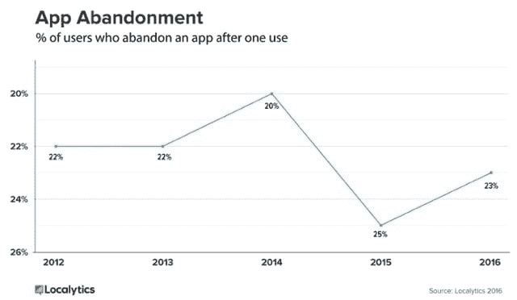
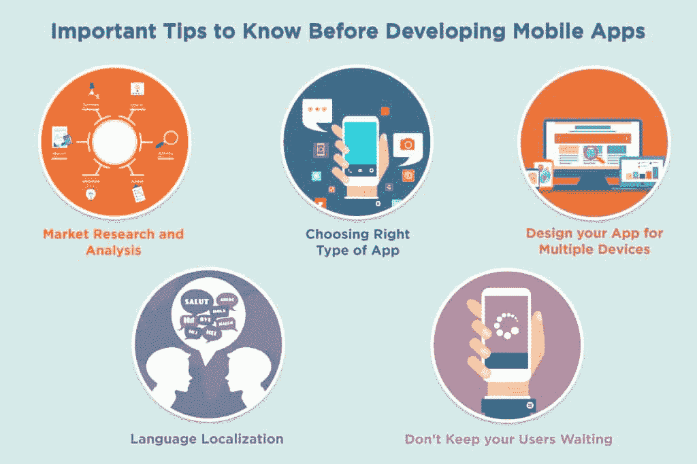

# 为什么用户会对你的 App 失去兴趣？

> 原文：<https://simpleprogrammer.com/interest-in-apps/>

在这个技术不断发展和每分钟都有新技术进步的时代，手机应用不仅是现在，也是未来。

然而，由于对应用程序的需求如此之大，越来越多的开发者提出了新的应用程序想法。但是，仅仅创建一个好的应用程序，然后高枕无忧是不够的。如果你想让你的应用程序在目标受众中获得人气和成功，你就必须持续跟踪你的应用程序，它的效用，以及它的缺陷。

这篇文章将强调你的用户可能对你的应用失去兴趣的原因。

## 为了更多的存储空间

[据 TechCrunch](https://techcrunch.com/2016/05/31/nearly-1-in-4-people-abandon-mobile-apps-after-only-one-use/) 报道，近四分之一的人只使用一次就放弃了手机应用。这对于 app 公司来说是相当惊人和麻烦的。用户卸载或删除这些应用背后的原因非常广泛。人们倾向于选择能给他们带来更好效用的选项。例如，如果用户发现一个健身应用程序比你的应用程序加载更快，广告更少，锻炼种类更多，他们就会转向它。

你的用户的手机已经充满了无数的图片和无数的歌曲。他们最不需要的就是一个沉重的 app。如果你的应用占用了他们太多宝贵的内存，他们会自动开始寻找替代应用。所以，设计一个大小合适的 app 是明智的。

TechCrunch 关于应用程序使用情况的有趣统计数据:

这意味着一个成功的应用程序是用户每天打开的应用程序，因为他们对它所提供的东西真正感兴趣。考虑以下因素将有助于你开发一款用户不会失去兴趣的应用:

*   **容易上手**–过多的注册步骤会导致用户放弃你的应用。
*   **推送通知**——只要你发送有用的通知，并且发送的很智能，不需要过多的推送用户。
*   **个性化**–为用户设计更独特、更贴切的体验。
*   **提供激励计划**——鼓励用户使用你的应用。它可以是任何特定于移动设备的奖励、专门的内容访问、优惠券、特别促销和其他有助于推动转化和鼓励参与的优惠。
*   **鼓励双向沟通**–向用户征求反馈。

## 低效率的服务

决定你的应用质量和人们对它的兴趣的实际上是一些小事。

如果你想在你的应用上给你的客户提供一个愉快的体验，确保它解决了用户的问题，并且运行完美。这不仅会保持用户的兴趣，还会吸引新的客户。

为了确保你的应用程序运行完美，请记住，当你把你的应用程序推向市场时，你是在为你的用户和客户提供服务。一个服务只有做对了才会受欢迎，一个应用只有兑现了承诺才会受欢迎。确保你的应用程序执行顺畅。如果不是，你就会失去用户。为了让人们参与到你的应用中，你必须确保:

*   错误不会每隔五分钟就出现。
*   这个应用速度很快，不慢。

## 缺乏市场研究

如果你想让你的应用不仅在发布时获得成功，而且尽可能长时间地留在市场上，彻底的家庭作业是你最好的选择。在这里，作业意味着[事先为你的应用做市场调研](https://learnappmaking.com/market-research-app-idea-how-to/)。这使你能够清楚地了解用户到底在寻找什么。

[来源](http://complitech.us/blog/important-tips-to-know-before-developing-a-mobile-app/)

因此，你会设计一个他们都需要的应用程序，他们会经常使用你的应用程序，因为这是他们需求的准确反映。缺乏市场调查会使你所有的努力和努力都变得毫无用处，因为这对你的用户来说没有多大用处。因此，他们对你的应用程序几乎没有兴趣。

以下是一些解决特定问题的应用程序的示例，因此这些应用程序非常有用，人们经常使用:

### [提醒](https://www.remind.com/)

问题:记录课堂作业很复杂。

解决方案:Remind 是一个工具，可以让你更容易掌握功课。这款应用不仅可以实时发送信息，还可以让你使用送达回执选项来查看谁在阅读你的信息；这有助于教师确保他们的信息及时传达给每个学生/家长。

如果开发人员在创建应用程序时没有记住这一点，老师们将能够发送消息，但他们会一直担心他们的消息是否会被接收到。这将导致学生作业的延误，因此应用程序中的这个错误将使用户对它失去兴趣。

### [用我的健身器材](https://www.myfitnesspal.com/)

问题:记录健身日程是乏味的。

解决方案:MyFitnessPal 是一个免费的卡路里计数器，让管理健身程序变得更快更容易。它不仅会计算你摄入的卡路里，还会根据你做的运动减去卡路里。

如果它只是一个卡路里计数器，健身爱好者只会知道消耗的卡路里的确切数字。对于健身爱好者来说，健身应用程序要有效和有用，它必须告诉你消耗的卡路里数。

### [文莫](https://venmo.com/)

问题:手头没有现金，无法给朋友付款。

解决方案:Venmo 是一个数字钱包，当没有人有现金时，你可以轻松地偿还朋友。

它不仅简化了点对点支付，而且在超过 200 万个地方被接受(几乎和 PayPal 一样多)。如果它没有被如此多的地方接受，它的效用就会减少，它也不会得到如此多的欢迎。

## 停滞

由于全球化以及其他因素，世界趋势一直在变化。随着你周围的世界不断变化是极其重要的，因为人们的偏好和选择也开始变化。你可以创建一个伟大的应用程序，吸引大量用户，但如果你不能与时俱进，你就会失去大部分用户。如果你不能给用户提供符合他们喜好和当前趋势的东西，你就会失去他们。

还记得十年前的脸书吗？还记得时不时会发生微小(几乎可以忽略不计)的变化吗？2013 年，新闻订阅开始看起来更像一份数字报纸，充满了为每个用户量身定制的信息。公司给了你更多的方法来决定你想看什么或不想看什么。

后来，该公司扩展了这些工具，让你选择你想首先看到其帖子的朋友和品牌。例如，这意味着新闻记者可以选择突出新闻文章。您还可以取消关注某个特定朋友的帖子，同时在脸书上保持联系；你可以决定以后再关注那个人。

难怪这个应用程序已经成为我们生活中如此重要的一部分。它真的知道如何进化！

所以，你的应用程序可能会失去用户的原因之一是你让你的应用程序停滞不前，没有让它随着世界趋势而增长。

根据移动技术和商业专家 Sara MacQueen 的说法，你的组织应该将以下五件事作为你的[移动应用维护计划的一部分](https://www.linkedin.com/pulse/what-include-your-mobile-app-maintenance-plan-sara-macqueen/):

*   设计和功能增强。
*   年度应用审计。
*   代码维护和安全更新。
*   性能监控。
*   App store 列表维护。

## 沉闷的界面

There is a theory that the [first seven seconds](https://ux.stackexchange.com/questions/33813/what-evidence-is-there-that-users-lose-interest-after-7-seconds) your user spends on the app pretty much determine the future of your app on their phone. And a bright, clear, and positive interface will go a long way toward extending that first impression period.

根据 StoreMaven Academy 的说法，你大约有三秒钟的时间向访问者解释你的应用程序是做什么的。在这几秒钟内，访客会表现出两种行为类型之一:

*   果断的访问者将决定安装或离开，而从来没有参与的网页。
*   探索访问者将选择浏览应用商店页面上的可用内容。

## 无尽的通知

通知很重要；他们会告知你的用户你的应用程序的功能，并随时更新。在开发你的应用程序之前，你必须完全理解不同种类的通知和消息。

好的通知和坏的通知是有区别的。[根据 Medium](https://medium.com/@orarbel/notifications-the-good-the-bad-and-the-irrelevant-8bd373e8c86) 的说法，以下是我们认为好的通知的一些例子:

*   最喜欢的足球队刚刚进了一球。
*   一家初创公司刚刚被收购。
*   巴拉克·奥巴马刚刚发起了一场推特风暴。

简单来说，发布者的通知要么非常有用，要么非常烦人。一个好的通知只需要两个属性。应该是:

*   语境。
*   时间敏感。

这些属性回答了这两个问题:

*   背景—*为什么*我会收到这个通知？
*   时间敏感—*为什么*我现在才收到这个通知 ***？***

如果这些问题的答案在我们收到通知的那一瞬间是清楚的，我们就可以立即得到值。否则，我们开始浪费大脑周期来决定我们是否应该打开它，这就开始变得令人讨厌了。

没有人喜欢不断被应用程序通知打扰。如果你认为你正在失去你的用户，看看你的通知程序。如果警报和通知过于频繁和无用，这就是你的答案。大多数人不喜欢手机上总是弹出随机通知。此外，如果很多人每天在屏幕上收到大量的通知，他们的焦虑就会被触发。

## 以移动数据为食

几乎没有人有无限的数据计划。他们有非常精确的数据量，可以用于移动应用程序。一些应用因使用过多用户的移动数据而臭名昭著。你必须开发一款不具备这种功能的应用。用户倾向于删除使用过多数据的应用。

例如，Snapchat 因使用过多数据而臭名昭著。防止数据流失的一种方法是，确保你的应用在更新前请求许可。另一种方法是为自动播放视频提供启用/禁用选项(脸书提供了这个选项)。

上述原因就是你的用户可能对你的 app 失去兴趣的原因。为了留住你的用户并吸引更多的用户，试着增加实用性并避免无用的元素，如果你困在其中任何一个上，努力摆脱它们。此外，一定要做好调查，确定第一个你在哪个(些)平台上开发你的应用。