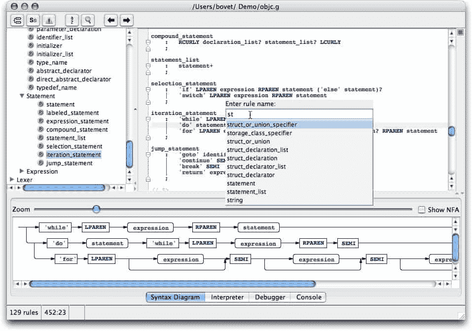

# 内部 DSL 变成了外部 DSL

> 原文:[https://simple programmer . com/internal-DSL-becoms-external-DSL/](https://simpleprogrammer.com/internal-dsl-becomes-external-dsl/)

最近，我一直致力于创建一种自动化测试语言，以允许比我之前创建的内部 DSL [更简单的语法。](https://simpleprogrammer.com/2010/01/05/automated-ui-testing-framework-a-real-example/)

最近我一直在思考内部 DSL 和外部 DSL 的区别。我开始觉得有点奇怪，把 Java 这样的语言扭曲成我想要的样子。

让我给你举个例子:

是的，语法类似于 fluent，但是它使用静态方法，修改枚举，使用参数列表，以及有点奇怪的命名约定。所有这些都是为了让它更易读，更容易从 IDE 中编程。(自动完成友好。)

我真正想说的是:

第二种语法更容易阅读。有人不懂 Java 也能写出来。有人甚至可以不经过任何培训，仅仅通过查看其他测试来编写测试。如果我要创建一个可以运行脚本的小的可执行文件，人们就可以编写和运行测试，而不必设置 IDE，不必担心 jar 或 dll，甚至 JUnit。

## 更上一层楼…

所以我决定试一试，看看从我的内部 DSL 创建一个外部 DSL 有多难。让我倾向于内部 DSL 而不是外部 DSL 的部分原因是，我认为编写一门语言会很难。

事实证明并非如此。

输入 [ANTLR](http://www.antlr.org/) ，输入 IBESScript。

在研究中，我发现了一个名为 ANTLR 的非常好的工具，它被设计用来为由 [EBNF](http://en.wikipedia.org/wiki/Extended_Backus%E2%80%93Naur_Form) 符号定义的定制语言创建解析器和词法分析器。那是一个拗口的词，是什么意思？基本上是这样的:ANTLR 允许您指定一种语言的语法，并创建 Java 或 C#代码来解析该语法的字符串，将它们分解成单独的语言结构，然后按照您的指定执行它们。那到底是什么意思？好吧，我给你举个例子:

我告诉 ANTLR 一点关于语法:

我给了它一些指导，告诉它如何分解新语言的各个部分，以及应该生成什么样的 Java 代码来执行该语言的语言结构。

ANTLR 为我生成了一些用我的新语言阅读的 Java 代码，并创建了如下代码:

很酷，实际上也很容易做到。尤其是对于主要是命令的简单 DSL。

内部 DSL 到外部 DSL 的准入门槛刚刚被抹杀。我可能不得不改变对内部 DSL 的看法。

## 放下干草叉

那么，我是在说内部 DSL 现在是坏的，而外部 DSL 现在是好的吗？不，差得远呢(虽然将来某个时候我可能会改变主意。)我在这里真正想说的是，我原以为创建外部 DSL 会比实际困难得多，但现在我发现它是多么容易，我开始将它视为一个实际的选项，而不是内部 DSL。

我想知道我们使用的一些使用内部 DSL 的工具。[这篇文章](http://elegantcode.com/2010/03/01/an-evolution-of-test-specification-styles-my-journey-to-mspec/)促使我更深入地思考这个问题，这促使[这篇文章](http://elegantcode.com/2010/03/03/is-mspec-an-internal-dsland-is-that-okay/)，最终导致我来到这里。感谢 [Richard Cirerol](http://elegantcode.com/author/rcirerol/) 让我思考这个问题。

也许我们应该考虑用外部 DSL 替换我们的一些内部 DSL，特别是在内部 DSL 代码看起来像是宿主语言的正常源代码的真实混血儿的情况下。在这一点上，我们不就是在试图把一个奇怪的语法塞进一个它不适合的盒子里吗？是的，是的， [MSpec](http://github.com/machine/machine.specifications) 我在说你。

你怎么想呢?有人在外面创建了一个外部 DSL 吗？