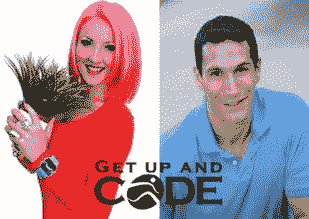
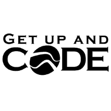

# 介绍起床和编码播客！

> 原文:[https://simple programmer . com/introducing-the-get-up-and-code-podcast/](https://simpleprogrammer.com/introducing-the-get-up-and-code-podcast/)

我非常兴奋地宣布一个全新的播客 [Iris Classon](http://www.irisclasson.com/) 和我一起制作的**“起床编码！”**

我一直想做一个播客，但我一直在寻找合适的主题和合适的合作主持人，我相信我最终找到了两者。

## 起来编码！(关于健身和营养的开发者播客)

**播客网址:**[**【http://getupandcode.com】**](http://getupandcode.com)

**iTunes 链接:**[**https://itunes.apple.com/us/podcast/get-up-and-code!/id 646958161**](https://itunes.apple.com/us/podcast/get-up-and-code!/id646958161)****

****

即使我花很多时间谈论代码和编程，健身和营养也是我生活的一大部分。

***我举重和跑步大概有 18 年了。在这段时间里，我学到了很多关于增肌、减肥、跑步和许多其他话题的知识——主要是从我自己在这些方面的错误中。***

")

[T8】](https://simpleprogrammer.com/wp-content/uploads/2013/05/john-fit-Mobile.jpg)

[***Iris Classon***](http://www.irisclasson.com/)***，我的共同主持人，是临床营养师和国际私人教练，也做健美(健身量表)、超跑和极限运动。但是，如果你正在阅读我的博客，你可能知道她是那个粉头发的程序员和*** [***Telerik 福音传道者***](http://www.telerik.com/community/evangelists/iris-classon.aspx) ***。***

*")*

**

我们认为，我们对所有代码和所有健康事物的共同热爱可能也是许多其他程序员和 IT 专业人员的共同爱好。

因此，我们决定做一些以前没有做过的事情——创建一个针对 IT 行业的健身和营养播客。

## 一项实验

我们之前都没有主持过播客，尽管我们都参加过 [Hanselminutes](http://hanselminutes.com/) 节目，我也参加过几次平板电脑节目。

这将是一个小小的实验，开始时可能会有点困难，但我相信我们会找到自己的路。

如果你愿意支持我们的努力，请传播这个消息，在 twitter 上关注 [@GetUpAndCode](https://twitter.com/getupandcode) ，在[上关注我们的脸书页面](https://www.facebook.com/pages/Get-Up-And-Code-Podcast/569336663087180?ref=tn_tnmn)！