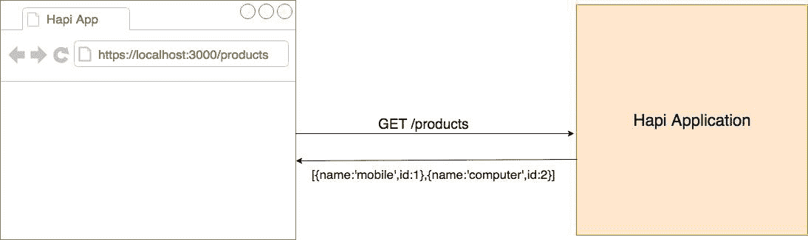
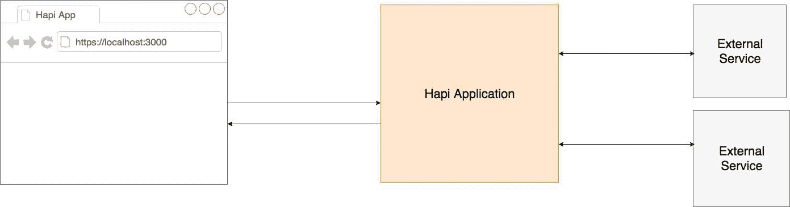
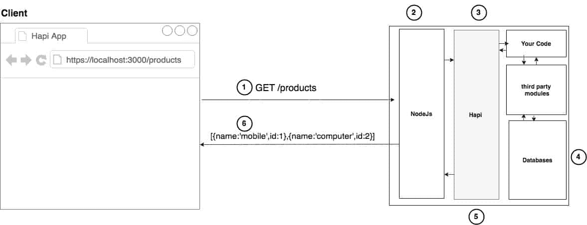
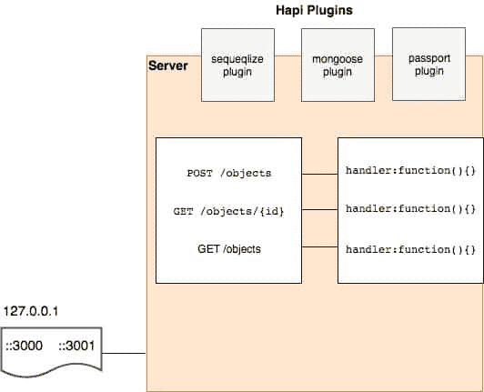

# 哈比神介绍。射流研究…

> 原文：<https://simpleprogrammer.com/introduction-hapijs/>

hapi.js(也称为 hapi)是一个用于 web 应用程序的开源框架。hapi 最常见的用途是构建 web 服务，比如 JSON API。您可以使用 hapi.js 构建应用程序编程接口(API)服务器、网站和 HTTP 代理应用程序。

hapi 由沃尔玛实验室的移动团队创建，由创建 OAuth 的 Eran Hammer 领导，用于处理黑色星期五等活动的流量，黑色星期五是美国日历上最繁忙的在线购物日之一。

hapi 的最初版本使用 Express 框架。沃尔玛发现 Express 存在一些限制，使得该框架不适合他们的特定需求。Express 缺少一些关键功能，所以沃尔玛最终让 hapi 发展成自己的独立框架。

我开始使用 Express 来构建我的 web 应用程序。我从事的是小项目，Express 非常适合小项目。但是当我开始从事更大、更复杂的项目时，我不断遇到框架的问题。在 Express 中很难进行缩放。在 Express 中没有一个推荐的组织事物的方法，这对初学者和有经验的开发人员来说都是一个陷阱，并且会导致不可维护的项目。

沃尔玛有很多用户，他们的系统很复杂。你可以在 hapi 中成功开发企业级应用。对我来说，使用 hapi 的转变是快速而没有痛苦的。我喜欢简单的配置驱动的 api 和 hapi.js 的强大插件系统。

hapi 对开发人员来说很重要，因为它的设计让他们将时间集中在关键项目任务上，而不是构建基础设施。我们将深入探讨为什么 hapi 是一个值得你了解的好东西。然后，我将向您详细介绍如何使用 hapi。

## 谁在用 hapi.js？

使用 hapi 的公司有一个庞大的社区。根据 hapi 的说法，下面出现的公司是使用他们的框架的一些主要参与者。

一些 hapi 用户说:

*“hapi 是我们开源 npm 代理的坚实基础，它已经服务了数百万个请求，没有任何问题。凭借可靠的插件架构，hapi 已被证明是我们一些经常变化的内部工具的理想选择。”*

–PayPal 工程建筑师让-查尔斯·西斯克

*“hapi 拥有生产场所所需的所有最新的安全和稳健特性。我们喜欢使用、支持和创建有益于整个社区的开源软件，我们感谢 hapi 团队的巨大努力和奉献精神。”*

Mozilla 的丹尼·科茨

## 为什么要用 hapi？

hapi 提供了一个强大的插件系统，允许你快速添加新功能和修复错误。hapi 使您能够构建可伸缩的 api。它是构建表述性状态转移(REST)API 的绝佳选择，因为它为您提供了路由、输入、输出验证和缓存。您可以[构建一个 API](https://simpleprogrammer.com/2014/05/19/use-default-parameters-enumerations-make-apis-easier-use/) 来服务所有需要移动和单页面应用程序的客户端。

hapi.js 还可以使用 MySQL、MongoDB、Postgres，hapi 还允许你建立静态网站。它提供了一个模板引擎来呈现动态内容。您可以将 hapi.js 与任何前端框架一起使用，如 React、Angular 和 Vue.js，以创建单页面应用程序。

hapi 也是构建代理的好选择。例如，[沃尔玛使用 hapi](https://gist.github.com/hueniverse/7686452) 将请求从其 api 转发到外部 Java 服务。如果您想要构建一个单页面应用程序，并且您有多个后端服务器，即使它们与 web 应用程序在同一主机上，但是在不同的端口上，您也会遇到跨源资源共享的问题。你可以在代理的帮助下解决这些问题。

hapi 与社交应用程序和实时聊天应用程序配合良好。你不需要为实时应用创建自己的定制插件，因为 hapi 为实时聊天应用提供了一个名为 nes 的插件[。](https://github.com/hapijs/nes)

### 作为 api 服务器的 hapi

hapi 简化了您编写高可伸缩性 api 的方式。它功能强大，具有一个健壮的架构和丰富的框架。以下是 hapi API 服务器的架构:

客户端或浏览器将向 hapi 应用程序发送网络请求。浏览器将发送产品的 HTTP 请求。hapi 将接收 HTTP GET 请求并从数据库中找到产品，然后客户端将接收产品数组。

### 作为网站服务器的 hapi

你也可以用 hapi 构建一个网站服务器应用。您的客户端或浏览器将向 hapi 发送对 index.html 的请求，hapi 将拥有一个类似 EJS 或 Jade 的模板引擎。这些模板引擎以 HTML 的形式呈现动态内容。在 HTML 中完成渲染后，hapi 会将 index.html 发送到浏览器。

### hapi 作为 HTTP 代理

hapi 的另一个用途是作为 HTTP 代理。沃尔玛使用 hapi 作为[代理 HTTP](https://gist.github.com/hueniverse/7686452) 服务；虽然大部分业务服务仍然由 Java 外部服务提供，但是所有传入的流量都是通过代理服务器发送的。

### hapi 应用程序的大图

以下是从 hapi 应用程序获取数据的步骤:

1.  浏览器发送对产品的请求。节点接收到请求，并将其转发给 hapi。
2.  hapi 应用程序对用户进行身份验证，并为当前路由运行适当的路由处理程序。
3.  您的应用程序从数据库中获取数据。
4.  产品数据被提供给 hapi 回复功能。
5.  HTTP 响应从节点发送到云应用。

如果你正在寻找一个灵活的框架来构建所有类型的网页和应用程序，hapi 是你应该了解更多的东西。

## hapi.js 的构建模块

hapi 由几个关键组件组成。服务器是 hapi 应用程序的主要容器。您使用连接将 hapi 服务器连接到网络接口，这样它就可以开始接受传入的请求。您还可以将 hapi 服务器连接到多个端口，如 3000 和 3001。

确保您指定了您的 HTTP 请求类型，如 **GET** 、 **POST** 、 **PUT** 、 **DELETE** 或 **PATCH** 。您必须为每条**路线**指定**路径**。每条路线都有一个**处理器**功能，您必须在创建新路线时定义该功能。每当您向任何端点发送请求时，都会为该路径调用路由器处理程序函数。

插件是 hapi 的一个便利特性。借助插件，您可以为 hapi 应用程序添加更多的功能。如果你想连接到 MySQL 数据库，hapi 有 **Sequelize** 插件。你可以使用 hapi-mongose 插件与 **MongoDB** 进行通信。

### 创建新服务器

您可以通过创建新的 **hap 实例来创建新的服务器。服务器()**

在代码编辑器中打开空项目，并运行命令:

它将创建新的 package.json 文件。现在您需要安装 hapi 框架。

在根目录下创建一个名为 **server.js** 的新文件。

现在，您可以通过运行以下命令来运行 hapi 应用程序:

您将看到这条消息:服务器运行在**端口 3000。**

### 创建新路线

hapi 提供了一个 **server.route** 方法来在 hapi 中创建新的路由。

**server.route** 将接受一个 options 对象，该对象有三个属性。您需要指定端点的路径。确保将方法定义为 GET、POST、PUT、DELETE 或 PATCH。

最后一个属性是处理函数。当您向任何路由发送 HTTP 请求时，hapi 将调用处理函数，它将接受两个参数， **req** 和 **reply** 。您可以从 req 对象中获取所有请求数据。您使用 reply 方法从服务器发送响应。

您必须使用 **node server.js 运行应用程序。**您可以通过从浏览器发送请求来测试这两条路由。

### 在 hapi.js 中添加插件

您可以通过向 hapi 应用程序添加插件来扩展服务器。您还可以通过使用插件将 hapi 应用程序转换成模块。

你必须使用 **server.register()** 来注册插件。这个 **server.register()** 可以接受一个对象或一组配置。我已经在 hapi.js 中注册了**好插件**，它用于 hapi 中的**登录**目的。此配置对象必须具有 register 属性，options 是可选属性。

如果插件需要任何选项，您也可以在插件配置期间包含选项。我在插件选项中使用记者。报告器用于记录响应。

## 正确的框架

因为 hapi.js 是一个 web 应用程序框架，可以帮助您构建网站、api 或任何 HTTP 服务，所以它是一个非常有用的工具。

hapi 应用程序的主要构件是服务器、连接、路由、处理程序和插件。hapi 之所以有效，是因为您可以定制这些构建块，并使框架符合您的要求和需要。它还允许你通过使用其强大的插件系统和 npm 包管理器，以模块化的方式构建你的应用程序。

使用 hapi 可以使您的开发项目更加容易，并且让您更加关注构建的关键部分，而不是担心基础设施的细节。