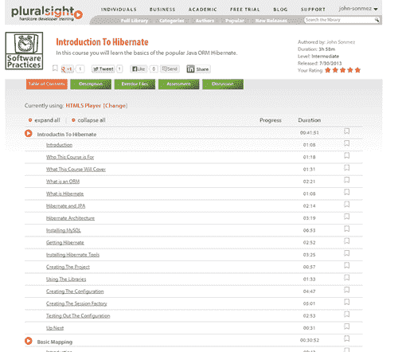

# Hibernate 简介

> 原文：<https://simpleprogrammer.com/introduction-to-hibernate/>

我刚刚发布了一个新的 Pluralsight 课程，[Hibernate 简介](https://simpleprogrammer.com/hibernate-introduction)。

这个课程绝对是一个很难制作的课程。Hibernate 包含了太多的内容，我不可能面面俱到。

以下是课程描述:

在 Java 世界中，最流行和最广泛使用的框架之一是 Hibernate。

[Hibernate](http://www.hibernate.org/) 是一个 ORM 或对象关系映射器，允许开发人员将 Java 对象映射到关系数据库表。这是一个所有 Java 开发人员都应该知道如何使用的有价值的工具。*问题是，学习冬眠可能很难。* Hibernate 是一个非常大的框架，要有效地使用它，需要理解许多重要的概念。

**您是……**的开发人员吗

*   一直想学习如何使用 Hibernate
*   努力使用应用程序
*   从未真正理解过冬眠

本课程旨在为您提供所需的知识，让您对 Hibernate 的工作原理和使用方法充满信心。

**本课程提供的内容:**

本课程旨在使 Hibernate 的入门尽可能简单，并专注于您需要知道的最重要的事情。John 从教你一些关于 Hibernate 的知识和它的工作原理开始了这个课程。

然后，您将看到如何用一个真正的 MySQL 数据库安装来设置它。之后，您将学习映射的基础知识，这是了解 Hibernate 最重要的事情之一。

John 将向您展示如何创建 Java 对象到关系表的基本映射，并向您解释映射是如何工作的。他还介绍了一些复杂的映射情况，比如映射集合和不同的关系映射，比如一对多和多对一。

一旦你学会了如何映射你的对象，你就会想知道如何查询它们，所以他将向你展示如何使用 Hibernate 的内置 HQL 和使用 Criteria API 的更加面向对象的方法来完成这些。

最后，他简要介绍了一些更高级的特性，如缓存和拦截器，从而结束了本文。

