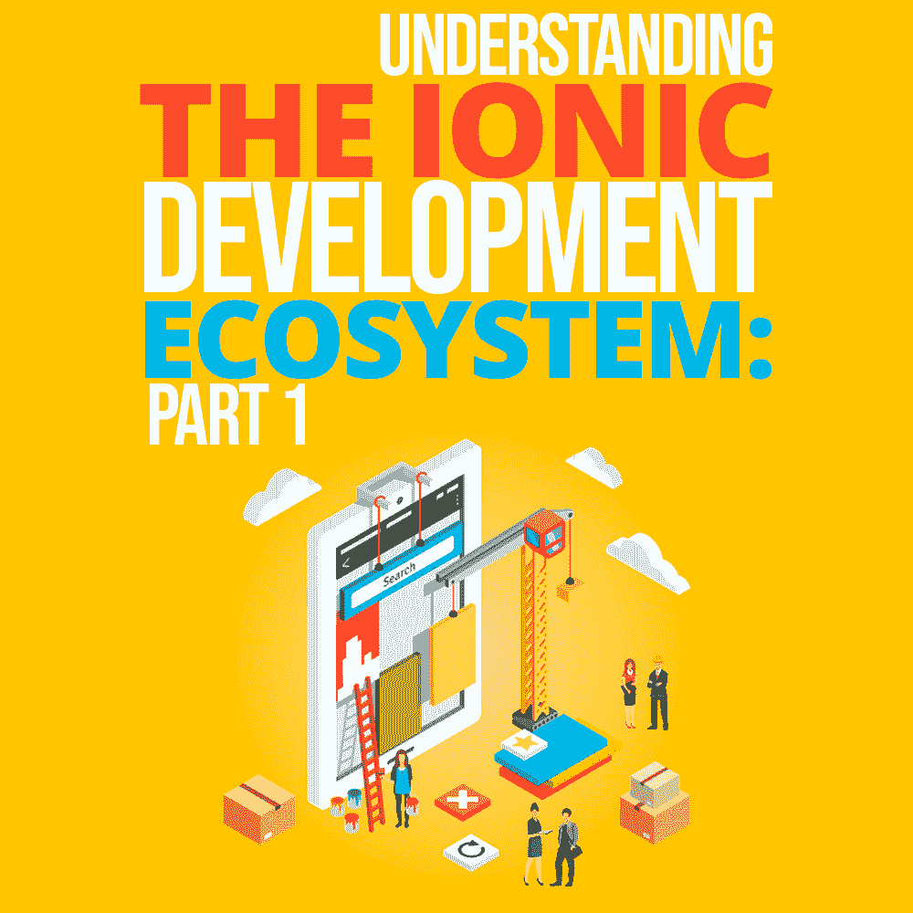

# 了解离子开发生态系统:第 1 部分

> 原文：<https://simpleprogrammer.com/ionic-framework-development/>

Congratulations! You’ve decided to learn how to build apps with [Ionic Framework](https://ionicframework.com/). And you’ve made a great decision, given that the web is the most trusted universal runtime in the world.

在庞大的开发者社区的支持下，Ionic 为您提供简单的工具来构建令人惊叹的跨平台体验，从获奖的应用商店应用，如 [Sworkit](https://sworkit.com/) 到任务关键型企业应用。

在阅读了这个由两部分组成的指南后，你会对理解每一项技术以及基于你的 web 开发背景的合适的学习路径充满信心。在第一部分中，我将介绍 Ionic 框架的基础知识以及它所基于的 web 技术。

## 什么是爱奥尼亚？

在我们继续之前，让我们先简单介绍一下。Ionic Framework 是一个免费的开源移动用户界面(UI)工具包，用于为原生 iOS、Android 和 web 开发高质量的跨平台应用程序，所有这些都来自单个代码库。

自从 2012 年首次发布以来， [Ionic *框架*](http://www.amazon.com/exec/obidos/ASIN/1491937785/makithecompsi-20) 已经获得了巨大的人气，并且已经发展成为一个拥有全球大约[500 万开发者的社区](https://ionicframework.com/community)。它得到了 Ionic *公司*的全力支持，该公司提供的不仅仅是框架，还包括为构建多个 Ionic 应用的团队提供的[移动 DevOps 解决方案](https://ionicframework.com/appflow)，一个大型的第三方[集成套件](https://ionicframework.com/integrations)，以及[企业支持和咨询服务](https://ionicframework.com/enterprise-engine)。

Web 开发人员在寻找利用现有技能构建移动应用程序的方法时，经常会发现 Ionic。但是，Ionic 的好处远不止于此，它可以增强你的 web 技能(HTML、CSS、JavaScript)，帮助你学习新的 web 框架(如 Angular、Vue 或 React)，提供你构建渐进式 web 应用程序(PWA)所需的工具，等等。随着 Ionic Framework 4.0 的[最近发布](https://blog.ionicframework.com/introducing-ionic-4-ionic-for-everyone/)，现在是加入并利用其最新技术的绝佳时机。

首先，我们来看看所有 Ionic apps 的基础:web 基础。

## 网络基础

从本质上来说，Ionic app 只是一个 web 应用程序，并配有各种工具，用于将应用程序部署到不同的平台(包括桌面、web 和本机)。这意味着应用程序建立在 web 的基础之上: **HTML、CSS 和 JavaScript。**如果你还不熟悉这些，那么建议你在尝试构建 Ionic 应用程序之前先学习一下。

幸运的是，投资学习 web 开发基础知识是一个很好的职业选择。不仅网上有很多免费的和 T2 付费的学习资源，而且 JavaScript 是世界上最常用的编程语言。

同样值得一提的是 **ECMAScript 6 (ES6)** ，它定义了 JavaScript 和 Ionic 应用程序都可以利用的新语言特性。[这些特性](http://es6-features.org/#Constants)使得 JavaScript 成为一种更容易使用的语言。在 Ionic 应用程序的上下文中，注意类、模块、承诺、块范围、箭头函数和范围变化。

我建议先浏览一下这些概念，然后在构建 Ionic 应用程序时根据需要进行回顾。这些变化中最好的部分是更干净、更易读的代码。

## 向 JavaScript 添加类型

在 Ionic 应用程序中还可以找到 **TypeScript** 。正如[在其主页](https://www.typescriptlang.org/)上所描述的，它是“编译成普通 JavaScript 的 JavaScript 的类型化超集”那是相当多的一口！所以，我们来分解一下。

“超集”意味着它包含了所有现有的 JavaScript 功能，但是具有额外的特性。最强大的特性之一是“类型注释”，它允许您以更严格、更面向对象的方式编写 JavaScript 代码。跟随一个例子是理解它们的最好方法。

欢迎函数的单个参数 *person* 必须是一个字符串。如果我们在传入数组的同时执行这段代码，将会产生一个错误。

*错误 TS2345:类型为“number[]”的参数不可分配给类型为“string”的参数*

虽然这个例子非常简单，但是这个内置的错误检查功能对于复杂的 web 应用程序非常有用，因为它们可以在软件项目的整个生命周期中防止大量的错误。

TypeScript 定义的最后一部分“编译成 JavaScript”怎么样？Web 浏览器不理解 TypeScript 代码，而且并非所有浏览器都支持 ES6 的某些功能。因此，在 Ionic 构建过程中，TypeScript 代码被转换成 JavaScript 并打包成一个文件。

幸运的是，Ionic 为我们做了所有这些，但是理解这个概念对于了解幕后发生的事情是有用的。

## 回到爱奥尼亚

定义了各种 web 技术的基础之后，我们可以将注意力转回到 Ionic 框架上。它是一个可重用的 UI 组件库，作为应用程序的构建块。虽然是预构建的，但它们从头开始就被设计成高度可定制的，允许每个应用程序都有自己的外观和感觉。

此外，Ionic 提供了开箱即用的应用程序 UI/UX 元素——控制、交互、手势和动画。这让你可以专注于构建你的应用的独特功能和业务逻辑。

一张卡(离子卡)包含一个主题的内容。

除了是一个很棒的 UI 工具包，Ionic Framework 还提供了"**平台连续性，**"这意味着每个 Ionic 组件都会根据应用运行的平台调整其外观。

比如在苹果设备上 [Ionic 使用 iOS 设计](http://www.amazon.com/exec/obidos/ASIN/1788623231/makithecompsi-20)语言，而在安卓设备上使用谷歌的材质设计。因此，应用程序开发人员可以使用相同的代码库来针对多个平台。

## 框架集成/工具

Ionic 首先是一个 UI 框架。虽然你可以在没有应用程序的情况下开发应用程序，但是大多数 Ionic 开发者会将他们的应用程序与另一个 web 开发框架结合起来，比如 T2 Angular T3。通过这样做，他们可以获得最好的应用程序开发体验:一个漂亮的 UI 工具包，以及用于构建、捆绑、路由和业务逻辑的工具。

Ionic 4 UI 组件基于开放的 web 标准构建，因此它们通常可以与所有主要的前端框架一起开箱即用(对 Vue 和 React 的官方支持即将推出)。

## 下一步是什么？

现在你已经了解了 Ionic 是什么，以及为了构建一个成功的应用程序你需要知道的网络技术。在第二部分中，我将介绍 Ionic 生态系统的其余部分，包括环境和构建工具，如何创建移动应用程序，以及在开发 Ionic 应用程序时会遇到的其他技术。

迫不及待想开始？[今天就打造一款 Ionic app](https://ionicframework.com/getting-started#account) ！