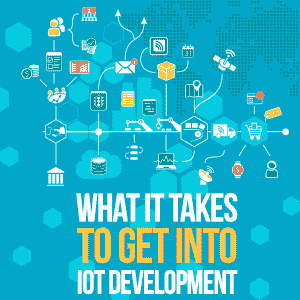

# 进入物联网开发需要什么

> 原文：<https://simpleprogrammer.com/iot-development/>

In 2015, there were [15.4 billion internet-connected devices](https://www.visioncritical.com/internet-of-things-stats/), and that number is expected to grow to 30.7 billion by 2020 and 75.4 billion by 2025\. As the demand for [“internet of things” (IoT)](https://simpleprogrammer.com/iot-the-success-tool-for-entrepreneurs/) devices and technologies continues to climb, so will the need for developers and experienced coders who can help maintain and deliver these systems.

但不仅仅是消费者领域在蓬勃发展:几乎每个行业都是如此，包括制造业、医疗、军事和零售业。SparkLabs 预测，该市场将从 2017 年的 25 亿连接扩大到 2020 年的 54 亿。

如果你正在考虑从事物联网开发，那么现在是登上这艘船的最佳时机。

作为一名成功的物联网开发人员，你需要建立一套多样化的技能和才能。更重要的是，你需要熟悉几种编程语言，包括汇编、B#、C、GO、Java、Python、PHP、Swift 和其他一些语言。当然，确切的语言取决于您将使用的平台和软件。

也就是说，对编程经验的需求是显而易见的。那么，打入物联网开发领域还需要什么呢？

对于物联网，必要的概念和技能可以分解为六大类。

## 1.五金器具

物联网涉及设备和虚拟世界之间的连接。智能设备，如每个人都在圣诞节得到的 Google Home、你的孩子现在正在使用的游戏化牙刷，甚至是智能手机控制的咖啡机，通常都包括用于测量物理元素的物理传感器和连接器。这被转化为数据，反馈到设备和“连接”空间，也就是互联网。

因此，物联网背后的硬件与促进数据收集和传输的软件一样重要。

作为一名物联网开发人员，研究和了解您将为其创建应用程序和软件的各种设备符合您的最佳利益。虽然不是每个物联网设备都是一样的，但熟悉产品与消费者以及消费者与产品的交互方式非常重要。

## 2.建立关系网

连接或联网是物联网设备最重要的组成部分之一。它允许设备通过应用程序、服务和云技术相互通信。

您至少需要对网络设计和管理有基本的了解，并掌握网络中使用的标准和协议。举几个例子，有 Wi-Fi、蓝牙、射频识别(RFID)、Zigbee 等等。

虽然有多本关于物联网开发入门的书籍，但并不是每个人都能够独自掌握这些知识。对于那些在一些指导下学得更好的人来说，在线课程——比如 Coursera 提供的[——是获得一些坚实基础知识的好地方。](https://www.coursera.org/specializations/iot)

## 3.应用程序设计和开发

Web 和移动应用是与物联网设备和网络交互的以用户为中心的门户。例如，如果你正在开发一个智能灯泡，你还需要设计一个允许消费者使用灯泡的移动应用程序。这不仅需要软件开发和设计的工作知识，还需要用户界面(UI)和用户体验(UX)设计技能。

一些较新的物联网设备采用专有的用户界面，如语音控制系统，如亚马逊的 Alexa。当使用这些小工具时，您需要理解并能够使用相关的 UI，因为每种设备可能会有不同的语言偏好。

## 4.安全性

因为物联网设备连接到互联网并与附近的设备联网，所以安全性是首要考虑的问题。事实上，安全一直是采用物联网的最大障碍之一，因为这些设备与用户日常生活的密切关系随着大量收集的数据而结束。

For instance, the “personal information” that hackers can steal has now increased to include your binge-watching habits and–even more terrifying–your sleep patterns and when your house is left unattended.  With this considered, you need to be conscious about security at every step of creating an IoT device.

数据伦理、隐私和责任也属于这一类，如果您未能遵循这些原则，可能会带来法律后果。作为一名开发者，你需要在[安全措施](https://simpleprogrammer.com/5-security-concepts/)方面保持领先。

## 5.商业智能和数据分析

物联网不仅仅是一场以消费者为中心的运动。它几乎占据了商业的所有方面。

作为一名开发人员，你需要了解公司如何利用现代物联网设备来收集数据(根据设备的环境和传感器，数据可以包括从位置、看电视习惯到心率的任何内容)，并熟悉等式的数据科学一面。

您如何能够可靠地接收、处理和存储数据，并在以后加以利用？你需要能够开发和创建能够帮助数据处理的系统，既可靠又准确。仅仅这一点就需要对商业智能和现代分析工具的工作原理有深刻的理解。

虽然很有可能自学大数据在物联网中的作用以及如何在铭记这一点的情况下进行开发，但 edX 提供了关于[物联网编程和大数据](https://www.edx.org/course/iot-programming-big-data-curtinx-iot4x)的优秀课程。

## 6.机器学习和人工智能

虽然不是所有的物联网设备和硬件都利用机器学习，但无论如何，这是你应该熟悉的东西。你至少应该了解开发人员如何使用该技术来增强物联网设备。

机器学习是人工智能的一种应用，涉及为计算机提供数据访问，并让它们使用数据进行学习。通过机器学习，算法已经教会了自己如何玩棋盘游戏，识别 X 射线中的异常，以及执行许多其他复杂的任务。

由于物联网设备收集了如此多的数据，它们在机器学习方面具有巨大的潜力。IBM 最近公布了通过沃森物联网将物联网打造成[“会思考的互联网”](https://www.ibm.com/internet-of-things)的计划，并且已经有传言称机器学习和物联网设备将能够帮助未来的智能城市[发现事故和犯罪的先决条件](https://www.leverege.com/blogpost/machine-learning-applications-in-iot)。

除了 IBM 和 digital justice，就像其他领域和行业一样，机器学习正被用来帮助将使用物联网设备转变为消费者更个性化的体验。Nest 恒温器已经了解了用户的温度偏好。

## 我如何成为一名物联网开发者？

如果你已经迈出了第一步，那么你很可能知道下一步该去哪里。但如果你是从零开始，这里有很多东西需要消化。从哪里开始最好？可以去哪里学？

最好的答案是你觉得舒服的任何地方。正如你从上面的列表中看到的，作为一名物联网开发人员，你需要了解技术的几乎所有方面，包括软件、硬件以及二者之间的一切。有扎实的编程或开发背景是不会错的，所以从那里开始是个不错的主意。对你想使用的物联网系统做一些研究，找到共同语言。

与此同时，您还可以使用 Arduino 和 Raspberry Pi 构建修补初学者或初学者集。它们允许您构建和开发自己的物联网系统和硬件，这也非常有趣。

根据上面给出的建议，以及你自己的一些研究和实验，成为一名物联网开发者并不像你最初想象的那么遥远。

现在就去吧——成为我们互联世界所需要的物联网开发者！你知道，我们都在等待新的声控溜溜球，它可以跟踪你的脚步，支付你的账单，并订购优步。