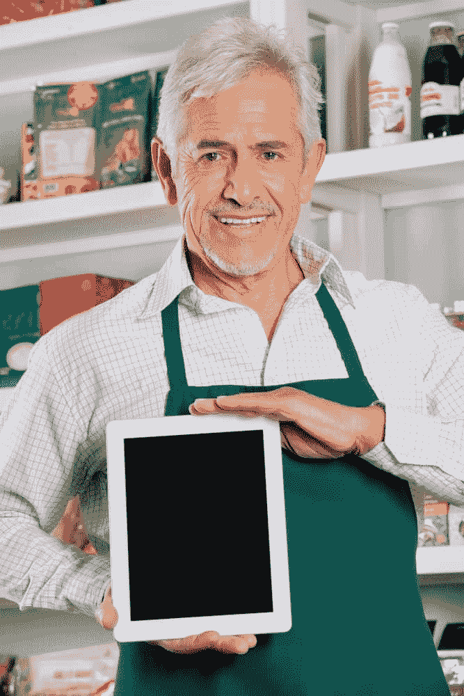
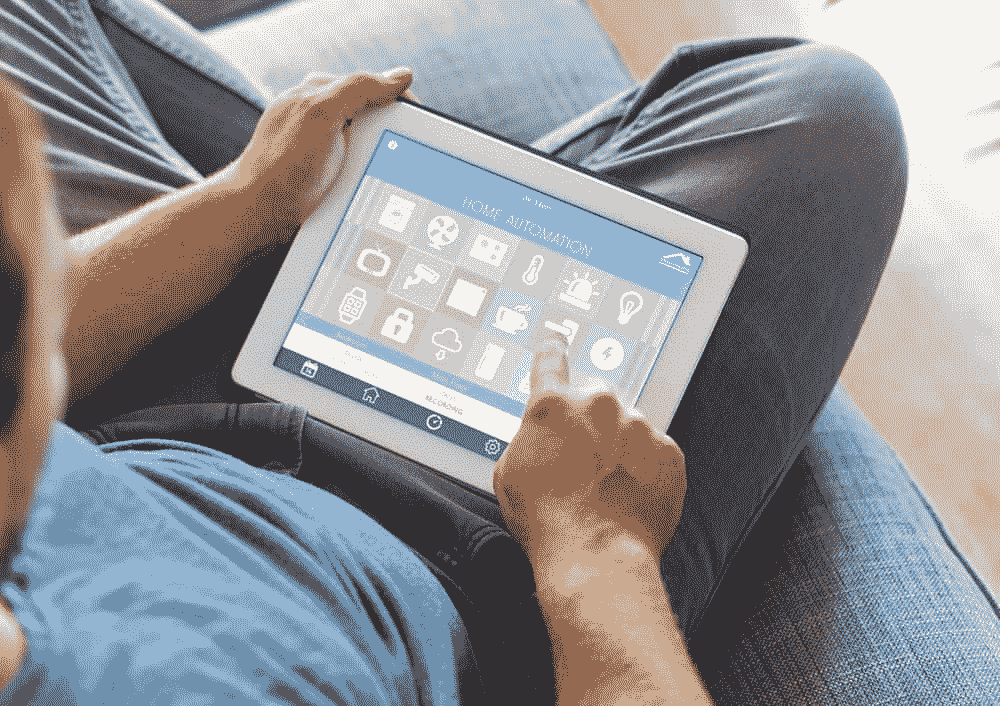

# IOT 是企业家的成功工具

> 原文:[https://simple programmer . com/IOT-the-success-tool-for-entrepreneurs/](https://simpleprogrammer.com/iot-the-success-tool-for-entrepreneurs/)

如果你在[创业领域](https://simpleprogrammer.com/2013/11/04/want-quit-job/)，或者是一个热衷于关注科技新闻的人，你会经常听到 IOT 这个缩写词。

IOT 的意思是物联网，它是嵌入了电子设备、软件、网络连接和传感器的物理对象网络，使这些对象能够交换数据。应该注意的是，IOT 和数据在这里是相互包容的，没有一个就不能增加价值。

事实上，物联网的成败可能取决于数据，以及如何对数据进行分析以吸收成有意义的信息。

IOT 中的“东西”可以指过多的设备，包括内置传感器的汽车、帮助消防队员进行搜索和救援行动的现场操作设备、心脏监测植入物等。这些设备在现有技术的帮助下提供有用的数据，并随后允许数据在这些设备之间流动。

除了 IOT 的明显优势之外，预计它还将从不同地点产生大量实时汇总的数据，这就需要对这些数据进行索引存储和处理。

****

**IOT 市场的成长**

作为世界上最大的航运公司之一，UPS 使用传感器数据和大数据分析来节省资金、减少环境影响和提高效率..

来自 UPS 的一份报告称，他们每天为超过 80，000 辆车中的每辆车捕获超过 200 个数据点。这节省了大量时间和燃料消耗，同时减少了有害排放。

迪士尼世界的 MagicBand 是 IOT 和大数据协同工作的一个智能例子。MagicBand 是一款可穿戴的传感器腕带，游客可以使用它在酒店办理入住手续，购买食品或商品，并参观游乐园的各种景点。佩戴者可以通过用他们的带子轻击接收器在特定的岗位签到，这些动作通过射频识别(RFID)标签进行跟踪。

这可以用来收集游客流动的数据，也可以帮助他们容纳更多的客人，确定需要更多库存的商店，正确运营景点，并管理高流量位置。

IOT 市场仍处于萌芽阶段，随着越来越多的设备相互连接，可以预计它将快速爆炸。连接设备的数量预计将达到数百亿。

创业创新将推动这个行业，因为可以获得巨大的利益。与大公司不同，大公司的战略是不容易进行实验，创业生态系统允许企业家和员工冒险和创新。

麦肯锡的一份报告称，物联网的兴起有三个原因:

1.  如今可用的传感器越来越快、越来越小、越来越便宜。
2.  网络无处不在；如今，你几乎可以在任何地方联网。
3.  分析这些网络传感器生成的数据的能力，这使得 IOT 场景更具吸引力。

**IOT 跨行业使用:**

让我们以 IOT 实施率较高的行业为例，看看它是如何变得更加智能的。每一个领域都为企业家提供了不同的市场机会，他们通过技术创新来改善服务、联系和沟通。

**医疗保健:**

Healthcare is one of the most promising areas where IOT’s implementation can be very successful, as it also has the potential to improve the lives of billions around the world.

医院可以收集数据，并对哪怕是最小种类的医院设备进行分析。这可以帮助医务人员进行诊断和治疗，并有效地提高患者的护理标准，因为患者的数据很容易获得并且已经过分析。

向医务人员传输诸如生命体征数据等方面的实时信息将患者置于更有利的位置。这是通过可穿戴技术实现的。就像按下按钮一样简单，医院可以立即得到关于病人状况的通知。

有 FitBit、GOQii、Nike FuelBand 等健身追踪器，它们的设备可以测量一整天的运动。这可以改变保险公司的工作方式。

企业家可能希望进入其中的任何一个方面，并围绕它建立一个企业，因为它增强了用户的能力，并可以改变那些成为其中一部分的人的生活。

**零售**

Online shopping has changed the way we shop, but right now,brick and mortar stores are on a level playing field with the proliferation of connected devices.

这主要是因为他们可以使用[库存管理软件](http://www.softwaresuggest.com/inventory-management-software)跟踪库存，可以有效地服务消费者。移动 IOT 技术使消费者能够获得更加个性化的购物体验。

在 IOT 技术的帮助下，商店可以收集消费者的位置、人口统计信息和购物历史，从而为他们提供改善购物体验的优势。

有了实时数据，实体店的销售人员还可以进行个人推荐，从而有助于增加销售额。

为了识别单个商品，这些实体商店也在使用 RFID 标签。虽然这与条形码的工作原理相似，但它可以无线使用。这些标签有助于零售商高效跟踪库存，并不断更新消费者信息。

销售人员还能够当场给出建议，帮助顾客购买商品，从而将自己与顾客区分开来。

**制造**

制造业是最早利用 IOT 技术的行业之一。世界各地的工厂都在使用这项不可思议的技术。连接在一起的数十亿个网络使日常运营得以顺利进行。

企业将基于传感器的技术集成到现有的流程和系统中，以构建智能制造系统。IOT 不仅有潜力让它变得更快更有效率，还能让它变得更有利可图。

**安全**

安全服务是使用 IOT 技术的行业的另一个多用途领域。这可以用于保护家庭的安全系统，以及可以测量实时数据的贵宾安全系统。

能源消耗是企业家可以集中精力做大的另一个领域(例如，创造一种当它感觉到房子里没有人时会自动关闭设备的设备)。

**IOT 的嵌入式智能**

像思科、松下和夏普这样的巨头已经承诺制造与网络系统兼容的设备和装置，这样机器就可以互动。创业者需要找到一个利基，这可以借助物联网成为可能。

你一定想知道 IOT 在你的生活中能帮到你什么。从观察熟睡的宝宝、预约医生、确保按时服药开始，大量可穿戴设备可以跟踪你的活动。IOT 还允许恒温器给你天气信息，这样你就可以减少电费。它还可以为你的城市提供平台，让街道根据日期、时间、气候和季节进行照明。

在互联网技术的帮助下，每一种互动都可以改变，企业家将站在一切创新的最前沿。智能手机将成为普通人群物联网概念的门户，以及对你生活的完全远程控制。具有创新个性的商业远见者有机会利用这个不寻常的机会。