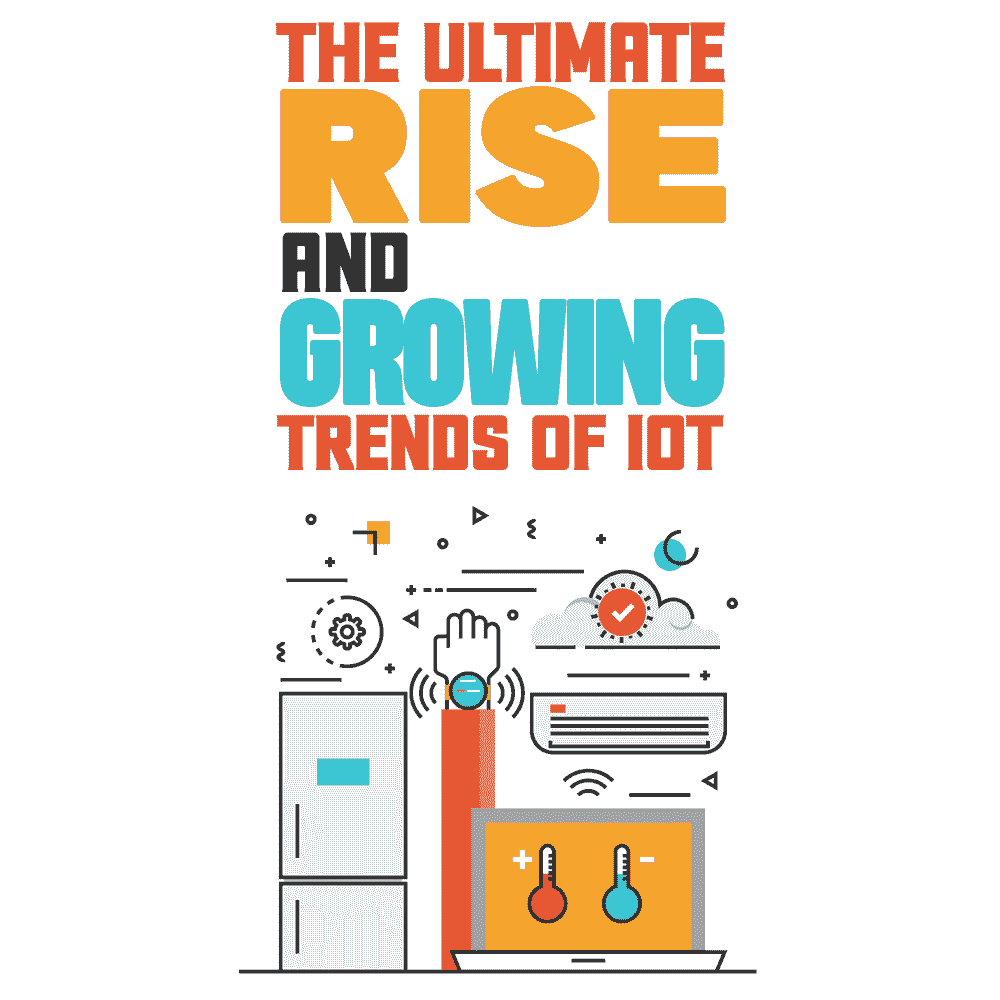
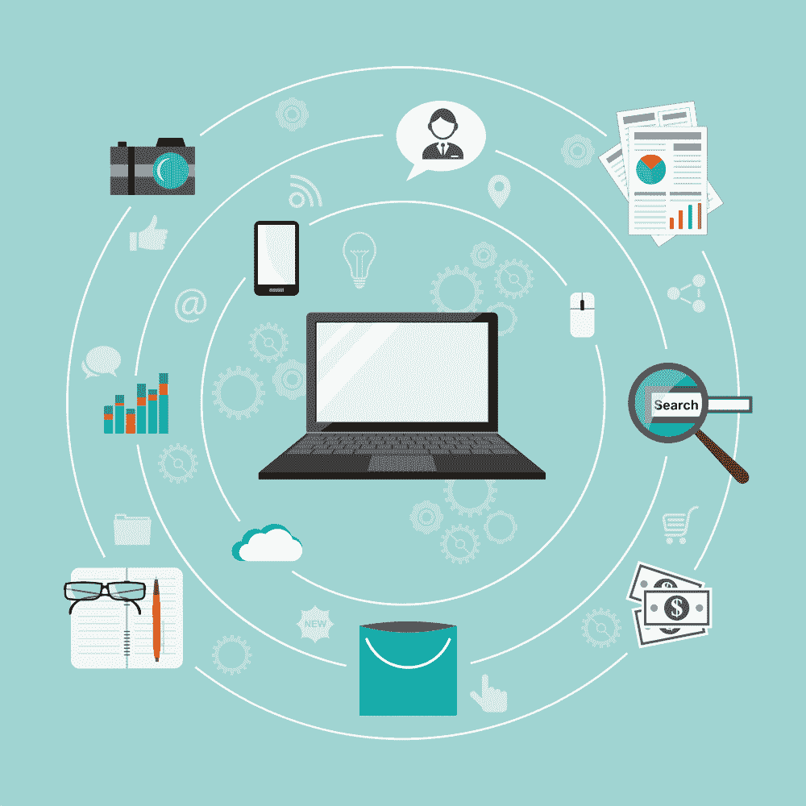

# 物联网的最终崛起和发展趋势

> 原文：<https://simpleprogrammer.com/iot-trends-and-rise/>

Two decades ago, the rise of the internet gave birth to several tech advancements. Most of those advancements simplified life by making a lot of things go smoothly. IoT is one of those advancements that took the world by storm.

几年前，物联网还只是一个技术概念，而今天，它已经成为我们生活中有影响力的一部分！物联网是传感器、软件、设备和网络的融合，它将积累数据的人工干预降至最低。

技术升级和新设备的引入推动了物联网技术的发展。今天，人们正在购买配备基于传感器技术的设备。无论是家庭自动化设备还是医疗物联网设备，人类都在充分利用技术。

根据 Statista 编制的报告，考虑到智能设备在日常生活中的使用越来越多，预计到 2025 年将有超过[750 亿台物联网设备在使用。](https://www.statista.com/statistics/471264/iot-number-of-connected-devices-worldwide/)

## 物联网设备

通过互联网收集和交换数据/信息的各种电器、小工具和传感器称为物联网设备。这种设备经过专门编程，可以嵌入到其他设备中，通过物联网设备，可以从世界任何角落控制其他应用程序和小工具。

在进入文章的主要部分之前，先来看看一些值得您关注的关键统计数据。

*   到 2030 年，物联网的全球收入预计将超过 1 万亿美元
*   通过工业物联网(IIoT ),全球经济可增加高达 14.2 万亿美元
*   根据思科的报告，M2M 企业预计将在 2022 年增长到 30 亿
*   MTA 预测，到 2030 年，每人将拥有 15 台设备

所有这些统计数据都表明物联网正在快速普及。不仅仅是物联网的采用，由于预计未来的大量投资，经济也将大幅增长。

物联网在 5G 网络、人工智能等技术的发展中一直发挥着重要作用。很明显，我们将见证物联网在未来的崛起。

既然我们已经讨论了物联网的重要性及其发展速度，那么让我们更深入地了解一下物联网是什么、全球市场以及 2022 年的预期趋势。

## 创新的现存现实

物联网在商业中的应用概念成为讨论话题的日子已经一去不复返了。今天，许多商业领域已经集成了物联网，同时不断改进。

用于标记出勤、跟踪员工工作流程、住宅/企业安全摄像头、烟雾传感器等目的的定制软件。笔记本电脑、智能手表、智能灯泡、智能手机等。，可以毫不费力地连接到互联网！它们只是人们日常使用的物联网设备的例子。

如果仔细观察，物联网的概念围绕着工作的机器人化。[物联网在企业中的吸收率越高](https://simpleprogrammer.com/build-iot-projects/)在性能方面的效率越高。

物联网设备将上述内容保持在循环中，以加强不同行业和业务在市场中的表现。

### 物联网设备是如何工作的？

智能手机或智能手表等物联网设备包含集成的 CPU、网络适配器和固件。它们连接到动态主机，需要 IP 地址才能运行。此外，为智能手表和智能手机设计的应用程序与软件相连，以执行不同的功能，使它们成为智能设备。

例如，手表以前只是用来跟踪时间。但是，[物联网技术](https://simpleprogrammer.com/becoming-iot-developer/)允许个人跟踪行走的步数、心跳速率、消耗的卡路里等。因此，将普通手表变成智能手表。

### 卓越的物联网设备

亚马逊 ECHO 语音控制器、Google Home 语音控制器、亚马逊 ECHO spot、Nest Audio 等。，是市场上一些主要物联网设备的示例。配备了语音控制器功能，个人可以通过语音操作和管理不同的任务。

语音控制器是大多数智能设备的突出特征。一旦激活并配置了特定的声音，它就会执行用户发出的命令。

示例包括播放音乐、操作闹钟、电视、打开/关闭灯、键入消息、控制其他兼容设备等。，使用这样的语音控制器物联网设备可以流畅的完成。传感器和扬声器等嵌入式组件使得操作所有著名的物联网设备成为可能。

### 市场上的关键物联网设备

Several IoT devices have entered the market and they’re here to stay. Equipped with the right technology, these devices have proved to be beneficial in the long run. Manufacturers are upgrading the existing versions for better performance. Take a look at some popular IoT devices.

**空气质量监测仪**

使用空气质量监测器，个人可以跟踪室内的杂质水平。这些设备易于安装、保持温度和净化空气。

**照明系统**

照明系统是广泛使用的个人物联网设备。通过在室内安装这些，个人可以通过安装在手机上的应用程序控制灯光。

**智能门铃**

在门口安装智能门铃，就不用有人来就开门了。智能门铃允许用户在房子的任何地方用手机开门。

**智能锁**

使用智能锁，人们可以在未来保护他们的家！智能锁是一种物联网设备，当用户通过应用程序连接时，可以使用生物识别或蓝牙解锁。如果门没有锁好，会有嘟嘟声提醒你。

**网状无线网络**

全屋网状 Wi-Fi 是一种物联网，它通过现有的互联网服务提供商在您的整个家中循环 Wi-Fi 信号。网状 Wi-Fi 可以通过 Orbi 应用程序进行配置。它消除了缓冲区，增强了 Wi-Fi 信号，实现了无缝体验。

随着物联网领域的不断进步，随着即将到来的物联网设备进入市场，预计到 2030 年物联网价值将超过[万亿美元。不仅仅是收入，物联网设备的数量预计也将是目前的三倍。](https://www.statista.com/statistics/1194709/iot-revenue-worldwide/)

93%的企业在日常运营中采用了物联网。电能表和智能电器是被广泛采用的重要设备。记住这一点，让我们看看物联网的全球市场。

## 全球物联网市场

根据 2021-2026 预测期的专家报告，全球物联网市场预计将大幅增长。凭借 10.53%的高 CAGR，[全球物联网将从 2020 年的 7610 亿美元增长到 2026 年的 13860 亿美元](https://www.mordorintelligence.com/industry-reports/internet-of-things-moving-towards-a-smarter-tomorrow-market-industry)。

由于对话式人工智能、机器学习、云计算平台和低成本传感器技术等技术，全球物联网的增长已经成为可能。

## 工业物联网

工业物联网，简称 IIoT，是指物联网在工业领域的实施，涉及控制传感器和设备的技术。世界各地的工业已经吸收了机器对机器学习(M2M)的技术来获得自动化控制。

但是，随着机器学习的出现，建立新的收入模式将变得更加容易。IIoT 的一些常见用法如下:

**联网车辆**

送货卡车和公共汽车等车辆配备了额外的物联网技术，用于监控强制性安全实践。

**智慧城市**

智能城市中的物联网部署有助于监控影响市政的实践。使用物联网，市政当局可以为社区的建筑安全提供更好的见解。

**智能交通管理**

升级后的交通管理系统简化了交通相关的缓解措施。交通灯中的传感器根据日光调节信号亮度。桥梁/天桥监视器检测结构健康状况并生成定期维护报告。

**智能供应链管理**

通过集成物联网技术，配送后跟踪交付物的位置变得更加容易。GPS 追踪器和软件有助于交付经理和利益相关者了解已发货物品的位置。

### 铁路中的物联网和大数据

考虑到工业方面，物联网对铁路的影响令人印象深刻。毫无疑问，铁路是一个支离破碎的部门。世界上许多国家依靠铁路作为运输货物的方式。

根据行业物联网分析，铁路拥有最复杂的数字化环境。专家认为这是一个挑战，因为存在 5v，即:

*   **价值**–地理上分散且价值高

*   **准确性**–处理数据的可靠性

*   **速度**–处理数据的速度

*   **体积**——达到设定的极限，无法通过传统方法处理

*   **品种**——更新过时的技术

使用边缘计算可以清除这些技术障碍。当物联网与边缘计算相融合时，它就成为上述与机车车辆相关的挑战和问题的解决方案。

使用这种先进的技术，个人不仅可以访问生成的数据，还可以找出网络安全的实时解决方案。当网络安全水平提高时，新的趋势就会出现。了解 2022 年的物联网趋势。

## 2022 年物联网趋势值得关注

以下是 2022 年值得关注的一些[热门物联网趋势](https://www.amazon.com/Internet-Things-Everyone-Needs-Know%C2%AE-ebook/dp/B087JYFMNQ/ref=sr_1_4?keywords=internet+of+things&qid=1650528943&s=digital-text&sr=1-4)。

### 物联网在大数据中的崛起

物联网在分散信息驱动的数据方面非常丰富，因为它有数十亿个物联网设备 24×7 交互。虽然物联网设备使用传感器收集信息和数据，但大数据技术可以分析大量可以频繁使用的数据。

通过将信息输入机器学习算法，可以简化集成物联网技术的整个过程。通过这样做，机器内部的功能得到了显著的改进(见下文)。

*   **提高决策能力**—根据结果立即做出决策
*   **更好的数据性能**–以更高的速度处理数据
*   **提高分析性能**–能够轻松执行复杂的分析
*   **增强的模式识别**–轻松识别和调整重复的模式

### 5G 网络的发展

毫无疑问，5G 是未来。到 2025 年，[中国预计将拥有 8.66 亿 5G 连接](https://www.statista.com/statistics/1275996/forecast-5g-adoption-mobile-connections/)。另一方面，美国预计将有 2.47 亿个 5G 连接，其次是日本，有 1.38 亿个 5G 连接。5G 技术承诺提供更快的连接速度、更高的 DTR 和更好的网络可靠性

随着 5G 成为蜂窝网络的核心，物联网设备将在互联设备之间快速传输数据方面发挥关键作用。

### 医疗保健行业的物联网

医疗保健行业是物联网技术的最大采用者和消费者。即使在疫情疫情爆发期间，当其他一切似乎都放缓时，该行业也为物联网技术的崛起做出了贡献。

各种基于物联网的手术器械、血液监测仪、心脏病/神经病学和智能可穿戴设备积极影响着人们的生活方式。在 covid 之后的生活中，医疗保健现在可能变得更加重要，并且在过去 2 年中没有积极参与“正常”健康。

话虽如此，在医疗保健领域使用物联网设备和技术的趋势将在 2022 年继续。

### 改善网络安全

Undoubtedly, the number of people using the internet is scarcer as compared to the number of connected devices. This imbalance is scary because it opens the entryway for invasion by hackers

随着技术的进步，网络安全的阴暗面也随之而来。尽管许多人知道如何保护他们的设备(以及所有存储的个人信息)的安全，但即使是最微小的漏洞也足以引发一场有影响力的网络攻击。

考虑到这些和其他许多网络安全问题，公司已经开始解决物联网设备的安全问题。通过监控物联网设备、实施网络分段以进行防御、采用安全密码实践以及通过定期更新来修复安全补丁，网络安全得到了升级。

## 物联网——未来

毫无疑问，物联网是具有无限潜力的未来！不断发展的物联网将为不同用例的部署和自动化提供敏捷性。

物联网的潜力不仅在于实现多种设备之间的通信，还在于通过人工智能利用更大的数据量。

考虑到现有的全球市场和多个行业采用物联网的趋势，预计它将很快快速增长。

新一波的进步将会有类似感官体验的人机交互和机器对机器的交互。这将揭示几个新的创新机会，显然，它可以渗透成为世界上的一个关键接口。