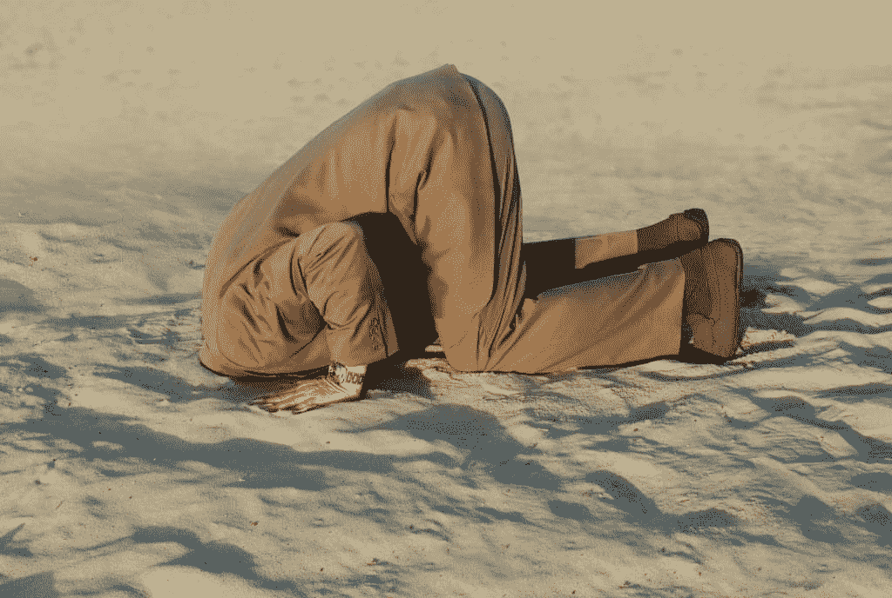

# 重要的不是评论家

> 原文：<https://simpleprogrammer.com/its-not-the-critic-who-counts/>

> “重要的不是批评家；不是指出强者如何跌倒，或者实干家在哪里可以做得更好的人。
> 
> 荣誉属于真正站在竞技场上的人，他的脸上沾满了灰尘、汗水和鲜血；
> 
> 勇敢奋斗的人；谁犯错，谁一次次功亏一篑，因为没有不犯错误和缺点的努力；
> 
> 但是谁真正努力去做这些事情呢？
> 
> 谁知道伟大的热情，伟大的奉献；他把自己奉献给一个有价值的事业；
> 
> 谁最好知道最终高成就的胜利，谁在最坏的情况下，如果他失败了，至少失败而大胆，所以他的位置永远不会与那些冷漠和胆小的灵魂不知道胜利和失败。"
> 
> —西奥多·罗斯福

把这句话打印出来，贴在墙上。

把它放在你的镜子前面。

把它放在你的显示器旁边，这样每当你准备不做自己的工作，而是批评别人的工作时，你就会停下来想一想。

你想成为批评家还是实干家？

你想成为那个嘲笑别人采取行动，而自己却什么都不做的人吗？

## 互联网是一个黑暗的地方，软件开发人员可能很卑鄙

我以前写过这个，当我谈到没有人谈论的软件开发的黑暗面时，所以我不会在这里反复强调这一点，但重要的是要明白，当你实际做一些事情时，你很可能会因此受到很多批评。

我希望我们生活在一个更美好的世界里，在那里每个人都支持其他人努力做某事——采取某种行动——但是，我们没有。

事实是，在我们生活的世界里，谴责他人的行为并指出他们的缺点要比支持和鼓励他们容易得多，或者更好的是，自己做点什么。

别误会我的意思。有很多优秀的软件工程师和软件开发社区。

有很多好人在做他们自己的事情，并为我们这些勇敢走出舒适区并付出努力的人加油。

但是，到目前为止，大多数直言不讳的人都是批评家。

最近，当我在 Reddit 上发布了一篇关于 Joel 程序员测试的博文时，我被粗暴地提醒了这一点。

肯定会有一些令人讨厌的评论，但与它能变得多糟糕相比，这算不了什么。

我的观点不是劝你不要把你的东西公开，甚至不要寻求建设性的反馈和批评，而是让你做好准备，当你开始把自己和你的东西公开时，互联网会有多糟糕。

## 那又怎样？无论如何都要做

事情是这样的:

人贱又怎样。

如果人们是混蛋，会批评你的所作所为，而他们自己却没有采取任何行动，那又怎么样呢？

不要让这阻止你自己采取行动。

充满仇恨的评论和辱骂看起来很痛苦，但如果你放任不管，它只会伤害你。

我知道，说起来容易，但这是真的。

如果我们愿意，我们可以选择忽略这个世界，继续做我们自己事情。

我们甚至不必去读人们写的关于我们工作的令人讨厌的东西。

从长远来看，这可能不是最好的方法。得到反馈通常是值得的——即使它就像一记耳光——但是，如果你需要把你的头埋在沙子里以继续做你的事情，无论如何，挖一个洞，把你的头放进去。

## 大多数人从不做任何事

真的，是真的。

大多数人一生中从未真正做过任何事情——至少没有什么有意义的事情。

并不是因为他们没有天赋。

并不是因为他们什么都不能提供。

因为他们害怕。

没错。他们害怕。

害怕别人会怎么想。

害怕他们做的不够好。

害怕人们会嘲笑他们。

怕太辛苦。

害怕自己会失败；他们将无法恢复。

害怕他们会浪费生命去做一些没有意义的事情，那么他们会做些什么来回应呢？

…他们浪费生命去做 ***无意义的事——***。

我今天告诉你，做点什么。

我不在乎是什么。

我不在乎世界上的每个人都认为这很愚蠢。

这是个坏主意又怎么样。

赚不到钱又怎么样。

所以如果人们会嘲笑你，骂你，因为你敢于做一些他们没有勇气做的事情。

坐下来写吧。

写一本书。

写点代码。开发你想开发的应用程序。

推出该产品。

开始创业。

去见那个女孩，问她要电话号码。

无论你做什么，做点什么。

人生苦短。它只出现一次，然后就消失了。

你可以在沙发上留下印记，在那里你浪费了看电视的时间，或者你可以留下遗产。

是的，你…真的是你。

## 找到一件事，然后去做

这是不是“正确”的事情并不重要。

没关系，这是“你的召唤”

即使你很擅长，或者你完全不擅长，都没有关系。

那又怎样？一开始我们都很差劲。

当我开始写这个博客的时候，我写得很糟糕——有些人可能会说我现在仍然如此——但是，你猜怎么着？

我真的不在乎。(我甚至不在乎我只是用了字面上的错误。)

说真的，我不在乎你是否认为我写的很烂。

我用我糟糕的写作出版了一本该死的书，卖了几万本。

我的观点是“吮吸”不是不做的借口——当然也不是批评别人的借口。'

如果你想做好某件事，你首先要学会如何去做；事情就是这样。

开始几次你可能会失败。

你可能不得不重新开始，或者撕掉它，重新开始。

但是，你猜怎么着？

如果你不放弃，你最终会到达那里。

如果你没有到达那里，至少你已经尝试过了。

至少你已经做了一些事情——超过 99%的人会这样做。

猜猜还有什么？

你可以试试别的。

你不必在第一次挥杆就把它打出公园。

你甚至不用用同一个球棒。

你可以站到不同的盘子上。

你甚至可以玩一种完全不同的运动。

因为，这是他们在大学里不会告诉你的秘密…

这是评论家不想让你知道的事情…

一旦你开始做事，事情就会变得容易。

它不仅变得更容易，你甚至可能会上瘾。

你甚至可能拔掉电视插头，开始每天做各种各样的事情。

## 不要成为问题的一部分

我给你们最后一条建议——给那些不打算做某事的人。

别挡我的路。

别挡我们的路。

如果你自己不打算做什么，那么闭上你的嘴，袖手旁观，把你的意见留给自己。

不要成为问题的一部分。

不要成为批评家。

做一件事已经够难了。

每天早上醒来把自己放在外面已经够难的了；面临失败；直面失败——并开怀大笑。

所以，不要让它变得更难。

别让我更难做。

不要让你更难过。

不要让任何愿意尝试的人变得更难。

相反，当你看到有人试图做某事时，帮他们一把。

鼓励他们。

告诉他们他们做得很好。

告诉他们你欣赏他们正在做的事情。

如果你不同意他们，很好，用一种好的方式。

尊重他们，因为尽管他们可能没有做你想让他们做的事情，尽管他们甚至可能失败或完全搞砸了，尽管他们可能整个事情都错了，你知道如何解决，但至少他们在做一些事情…

你在做什么?