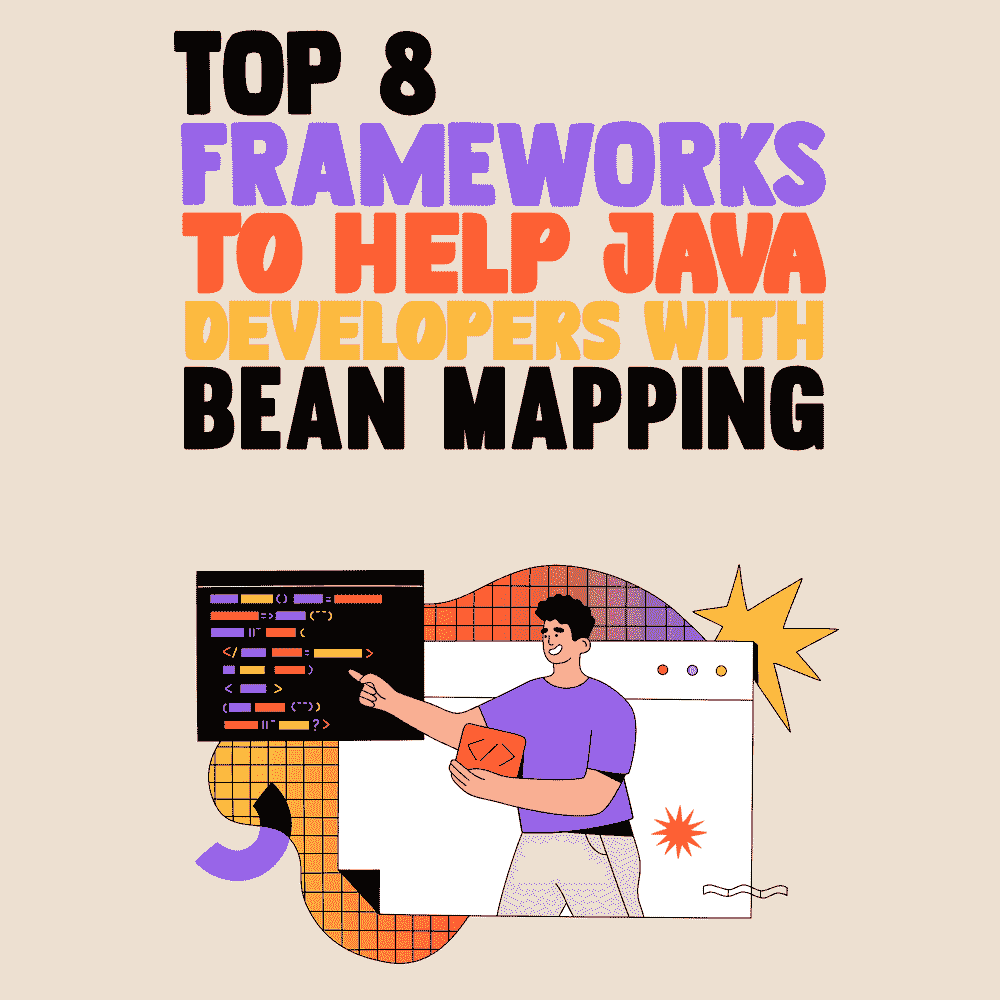

# 帮助 Java 开发人员进行 Bean 映射的 8 大框架

> 原文：<https://simpleprogrammer.com/java-bean-mapping-frameworks/>



As a newbie Java programmer, you might want to know how you can build a large application without using tons of similar code that can exhaust you.

在 [Java](https://simpleprogrammer.com/learn-java-fast/) 上构建包含多个层的大型应用程序需要像域、持久性和数据传输对象(dto)这样的模型。应用程序通常由不同但相似的对象模型组成，其中数据可能相似，但结构和目标不同。在执行大型应用程序时，为业务决策或数据隐藏转换不同类型的数据或对象至关重要。

有了对象映射，在隔离不同的模型时，将一个模型转换成另一个模型变得更加容易。

虽然将一个对象映射到另一个对象是很常见的，但是这通常是迭代的和乏味的，因为两个类具有相似或相同的映射属性。幸运的是，有几个 Java 映射框架可以用来递归地将数据从一个对象复制到另一个对象。

但是在进入映射[框架](https://www.decipherzone.com/blog-detail/web-app-frameworks)之前，让我们从 Java 中的映射基础开始。

## JavaBean 是什么？

JavaBeans 是将不同的对象封装成一个对象或 bean 的 Java 类。Beans 应该是可序列化的(例如，将对象状态转换为字节流)，应该有一个公共的无参数构造函数，并且属性必须是私有的，具有公共的 getter 和 setter 方法。

让我们看一个例子，展示 JavaBean 类是如何构造的。

1.  **包**my pack；
2.  **公共** **类**学生**实现** java.io.Serializable{
3.  **private****int**id；
4.  **私有**字符串名称；
5.  **公共**学生(){}
6.  **public**T2【void】T3】setId(**int**id){**this**。id = id}
7.  **public****int**getId(){**return**id；}
8.  **public****void**set name(字符串名){ **this** 。name =名称；}
9.  **public**String getName(){**return**name；}
10.  }

现在要访问 JavaBean，getter 和 setter 方法的用法如下:

1.  **包**my pack；
2.  **公共** **类**测试{
3.  **公有** **静态** **无效** main(String args[]){
4.  Student s =**new**Student()；//对象已创建
5.  s.setName("安娜")；//设置对象的值
6.  system . out . println(e . getname())；
7.  }}

尽管 JavaBeans 可以向其他应用程序公开以重用软件组件，但是 JavaBeans 是可变的(即在创建后可以更改)，因此它们不能受益于不可变的对象(如 Java 中创建后不能更改的字符串)。当您想要封装(隐藏)数据时，它需要一个 get 方法来返回它的值，并需要 set 方法来设置或更新它的值。然而，为每个属性创建 getter 和 setter 方法可能会导致多个区域中的重复代码，这些代码几乎没有变化，也称为样板。

这就是 bean 映射框架在[项目开发](https://www.decipherzone.com/on-demand-solutions)中发挥作用的地方。

## 什么是 Bean 映射框架？

有时，由于非结构化、宽泛的目标和非线性工作流使应用程序更加复杂，构建企业级项目可能会很困难。此外，要完成外部系统遗留组件的某些功能，需要将具有相似结构的对象(如对域对象的外部服务响应和域对象)转换为外部服务请求，这很难通过人工获得。

让我们看一个真实的场景，这些请求和响应对象可能包括许多列。用手动代码将一个 bean/对象复制到另一个 bean/对象需要大量代码行，如 destination . set ABC(source . get ABC())，这是递归的，容易出错。

如果您想克服编写类似的代码行来将数据从一个 bean 复制到另一个 bean 的复杂性和重复性，bean 映射框架非常有用，因为它提供了简单的配置和更少的代码行来简化您的工作。

## Java 中映射的顶级框架

现在您已经知道了 Java 中的 JavaBean 和 Bean 映射框架是什么，以及为什么首先要使用它们。是时候学习顶级的 Java Bean 映射[框架](https://simpleprogrammer.com/top-10-emerging-front-end-frameworks/)了，你可以在下一个项目中使用它们进行映射。

### dOOv

面向领域对象验证(dOOv)是一个用于领域模型验证和映射的 API。dOOv 使用代码生成、注释和类型安全的特定于域的语言(DSL)来使映射和验证更加容易和快速。节省您的时间和精力。

dOOv 由 dOOv 核心、dOOv 生成器和 dOOV 断言组成，其中核心包含抽象语法树(AST)、DST 和注释，生成器由字段信息和模型映射的代码生成器组成，断言包括 AssertJ 断言。

对于下面关于推荐框架的部分，我将提供框架的概述性解释，然后为您提供代码段，以便您在准备好的时候开始使用。

*   **标注领域模型**

```
public class User {

    @TestPath(field = TestFieldId.FIRST_NAME, readable = "user first name")
    private String firstName;

    @TestPath(field = TestFieldId.LAST_NAME, readable = "user last name")
    private String lastName;

    @TestPath(field = TestFieldId.DATEOFDATE, readable = "user date of birth")
    private LocalDate birthDate;

}
```

*   使用 userFirstName、userLastName 和 userDateIOfBirth 等元素生成 DSL 代码
*   编写和执行验证规则

```
ValidationRule rule = DOOV.when(userDateOfBirth.ageAt(today()).greaterOrEquals(18)).validate();
```

您必须在实例化的模型中编写代码来执行它，其中实例化的模型是真实实例的创建或抽象的特定实现，例如一类对象。

```
// Execute the DSL on the model
DslModel model = new SampleModelWrapper(sampleModel);
Result result = rule.executeOn(model);
if (result.isFalse()) {
  // do stuff on the model that didn't validate
}
```

*   **地图**

要使用 dOOv 将一个对象与其他对象进行映射，您需要编写如下代码:

```
MappingRegistry mappings = mappings(
  map(userFirstName, userLastName)
    .using(biConverter((first, last) -> first + " " + last))
    .to(accountFullName),
  map(userDateOfBirth)
    .using(date -> Years.yearsBetween(date, LocalDate.now()))
    .to(accountAge));
```

然后，可以使用两个实例化的模型来执行映射代码。

```
DslModel model1 = new SampleModelWrapper(sampleModel1);
DslModel model2 = new SampleModelWrapper(sampleModel2);
Context context = mappings.executeOn(model1, model2);
// do stuff with model2 new values
```

*   **测试验证规则**

断言在 doov-assertions jar 中可用。因为 AssertJ 是必需的，所以可以使用 assertThat 语法。

```
ValidationRule rule = DOOV.when(userFirstName.isNotNull().or(userLastName.isNull())).validate();
```

```
assertThat(rule).validates(model).hasFailedNodeEmpty();
```

### **JMapper**

JMapper 是基于 Javassist 的 [Java](https://www.amazon.com/Core-Java-Fundamentals-Oracle-Press/dp/0137673620/) 映射框架，使用字节码操作进行快速映射。JMapper 以零内存消耗提供了动态转换、关系映射和静态代码性能的优势。它接受两类输入，目的地(将被创建或修改的实例)和源(包含数据的实例)。所以在映射之前，您需要在源和目的地之间配置一个类，然后调用方法[获取方法](https://www.w3schools.com/java/java_encapsulation.asp)。

**标注**

```
class Destination {

  @JMap
  String id;
  @JMap("SourceField")
  String destinationField;
  String other;
  // getter and setter
 }

 class Source {
   String id;
   String SourceField;
   String other;
   // getter and setter
 }
```

要调用 GetDestination 方法，您将创建并使用一个 XML 文件，如下所示:

```
<jmapper>
  <class name="it.jmapper.bean.Destination">
    <attribute name="id">
      <value name="id"/>
    </attribute>
    <attribute name="destinationField">
      <value name="SourceField">
    </attribute>
  </class>
</jmapper>
```

为了执行，您将创建如下 API:

```
JMapperAPI jmapperAPI = new JMapperAPI()
    .add(mappedClass(Destination.class)
             .add(attribute("id")
                     .value("id"))
             .add(attribute("destinationField")
                     .value("SourceField")));
```

### **MapStruct**

MapStruct 是用于高性能和类型安全 JavaBeans 类映射器的最常用的 Java 注释处理器之一。它带有内置的转换和合理的默认值，在实现或配置特定行为时不会打扰您。

MapStruct 通过尽可能自动化来简化映射。它在编译时生成 bean 映射，以确保高性能、彻底的错误检查和快速的反馈。

MapStruct 是一个注释处理器，它被插入到 Java 的编译器中，可以在您首选的集成开发环境(IDE)或命令行版本(如 Gradle 和 Maven)中使用。

要使用 MapStruct，您需要定义 mapper 接口，声明所有必需的映射方法。

假设您有两个类，一个代表汽车，另一个伴随数据传输对象(DTO)，如下所示:

*   Car.java

```
public class Car {

    private String make;
    private int numberOfSeats;
    private CarType type;

    //constructor, getters, setters, etc.
}
```

*   CarDTO.java

```
public class CarDto {

    private String make;
    private int seatCount;
    private String type;

    //constructor, getters, setters, etc.
}
```

这两个类几乎完全相同，除了座位计数属性的名称不同，汽车类中的枚举类型属性是 DTO 中的普通字符串。

要为 carDTO 创建映射器，映射器接口将被定义为:

```
@Mapper
public interface TestMapper {

    TestMapper INSTANCE = Mappers.getMapper( TestMapper.class );

    @Mapping(target = "seatCount", source = "numberOfSeats")
    TestDto testToTestDto(Test test);
}
```

使用您为映射器创建的接口，可以以类型安全的方式轻松完成对象映射，如下所示:

```
@Test
public void shouldMapCarToDto() {
    //given
    Car car = new Car( "Morris", 5, CarType.SEDAN );

    //when
    CarDto carDto = CarMapper.INSTANCE.carToCarDto( car );

    //then
    assertThat( carDto ).isNotNull();
    assertThat( carDto.getMake() ).isEqualTo( "Morris" );
    assertThat( carDto.getSeatCount() ).isEqualTo( 5 );
    assertThat( carDto.getType() ).isEqualTo( "SEDAN" );
}
```

### **模型目录**

作为一个智能映射库，ModelMapper 能够自动映射对象。它提供了一个简单的重构安全 API，并使用传统的方法来处理某些用例。

ModelMapper 是一个很棒的 Java Bean Mapper，因为它通过确定一个对象如何通过约定自动映射到另一个对象，使对象映射变得更容易，所以您不必担心手动映射。

您可以按如下方式在 Maven 中设置模型映射器:

```
<dependency>
  <groupId>org.modelmapper</groupId>
  <artifactId>modelmapper</artifactId>
  <version>3.0.0</version>
</dependency>
```

要使用模型映射器将一个对象与其他对象进行映射，您可以按如下方式创建源和目标模型代码:

源代码:

```
// Assume getters and setters on each class
class Order {
  Customer customer;
  Address billingAddress;
}

class Customer {
  Name name;
}

class Name {
  String firstName;
  String lastName;
}

class Address {
  String street;
  String city;
}
```

目的地代码:

```
// Assume getters and setters
class OrderDTO {
  String customerFirstName;
  String customerLastName;
  String billingStreet;
  String billingCity;
}
```

要执行模型映射器隐含的映射，请使用以下内容:

```
ModelMapper modelMapper = new ModelMapper();
OrderDTO orderDTO = modelMapper.map(order, OrderDTO.class);
```

在调用 map 方法时，源模型和目的模型代码将被分析以识别基于[匹配配置](https://docs.oracle.com/html/E68420_01/mime_ref_chapter2.htm)和策略的属性简单性。只有在数据被映射到其他对象之后。

### **重新映射**

ReMap 是一个 Java 映射库，帮助开发人员逐个属性地简化对象转换，同时减少映射器类的单元测试。

通过 JCenter 和 Maven Central 可以很容易地访问 ReMap。下面是你将如何在应用程序中映射源和目的地类型。

```
Mapping.from(Customer.class)
    .to(Person.class)
    .omitInSource(Customer::getAddress)
    .omitInDestination(Person::getBodyHeight)
    .reassign(Customer::getTitle)
        .to(Person::getSalutation)
    .replace(Customer::getGender, Person::getGender)
        .withSkipWhenNull(Gender::valueOf)
    .mapper();
```

### **奥里卡**

Orika 是一个 JavaBean 到 Bean 的映射框架，它迭代地将数据从一个对象复制到另一个对象。在开发多层 web 应用程序时，强烈推荐使用它，因为 Orika 为 Java Bean 映射构建了有效、全面和健壮的解决方案。

Orika 通过使用字节码生成器以最小的开销使 Java Beans 的映射速度大大加快。

要将两个 beans 或对象相互映射，首先声明目标和源类，如下所示:

```
class BasicPerson {
  private String name;
  private int age;
  private Date birthDate;
  // getters/setters omitted
}
class BasicPersonDto { 
  private String fullName;
  private int currentAge;
  private Date birthDate;
  // getters/setters omitted
}
```

接下来，将这两个类映射为:

```
  mapperFactory.classMap(BasicPerson.class, BasicPersonDto.class)
   .field("name", "fullName")
   .field("age", "currentAge")
   .register();
```

如果您创建自定义映射器、转换器和 ObjectFactory 类型，其中映射器可用于将一个对象的属性应用于另一个对象，也可以自定义 Orika 映射。ObjectFactory 可用于在映射的上下文中构造实例，Converter 完全控制映射过程。为您的下一个项目制作一个高效的 Jave Bean Mapper。

```
Selma
```

愚蠢的简单静态链接映射器(又名 Selma)是一个基于注释处理器的 Java bean 到 bean 映射器。它生成 Java 代码来处理字段到字段的映射，还作为运行时库来调用生成的映射器。

要了解 Selma 的实际情况，请遵循以下步骤:

```
@Mapper
public interface SelmaMapper {

    // Immutable mapping
    OutBean asOutBean(InBean source);

    // Update graph
    OutBean updateOutBean(InBean source, OutBean destination);
```

要使用 Selma 进行制图，我们将:

```
  SelmaMapper mapper = Selma.mapper(SelmaMapper.class);

    OutBean res = mapper.asOutBean(in);

    // Or
    OutBean dest = dao.getById(42);

    OutBean res = mapper.updateOutBean(in, dest);
    // res is the value for the bean destination
```

### **推土机**

Dozer 是一个 Java 映射框架，它使用 APL/XML 配置和注释将数据从一个对象复制到另一个对象。它是一个开源、健壮、灵活、可配置、可重用的通用映射框架，支持复杂、简单、隐式、显式、双向和递归的 JavaBeans 映射。如果您想避免在将数据从一个 bean 复制到另一个 bean 时使用不必要的代码，Dozer 是理想的选择。它不仅支持 beans 的映射，而且还自动转换数据类型，以便用 dto 映射类。

使用 [Maven](https://maven.apache.org/) ，您可以简单地通过以下方式在您的项目中添加 Dozer:

```
<dependency>

    <groupId>com.github.dozermapper</groupId>

    <artifactId>dozer-core</artifactId>

    <version>6.5.2</version>

</dependency>
```

创建源类和目标类:

```
<mapping>
  <class-a>yourpackage.SourceClassName</class-a>
  <class-b>yourpackage.DestinationClassName</class-b>
    <field>
      <a>yourSourceFieldName</a>
      <b>yourDestinationFieldName</b>
    </field>
</mapping>
```

And map these classes as:

```
SourceClassName sourceObject = new SourceClassName();
sourceObject.setYourSourceFieldName("Dozer");

Mapper mapper = DozerBeanMapperBuilder.buildDefault();
DestinationClassName destObject = mapper.map(sourceObject, 
DestinationClassName.class);

assertTrue(destObject.getYourDestinationFieldName().equals(sourceObject.getYourSourceFieldName()));
```

## **用框架简化 JavaBeans 映射**

当开发软件或 web 应用程序来满足大型企业的需求时，Java 映射框架是非常重要的。

采用 Java 映射框架将更容易快速地将数据对象从一个 bean 复制到另一个 bean，并且更加准确和省力。

这些 Java 映射的顶级框架，如 MapStruck、reMap、dozer 和 dOOv，将帮助您在未来获得专业优势。

关键要点:

*   有了对象映射，在隔离不同的模型时，将一个模型转换成另一个模型变得更加容易。
*   Bean 映射框架非常有用，因为它提供了简单的配置和更少的代码行来简化您的工作。
*   在进行下一个项目时，可以使用的 Java Bean 映射框架有 dOOv、JMapper、MapStruct、ModelMapper、reMap、Orika、Selma 和 Dozer。
*   要映射两个对象，您需要创建源类和目标类。
*   Java Bean 框架很容易通过命令行构建来访问，比如 Maven 和 Gradle。