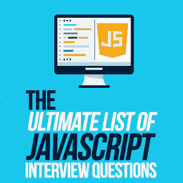

# JavaScript 面试问题的终极列表

> 原文:[https://simple programmer . com/JavaScript-interview-questions/](https://simpleprogrammer.com/javascript-interview-questions/)

I’m going to take a guess that you’re here because you recently got an interview for a JavaScript job. Am I right?

如果是这样，首先，不用担心。我们将详细介绍你应该如何利用时间来给自己带来最大的成功。

## 如何组织你的 JavaScript 面试准备

每个面试过程都是不同的——由于时间限制，人力资源和技术部门的分离，以及对什么是好的开发人员以及需要什么类型的开发人员的普遍困惑，公司以不同的方式招聘。此外，评估技术能力非常困难，结果是面试方法千差万别。

因此，不同公司的招聘流程会有很大差异。但是无论你在哪里面试，你都可以建立一个坚实的知识基础，给你最好的成功机会——我们已经在这篇文章中整理了这个基础。

大多数 JavaScript 职位的面试流程都有几个阶段:

初始阶段通常由简单简短的[问题](https://simpleprogrammer.com/programming-interview-questions/)组成，旨在快速筛选第一批候选人。这个阶段看起来像(通常被认为是)“琐事”，因为它可能是关于核心语言概念的粗糙、简单的问题。虽然业内许多人反对这种类型的面试测试，但这仍然是一种很常见的做法。所以，不管你喜不喜欢，你可能会先面对这个坎，所以你要做好准备。

在初始阶段之后，你可能会被邀请到现场进行一次更全面的技术面试。这通常看起来像是按照“解释这段代码”或“用代码实现它”的思路回答问题这些问题通常是 JavaScript 语言中各种概念的巧妙组合，结合了闭包、作用域、函数式编程等概念。

在本文中，我们将只讨论第一个阶段，分为以下几个部分:

*   核心 JavaScript—JavaScript 语言的核心部分
*   **编程范例/模式**—设计模式、面向对象编程(OOP)与函数式编程等。
*   **作用域和闭包**—JavaScript 如何管理作用域
*   **类型、语法和句法**——语言中更复杂的部分
*   **异步(async)和性能**—如何调优 JavaScript

有了这些类别，你就能为 JavaScript 面试做好充分准备。

## 准备方法

在我们开始写代码之前，我想快速地提一下在你开始准备 JavaScript 面试之前应该采取什么样的心态。如果你在整个过程中不后退一步记住什么是重要的，那么就非常容易陷入各种陷阱，比如记住错误的区域，并且通常会让自己感到沮丧。

让我们来看看:

*   **慢慢来**——我们将在这篇文章中涉及很多内容。不要试图一下子就把这里的信息全部消化掉。这需要时间，所以调整好你自己。

*   **在代码中实验**——尝试代码是*理解一个陌生概念的*最佳方式。

*   **关注你的弱点**—浏览问题列表，在你不熟悉的概念旁边给自己做个笔记，并考虑从那里开始。

*   这不是记忆测试，程序员可以访问互联网，面试官也知道这一点。不要试图简单地记忆细节，就像每个辅助函数一样。

*   关注概念胜于细节—正如你不应该试图去记忆这个列表，你也应该关注概念而不是细节。例如，从概念上学习一个 map 函数做什么；不要为传入的属性的排序而苦恼。

*   **改变你的媒体**—试着在准备时交换媒体以打破单调。实用的编码、与朋友讨论、或者使用闪存卡都是阅读的好选择，但是真正投入进去进行实验才是你最好的选择。

*   在阅读答案之前，大声回答这个问题——你可能很想直接跳到这个问题的答案，但是要忍住这种冲动。相反，对自己大声读出这个问题，并练习对你未来的雇主说出答案。
*   不要忘记其他研究—这是一篇关于 JavaScript 的文章，但是技术部分并不是唯一需要准备的领域。花时间了解你正在面试的企业，练习演讲或面试所需的任何其他[技能/知识](https://simpleprogrammer.com/prepare-developer-job-interview/)。

## 第 1 部分:核心概念

### 类别:核心 JavaScript

在这一部分，我们将了解 JavaScript 语言的一些基础知识。这些问题与语言本身有关，而不是与语法有关。

1)单线程是什么意思，为什么对 JavaScript 很重要？

**提示:**与异步行为有关。

[回答](https://www.sohamkamani.com/blog/2016/03/14/wrapping-your-head-around-async-programming/)

2)说出 JavaScript 中定义变量的三种不同方式，并解释它们的区别。

**提示:**与作用域和可变性有关。

[回答](https://www.sitepoint.com/how-to-declare-variables-javascript/)

3)什么是短路评估，为什么重要？

**提示:**与逻辑运算符(AND、OR、NOT)有关。

[回答](https://codeburst.io/javascript-what-is-short-circuit-evaluation-ff22b2f5608c)

4) What is blocking in JavaScript and why is it important?

**提示:**和业绩有关。

[回答](https://nodejs.org/en/docs/guides/blocking-vs-non-blocking/)

5)node . js 是什么，和浏览器中的 JavaScript 有什么区别？

**提示:**并不是所有的方法和函数都属于 JavaScript 本身。

[回答](http://voidcanvas.com/node-vs-browsers/)

6)什么是*不变性*？

**提示:**跟改变数据的能力有关。

[回答](https://medium.com/@yej.arin.choi/this-is-a-post-that-summarizes-my-dive-into-immutability-in-programming-what-it-is-why-its-34cbba44f889)

### 类别:编程范例

作为一种语言，JavaScript 从包括 Java 和 c 在内的许多其他语言中获得灵感。这意味着该语言有不同范例的元素可用。因此，JavaScript 开发人员了解这些不同的范例是什么、它们为什么重要以及何时使用每种范例是很重要的。

7)什么是“按引用传递”与“按值传递”？

**提示:**是关于对象创建的。

[回答](http://www.mathwarehouse.com/programming/passing-by-value-vs-by-reference-visual-explanation.php)

JavaScript 中最重要的两个主要编程范例是什么？

**提示:**一个是关于思想的传承，一个是关于构图。

[回答](https://medium.com/javascript-scene/10-interview-questions-every-javascript-developer-should-know-6fa6bdf5ad95#c851)

9)什么是函数式编程？

**提示:**线索在名字里。

[回答](https://medium.com/javascript-scene/10-interview-questions-every-javascript-developer-should-know-6fa6bdf5ad95#619e)

10)OOP 背后的主要思想是什么？

**提示:**想想代码是如何共享的。

[回答](https://searchmicroservices.techtarget.com/definition/object-oriented-programming-OOP)

11)函数式编程与面向对象编程相比有什么优缺点？

提示:考虑共享状态、副作用和简单性。

[回答](https://medium.com/javascript-scene/10-interview-questions-every-javascript-developer-should-know-6fa6bdf5ad95#e76e)

12)类和原型继承的区别是什么？

**提示:**想想对象是如何被复制的。

[回答](https://medium.com/javascript-scene/10-interview-questions-every-javascript-developer-should-know-6fa6bdf5ad95#e577)

13)JavaScript 中的*这个*关键字指的是什么？

**提示:**想想函数是怎么调用的。

[回答](http://javascriptissexy.com/understand-javascripts-this-with-clarity-and-master-it/)

14)什么是“递归”函数？

提示:它允许我们迭代一个函数，即使我们不知道我们需要多少个循环。

[回答](https://www.sitepoint.com/recursion-functional-javascript/)

### 类别:范围和闭包

与 JavaScript 中的作用域紧密相关的是闭包的概念。虽然名字有点迟钝，但是一旦你理解了这个概念，你就能写出优雅的 JavaScript 了。然而，它也不是没有缺点。您将希望了解 JavaScript 闭包的利与弊。

15)什么是*关闭*？

**提示:**闭包是 JavaScript 中与作用域密切相关的概念。

[回答](https://medium.com/javascript-scene/master-the-javascript-interview-what-is-a-closure-b2f0d2152b36)

16)JavaScript 中的*提升*是什么意思？

提示:宣布什么并不重要，重要的是*何时宣布。*

[回答](https://scotch.io/tutorials/understanding-hoisting-in-javascript)

17)什么是*词法范围*？

**提示:**这与如何访问值以及 JavaScript 的编译性质有关。

[回答](https://medium.com/@nickbalestra/javascripts-lexical-scope-hoisting-and-closures-without-mystery-c2324681d4be)

18)什么是立即调用的函数表达式(通常称为 IIFE ),为什么它很重要？

提示:考虑作用域以及 JavaScript 如何作用域。

[回答](https://github.com/ganqqwerty/123-Essential-JavaScript-Interview-Question#question-6-how-to-empty-an-array-in-javascript)

19)什么是*阿谀奉承*？

提示:它与函数以及如何使用它们来封装作用域有关。

[回答](https://www.sitepoint.com/currying-in-functional-javascript/)

### 类别:类型、语法和句法

在这一节中，我们将讨论这种语言的更细粒度的细节。语法很重要，因为它将定义不同代码的功能。例如，很容易忽略模板文字和常规字符串之间的区别；这是语法上的细微差别，但在功能上有很大的不同。

20)JavaScript 中的“use strict”声明有什么好处？

**提示:**与向后兼容有关。

[回答](https://johnresig.com/blog/ecmascript-5-strict-mode-json-and-more/)

21)ECMAScript 2015 及以后版本中，*对象析构*是什么？

提示:这与我们如何从对象中为作用域赋值有关。

[回答](https://wesbos.com/destructuring-objects/)

22)什么是插值表达式(模板字符串)？

**提示:**它与将字符串和变量混合在一起有关。

[回答](https://developers.google.com/web/updates/2015/01/ES6-Template-Strings)

### 类别:异步编程和性能

JavaScript 是一种单线程语言，这意味着它一次只能处理一个片段。这意味着为了让 JavaScript 快速运行，它需要确保没有任何东西“阻止”它处理其他代码。JavaScript 有许多不同的方法来处理异步代码。

23)什么是异步编程，为什么它在 JavaScript 中很重要？

**提示:**跟单线程环境有关。

[回答](https://medium.com/javascript-scene/10-interview-questions-every-javascript-developer-should-know-6fa6bdf5ad95#af67)

24)JavaScript 中的*事件循环*是什么，为什么它很重要？

**提示:**这与代码的加载方式和 JavaScript 的单线程特性有关。

[回答](https://blog.risingstack.com/node-js-at-scale-understanding-node-js-event-loop/)

25)什么是*承诺*？

**提示:**想想 JavaScript 的单线程本质。

[回答](https://medium.com/javascript-scene/master-the-javascript-interview-what-is-a-promise-27fc71e77261)

26)什么是内存泄漏？

**提示:**当语言无法释放内存时，导致此问题。

[回答](https://auth0.com/blog/four-types-of-leaks-in-your-javascript-code-and-how-to-get-rid-of-them/)

27)您如何导致 JavaScript 内存泄漏？

提示:有几个答案…考虑像范围、文档对象模型(DOM)和闭包这样的概念。

[回答](https://auth0.com/blog/four-types-of-leaks-in-your-javascript-code-and-how-to-get-rid-of-them/)

28)什么是 *async/await* 关键字，它们的优缺点是什么？

提示:这与你如何编写异步代码有关。

[回答](https://tutorialzine.com/2017/07/javascript-async-await-explained)

### 类别:功能

毫无疑问，函数是 JavaScript 语言最重要的部分，也是 JavaScript 多功能性的核心。函数封装了行为，当与将函数传递给函数、从函数返回它们的能力结合时，等等。，这会产生一些非常简洁易读的代码。

29)什么是*纯*函数？

**提示:**和副作用有关。

[回答](https://medium.com/javascript-scene/master-the-javascript-interview-what-is-a-pure-function-d1c076bec976)

30)什么是函数“原型”？

**提示:**与函数如何共享行为有关。

[回答](https://hackernoon.com/prototypes-in-javascript-5bba2990e04b)

31)与“for 循环”相比，使用函数迭代方法有什么优点/缺点？

**提示:**这与作用域有关。

[回答](https://ryanpcmcquen.org/javascript/2015/10/25/map-vs-foreach-vs-for.html)

32)如何设置函数的默认参数值？

提示:有三种方法可以做到这一点:一种使用 ES5 语法，一种使用 ES6。

[回答](https://github.com/ganqqwerty/123-Essential-JavaScript-Interview-Question#question-47--how-to-set-a-default-parameter-value-)

33) What is the difference between a function and a method?

**提示:**函数是声明。

[回答](https://github.com/ganqqwerty/123-Essential-JavaScript-Interview-Question#question-6-how-to-empty-an-array-in-javascript)

34)定义函数有哪些不同的方法？

提示:考虑类和变量赋值。

[回答](https://dmitripavlutin.com/6-ways-to-declare-javascript-functions/)

35)什么是“胖箭头”功能？

**提示:**想想函数定义。

[回答](https://www.sitepoint.com/es6-arrow-functions-new-fat-concise-syntax-javascript/)

36)您何时会使用粗箭头功能？

提示:想想在哪里使用粗箭头是不好的。

[回答](https://medium.com/@makaryan.gevorg/es6-arrow-functions-two-benefits-b8e1445561c0)

37)解释 JavaScript 中数组的函数方法。

**提示:**通常，它们被用来使数组更短(以不同的方式)。

[回答](https://medium.com/jsguru/javascript-functional-programming-map-filter-and-reduce-846ff9ba492d)

38)有什么区别。打电话。绑定，还有。申请？

**提示:**都和*这个*关键词有关；区别在于如何使用它们。

[回答](http://javascriptissexy.com/javascript-apply-call-and-bind-methods-are-essential-for-javascript-professionals/)

39)什么是去抖/节流功能？

**提示:**去抖是出于性能原因而使用的。

[回答](https://css-tricks.com/debouncing-throttling-explained-examples/)

## 总结

唷！那是一大堆琐事！确保你的知识已经被吸收的最好方法之一是和你的伙伴或朋友一起准备，或者一边准备一边写下问题的答案。

记住:面试不仅仅是关于你的技术能力，还有其他技能，比如你的态度、沟通和文化适应。因此，你可能不需要成为一个已经发表的 JavaScript 作者，但是要有基础知识和求知欲。

祝你好运！