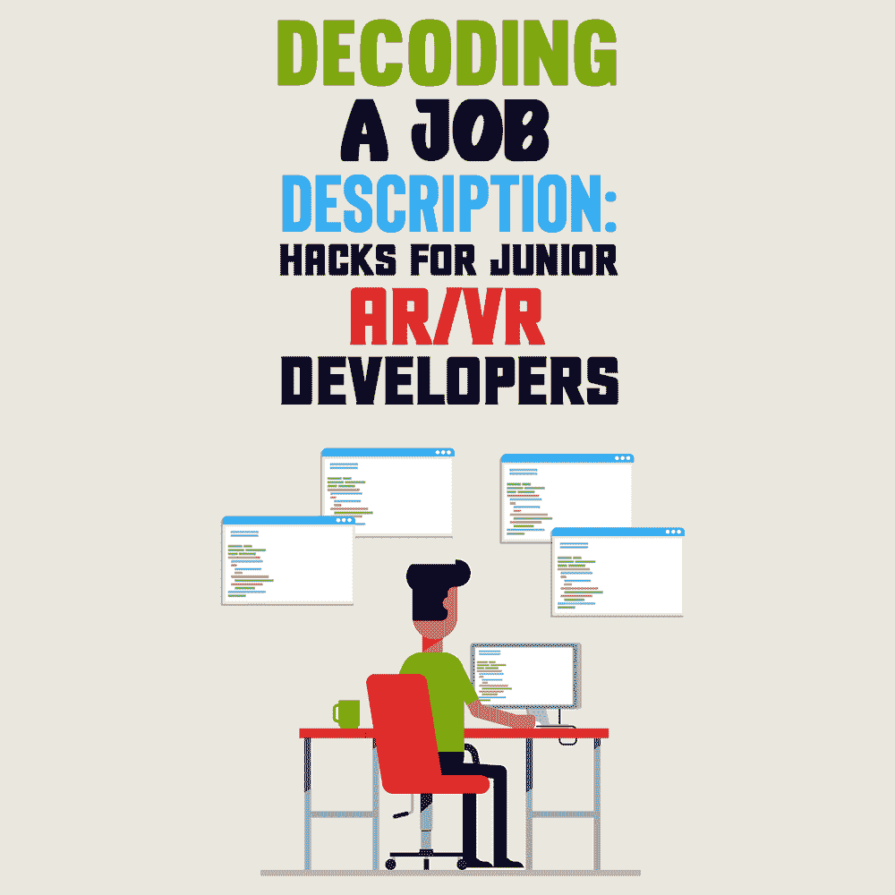

# 解码工作描述:初级 AR/VR 开发人员的技巧

> 原文:[https://simple programmer . com/job-description-junior-ar-VR-developers/](https://simpleprogrammer.com/job-description-junior-ar-vr-developers/)

The immersive gaming industry is growing at a rapid pace. [According to Statista](https://www.statista.com/statistics/499714/global-virtual-reality-gaming-sales-revenue/), virtual reality gaming is projected to reach a revenue of $1.6 billion globally by the end of 2022\. That makes for an excellent opportunity for programmers looking to build their careers in the field.

然而，成为一名有效的增强现实(AR)或虚拟现实(VR)游戏开发者——或任何类型的游戏开发者——的真相是，目前大多数寻求招聘程序员的工作室都希望有多年经验的专业人士。对于希望获得第一份工作的初级程序员来说，进入 AR/VR 游戏行业不是在公园里散步。

此外，身临其境的游戏工作描述通常使用简短或不清楚的语言和行业专用术语。大多数时候，对于那些没有两到五年工作经验的人来说，他们听起来很沮丧。

在这种情况下，想要进入 AR/VR 游戏行业可能会令人生畏。然而，这并不意味着这是不可能的——即使你是一个初级开发人员。

本指南涵盖了数字娱乐行业中解码工作描述的过程。它指出了初级程序员应该在招聘信息中寻找什么，教你如何解码常用短语，并提供了一些提示，告诉你可以做些什么来确保你获得游戏开发员的梦想工作。

## 加入 AR/VR 游戏行业需要哪些技能？

成功地找到一份 AR/VR 开发人员的工作——是的，即使是大三学生——取决于你是否拥有相关的技能。

所以，毫不奇怪，在数字娱乐行业就业的第一步应该从一段时间的深入研究开始。具体来说，在研究过程中，你将确定你希望加入的行业的雇主招聘所需的硬技能和软技能。

当然，最理想的方法是开始浏览招聘信息。事实上，无论你是选择 LinkedIn，还是其他任何平台，你能做的最好的事情就是写下雇主要求的资格，最好将它们分成三类。

### 必备硬技能

你会发现 AR/VR 开发的职业很大程度上取决于你的技术诀窍。要找到一份初级开发人员的工作，你必须掌握一些基本的编程技能，尽管这些要求会根据你想加入的组织的需求和规模而有所不同。

通常，游戏开发组织使用 C 编程语言，特别是 C#或 C++。对于刚刚开始学习编码的人来说，好消息是有大量的资源可以用来学习 C 编程。例如，Jon Skeet 的 [*C# in Depth* 代表了业界最好的资源之一，而 Simple 程序员博客上的](https://www.amazon.com/dp/161729134X/makithecompsi-20)[这篇学习 C++](https://simpleprogrammer.com/how-to-learn-c-programming/) 的介绍也为有抱负的开发人员提供了有用的信息。

但是，除了扎实掌握 C 编程语言(即使你只申请初级职位，你也需要精通)，你还需要对最常用的游戏引擎有很强的理解和一些实践经验。

如今，大多数游戏开发团队——大约 70%——在 Unity 中工作。这非常方便，因为平台背后的公司专门为游戏开发者提供[认证培训](https://unity.com/products/unity-certifications/associate-game-developer)。然而，请注意，一些大工作室，如[史诗游戏](https://www.epicgames.com/site/en-US/careers)，使用虚幻引擎构建他们的产品，而其他公司，如育碧，可能会使用他们的内部版本 [CryEngine](https://www.cryengine.com/certification/view/programmer) 。

展示你硬技能的最好方式是润色你的作品集。无论你以前是否参与过个人项目或学校项目，确保你用它们来突出你的知识，并展示你以前的经验如何能让你想加入的工作室受益。

但是，请注意，你应该限制你在申请工作时展示的项目数量。例如，一个杂乱的 GitHub 简介不仅会分散你作为开发人员的主要素质，还会传递出你缺乏专注的信息。这绝对不是你想在理想工作的面试中留下的印象。

### 很好的功能

In addition to the hard skills required by game design studios, some employers may seek candidates who possess additional qualifications.

例如，开发游戏不仅仅是写代码，还要完善代码。因此，希望进入该行业的有抱负的程序员应该准备好从事概要分析、调试和用户界面(UI)优化工作。

那些申请入门级职位的人可能也想获得一些报告软件的经验，因为通过[质量保证](https://simpleprogrammer.com/going-from-qa-to-software-developer/) (QA)途径进入游戏开发行业是一条很好的职业道路。

最后，不要忘记今天的消费者使用多种平台玩游戏。事实上，虽然 PC 或游戏机看起来像是玩游戏的合理解决方案，但统计数据显示，[手机在 2021 年击败了这两个](https://www.statista.com/statistics/1132960/popular-devices-video-games/)成为消费者的首选。所以，如果你过去开发过应用程序，这种经历可能会让你从其他候选人中脱颖而出，帮助你获得你想要的职位。

### 首选软技能

当你开始你的求职之旅时，不要忘记开发游戏不仅仅是硬技能。毕竟，任何人都可以学习这些，只要他们努力。创造下一个大头衔同样需要有合适的软技能。

下一级的游戏设计师不仅仅是那些知道如何编写清晰的代码行并对常见问题提出有效解决方案的专业人士。有抱负的游戏开发者还应该了解创建一个伟大的娱乐产品的更好的细节——从讲故事到视觉效果，甚至到[找到每个主角](https://www.voices.com/help/ultimate-guide-to-hiring-voice-actors/describing-the-sound-youre-looking-for)的声音和声音，所有这些都是为了使游戏体验尽可能地身临其境和逼真。

此外，请注意，创建游戏从来不是一个人的努力。它需要一个运转良好的团队努力工作，这意味着你需要很好的沟通技巧和批判性思维。此外，一个灵活的创新过程对于在这个领域取得成功至关重要。(关于这一点， *[做敏捷正确的事:没有混乱的转变](https://www.amazon.com/dp/163369870X/makithecompsi-20)* 是学习如何让敏捷为你工作的一个很好的资源。)

最后，如果你的目标是从初级职位晋升到中级或高级职位，要明白你的职业道路将要求你适应领导角色。

除了你的技术知识，确保你努力完善你的项目管理和领导技能。此外，如果你之前有任何你认为自己在(近期或远期)未来会扮演的角色的经验，确保你在面试中突出了这一点。

## 我需要计算机科学或工程学位吗？

许多希望进入该行业的初级 AR/VR 开发人员都问的一个常见问题是，他们是否需要计算机科学或工程学位。

事实是，大多数职位描述都要求其中之一。尽管如此，仔细观察就会发现，游戏开发工作室准备与没有受过正规教育的程序员合作。

尽管如此，那些申请没有学位的工作的人必须在相关领域有大约三年的工作经验。或者，他们必须证明自己拥有该职位所需的技术知识。

记住，AR/VR 领域还比较年轻。这意味着公司将准备接受那些不一定符合他们所有要求的有天赋的开发人员。

无论如何，确保你在申请游戏开发工作时脱颖而出的最好方法是寻找任何你能得到的机会来提高你的技能和拓宽你的视野。这是否意味着加入学校俱乐部、参加黑客马拉松、从事激情项目或活跃于相关的不和谐社区，完全取决于你。

## 了解 AR/VR 游戏行业的职位描述

当你寻找机会进入 AR/VR 游戏开发领域时，你可能会发现自己被工作描述中使用的简短和重复的措辞所迷惑。在求职过程中，理解这些描述背后的含义至关重要。

首先，清楚地了解这些短语的意思将有助于你优化你的求职申请，从而使你在众多求职者中脱颖而出。其次(也许更重要的是)，它将帮助你决定正在讨论的组织是否适合你，以及公司文化是否会给你作为程序员所寻求的机会。

因此，让我们来看看初级 AR/VR 开发人员职位描述广告中最常用的一些单词和短语，并找出它们的真正含义:

***“必须能够在动态环境中进行多任务处理/优先处理/工作”***

从本质上来说，这意味着你正在考虑的角色会伴随着繁重的工作量。如果你准备好迎接这种挑战，这样的职位将会是你的理想选择。然而，如果你需要时间和空间来完善你的技能和工作流程，也许你应该寻找那些在描述中提到关键词的工作，比如*稳定*或*支持环境*。

***【压力下的工作能力】***

这个职位会有很大的压力。这对那些热衷于刺激、截止日期和挑战性约束的人来说很好。然而，如果有太多你无法控制的事情让你感到压力，这句话就是你应该避免的确切职位类型的一个致命提示。

***【有发展壮大的意愿】***

This phrase is often an indicator that the company you're looking to join has a strong learning culture. It's an excellent opportunity for junior developers who are looking for their first job. However, keep in mind that the phrase can also mean doing lots of highly-technical work while being compensated with minimal pay. Before you accept a job that mentions this phrase in the description, make sure you have a solid idea of what will be expected of you and that you're willing to sacrifice pay for the possibility of long-term growth.

***【独立/上进心】***

虽然这句话似乎意味着你将拥有自主权，但这通常是公司领导层没有足够时间来培训新员工的信号。所以，如果你真的很独立，不介意用自己的时间学习，喜欢提出新的解决方案，这将是一份非常适合你的工作。然而，如果你更喜欢一点指导，也许你应该努力申请一个有强烈导师文化的组织。

## 作为初级 AR/VR 开发人员开始找工作

无论你已经开始申请游戏行业的 AR/VR 开发人员工作，还是只是在做研究，请记住，确保你个人工作满意度的最佳方式是加入一个价值观与你相匹配的组织。

换句话说，确保你有你的优先事项。

如果你想要一个成长的机会，做你引以为豪的工作，你可以考虑加入一个创业工作室，那里的节奏很快，你遇到的挑战会将你推向极限。然而，如果稳定、工作生活平衡和健康的公司文化是你想要的，那么你可能会更好地加入一个团队，在那里你会得到培训和指导，尽管速度会慢一些。

不管怎样，当你去面试的时候，不要害怕问问题。毕竟被评价的不只是你。如果你的职业能给你带来满足感，你的雇主就必须拿出他们对你的期望。