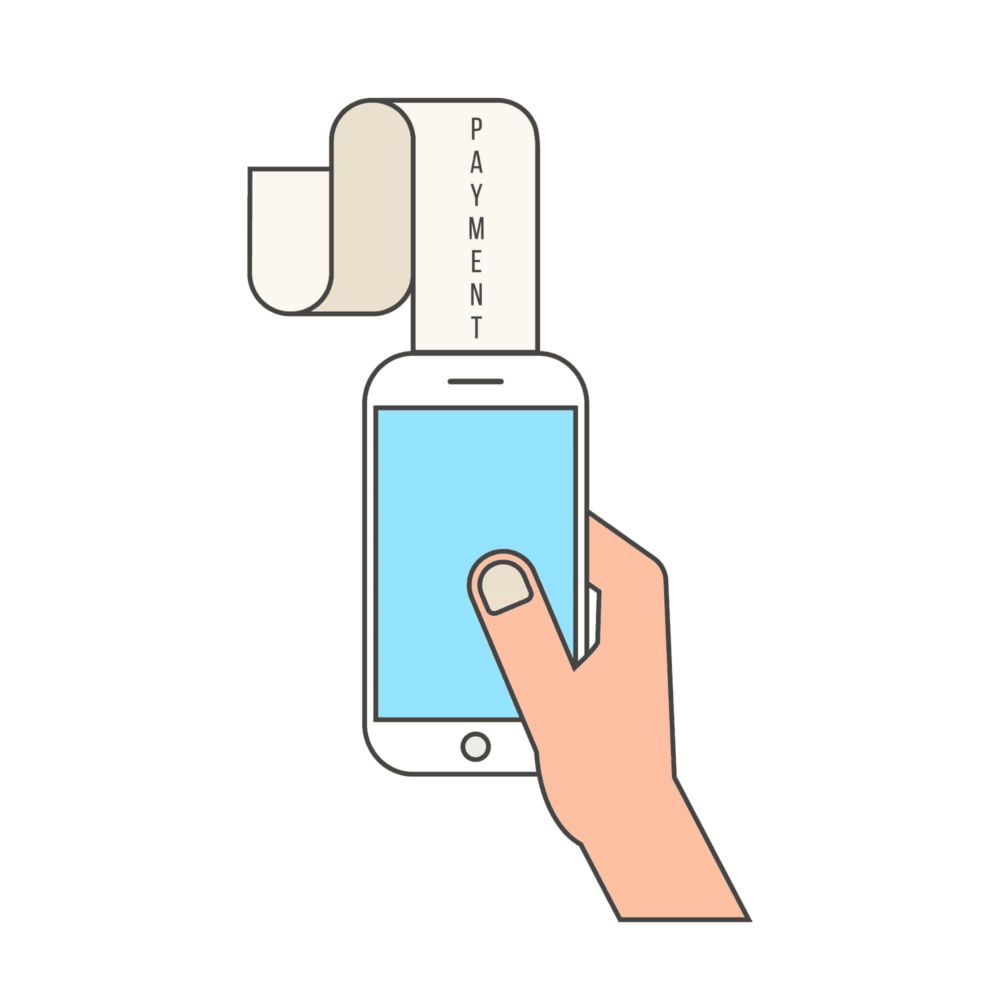

# 软件开发人员的工作保障

> 原文：<https://simpleprogrammer.com/job-security-software-developers/>

跟我重复:

工作保障是不存在的。

工作保障是不存在的。

即使在日本，很长一段时间以来，人们普遍认为，一旦你开始为一家公司工作，你就会为这家公司工作一辈子，但这种方式即将结束。

是的，我知道你的父母告诉你，如果你去上学，取得好成绩，成为一名大学毕业生，在一家好公司找到一份好工作，一切都会好的。

嗯，这不好！

一切都不会好的。

这个世界过去可能是这样运作的，但现在肯定不是了。

你可以“把每件事都做对”，甚至根本找不到工作。

没有论资排辈这回事。

没有权利这回事。

没有“支付你的费用”这样的事情，至少不会因为你做了某件事而让某个雇主欠你什么。

所以，现在就把工作安全和稳定的想法从你的脑海中抹去吧。

不舒服也要舒服。

坦然面对未知，用你的期望换取适应，矛盾的是，你所寻求的工作安全感和稳定性会来到你身边。

只是方式和你想象的不一样。

## 很不稳定，没事

你可能会认为我上面说的一切都让你有点震惊，现在我实际上要告诉你的是*会好起来的*和*会好起来的*。

我没有。

不是的。

这没关系。

这个世界再也不会像以前那样了。

不管任何政治候选人说什么，“工作”都不会回来了。

他们已经一去不复返了，我们的工作方式已经改变，并将继续改变。

你不能指望在一家公司找到一份工作，并在那里呆上二三十年，直到你退休或拿到养老金。

干扰太多了。

变化的速度太快了。

看看黑莓吧。

黑莓是移动市场的王者。

没有人看到他们去任何地方，然后嘣，一夜之间他们就在下水道里打转。

所以，即使你在黑莓有一份很好的软件开发工作，并且已经在那里工作了很多年，你也会突然发现自己处在一个不再那么稳定的地方。

事实是，你从来都不是。

无论你现在在哪里，或者无论你希望在哪里，你在那里也不稳定。

这只是当前工作环境的性质，它是双向的。

如今，雇主也不能指望他们的员工永远在那里。

在相当短的时间内为多家公司工作，这曾经是你简历上的一个污点。现在是常态了。

你越早意识到这一点，你就会过得越好，因为它会极大地影响你的选择。

想想吧。

如果你正在找工作，并希望在未来 20 年里为任何一家雇佣你的公司工作，你很可能会做出与你假设最多只会在那里工作几年不同的决定。

太多的软件开发人员表现得好像还是 20 世纪 70 年代一样。不是的。

太多的软件开发人员选择在“稳定”的公司工作，而不是接受更好的，“风险更大”的机会，因为他们认为一家公司的庞然大物不可能像一家初创公司那样迅速衰落。不对。

接受当前的商业世界，尤其是涉及技术的领域，本质上是不稳定的。

你有没有一个“哦，狗屎”计划，一个剧本，如果你的老板明天走进来递给你一张解雇通知书，你可以立即开始执行？你可以在这里下载一个“在紧急情况下，打破玻璃”的紧急求职工具包[。确切地知道在这种情况下你会怎么做将会消除恐惧，给你信心，你可以处理任何事情。](https://simpleprogrammer.com/career-guide-toolkit)

停止寻找稳定；相反，努力让自己变得更加强壮和适应能力更强，这样你就可以一直被雇佣。

## 工作保障不是来自于囤积知识

我们一会儿会回到稳定的话题，但在此之前，我想花点时间来解决工作保障问题，因为如果你问我的话，人们试图实现工作保障所做的一些事情是非常糟糕的，而且非常糟糕。

许多软件开发人员为了更安全而做的最糟糕的事情之一就是囤积知识。

他们没有公开分享他们正在学习的东西，也没有教其他人如何做他们的工作，这样即使他们被公共汽车撞了，生活也能继续。

他们**故意把事情复杂化**,并试图确保他们是唯一知道构建系统如何工作或者如何处理架构中这个棘手部分的人。

他们试图创造一种环境，如果他们真的被公共汽车撞了，世界基本上就要毁灭了。

好吧，好吧，我有消息告诉你。

不管你认为自己有多重要，也不管你知道什么“秘密”，世界都在继续。

你的内脏从巴士的烤架上被清理掉，其他人被雇来做你的工作，其他人把这些碎片拼凑起来，最终弄清楚你是如何做你所做的事情的。

当他们这么做的时候，他们意识到你所做的毕竟不是那么重要——他们早就可以摆脱你了(他们可能早就应该摆脱你了，混蛋)。

不要这样。

这不是创造工作保障的方法。

这只会惹恼别人，降低你的价值，不仅对你现在的公司，对其他任何公司都是如此。

你本可以把所有的时间和精力都花在学习新东西上，把你学到的东西教给别人，提高自己的技能，但是你却浪费了这些时间和精力，试图抓住一些你无论如何也抓不住的东西。

也许你可以在这项技术上取得些许成功，暂时将一家公司扣为人质，但最终，他们会扯下胶带，踢开松动的地板，然后沿街跑去。

你不能阻止进步。

## 相反，做相反的事情

具有讽刺意味的是，你可以通过故意让自己变得不必要来获得最高水平的工作保障。

我知道这似乎适得其反，我也知道许多好心的长者可能会给你建议，不要泄露你所有的秘密，否则你将不再被需要。

但是，事实证明，任何公司所能拥有的最有价值的员工都是那些通过尽可能多地实现自动化并培训其他员工能够做他们能做的事情而使自己的工作变得多余的人。

是的，如果你让你的工作变得不必要，你不会保住那份工作，但你也不会被解雇。

你会升职的。

这才是真正的工作保障所在——价值如此之高，以至于你接触到的任何东西都能变成金子，所以你只能继续负责越来越多可以接触的东西。

你知道，作为一个为公司工作的孤独的软件开发人员，你只能做这么多。

你可以成为一名非常优秀的程序员，但是你会在一天内完成的事情上有一些真正的限制。

但是，如果你能帮助你的软件开发同事完成更多的工作，或者你能自动化你的部分工作，这样你就不必再手工操作了，你正在利用杠杆的力量变得比任何一个单独工作的员工更有效率。

你分享你所知道的越多，你就变得越有价值，这是现今存在的唯一真正的工作保障形式。

## 用能力代替稳定

最终，实现工作稳定和安全的最佳方式不是在稳定的公司获得完美的工作，并以只有你知道的如何工作的关键秘密来要挟公司，而是通过**积累知识并自由分享知识来变得更有价值**。

与其试图玩政治游戏来保住自己的位置，赌对稳定的马，不如把自己建立起来，这样你就不需要工作保障或稳定了。

为什么不考虑把自己的能力提高到随时都能轻松找到新工作的程度，而不是把希望寄托在一家公司或某家公司的一份工作上呢？

变得如此有价值，以至于公司会吵着要雇用你，突然之间，工作的安全性和稳定性似乎成了一个愚蠢的想法。

这是更好的策略，因为这个策略依赖于你能控制的东西——你——而不是你不能控制的外部因素。

就像我之前说的，时代变了。

今天，只有一种工作安全和稳定的幻想。

因此，通过提高自己的能力[变得自力更生](https://simpleprogrammer.com/cg56-mindset)比在任何工作中依赖任何一种安全或稳定要有利可图和明智得多。

## 创建自己的安全网

再也不用担心工作的安全性或稳定性的最好方法之一，就是为自己建立一个安全网，存下三到六个月的生活费以备不时之需。

我一直很惊讶有多少软件开发人员和普通人靠薪水过活。

这没有任何意义，也没有任何借口。

**如果你靠薪水过活，[你将自己置于一种我称之为“挤压”的境地](https://simpleprogrammer.com/cg56-squeeze)，**如果你生活中有一件事出了差错，经济上就会引发一连串的问题，直到你的整个生活在你眼前自毁。

如果你依靠下一份薪水来支付房租和其他账单，你当然会过度担心工作的安全性和稳定性，因为失去工作会对你的生活产生巨大的影响。

但是，如果你有几个月的生活费，你不一定想丢掉工作，但如果你想，这不是一件大事，因为你有足够的时间找到另一份更好的工作。

现在我这么说，大部分人都同意。

他们点点头，说“是的，有道理。”

但是他们告诉我，他们希望能存下几个月的生活费，但是现在他们不能。

他们告诉我一些悲伤的故事，关于他们的账单，或者他们是如何勉强赚到足够的钱来维持生活，一旦他们获得加薪或者还清了汽车贷款，他们就会开始存钱并建立他们的安全网。

扯淡！

我不在乎你挣得多还是少，没有理由为什么你不能从今天开始把至少 10%的收入存入一个储备账户——从今天开始！

如果你认为你负担不起，那你就入不敷出了。

也许你需要买一栋小一点的房子或者一辆旧一点的车。

也许你应该停止一周出去吃五次饭，并且停止去看电影。

也许你不需要在手机上安装昂贵的数据套餐。见鬼，也许你可以暂时完全不用手机。

切断有线电视，打包你的午餐，缩减你的汽车，你的房子，**尽一切努力达到你至少可以节省你收入的 10%的水平**这样你就可以开始建立储备了。

如果你现在开始，你可以在几年内攒够三个月的生活费。

那你就再也不用担心工作保障了。

感觉不会很棒吗？

这难道不值得小小的牺牲吗？

在过去的 10 年里，我总是存下至少一年的储备。

当你的银行账户里有一年的生活费时，你知道你拥有的权力吗？

你可以直接告诉你的老板滚蛋，不要在意，因为你已经有足够的时间花一整年去找另一份工作。(不是说这个不推荐。)

感觉棒极了。

另外，你再也不用平衡支票簿了。

我不记得上次平衡支票簿是什么时候了。

也不是因为我富有，有很多钱。这是因为**我确保自己的生活总是远远低于我的收入**，这样我就永远不会陷入困境。

即使当我挣得比现在少得多的时候，我仍然存了很多钱，也不担心失业或收支平衡。

关于这个主题的最好的书之一，我强烈推荐，叫做[巴比伦最富有的人。](https://simpleprogrammer.com/cg56-babylon)

我强烈推荐你阅读这本书，并承诺按照它的原则生活。

嘿，约翰|我喜欢你说的话，但我无法让我的配偶同意。他们的开支失控了。救命啊！T3】

这是一个棘手的问题。

不幸的是，真的没有简单的或者放之四海而皆准的解决方案，但是这里有一些通用的建议。

首先，要认识到你无法控制其他人和他们的所作所为——甚至是你的配偶——但是，你可以控制自己的所作所为。

因此，即使你的配偶可能会破坏你控制开支的努力，你仍然可以保持原则上的克制和节俭，这至少会产生一些影响，也会成为一个榜样。

通常以身作则是让某人做某事的最佳方式。

如果你在金钱决策上开始变得更明智，开始变得更节俭，你的配偶很有可能最终会养成一些相同的习惯——虽然不能保证，但值得一试。

其次，确保你已经和你的配偶清楚地交流了你想要做出什么样的财务改变以及为什么。

试着以一种非判断的方式去做，但是要非常清楚你想要什么，并且谈论你打算做什么，而不是你要求你的配偶做什么。

*问这样一个问题:“我们如何一起实现这个目标？”为了创造认同和共同努力的感觉。*

最后，认识到你最终要对自己的生活负责。

如果你有一个配偶完全不愿意配合你的财务计划，你可能要重新评估你是否想在你的余生中过着靠薪水过活的生活。

如果你的配偶坚持要买古驰手袋或最新的科技产品，我并不是建议你离婚，但是你可能要仔细考虑一下在你的生活中你允许什么和不允许什么，以及这对你有多重要。

你可能需要设定明确的界限，说你不会让你的财务前景受到损害，并清楚地表明你觉得你配偶的行为是在以什么方式这样做，然后采取适当的行动。

请记住，在生活中，对于任何给定的情况，你总是有三种选择

*   *接受它*
*   *改一下*
*   *将你自己从其中移除*

如果你不能接受或改变它，你可能不得不从中抽身。

## 拥抱不确定性

在这一章的结尾，我将为工作的安全性和稳定性敲上最后一颗钉子:拥抱，而不是回避不确定性。

去年，我参加了托尼·罗宾斯最著名的研讨会之一，名为【与命运的约会】。

这是一个为期六天的项目，在这个项目中，你基本上是根据你想要的生活价值观来解构然后重建你自己和你的生活。

这是一个改变人生的事件——我强烈推荐它。

无论如何，在这个研讨会上，他说了一些非常有力的话，从根本上改变了我看待生活的方式，改变了我对稳定和确定性的整个看法。

“你的生活质量与你能舒服地生活的不确定性成正比。”T3】

你知道，在那之前，我一直在追求确定性、安全性和稳定性。

我试图在我的生活、财务和未来周围建造一座坚不可摧的堡垒。

我试着让它不会发生在我身上。

我想钉牢每一块地板，让我的船永不沉没。

我花了一生的大量时间试图实现这个目标。

但是，我意识到这样做实际上降低了我生活的整体质量。

我不仅降低了我的整体生活质量，还试图实现一个不可能的目标。

不管你有多少钱，或者你的工作有多好，或者你有多努力去保护和坚持你所拥有的，总会有一些风险。

无论你拥有什么，都有可能被夺走。

当你竭尽全力阻止这种情况发生时，你就把生活中的快乐吸走了。

相反，我发现通过真正拥抱不确定性，矛盾的是，就像托尼说的，我的生活质量显著提高了。

当我在自己的生活中做了这个转变后，突然之间我没有那么紧张了。

我仍然努力工作，我仍然试图做出明智的决定，但我做了我能做的，然后我把剩下的交给命运。

我不能控制命运，我甚至懒得去尝试。

当你不去试图控制那些你无法控制的事情，并且愿意接受任何摆在你面前的事情时，生活会变得更加愉快，也更加令人兴奋。

我给你的最后一条建议是拥抱不确定性。(关于这个主题的一本好书是马克·曼森的 [*《不在乎的微妙艺术》*。](https://simpleprogrammer.com/cg56-subtle)

是的，增加你的能力是一个好主意，这样你可以更容易地找到一份新工作。

是的，这是一个很好的主意，通过分享你所能分享的所有知识，而不是囤积知识，让自己在目前的职位上更有价值。

是的，建立自己的安全网是一个很棒的主意，这样无论你在经济上发生什么，你都可以度过难关。

但是，你可以做所有这些事情，仍然会被我最喜欢的作家之一尼古拉斯·塔勒布(Nicholas Taleb)所称的黑天鹅事件所吸引，并失去这一切。

所以，为什么不拥抱不确定性，把它当作生活的一部分呢？

* * *

