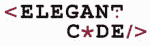
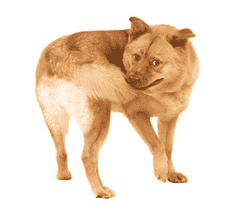

# 加入优雅的代码

> 原文：<https://simpleprogrammer.com/joining-elegant-coders/>

本周早些时候，我被邀请加入优雅代码博客的开发者社区。我不得不考虑一下，因为我想确保我能够履行我的所有义务，并且仍然保持我对自己负责的帖子和工作的质量。我很高兴地说，我已经接受了加入优雅代码的邀请，因为我确实觉得我可以在继续保持我的质量标准的同时开始这次冒险。

## 这对化繁为简意味着什么？

应该没有明显的变化。我知道这可能会让这个网站的一些读者有点困惑，因为我现在将在两个地方写博客，所以让我概述一下你可以期待看到什么。

*   我将继续每周在 https://simpleprogrammer.com 写 2-3 次博客
*   关于 simpleprogrammer.com 的内容将继续是相同类型的一般规划、最佳做法和技术评论，不与特定主题挂钩。
*   我大概一个月会在 http://elegantcode.com 写 2-3 次博客
*   我在 elegantcode.com 上发布的内容将围绕着如何编写优雅的代码以及如何改进你的代码。
*   我不会交叉邮寄。这意味着内容将只出现在一个地方，而不是两个地方。我可能会链接到任何一个网站，但内容将有一个明确的家在一个或另一个。
*   从现在开始，我将专门编写 COBOL，我所有的帖子都将是关于用 COBOL 编程和 COBOL 程序员的秘密生活。(好吧，那一个是骗人的，但其余的都是真的。)

我在 elegantcode.com 的第一篇文章今天刚刚发布，标题是“[优雅的代码对我意味着什么](http://elegantcode.com/2010/04/09/what-does-elegant-code-mean-to-me/)”。

我走之前还有最后一件事。

这是一张狗咬自己尾巴的照片。

这是一张蓝色蘑菇的照片。

仅此而已。