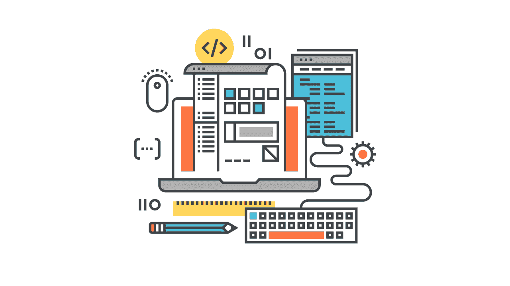
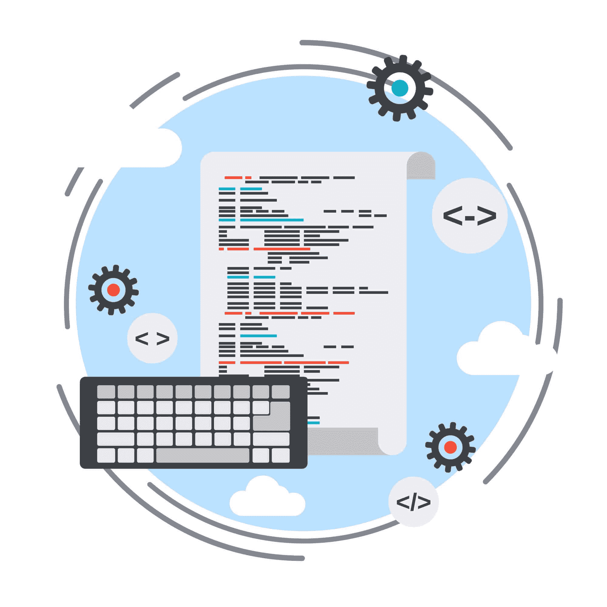

# 程序员的改善之路

> 原文：<https://simpleprogrammer.com/kaizen-developers/>

Kaizen 在日语中是改进的意思。在现代商业中，改善的定义已经扩展到持续改进。通常，这是大多数专业人士对改善概念的理解。真正的改善要走得更远，简单回顾一下它的起源就会明白。

改善始于二战后，但不是在高科技领域。改善始于制造业，特别是丰田的汽车制造业。在此期间，丰田实施了质量圈，工人们将定期分析他们正在做的工作，并提出可以改进的方法。这种以改善为目的的定期反思和改变活动就是改善的诞生。

上世纪 80 年代，改善在西方世界，尤其是美国变得流行起来。1985 年，Masaaki Imai 的著作《改善:日本的改善精神》的出版使制造企业接触到了改善的概念。这开始了一场接受这些概念的运动，以提高生产效率和盈利能力。

随着 2001 年初[敏捷宣言](http://agilemanifesto.org)的发布，敏捷开发方法开始成形，Kaizen 开始与软件开发融合。2003 年，随着大量借鉴精益制造原则的《[精益软件开发](http://www.amazon.com/exec/obidos/ASIN/0321150783/makithecompsi-20)》一书的发布，改善被确立为软件开发的基本原则。

不幸的是，作为一名优秀的程序员，你可能会认为改善是你应该做的事情，以达到“[质量](https://simpleprogrammer.com/2016/11/04/hunting-mythical-high-quality-code/)”，但你可能不明白需要做什么或如何做。你需要了解在你目前的经验水平下，改善对你意味着什么，以及什么样的行动有助于你有效地参与改善。

真正的改善不仅仅是管理术语。它比一项倡议或一个项目更深刻。它是一种文化和个人哲学，引导组织和个人达到更高水平的质量、效率和成功。当你学习新技术、重构代码以获得更容易的维护或更好的性能，或者从软件中消除 bug 时，你会练习改善。

改善是对减少的关注。它试图从一个过程或实践中消除大木或无用的废物。虫子是无用的废物。低效的套路是无用的浪费。充斥着繁文缛节和官僚作风的超负荷流程是无用的浪费。要做到真正的改善，你必须找出这些不足，并从你的代码、系统和思维中根除它们。

当练习改善时，你会在你所做的一切中寻求改进。没有任何活动或努力可以达到完美，但是通过改善，所有的过程和产品都会得到改善。

当你掌握了舒(跟随的状态)、哈(创新的状态)和日(流动的状态)时，改善就一步一步地实现了。每一个状态都建立在对前一个状态的掌握之上。从一个状态到下一个状态的每一个进展都是你进入改善的进一步进展。

让我们探索一下改善的每个阶段，以帮助你确定你目前所处的状态。通过提供的示例，您将了解到，根据您作为程序员的职业生涯，为了对改善做出贡献，您应该采取哪些行动。

## 舒:跟随的状态

在你的程序员生涯的开始，你进入了蜀国。要掌握这种状态，首先要观察和跟随指导你的更有经验的程序员和导师的形式、编程技术和解决问题的策略。每次迭代的“你好，世界！”当你开始学习一门新的语言时，你勤奋地打字是掌握舒的第一步。舒是语法形式和功能的精确重复。

舒不允许有任何偏差。你在你寻求精通的领域接受指导和学习；你努力匹配你面前的形式。舒的改善是大师作品在形式和功能上的复制。硕士的形式存在于教授语言句法的书籍、编程课程以及同事和主管的代码中。这些形式是由有经验的程序员开发的，并经过提炼，一步一步地教你一门语言的语法。每走一步，您的编程能力都会增长。

程序员通过这种复制建立力量和反应。当你熟悉一种语言的语法，如何再现它，以及它做什么，你就更有能力解决问题。你本能地知道一种语言的哪种特征或功能能完成你想要完成的任务。你也会学到解决问题的有效方法。你模仿的模式旨在教会你高效的编程解决方案。当您能够准确地回忆起它们时，您编写的代码会更有效率，这就消除了您的应用程序在处理时间和维护时间方面的浪费。

当你掌握了舒，你将能够复制你的导师要求你的任何形式。你不会偏离。你的代码将和你导师的代码难以区分。这是可取的，因为您的导师已经生成的代码是一个质量、性能和可维护性的模型，而在您与导师一起学习之前，您自己无法生成这样的模型。当你实现了可预测性和精确性，你就在蜀国实现了改善。

我对 Shu 的第一次体验是在我把书和杂志上的程序复制到我的 Atari 800XL 电脑的内存中的时候。我没有可用的磁盘驱动器，所以每个程序都是短暂的。当它停止运行或电脑断电时，我编写的程序就消失了。这段经历教会了我在模仿我所学的程序时要非常小心和精确。

如果我成功了，我就有了一个可以享受的工作计划。如果我失败了，我完成的所有工作都是无用的，必须重做。

痛苦的学习，却是宝贵的经验。

当你开始学习的时候，你比我拥有更多的资源。从面向初学 web 开发人员的 [W3Schools](https://www.w3schools.com/) ，到 [Codecademy](https://simpleprogrammer.com/codecademy-py) 和 [Udemy](https://www.udemy.com/) ，许多免费或低价的初学编程课程可供您选择。我建议从网上的一些免费教程开始。他们将带你经历开始的步骤，并帮助你记住你需要学习的语法，以便开始精通你选择的编程语言。

一旦你熟悉了基础知识，就去 [GitHub](http://github.com) 吧。这是一个开源项目库，允许你下载源代码。找到一个你想学习如何编码的基本应用程序项目。下载源代码，并开始在代码编辑器中复制它。

这听起来像是一个简单的练习，但是精确地复制代码比看起来更困难。当你从事这项工作时，当你遇到新技术时，你也会有疑问。记笔记，研究你有疑问的主题，或者在你完成代码转录后，请你的导师解释这些概念。你会发现自己很快就能深入了解编程语言是如何工作的。

一旦你学会了你所选择的编程语言的语法，你将寻求扩展你的知识，并发现更多关于它为什么以这种方式工作的信息。你已经准备好从跟随的蜀国进步到创新的哈国。

## 哈:创新的状态

一旦你掌握了舒，你就会理解一个形体是如何运作的。你会明白它是做什么的，效率有多高。你会知道处理的时间。您将知道输出、文件大小和 CPU 利用率。正是这种理解会让你进步到哈的状态，创新的状态。

编程的创新来自于将形式、语法和算法组合成更大的系统。你学习设计模式来解决问题。这些模式有机地从你的经验中浮现出来，从接触到与你密切合作的其他程序员的模式中浮现出来，并且通过对历史解决方案的正式研究。

在哈，你正在脱离模仿，并且正在提升你的技能。这种成长提高了你工作的价值——真正的改善。

如果你没有导师或者没有遵循正式的学习课程，你仍然会学习模式，尽管通往改善的道路会更慢。在这种情况下，你的经验将通过实验而提升。通过这些实验，你会看到哪些方法是值得的，哪些是不值得的。学习会很慢。

如果你向他人学习或使用正式的课程来研究模式，你会更快地进步。根据你的情况，这可能是也可能不是适合你的课程。如果你的目标是尽可能快地提升你的技能，这条路通常不是最直接的。然而，如果你正在寻求加深你的知识，时间不是一个因素，通过实验学习可能是正确的选择。

在我刚开始在大学学习编程之前，我的方法是通过自己的实验。我会想出一个主意，让一个程序做一些我想做的事情，我会从一张白纸开始。我会一边工作、编译、调试和重构，一边努力完成我开始构建的功能。当我遇到我不熟悉的领域时，我必须停下来，研究它们，并熟悉它们。

我没有以很快的速度开发特性，但是我对编程语言 BASIC 的不同方面是如何工作的有了透彻的理解。我曾经花了将近一个月的时间来创建一个简单的程序，它接受一个人的姓名、电话号码和地址，并将其显示在屏幕上，格式就像一张名片夹。我的吞吐量慢得令人痛苦，但最终，我学到了相当多的 BASIC 知识以及如何用它解决问题。

当我获得第一个专业编程职位时，我的经历发生了巨大的变化。时间成了我学习的一个重要因素。IBM 不愿意等待我的学习进展如此缓慢。相反，他们送我去培训，以迅速提高我的技能。

我通过为期一周的 Oracle 培训课程学习了 SQL。培训结束后，当我回到工作岗位时，第二周我写了一份我一直在努力的报告。正式的课程作业将我的学习浓缩到一个更小的窗口中，但我觉得我的理解比我自己进行的学习要肤浅得多。

在这两种情况下，我都能够应用我所获得的知识来解决更复杂的问题，并提供比我完成研究之前更好的解决方案。我朝着改善的技能和速度前进。不过，在第一种情况下，我觉得我对我正在构建的东西有了更深刻的理解。在第二阶段，我更快地达到了要求的熟练程度，但是我的能力有限。首先，我是一个多面手；第二个是专家。

一旦你适应了创新，不管你是多面手还是专家，你都会准备好进入下一个状态，心流状态。

## 国际扶轮:流动的状态

当你进入 Ri 状态时，你将到达一个地方，在那里你所掌握的形式和你所创造的创新已经提升了你的能力。这些提升的能力让你在最高水平上为改善做出贡献。

你随着呈现在你面前的挑战而流动。你寻求使每个系统比上一个更好。您努力争取更好的性能和更少的维护。在不牺牲功能的情况下，您努力简化而不是复杂的系统。你正处于技术能力的巅峰，但不要忘记还有更多东西要学。

在 Ri 的状态下，你对不太高级的程序员的改善有所贡献。你引导程序员体验 Ha。您提供建议，以便 Ha 中的程序员改进他们的系统并体验他们能力的增长。

你构建了体验 Shu 的程序员试图模仿的形式。在国际扶轮中，你用你的经验来改善程式新手在通往精通的道路上开始的形式。通过这种方式，通往精通的道路被缩短或改善了，因此从中走出来的程序员比你在职业生涯中的那个阶段更加熟练。

在我目前的职位上，我的经验允许我为初级程序员提供指导。在他们编写代码时，我与他们结对回答他们的问题，并回顾他们的成果。我为他们提供指导，让他们产生更有效或更易维护的代码。由于这一过程，改善有两种改进方式:

第一，初级程序员从我这里获取知识。他们学习一项技术或获得一项他们以前没有的技能。他们有机会提问，并从我的回答中更好地理解解决方案。从那时起，他们可以更有效地使用他们所掌握的工具。

其次，他们改进的能力通过提高效率改善了组织的改善。产生更好代码的初级程序员减少了处理时间和成本，并减少了维护系统的时间。这使本组织能够将其精力和资源集中在新的事业上，从而创造更多的收入。

除了导师之外，我的经验意味着我将被要求为提高组织效率的架构和流程创建标准。这些是入门级程序员学习记忆和遵循的过程和程序形式，以便在他们的角色中变得有效。这些是 Shu 的程序员学习的基础或形式。

在国际扶轮，你可能会扮演两种角色之一:团队领导或建筑师。作为一名架构师，您为您的系统创建蓝图。您考虑要构建的解决方案的最佳实践和细微差别。你的架构为其他程序员提供了一种构建高质量系统的有效方式。由于您对提高效率的贡献，改善得以改善。

作为团队领导，你是初级程序员的不二人选。你的经验可以让你快速回答问题，解决问题。你为其他团队成员提供方向，目标是生产更高质量的系统，这将改善传播到整个组织。

## 用你所学的知识掌握改善

在你的职业生涯中，你将通过“术”、“哈”和“日”的学习状态前进。在每种状态下，你对改善的贡献都是不同的。

在舒，你专注于你的内在改善。你学习质量的形式和基础，并寻求成为模仿大师。当你能精确地模仿你所学的形式时，你就准备好进入下一个阶段了，哈。

在 Ha，您通过创新关注改善。你寻求以新的方式使用和结合你已经掌握的形式。你寻求导师的建议，研究他人的作品，以获得更深的理解，提高你的创新。您不断地寻找方法，使您的创新能够改进他们所属的流程和组织。当你掌握了创新的艺术，你的贡献就会源源不断，你就准备好迈向国际扶轮的境界。

在国际扶轮，你成为你的经验所引导你的导师、建筑师或领导者。你提供了构建系统的愿景。你指导初级程序员，帮助他们提高技能和知识。你领导团队，回答问题和解决问题，所有这些都处于一种流动状态，不断地为你的组织带来改善。

改善就是持续改进。日积月累，微小的改进和浪费的减少会带来惊人的成就。你的成就将来自于你的知识从新手到大师的进步。你将学会并能够解决你刚开始时力所不及的问题。您将创建独特的新解决方案，并极大地改善现有系统。最终，你的成就将引导你帮助和激励他人达到更高水平的改善。

每一小步都是对改善的贡献。你今天会采取什么步骤？