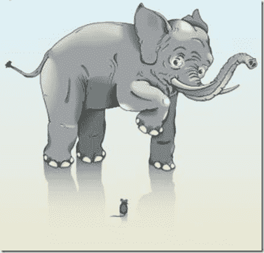

# 看板故事规模，大象和老鼠

> 原文：<https://simpleprogrammer.com/kanban-story-sizing-elephants-and-mice/>

在我们早上的站立会议上，我的一个团队成员提出了一个很好的观点，故事的大小并不那么重要。

在看板中，我们努力拥有相对相同大小的故事，因为它给我们带来了某些好处:

*   更准确地衡量任何要交付的故事的预计排队时间。
*   减少对评估和计划的依赖。
*   连续流动，而不是慢…快…快…慢。
*   可预见性。

## 我记得你说过故事的大小并不重要？

对，没错。它们的大小相对相同是很重要的，但大小完全相同并不重要。

基本上，我们不想把老鼠和大象扔在一起。

这就是把一块糖掰成两半来分享和量出处方药物的区别。

你可以看着糖块说“是的，看起来差不多一样大”，但是你最好不要对药物做同样的事情。

过分地分割糖果棒，甚至精确到毫克，完全是浪费时间。

试图获得精确到小时的故事完全是浪费。

## 把他们互相比较一下

在这种情况下，你如何确定故事的大小？

把它们互相比较一下就行了。当看一个新故事时，考虑你已经在黑板上的其他故事。与一群老鼠相比，这个新故事像一头大象吗？是不是反过来了？

如果是这样，调整故事使其有意义。不要相信你的直觉，不要把它和已经存在的东西进行比较，否则你会开始偏离你的估计。

如果你有时错了，不要太担心。只要你们很亲密，最终一切都会平衡。

也别忘了除掉所有的[蓝鲸](https://simpleprogrammer.com/2010/01/26/scrum-backlogs-that-cover-too-much-and-are-not-thinly-sliced-enough-and-have-spreadsheets-attached-and-have-non-specific-things-like-fix-everything-on-this-page/)。你永远不会想让这些出现在你的板上。