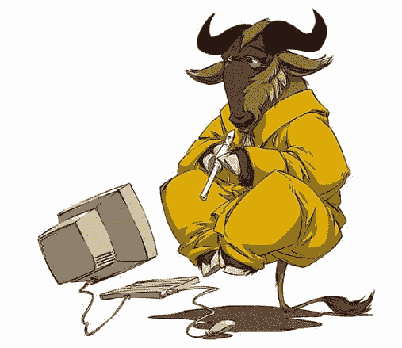
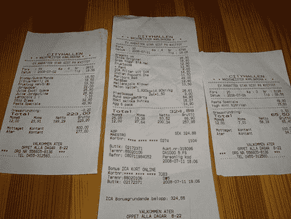

# 因果报应是真实的

> 原文：<https://simpleprogrammer.com/karma-is-real/>

这个世界上有两种基本的人。

1.  那些评估每一笔交易的人。
2.  那些把生活当作投资等待分红的人。

这两类人的背后是他们的动机。

那些高度重视每一笔交易的人通常是受眼前利益和公平的驱使。

那些高度重视投资的人通常受到收获的原则的激励——种瓜得瓜，种豆得豆。

## 一个小故事

我将暂时岔开话题，讲一个让我对这个问题有更多思考的故事。

这个周末，我和妻子、女儿去了一家小咖啡馆。我们通常在周六早上我女儿上完体育课后去那里。这是一家不错的小咖啡馆，但是食物有点贵。

我不介意为更高质量的食物和更高质量的服务多付一点钱，所以尽管价格昂贵，我还是去了。

这家小咖啡馆正在进行一项促销活动，如果你交出 8 张收据，就可以免费得到一顿饭。(大约值 10-12 美元。)

正如我说过的，我的妻子、女儿和我去那里已经有一段时间了，所以我们终于攒了 8 张收据。我们吃完饭，然后上楼去付饭钱。账单大约是 25 美元。

咖啡馆的老板仔细地看着我面前的收据。她似乎仔细检查了每一个，寻找一个有效的签名，这是从他们的咖啡馆。(记住，我们经常来这里，他们肯定知道我们是谁。大多数员工立刻认出了我的女儿。)

我心想，“好吧，这有点侮辱人，但没什么大不了的。她只是在核对收据。”

咖啡馆老板从一叠收据中抽出一张，说道:“你已经用过这张了。”

我看了看收据，发现它没有被使用过，但它确实在上次兑换的总额上有折扣。(总数仍然是 15 美元。)

我向她解释说，我有 8 张收据，代表着不同的访问，每张都超过 15 美元，平均金额在 25-30 美元左右。我还向她解释说，一张收据上确实有兑换，但它仍然有一份有效的餐费，而且是全额支付的。

我得到的回应是“你已经用过这个了。”

我们来回走了几次。在谈话中间，她接了一个电话，最后把我交给了另一个人，说“我不干了，你去处理这个家伙。”

新来的收银员告诉我同样的事情，这里的细节并不重要。我甚至不会告诉你他们是否给了我折扣，因为这不是重点。

事实上，从这个故事中我们可以吸取很多教训。先说主要的。

## 在单一交易中思考

在处理这一问题时，该企业的所有者只考虑了这一单笔交易，而没有考虑未来可能发生的交易。

在这里，我是一个付费顾客，带来了 8 张收据。其中一张收据上有折扣，因为我之前有 8 张收据。所以，我至少去过那里 17 次，并为食物买单(包括这次)。)

该企业主非常担心我会骗她 10 美元，因为其中一张收据无效，她愿意牺牲我未来的所有业务，并可能让其他客户感到不安，这些客户听到了她粗鲁的评论和对这种情况的处理。

那么这和发展有什么关系呢？

我们一会儿就会谈到这一点，但我想对这一点做更多的阐述，因为我认为这一课适用于生活的方方面面。

这里的要点是，单独思考生活中的事务，而不是关注正在发生的更大范围的事情，可以让你提前一天走出来，但从长远来看，会让你付出高昂的代价。

> ***“一只羊可以剪很多次，但只能剥一次皮。”*T3】**

现在，企业主应该怎么做呢？如果情况发生逆转，我会怎么做呢？

首先，我不会当着顾客的面检查收据。我会简单地扫描一下收据，或者如果我们遇到了大量的欺诈行为，我会很担心地说，“请等一下”，然后在看不见的地方迅速检查一遍。

接下来，如果我发现一张收据有任何问题，我会查看所有收据的平均支票大小——等等，我在撒谎。说实话，我都不会那么做。如果你带着 8 张收据来到我的餐馆，我说如果你交出 8 张收据，我会给你一顿免费餐，只要你不是明显想敲我竹杠，即使你是，但你确实来这里买了 8 次东西，我会说“非常感谢你的生意，我很高兴给你一顿免费餐。”

我甚至没有提到这个问题，我甚至没有说一句话或给一个眼神来让顾客尴尬。为什么？为什么这么做？你为什么要冒险责备一个付费的常客，并可能惹恼附近的其他顾客呢？我的意思是，你不会花 10 美元做广告来获得一个每周的顾客吗？你不会花 100 美元吗？

## 现在可以谈程序员了吗？

是的，是的。我想我们应该。

所以有两件非常重要的事情需要考虑。

1.  你是把你的职业发展当作一单交易还是一只支付股息的股票？
2.  你如何对待**你的**顾客？

## 投资自己

很容易陷入这样一个陷阱，即根据什么会给我带来最大的回报或者什么会带来直接的好处来分析每一个决定。超越当前可能在你面前的沙漠，看到等待那些有耐心和正直的人的绿洲，要困难得多。

我之前谈过[买自己的显示器](https://simpleprogrammer.com/2010/01/20/199/)。我还买了很多其他设备。有时是因为我的雇主不会给我买，有时只是因为我知道从长远来看它会让我更有效率，我会因为不便宜而看起来更好，但我会自己买，即使如果我问的话，我的雇主可能会给我买。

我在培训上投入了时间和金钱——周末和工作日晚上花几个小时自学——很多交易在短期内没有让我受益，但从长远来看却有巨大的好处。

这个博客就是其中之一。我花了 2-3 个小时，有时一周写一篇文章。在我开始做 [Pluralsight 视频](https://simpleprogrammer.com/pluralsight)之前，我曾经一周写 3 篇帖子。我几乎没有从发表博客文章中赚到什么，但我无法告诉你拥有这个博客在工作机会、商业机会和结识许多有趣的人方面有多少回报，他们有一些东西可以教我。

活在今天我从来都不开心。我总是有一个计划，一个议程。我的职业生涯是我积极管理的，我做这件事的方式是投资于它。

现在，我并不完美，远非如此。我自己也曾多次陷入这种交易风格。我已经几个月没有读一本对我的事业有益的书了。我浪费了大量的时间，或者做出了只有眼前利益而没有长远利益的糟糕选择。我只是试着像有因果报应一样生活，即使我可能不完全相信它。

我坚信收获的原则。种瓜得瓜种豆得豆。对我来说，它是通过魔法还是一系列实际的因果步骤起作用并不重要——这并不重要。重要的是它有效。

随着我们进入客户，关于你作为开发人员的职业生涯，我想说的另一点是帮助他人，并尽可能对每个人友好。

这非常重要，你最好现在就开始做！

说真的，在生活中获得成功的一个普遍建议是交朋友而不是树敌。你永远不知道你发展的什么样的关系最终会让你受益最大。

当有人需要你的帮助或请求帮助时，帮助他们。你会惊讶于你可能从教学中学到的东西，而且你会把严重的因果报应放入你的银行账户。

我去过一些地方，那里的人们隐瞒知识，不帮助别人，因为他们害怕这会让他们变得不重要，损害他们的工作保障，但这完全是愚蠢的。

任何公司中最有价值的人都是能让周围的人更成功的人！

不要因小失大！

老实说，我甚至不再试图分析更大的图景，因为我知道如果你做好事，好事就会到来。

我的个人哲学已经演变为:永远做正确的事情，因为它是正确的事情，而不是因为你会从这样做中得到回报。

## 投资于您的客户

如果你正在写软件，你有客户——句号！

我不在乎你认为你离他们有多远。有人正在使用你的软件，否则你不会写它。

至少，有人在支付你的薪水，这个人也是你的客户。

我不会尝试在这方面提供任何非常具体的建议，因为我认为这足以说明，在与您的客户打交道时，您应该记住他们已经带来的付费收据的数量，以及您希望从他们那里收到多少。

我承认有时候我自己也在这里摔倒了。我经常非常擅长与直接客户打交道，但有时我会忘记我的间接客户仍然是我的客户。

仅仅因为你拿到了薪水，并不意味着你没有在卖服务。你只是碰巧有一个常客。