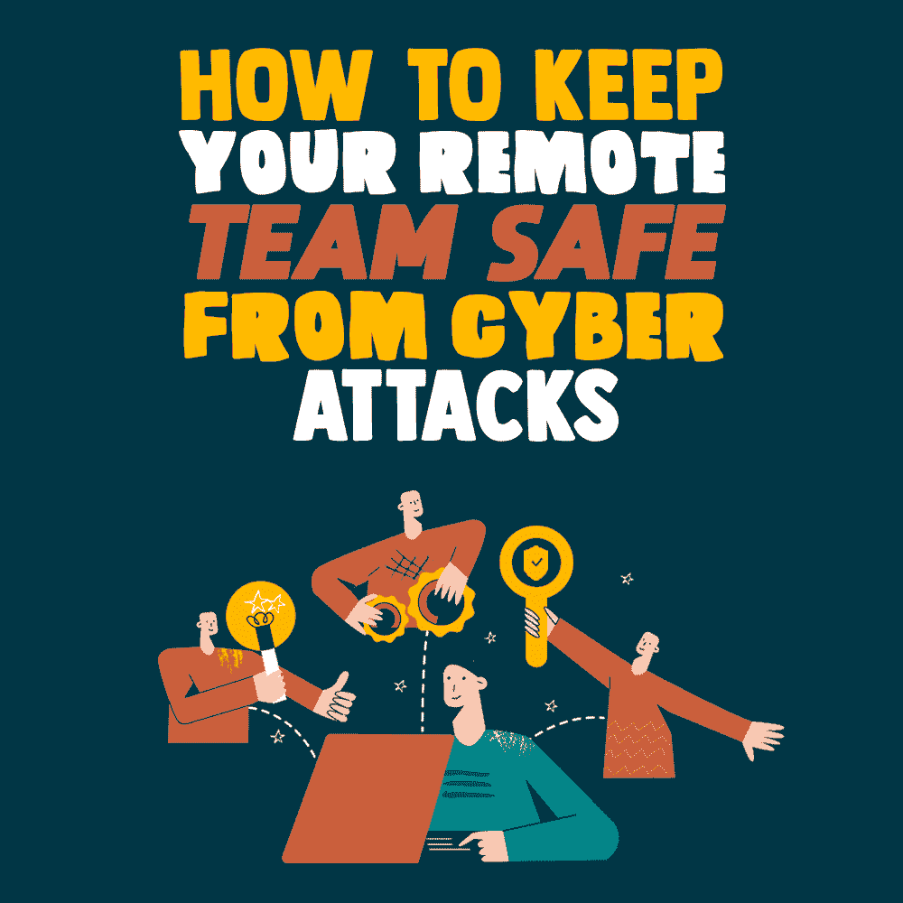
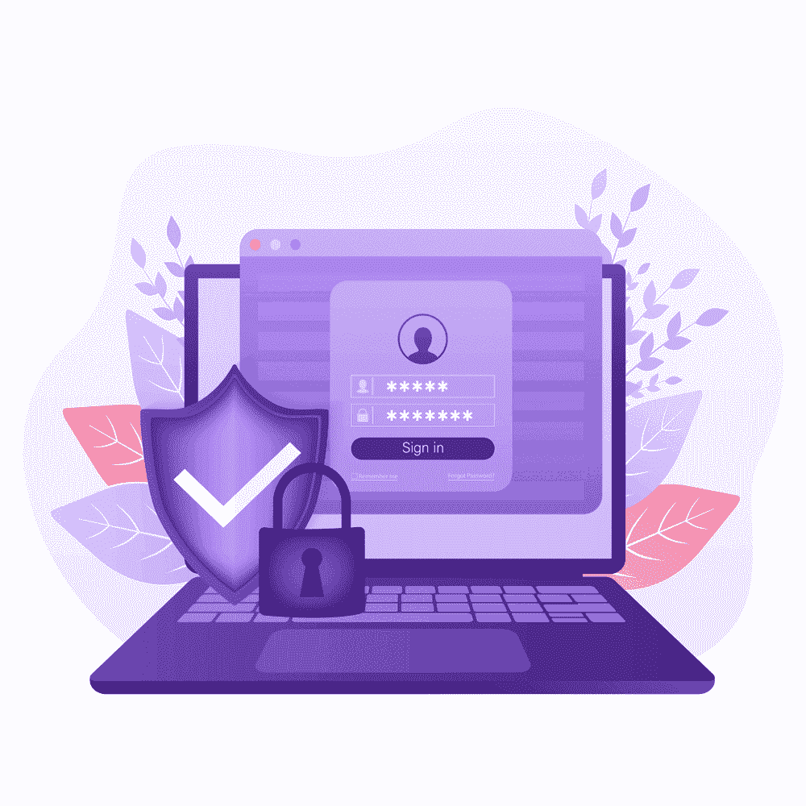

# 如何保护您的远程团队免受网络攻击

> 原文：<https://simpleprogrammer.com/keep-remote-team-safe-cyber-attacks/>

With the world struggling to get back on track amid the COVID-19 emergency, telework has become the silver bullet that keeps businesses up and running. Numerous software engineering teams rushed headlong into adopting the [remote workplace](https://simpleprogrammer.com/remote-first-guide/) model as well, only to hit a bunch of roadblocks along the way. These hurdles run the gamut from productivity nosedives to—you guessed it—security issues.

由于网络犯罪分子将此次危机视为提升其技能和增加受害者受众的机会，他们重新调整了攻击目的，以适应疫情的环境。因此，用于远程工作的主流工具，如视频会议软件、基于远程桌面协议的服务( [RDP](https://www.amazon.com/RDPwned-Securing-Microsoft-Desktop-Services/dp/B086FZVY17) )和虚拟专用网络(VPN)解决方案，最终成为骗子的目标。

为了加强他们的不法行为，这些不道德的人将网络钓鱼攻击的主题与员工的痛点和恐惧联系起来。窥探用户的敏感通信，窃取有价值的数据，用[掠夺性程序](https://macsecurity.net/view/289-search-marquis-com)感染计算机是恶意行为者的主要目标。

最近的一项全球[研究](https://www.businesswire.com/news/home/20200729005208/en/Tanium-Report-Reveals-90-Percent-of-Organizations-Experienced-an-Increase-in-Cyberattacks-due-to-COVID-19)揭示了关于威胁现状的令人不安的细节:多达 90%的受调查公司报告称，由于疫情，网络攻击企图激增。此外，93%的人表示，他们不得不推迟重要的安全项目，因为向远程工作的过渡被赋予了更高的优先级。

如果你把这些点联系起来，这个趋势看起来就像是一个灾难的处方。为了保证您、您的远程团队和您的公司的安全，这里列出了最常见的陷阱以及避免它们的方法。

## 网络罪犯攻击哪些服务以及如何保护它们

这里总结了瞄准远程工作人员的网络犯罪媒介，以及让包括开发人员在内的企业毫发无损的有效技术。

### RDP 黑客的祸害

如今，远程桌面协议是协作生态系统(如编程团队)中的游戏名称。像 TeamViewer 和虚拟网络计算(VNC)远程访问应用程序允许您连接到一台存储项目资源的机器，这样您就可以与您的同事协调您的工作。

不幸的是，RDP 的服务成为黑客攻击的目标。不良行为者不仅试图以这种方式窃取机密数据，而且他们还可能试图用恶意软件毒害连接的设备。

助长此类攻击的臭名昭著的漏洞之一是微软 RDP 实施中的 BlueKeep 漏洞(记录为 [CVE-2019-0708](https://cve.mitre.org/cgi-bin/cvename.cgi?name=CVE-2019-0708) )。除非你安装一个补丁，否则这个漏洞会让对手在你的 Windows 电脑上获得立足之地，并远程执行粗略的代码。

为了免受大多数类型的网络攻击，以下做法绝对不会错。

让你的软件保持最新。不要推迟在所有用于远程连接的设备上安装操作系统更新。这很重要，因为更新带来了改变游戏规则的安全补丁。

使用强密码。您希望对那些试图猜测或暴力破解您的远程连接的身份验证细节的罪犯保持较高的门槛。随机组合字母、数字和特殊字符。另外，密码长度至少要有 10 个字符。

**启用多因素认证( [MFA](https://www.amazon.com/dp/B08512BNFF/makithecompsi-20) )。**由于这种登录机制依赖于一个额外的因素，如发送到您智能手机的一次性密码，它可以防止黑客远程访问您的计算机。

**配置账户锁定规则。**如果你用 PC 编程，去开始>程序>管理工具>本地安全策略，设置账号锁定策略。例如，允许不超过三次不成功的尝试，锁定时间为三分钟。

使用特殊的网关。微软的远程桌面网关(RDG)服务是您的最佳选择，因为它提供加密连接，同时允许您指定授权用户的范围。

如果您的公司有与这些行为相抵触的做法(例如，如果您不能更新您的操作系统)，建议获得您的 it 部门的批准或邀请他们这样做。

### VPN 利用正在上升

When working out of the office, people need to maintain a stable and, more importantly, secure connection with the business IT networks. VPN is a critical instrument that bridges the gap between users and tamper-proof online communications. That is how it works in an ideal world.

实际上，事情并不总是一帆风顺的。随着远程团队成员越来越依赖这些工具来履行他们的日常职责，网络车正忙于探测这些工具的漏洞，并取得了一些成功。

2020 年 1 月，企业[被警告](https://us-cert.cisa.gov/ncas/alerts/aa20-010a)在 Pulse Secure VPN 服务中先前发现的漏洞被大规模利用。该漏洞被跟踪为 CVE-2019-11510，它可能会引发针对最终用户和企业环境的远程代码执行攻击。

据报道，该漏洞的核心问题之一与一种名为 Sodinokibi 的可怕的[勒索病毒](https://hacked.com/linux-ransomware-notorious-cases-and-ways-to-protect/)的传播有关。除非应用适当的补丁，否则该漏洞还可能允许犯罪分子绕过身份验证，访问以明文形式存储员工凭据缓存的网络日志。

以下提示可以帮助您消除工作中潜在的 VPN 利用威胁。

使 VPN 保持最新。本建议适用于您用来远程连接企业资源的公司发放的设备和个人设备。正确的修补程序管理可确保最新的安全配置和补丁程序到位。

**使用双因素认证(2FA)。**如果由于这样或那样的原因，该规则无法实施，请务必使用强密码登录 [VPN](https://simpleprogrammer.com/ugly-facts-about-vpns/) 服务。

**启用 VPN 删除开关。**此功能会在 VPN 关闭时终止您的设备与互联网的连接(是的，会发生这种情况)。让它开着，以防止您的数据在这种情况下可能被泄露。

严重依赖 VPN 技术的远程办公的普遍采用意味着普通用户的安全状况存在单点故障(SPOF)。成功入侵虚拟专用网络连接的对手可以令人不安地广泛访问您的数据资产。因此，加强这些连接的安全性符合您的最佳利益。

### 易受攻击的视频会议软件

与 VPN 的情况一样，自冠状病毒爆发以来，支持虚拟会议的工具已经大大扩展了其覆盖范围。软件工程师经常使用它们来协调团队工作。不足为奇的是，犯罪者越来越善于发现和利用流行的视频会议解决方案中的弱点。

威胁有多大？只要谷歌一下“缩放漏洞”，你就会发现这些工具——说得委婉一点——在安全性方面并不完美。

这种攻击的后果可能会令人不安，因为它为窃听铺平了道路，从而获得竞争优势或毁掉你的声誉。为了避免在使用缩放时出现这样的问题，请遵循一些建议来阻止窥探。

不要在网络会议中重复使用访问代码。如果你与过多的人分享这些信息，敏感信息很可能会泄露到预期的同事范围之外。

**使用“等候室”功能。**也被称为“绿色房间”，它阻止虚拟会议开始，直到主持人加入。

跟踪参与者。配置应用程序，在新与会者加入网络会议时触发通知。如果缺少此功能，主持人应该要求所有参与者表明自己的身份。

不要记录你的会议。没有人能免受网络攻击。由于有许多类型的病毒会从受感染的计算机中窃取数据，因此您的记录可能会落入网络罪犯的手中。如果您需要记录会议以供将来参考，请确保对文件进行加密。

另一方面，网络罪犯并不是唯一想要窥探你的虚拟会议的人。对你公司的数字资源拥有全部或部分访问权限的心怀不满的同事或前同事也可能会试图获取你的数据。

### 网络钓鱼攻击势头越来越猛

除了抵御上述风险，您还应该加强反网络钓鱼实践，以避开日益增多的冠状病毒主题的诈骗。一个例子是[模仿世界卫生组织(世卫组织)和其他新冠肺炎响应实体的电子邮件咨询](https://nakedsecurity.sophos.com/2020/02/05/coronavirus-safety-measures-email-is-a-phishing-scam/)激增。

这些欺诈试图欺骗收件人透露他们的个人数据或执行伪装成引人注目的附件的有害代码。对这样的信息要持怀疑态度，在与其中任何可点击的东西互动之前要三思。这里有一些额外的预防措施，当这样的邮件出现在你的收件箱时，你应该考虑一下。

寻找不准确的地方。网络博客经常忽略对文本的校对，所以仔细检查邮件中的拼写错误。发现明显错误就忽略。

微调您的电子邮件过滤器。现代电子邮件服务会阻止与已知网络钓鱼模板相匹配的邮件。转到提供商的安全设置，增强这些自动检查，使其超出默认设置。

不要点击电子邮件中的链接。点击这样的链接，你可能会陷入社交工程或恶意软件感染的陷阱。同样，不要打开陌生人邮件的附件。

**当面确认敏感事项。**如果一条看似来自你同事的信息指示你电汇，你最好打电话给发件人，仔细检查该请求的合法性。

**使用互联网安全软件。**该类别的可靠工具持续监控您的收件箱，如果检测到可疑邮件，会向您发出警告。

## 成为一个移动的目标

Not only is the global increase in [remote work](https://simpleprogrammer.com/effective-remote-work/) a natural element of the business evolution, but it is also an emergency response to the new circumstances ensuing from the health care calamity. Unfortunately, the occasionally crude implementation of telework has become one of the weakest links in the security of both individuals and companies.

坚持上面的建议是成功的一半。此外，如果您还没有通过难以猜测的密码和 2FA 来改善您的身份验证卫生，这不会有什么坏处。

如果勒索软件攻击你的电脑，数据备份策略就是你的 B 计划。这些技术经过深思熟虑的组合将阻止攻击者，以便您可以专注于您的工作。