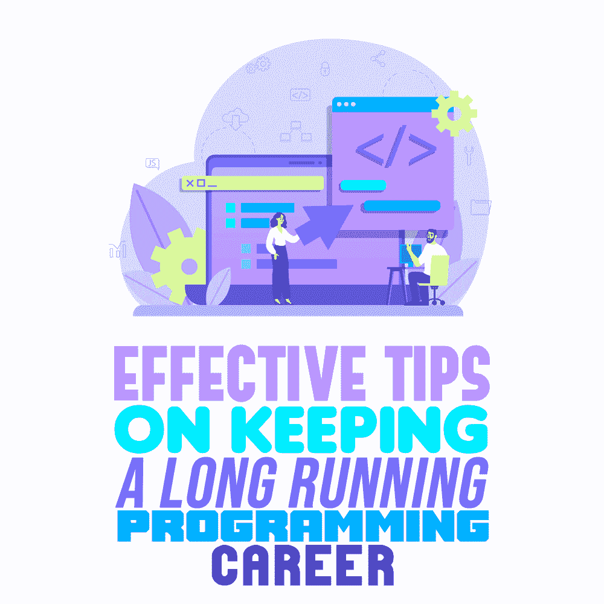

# 保持长期编程生涯的有效技巧

> 原文:[https://simple programmer . com/keeping-long-programming-career/](https://simpleprogrammer.com/keeping-long-programming-career/)

Every day we use dozens of applications on our smartphones and computers. As end users, we are concerned with their features and user-friendliness. If an application is considered too difficult to use or is full of bugs, we discard it immediately and move to an alternative.

正是在这种情况下，开发人员致力于开发吸引人的、面向解决方案的、用户友好的应用程序。下载一个应用程序可能几乎不需要一分钟，但对于程序员来说，这是无数个小时的辛勤工作。

以前，编程工作仅限于 IT 行业。其他部门不需要程序员。但是随着最近技术的飞跃和新商业途径的诞生，IT 世界发生了巨大的变化。

今天，几乎每个组织都有一个专门的 IT 部门，里面挤满了程序员和计算机专家。原因很简单。就像我们已经开始依赖我们的小工具做几乎所有的事情一样，组织已经向技术转移。因此，他们需要这些资源作为必需品。

因此，编程作为一种职业已经发展了很多年。每天都有数不清的职位空缺，而且需求还在不断增加。然而，选择程序员这一职业并不能保证成功。IT 行业正以前所未有的速度增长，如果没有适当的规划，您可能会在几个月或几年内被淘汰。

如果你没有跟上新的编程语言，并且没有不断提高自己，你的程序员生涯可能会戛然而止。在本文中，我将向您提供保持长期编程生涯的最有效的技巧，这一职业有趣、进步且经得起未来考验。

## 接受专业教育

有许多“专家”声称专业教育在 IT 行业中不再有价值。虽然你的技能确实对你的专业学位有很大的影响，但它们并不总是对你有利。必须明白的是，专业教育学位具有一定的声望和价值，这是 Udemy、Coursera 或 YouTube 讲座上的课程无法替代的。

专业认证给你所需要的优势，以验证你的技能，并建立一个行业的足迹。没有证书，你可能无法获得一份基于你真正潜力的奖励工作。

假设你是一名人力资源经理，正在招聘一名安卓程序员。有两个有希望的候选人。他们拥有相同的技能，但一个拥有软件工程专业学位，另一个从朋友或 Coursera 那里学到了专业技能。

你会雇佣哪一个？

在其他条件相同的情况下，我总是会选择有专业学位的人。原因是他们不仅在实践技能方面表现出色，而且理论知识水平也很高，这为公司提供了一个良好的资产。

领先的 IT 公司使用招聘软件，这些软件根据特定的指标来识别资源，其中之一就是教育背景。如果没有专业人士，你甚至可能不会被这些科技公司注意到。

因此，如果你想成为一名程序员，投资专业教育是必须的。获得学位，进行专业化，选择专业认证，比如 CCNA、敏捷等等。这将永远帮助你在你的领域中获得优势

## 让自己忙于学习新技术

程序员不再局限于地下室或角落办公室，他们可以安静地工作，一边啜饮咖啡，一边疯狂地敲击键盘。传统的工作环境已经发生了巨大的变化，程序员的工作性质也是如此。

以前，一个程序员必须写 100 行代码才能在应用程序或网站上显示一个按钮。今天，技术已经使程序员可以选择现成的模板，并根据他们的要求进行调整。正因为如此，你不再需要写 100 行代码。

考虑一下 [WordPress](https://www.amazon.com/Professional-WordPress-Development-Brad-Williams/dp/1118987241) ，一个著名的用于制作网站的内容管理系统。即使没有编程知识的人也可以用它来创建网站。这就是科技的进步。

作为程序员，最好**稳扎稳打**。例如，领先的电子商务平台如 [Magento](https://simpleprogrammer.com/magento-interview-questions/) 需要一套不同的知识。你需要知道哪个平台在哪个地区更受欢迎，才能让你的努力获得最大价值。

Learning new languages strongly complements your programmer profile and adds worth to your name. Moreover, it keeps you informed about the latest prospects in the market and how to utilize them to your benefit.

比如中东对 Magento 的需求巨大，他们的电商市场在 2019 年达到[185 亿美元。这意味着，如果你想在中东取得成功，你必须选择那里需要的最新技术。](https://www.fmeextensions.ae/blog/ecommerce-in-uae-middle-east/)

同样，如果有一种编程技能在美国非常受欢迎，你必须让自己精通它。关注地区偏好是你在编程生涯中取得成功的关键。

这不仅能让你为市场做好准备，还能帮助你保持竞争力。

## 永远不要让自己停滞在一个地方

有毒的工作场所或忘恩负义的老板都不是你应该花时间的地方。相反，**相信自己**。向其他地方申请，一有机会就辞职。

许多 IT 行业的新员工在工作环境中苦苦挣扎，仍然缺乏如何发展职业生涯和向前迈进的专业指导。静态工作会对程序员的职业生涯造成严重影响，因为它破坏了他们进一步超越他人所需的成长。

有毒的工作场所或忘恩负义的老板只会把你拖垮。它们阻止你意识到自己的价值和进一步超越的潜力。当你被限制在地下室的办公室里做可能与你的工作描述不符的“工作”时，你的梦想和抱负被搁置了。

在找到合适的工作之前经常换工作并不是承诺问题的表现。这表明你一直想要生活中的新挑战。

## 使用付费工具获得最佳价值

让我们假设你是一个顶级的自由职业者，有一个新客户在城里。每个人都希望得到他们的项目。你有丰富的经验，有信心搞定客户，但是让你惊讶的是，一个没有什么经验的人最终得到了这份工作。相信我，这比你想象的还要普遍。

今天，**客户与有技能并表现出承诺的人一起工作**。展示承诺的一种方式是投资付费工具。这些工具不仅能提高工作质量，还能让客户相信你是一个高度忠诚的人，愿意付出额外的努力。用付费工具打动的不仅仅是客户。你也可以使用这样的工具来改进你的工作，并迈向建立自己的 IT 公司的成长阶段。需要强大在线足迹的公司客户通常倾向于雇佣[电子商务开发](https://www.fmeextensions.ae/ecommerce-portal-design-development.html)代理而不是自由开发者。

## 工作中保持良好的纪律性

无论是自由职业还是朝九晚五的工作，在工作中保持良好的纪律性是成功的关键。如果你对你的工作不真诚，你肯定会比你想象的更快地面临一个问题。

缺乏纪律性会导致你作为程序员的职业生涯中出现几个主要的并发症。没有应有的承诺和对自己的信心，你根本无法指望在竞争激烈的 IT 行业取得成功。

经理或高层老板可以从懒惰的资源中识别出一个忠诚、勤奋的资源。同样，在自由职业者的世界里，错过一次交付或一个里程碑足以给你一个差评。你个人资料上的一个差评肯定会让你失去名誉和未来的工作。

因此，**继续致力于你的工作**。如果你觉得自己力不从心，我建议休息一下。利用这段时间想想你未来的行动方针。

## 永远不要让失败打败你

失败是生活的一部分。与其逃避，不如接受并从中吸取教训。这将帮助你在职业上和个人层面上有所提高。我见过那么多人因为一次失败而转行。在我看来，放弃只会加重对你的打击。相反，反思你做错了什么，不要再犯同样的错误。

我的一个朋友曾经没能按时完成一个自由职业项目。自然，客户留下了差评。从那以后，新客户变得很难找到。她对自己感到沮丧，怀疑自己的能力，最终决定改变职业。

When she came to me with her decision, I suggested she hold off on switching and advised her to try other sources of work instead of just one freelancing platform. It took some persisting, but eventually she obliged. Now, she’s a successful programmer with her own setup. Plus, she always delivers her work on time.

失败不一定是结束。你可以拥抱它，向它学习，并将其用于你的职业优势。

## 投资自己

不要自满。明智地利用时间，学习新技能。投资新技术和工具，尝试建立自己的网络。如果你的工作、自由职业或你自己的公司出现问题，这个网络将有助于你重新振作起来。

我上面列出的六个技巧一定会帮助你成为一个更好的程序员，并拥有一个成功、持久的职业生涯。