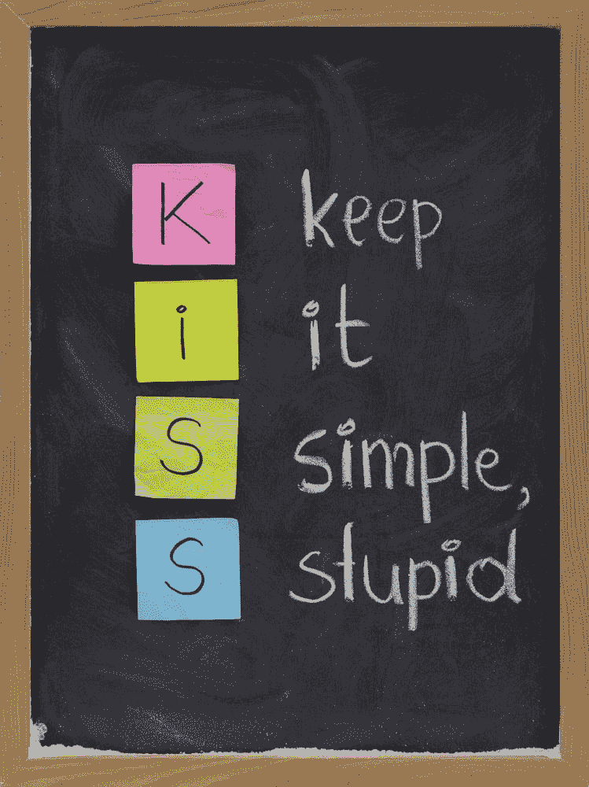

# 亲吻——统治一切的最佳实践

> 原文:[https://simple programmer . com/kiss-one-best-practice-to-rule-them-all/](https://simpleprogrammer.com/kiss-one-best-practice-to-rule-them-all/)

# **为什么接吻不容易**

再说 KISS，或者“简单点，笨蛋。”

但是在我继续深入之前，请想一想您在编写代码时最喜欢的最佳实践。是不是干——不要重复自己？或者你更像 YAGNI——你不需要它——的人？你遵循坚实的原则吗？还是你真的厌倦了我们在里面用的所有这些缩写，而只是用常识来代替？

No matter what your style of coding is, it should follow one rule: Keep It Simple, Stupid!
So what should I tell you about KISS? It really just means you have to keep it simple. Simple code is less prone to bugs, and is easier to read and understand for you and the people who'll be working on the code in the future (including yourself). And now you're probably thinking you're already doing that. Duh, why would you write complex code? Maybe you even think of yourself as not being a good enough programmer to write complex code! Let me tell you why this is probably not the case.

讽刺的是，保持事情简单并不简单！它需要抽象思维。它需要你所从事领域的知识。它需要了解代码、框架和您正在使用的语言。这需要经验。事实上，让我给你看马丁·福勒的这段话:

> 任何傻瓜都能写出计算机能理解的代码。优秀的程序员编写人类能够理解的代码。
> —马丁·福勒

想一想——你见过多少易于阅读、简单易懂的代码？可能不是很多。谁写的代码？他们是初学者、业余爱好者还是老年人？也许你已经看过所有这些人的代码——很有可能，他们都是复杂的怪物。实际上，如果你仔细观察代码，你可能会发现它充斥着所谓的“反模式！”但是事情是这样的:这同样适用于你的代码。你可能(现在)理解它，但是几年后(甚至几个月后)再回来看它。

但是为什么这么多代码不简单呢？只是没有很多人拥有我刚刚列出的技能:抽象思维、领域知识和技术。有些人就是喜欢拿复杂的代码来炫耀。程序员经常喜欢变得“聪明”，让代码变得比实际情况更复杂(因为，说实话，使用反射来获取属性值比仅仅获取值要有趣得多)。

很多程序员只是陷入了某种思路，而这种思路不一定是*正确的*思路。一般来说，每个编程任务都可以用无数种方式来执行。为了从数据库中获取[数据，您可以编写一个存储过程，并使用 ADO.NET 或实体框架(假设您使用。网)；或者，您可以使用 ADO.NET 在代码库中编写查询；或者你可能打算用实体框架编写一个 LINQ 查询(或者 LINQ 到 SQL，或者你可能还在使用类型化数据集)。](https://simpleprogrammer.com/2010/03/24/naming-database-columns-when-to-violate-dry/)

现在，如果我们要数一数可以编写 SQL 或 LINQ 查询的方法，你很快就会得出这样的结论:有数百种方法可以完成像从数据库中获取数据这样简单的事情。这通常只是一个更大的过程中的一小步，所以数一数你可以完成这个过程的不同方法，乘以你可以从数据库中获取数据的不同方法，你可以编写这个过程的方法可能接近无限个。除非你在顽强的 D，碰巧演奏了世界上最好的歌曲，否则你不会写出世界上最好的代码。

## 应用亲吻

那么，我们怎样才能写出简单的代码呢？我现在要说的可能有点争议，但我非常喜欢计算我的代码库中的行数。

实际上，更准确地说，我在我的代码中计算了*语句*的数量。语句是程序采取的一个操作，例如，声明和/或赋值一个变量、调用方法、循环遍历一个集合等等。大多数语言都允许嵌套语句或将多个语句放在一行中，所以几行代码显然不会有太大帮助。

比尔·盖茨对数线也有类似的感受:

> 用代码行来衡量编程进度就像用重量来衡量飞机制造进度一样。
> —比尔·盖茨

尽管如此，当我继承一个项目时，我喜欢看看我需要处理的文件中的行数。如果行数是数千行代码，那么这个文件，很可能是整个项目，可能不是 KISS。

Before you go and write me hate mail on why number of statements is a bad measure, let me explain why I think it's actually pretty valid. First of all, if people read our code, there's simply going to be less to read. Less to read means less for them to understand. Less is more, right? Second, less statements means [less debugging](https://simpleprogrammer.com/2011/06/17/the-debugger-mindset/)! If there's a bug in your code, you'd rather check ten statements than a hundred statements.

最后，但同样重要的是，您编写的每条语句都包含一个潜在的错误。“这很愚蠢，”你可能会说，但想想看:用上百条语句编写的程序比用一千条语句编写的相同程序更不容易包含 bug(假设后者只是有很多不必要的计算和开销)。

让我们看一个真实世界(C#)的例子。假设我们有一个函数，它接受一个字符串作为输入，并返回一个 bool，指示输入是否是数字(更准确地说，是一个 Int32)。我认为我们可以这样做。我们可以遍历字符并使用 Char。IsDigit 检查每个字符是否都是数字。如果我们发现一个不是，我们返回 false 否则，我们返回 true。我们还可以使用正则表达式来匹配输入的所有数值。最后，我们可以使用 Int32。TryParse，它实际上也会给出转换后的输入，但我们可以丢弃它。

这是三个功能:

我实际上见过循环遍历字符和使用 RegEx 将每个字符与[0-9]模式匹配的组合…显然不是 KISS！

这已经暴露了 RegEx 解决方案的一个问题。正则表达式很难。解决一些问题很好，但是它已经带来了大多数程序员不熟悉的初始复杂性。

在这种情况下，我们需要确保匹配整个输入，而不仅仅是输入的一部分。在正则表达式中使用循环的程序员可能不知道输入的开始和结束可以在正则表达式中用^和$来表示，所以[0-9]模式只适用于单个字符。因此，RegEx 解决方案不是 KISS(即使它的语句最少)。

这就剩下 TryParse 和 IsDigit 解决方案了。在这种情况下，我简单地采用最少语句规则，IsDigit 不是 KISS。现在我告诉你一个小秘密。胰蛋白酶溶液是唯一没有被窃听的。IsDigit 和 RegEx 不识别负值的–字符，但它们会为 2147483648 返回 true，这不是 Int32(溢出)。

RegEx 和 IsDigit 示例还有另一个问题。我们正试图重新发明轮子。亲吻的一个规则就是不要这样做。我们已经有了一个函数来检查某个东西是否是 Int32，所以我们就用它吧。显然，混合使用 IsDigit 和 RegEx 解决方案的程序员不了解 TryParse(或 Char。因此，如果有人不知道这个 KISS 解决方案，就会出现问题。

当我面临不属于我的领域的挑战时，我通常会想我的问题是否已经解决了。一个快速的谷歌通常可以做到这一点。在谷歌上搜索“c#检查字符串是否为数字”将会返回上述所有答案，所以请做出最佳判断。如果你什么也没找到，或者找到的解决方案都不符合你的要求，那就多搜索一些。

只有在那之后，你才可以想出自己的解决方案。我见过的所有“重新发明”的代码都被安装了 bug，包括日期时间、安全性和常用算法的函数。这些问题是众所周知的，可以通过比你更有经验的人编写的(标准)库来解决，所以使用它们。以下是我在编码时遵循的一些原则。

*   保持变量的范围尽可能小。例如，[不要在 if 块外声明](https://simpleprogrammer.com/2010/06/28/do-we-need-if-blocks/)变量，如果它只在 if 块内使用。在任何给定的时间，你声明的变量越少，你需要担心的就越少。

*   不要重复使用变量(除非在循环中)。我见过代码重用 I 这样的变量来表示温度、高度和时间。只需声明三个变量，正确命名它们，并且只针对它们所代表的内容使用它们。没有注意到一个变量在代码的其他部分有不同的含义或用法会导致一些非常奇怪的错误。

*   让函数尽可能小，并确保它们只做一件事。我宁愿十个函数只做一件事，也不愿一个函数做十件事。

*   为变量使用正确的命名。

*   干:不要重复自己。我已经提过了，但还是值得再提一次。如果你有重复的代码，试着用它做一个函数。

*   YAGNI:你不会需要它的。之前也提到过。不要编写超出当前需要的代码；只要写出能让你的用例工作的最简单的东西。

*   固体:这实际上代表了一堆原则。每个面向对象的程序员都应该知道它们。知道什么时候不使用它们也许同样重要！我不会在这里解释它们，但是维基百科上的给出了一个很好的概述。

巧合的是，这些原则恰好都是 KISS。把它们付诸实践不容易，特别扎实；但是一旦你了解了它们，你就能写出更好的、可维护的，最重要的是更简单的软件。它们可能为你敞开大门，但不幸的是，有些粗心的程序员不遵守这些规则。不要做那个程序员。

## 亲亲设计

Let's also look a little at the bigger picture with an example. Say you're writing a program for a company that has a sales department, and now they want to show some statistics for each salesman.

在这个应用程序中，您选择一个销售人员，应用程序显示这个销售人员的客户，他下了多少订单，他为您赚了多少钱，可能他得到了多少供应，以及其他类似的数据。什么是吻？

我只是以一种抽象的方式“大声思考”我将如何编写这段代码。也许用户选择了一个推销员，然后按了一个按钮。在点击按钮时，我们的(伪)代码可能看起来像这样:

每个统计数据只需要一次函数调用，所以语句越少越好。

简单声明一下:我不会在产品代码中那样使用 var，因为它会降低我们代码的可读性！

看起来很漂亮的吻，对吧？其实不是！让我们再深入一点。

从方法签名来看，所有这些函数都需要获取两条信息:所选的销售人员和他们各自的统计数据。为什么获取统计数据的函数也会获取销售人员？这不是 KISS——这很奇怪，违背了我们的最佳实践，即保持功能小，并给它们分配单一的任务。

这里有一个更好的代码版本:

只要稍微思考一下这个问题，我们就可以在实际编写代码之前消除重复的代码。这肯定会使语句的总数大大减少。此外，GetSalesManStatisticX 方法现在更简单了，因为它们只做一件事(获取统计数据)。

额外的好处是，这些方法变得可以重用(以防我们需要为一个额外的销售人员获取统计数据)。

请注意，这并不违背 YAGNI，因为我们现在确实需要这段代码。这能行吗？也许…但是很有可能，这些方法中的每一个都必须与数据库进行一次往返。他们会访问相同的数据吗？大概吧！

因此，出于两个原因，我们应该将其中一些功能结合起来。首先，实际上也是最重要的:从数据库获取数据需要一段时间。多次这样做可能会对性能产生巨大的影响！因此，总是尝试只获取一次数据。

第二，如果我们的函数得到相同的数据，我们可能在重复我们的代码。所以我们现在有几个选择。我不会说一个比另一个好，但他们在这里。拥有一个获取数据并将其作为输入传递给函数的函数怎么样？

也许我们可以用一个方法一次性计算并返回所有的统计数据。

也许我们可以在数据库中完成所有的计算。

根据计算的复杂程度，我可能会选择第一种或第三种方法(尽管将这些计算放入数据库也有利弊)。这里的要点是，所有提出的解决方案都解决了多次往返和获取相同数据的问题。

这其实是一个现实生活中的例子。我参与的一个项目使用了我举例说明的第一种方法，只是单独的方法调用，它们都有自己的统计数据。数据变大了，统计数据多了，事情就没好下场了。大量重复的代码和冗余的数据库调用。然而，不难看出为什么选择这种方法，因为它起初看起来很可爱。

这也说明被吻并不容易。做事情没有一种方法，从无限的选择中挑选一个好的方法来编写代码需要知识和经验。我发现一点点常识大有帮助。

## 得到吻！

So how can you become better at writing KISS code?

首先，请仔细阅读最佳实践！我可以推荐一本书:[干净的代码:敏捷软件工艺手册](http://www.amazon.com/exec/obidos/ASIN/0132350882/makithecompsi-20)作者:罗伯特·c·马丁。如果我的推荐还不够，约翰在他的书《软技能》中也推荐了它。所以一定要看完。罗伯特·c·马丁的《T2》也是关于坚实原则的系列文章，你应该认真阅读并付诸实践。

第二，在自己发明解决方案之前，一定要在谷歌上搜索。有效地搜索本身就是一种技能。有时候我都不称自己是程序员，而是职业谷歌人！现在，成为一名优秀的谷歌人真的能让你与众不同。你不可能什么都知道，但你可以谷歌一切。

说到这个话题，不要相信你在网上读到的任何东西。甚至 MSDN/TechNet 也有一些展示不良实践的文章！继续运用你的常识。

只是练习，练习，练习！熟能生巧，或者他们是这么说的。

然后阅读代码——大量的代码。找出什么可行，什么不可行。

最后，但同样重要的是，确保你的代码也被阅读。询问同事是否同意你的编码实践。如果他们不理解你的代码，不要认为他们太蠢而不能理解。询问他们你可以如何改进。如果你不信任你的同事，或者如果你没有同事，写一些关于你的代码，开一个博客(使用 John 的免费博客课程)，为 CodeProject 这样的网站写作，或者只是在 CodeProject 或 StackOverflow 上问一个简单的问题。

如果你能把 KISS 应用到你的代码中，那当然会让你成为一名出色的程序员。你能做到大多数人做不到的事。那肯定值点钱。

祝你好运，并快乐编码！