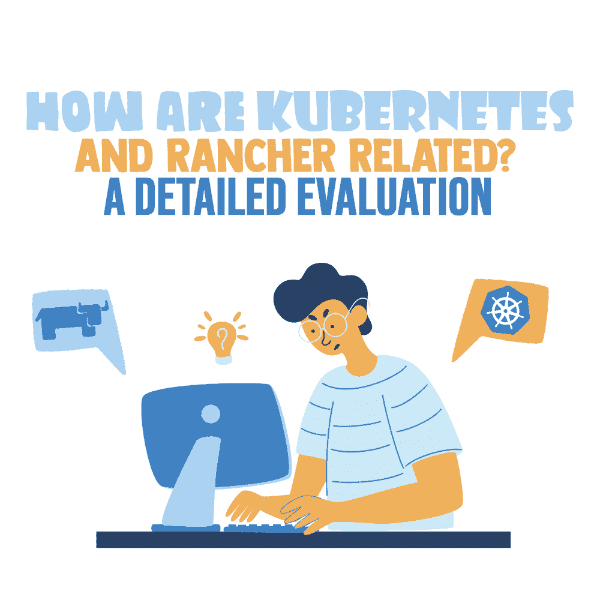
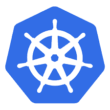

# 库伯内特斯和牧场主有什么关系？—详细的评估

> 原文：<https://simpleprogrammer.com/kubernetes-and-rancher/>

In the era of cloud-native development, there are two technologies that are often interchangeably understood: Kubernetes and Rancher. Both these technologies are popular and are complementary rather than competitive. There has been constant comparison between the two, amid certain uncertainties.

Kubernetes 是一个强大的容器编排引擎。另一方面，Rancher 拥有完整的 Kubernetes 分布，增加了它的价值。Rancher 是 Kubernetes 景观中不可或缺的一部分，这个景观非常复杂和巨大，但是开发者很少知道它们之间的联系和比较。

在本帖中，我将向您展示这两种技术各自的含义、它们的显著特征、使用它们的组织以及它们的替代方案。了解这两种技术之间的关系是很有价值的，如果你想找一份开发人员的工作，这也是很有帮助的。

## What Is Kubernetes?

*[Kubernetes](https://en.wikipedia.org/wiki/Kubernetes) 是一个开源的容器编排系统，最初由谷歌设计，现在由云原生计算基金会维护。*

Kubernetes ，也称为 K8s，是一个开源的容器编排平台，用于自动化部署、扩展和管理容器化的应用程序。它的名字来自希腊语，意为“飞行员”

Kubernetes 将具有应用程序的容器分组到逻辑单元中，以便更好地管理和发现流程。它提供了一个有竞争力的框架来灵活地执行分布式系统，并监控单元的伸缩、故障转移和部署。它可以在公共云中使用，也可以在内部使用，或者同时在两者中使用。

Kubernetes 为[应用程序部署](https://simpleprogrammer.com/deployment-made-simple/)提供工具，管理容器集群，根据需要扩展应用程序，优化容器下底层硬件的使用，并在需要时方便应用程序组件重启和在系统中移动。

在最近的一项调查中，83%的人认为 Kubernetes 虽然不是容器编排的唯一选择，但显然已经成为首选。

*主要特性:*

*   易于使用，功能丰富
*   积极的社区支持
*   高可用性的完整版本控制
*   自动化调度
*   自动化回滚和推出
*   水平扩展和负载平衡
*   节点和容器的自我监控
*   存储编排

*使用 Kubernetes 的组织:*

谷歌、Udemy、Shopify、Slack、Robinhood、StackShare、Nubank、Babylon、AppDirect、阿迪达斯、Bose、纽约时报、诺基亚、Spotify 和 Wink。

*立方替代物:*

亚马逊弹性容器服务、红帽 OpenShift 容器平台、谷歌 Kubernetes 引擎、SaltStack、Cloud Foundry、Portainer。

## 什么是牧场主？

Rancher 实验室是一家位于加州库比蒂诺的开源软件公司。该公司帮助大规模管理 Kubernetes。Rancher Labs 成立于 2014 年，拥有 3 万个活跃团队。

从数据中心到云再到边缘， [Rancher](https://rancher.com/) 让您交付 Kubernetes 即服务。对于采用容器的团队来说，它是 Kubernetes 管理的统一平台。它包含一个全面的软件堆栈，关注维护多个 Kubernetes 集群的操作和安全障碍。它还为 [DevOps](https://simpleprogrammer.com/devops-trends-2020/) 团队提供了执行容器化工作负载所需的集成工具。

Rancher 向 Kubernetes 添加了一个完整的用户界面和工作负载管理层，简化了采用并集成了持续交付组件。它从数据中心到云再到边缘部署 [Kubernetes 集群](https://www.amazon.com/dp/149203391X/makithecompsi-20)，并通过集中访问控制将它们联合起来。它有助于简化完全安全的集群部署。

Rancher 以一致的方式部署多集群应用，并集中配置安全策略，深入监控性能。它通过与 LDAP 或 Active Directory 等服务提供商的流畅连接来控制访问。它支持 DevOps 工具，如用于创建 CI/CD 管道的 [Jenkins](https://www.amazon.com/dp/149203391X/B005EI8686) 、Travis 和 GitLab。

牧场主鼓励任何 CNCF 认证的含有 RKE 和 K3s 的 Kubernetes 发行。它与 Prometheus、Grafana、Fluentd 和 Istio 等流行的开源项目无缝集成，使 Kubernetes 更有价值。

然而牧场主的另一个重要概念是牧场主库伯内特(RKE)的引擎。它是 Rancher 的命令链接实用程序，用于创建、管理和升级 Kubernetes 集群。创建 Kubernetes 集群作为软件的独立部分。

Rancher 包含一个完整的 Kubernetes 发行版，但它在三个主要方面增加了 Kubernetes 的价值:集群操作和管理、直观的工作负载管理和企业支持。

根据 Forrester New Wave 2020 的说法，“Rancher 是寻求在各种各样的云平台和边缘环境上可用的成熟的多云容器管理平台的公司的理想选择。”

*主要特性:*

*   统一的多集群应用管理
*   混合和多云支持
*   加快 DevOps 的采用
*   可靠的安全策略和一致性
*   统一的应用目录
*   运行时和流程编排、映像管理
*   在一个位置轻松管理多个集群

*使用牧场主的组织:*

KPN、贝尔、康卡斯特、儿童救援联盟、Windstream、阿里巴巴旅游、trivago、Oxylabs、星巴克、Yousign 和 useinsider。

*牧场主的替代品:*

Azure Kubernetes 服务、Google Kubernetes 引擎、Red Hat OpenShift 容器平台、AWS Fargate、Cloud Foundry 和 Mirantis Kubernetes 引擎。

## 关键比较参数:Kubernetes vs. Rancher

为了方便起见，我在这里提供了一个表格，详细列出了每种技术的关键方面——Kubernetes 和 Rancher——以便您可以清楚地看到它们之间的比较。记住，这两种技术是互补的，而不是竞争的。

| 因素 | 技术 | 大牧场主 |
| 关键特征 | 轻量级、易于使用、易于访问、高度模块化、云友好、可更换的组件 | 有效的用户管理、管理主机、部署容器和监控资源 |
| 技术 | 用于在机器集群下管理容器的容器编排技术 | 用于管理面向云的 Kubernetes 集群的技术本机 DevOps 技术堆栈 |
| 自然 | 面向容器的开源编排系统，加速开发并简化运营 | 用于执行私有容器服务的开源容器管理平台 |
| 易用性 | 处理多个集群，因此使用起来有点复杂 | 更易于使用，因为它可以很好地管理集群 |
| 分门别类 | Kubernetes 属于容器编排的范畴 | Rancher 属于物联网边缘平台类别 |
| 网络和文件隔离 | 无法使用 | 有空的 |
| 企业规模 | 更多地在企业领域实施 | 更多地在小型企业中实施 |
| 集成工具 | Docker，微软 Azure，Ansible，谷歌计算引擎，Rancher | GitHub，Docker，Jenkins，Amazon EC2，kubernetes，digital ocean，docker，Jenkins，Amazon ec2 |
| 分配和安装 | 复杂的分配和安装程序 | 使其易于分发和安装 |
| 基于云的服务 | 云托管的 Kubernetes 服务，如 GKE、EKS 等。运营 Kubernetes | Rancher 为这些基于云的服务提供了增强的管理体验 |

如上所述，Kubernetes 和 Rancher 有各自不同的特征。与此同时，某些元素[暗示它们是互补的](https://www.youtube.com/watch?v=5h1TCrh_hZ0)。因此，每个人都有自己的想法！

## 互补，而非竞争

对于任何构建云原生基础设施的组织来说，这两种工具都很重要。Kubernetes vs. Rancher 是一个常见的比较。

但是，请记住，这两种技术并不具有竞争性；它们是互补的，每一个都有自己的意义和作用。

Kubernetes 被认为是物理/虚拟机集群下容器编排的好选择。另一方面，Rancher 主要关注 Kubernetes 集群的管理。企业必须首先了解和分析自己的需求，然后决定首选方案。