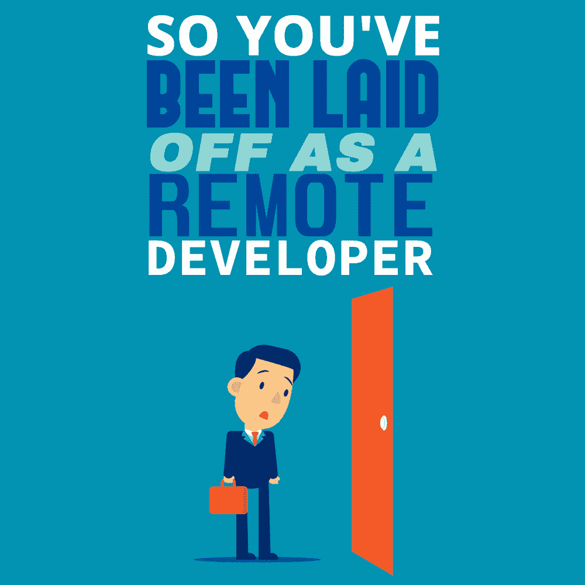

# 所以你作为远程开发人员被解雇了

> 原文：<https://simpleprogrammer.com/laid-off-remote-developer/>

Here's the situation: It is 2020, the COVID-19 pandemic has struck, most of us are working remotely, and we know that costs will need to be cut.

许多企业需要进入一个蟑螂阶段，以获得至少一个在未来 12-18 个月战斗的机会。后果会有很多，其中之一就是身边的朋友会被裁掉或者被裁员。

这对世界各地的许多初创公司来说尤其有害，它们总是不得不微妙地平衡现金流，以确保员工的家人有饭吃。

想象一下:一天早上，你的经理给你发了一条信息，说了四个可怕的词: ***“我们需要谈谈。”*T3】**

他不像往常那样乐观，而是变得严肃起来。这将是一次艰难的谈话。于是，视频通话开始了。在说话之前，你们互相看着对方，你知道接下来会发生什么。

游戏结束了，银行里的钱刚好够支付通知期的费用——至少你有这种安慰。

到目前为止，你已经注意到这种情况的迹象，但选择忽略它们。承包商在几个月前就被解雇了，你会感觉到你的直觉，但希望你是偏执狂。

两周前，最新的初级开发人员被裁掉，希望能稍微增加跑道，让它看起来更真实。

你应该听我的，你应该更主动一点。

你的一部分感觉你可以做得更多，但坦白地说，没有什么是你能控制的。

虽然转述，这是去年发生在我身上的事。事实上，仅在 2019 年，我就被裁员两次，我总是团队中最后一名成员。

**这就是在创业公司工作的风险。**

希望是，如果我们挖到金子，如果我们能获得[产品/市场契合度](https://en.wikipedia.org/wiki/Product/market_fit)，同时获得一点股权，我们就能成功。

就目前的情况来看，很难预料到一切。但是当这样的危机来临时，做好准备真的会有所不同。在这篇文章中，我将与你分享我所学到的东西——来之不易——这样**你**也能更好地准备。

## 对你周围的人感同身受

在一家初创公司，有两大类人会受到此类事件的影响:你的同事和董事。

几乎所有时候，同情都流向了员工。通常，这是他们唯一的生命线，他们需要养活家人，大多数时候他们没有多少积蓄。

另一方面，董事或所有者了解企业的财务健康状况；他们可能不得不动用个人储蓄，如果要拿工资的话，工资也往往较低。在某些情况下，它们依赖于更节税的方法，如股息或董事贷款。

在我个人合作过的大多数预营收创业公司中，大多数董事都遵循了这个剧本。

作为一名企业家是孤立的，有证据表明领导一家公司的心理代价。

这些人的责任是确保他们的员工得到照顾，而不管对他们自己的影响。

作为一名员工，如果你有情绪控制能力，退后一步，从更高的层面来理解这种情况，你就会洞察到谁在痛苦中，谁需要帮助。

如果你注意到有人不说话，主动伸出手，让他们知道你会支持他们。

远程对话更加困难，因为我们不能像面对面那样从正常的情感暗示中做出反应。

毕竟，我们都是人，我们都在一起。

## 重新协商你当前的角色

For the most part, there are three outcomes of a redundancy event:

*   该公司的资金已经完全耗尽，很可能进入破产管理阶段。
*   公司需要削减成本才能生存。
*   该公司需要让所有人都离开，但一旦尘埃落定，未来可能会有一个机会。

对于所有这些选择，强烈建议你将大部分时间投入到[建立你的个人品牌](https://simpleprogrammer.com/store/products/how-to-market-yourself/)上。

积极的一面是，如果你不是第一个被解雇的人，那么失去你很可能会给公司带来负面影响。

与此同时，你可以与管理层进行直接对话，通过这一框架进一步评估当前的财务状况。

**“我知道在接下来的 12-18 个月里，为了公司的生存，这将是一项削减成本的工作，这就是我能为你做的…”**

请随意添加您自己的价值主张，但我会这样做。

如果你确实喜欢你的工作，或者你需要一种主动的安全感，打个非正式的电话把你的工作时间从 5 天改为 4 天(或者更少),薪水是你工资的 80%。

你提出的这些选择和决定将把你放在一个框架中，在这个框架中，你对企业的情况有同理心和理解。结果，你会得到更高的重视和尊重。

如果他们坚持削减成本并找到解决方案，他们可能会回应:

*   谢谢你的提议，但我们需要你全职完成我们的目标。
*   是的，这将是一个问题，让我们想想办法。
*   我们需要每个人都全职工作，你会考虑减薪吗？

在最后一种情况下，如果你是一个高绩效员工，你可能会有股权讨论或其他类型的好处。你必须小心，因为任何形式的减薪都会让你处于更弱势的地位；您将以更低的成本为企业提供同样的价值。

你需要意识到你可能会被操纵到这个位置，尤其是当你觉得你没有太多选择的时候。

在我的第一份软件开发工作中，我为一家公司工作了三年半。曾经有一段时间，钱快用完了，客户的购买量没有预期的多。所有的开发人员都可以选择保留他们的工作，但是要减薪 50%。

回想起来，作为一名孤立的远程开发人员，对我的技能需求毫无概念，我接受了这些条款。

更糟糕的是，我甚至没有想过要进行一场关于股权的对话，我太天真了。

许多开发人员犯了这个错误，并认为他们交付的东西不值得公平，更不用说进行这样不舒服的对话了。

综上所述，对于大多数成功的创业公司来说，都有高峰和低谷；而且总会有削减成本的练习。

你是否想自担风险地坐这个过山车取决于你自己。

## 做一个专业人士，拒绝破釜沉舟

去年我加入了一个新团队。很明显，空气中弥漫着对管理层的不满情绪。

团队的核心文化受到毒害，他们的目标和观点支离破碎，所有朝着共同使命的进展都陷入停滞。

我是作为一个局外人进来的，不知道这个团队的内部政治。员工们不知道的是，几个月后，我们所有人都遭遇了裁员。

双方都做出了错误的决定，明显缺乏透明度，几乎没有任何形式的沟通。

发生的事情是公开发布员工面临的问题，点名羞辱公司。

无论有多么好的意图，这种行为都是不恰当的、恶意的和不负责任的。这一事件损害了公司的筹资努力，也损害了员工的声誉，影响了那些参与者获得未来工作的能力。

在整个过程中，我觉得自己被夹在中间。当别人不低着头时，我保持低着头，我完成了所有被放弃的项目，并兑现了我们先前的承诺。

我与团队保持沟通，尽管我有时会感到沮丧，但我有责任尽我所能做好我的工作。

我亲身经历了消极助长消极。这种循环影响人们的心理健康，应该避免，即使这意味着要对抗你钦佩的有经验的专业人士。

你需要能够后退一步，提醒自己你所经历的一切都是暂时的，并且能够只见树木不见森林。

作为一名开发人员，尤其是作为一名高级人员，您的角色是交付和支持您的团队。随着你成长为一名专业人士，你会明白成为一名价值创造者只是企业成功的一小部分。

一点点的同情会有很大的帮助。诸如此类的人际交往技能确实需要很长时间才能成熟，但这是成为技术主管和首席技术官的首要先决条件。

## 掸掉身上的灰尘，制定计划，然后执行

Trying to find a new role can feel overwhelming, switching to the mindset of looking forward and coming to terms with the change.

近年来，我个人最大的成功是与我的人际网络中的人取得联系，特别是我以前与天使投资人合作过的人。

大多数年轻的初创公司现金储备都很少，当他们的每一次招聘都有很大风险时，信任和忠诚等品质就变得至关重要。

通过与天使投资者联系，你可能会发现新的创业公司正在寻找你的经验。如果你能得到介绍，很可能你会因利用天使的名声而处于有利地位。

尽管你可能处于职业生涯的早期阶段，你的关系网可能很小，但举手直接寻求帮助不会有什么坏处。随着你不断积累多年的经验，你会更好地关注你想要走的路，以及实现目标需要采取的行动。你的职业生涯是一场漫长的比赛——你面前会有很多未知的机会，没有人知道未来会怎样。

我从来没有通过招聘经理或招聘人员被安排过职位，我所有的工作都是通过与联合创始人的直接对话，通过我自己的个人品牌或网络获得的。

寻找招聘人员或申请一份有几十份甚至几百份申请的工作的常规途径太慢了。甚至在 3-4 周后等待可能的面试决定几乎没有任何好处，我更喜欢更主动和直接的方法。

如果你能[提前展示价值](https://worldclassremote.com/balancing-delivering-value-for-free-and-volunteering/)并证明你的洞察力而不要求任何回报，你将有更大的机会获得成功并找到你的下一个角色。

得到负面消息后，你行动越快越好，因为时间对你不利——你的最后一份薪水就在眼前。

如果你需要更成功的开发者如何营销自己的灵感，看看他们的网站、博客和社交媒体。你可能刚开始，但我们在职业生涯中都曾经历过那个阶段。