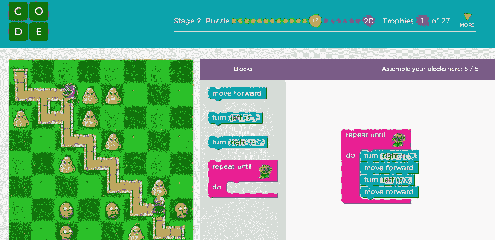
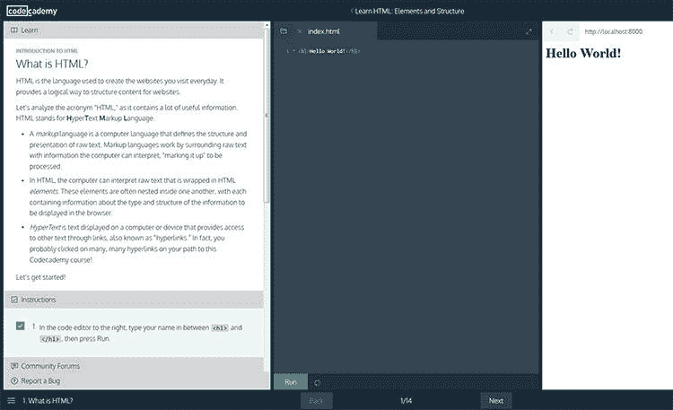
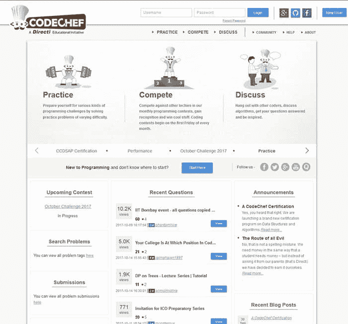

# 为什么您应该学习编码以及从哪里开始

> 原文：<https://simpleprogrammer.com/learn-code-where-start/>

在世界前 20 名最富有的人当中，有 6 个人的职业是基于信息技术的。他们中的四个是世界十大亿万富翁。这意味着不仅 It 人有很好的机会变得非常富有，而且 IT 行业正在蓬勃发展。

有了足够的技能，即使你生活在第三世界国家，你也能确保获得体面稳定的收入。如果你很幸运，有一个值得关注的创业想法，你可能会像马克·扎克伯格一样获得数十亿美元的大奖。

成功的 IT 职业生涯的第一步是学习如何编写或理解计算机程序。有了这么多鼓励从事编程职业的理由，你会发现学习编程只需要动机和正确的资源来帮助你成功。

## 学习编程技能的好处

不久前，编程曾经类似于火箭科学。只有最聪明的人才能处理它。此外，昂贵而笨重的设备使得只有相对较少的一部分人能够学习编程。

幸运的是，今天的高级编程语言已经简化了编码。先进的微处理器、更便宜的计算机以及大量的书籍和课程让每个人都可以学习和练习编程技能。

随着信息技术越来越深入我们的生活，对程序员的需求是疯狂的。许多电子设备被编程为在从娱乐到医疗保健和国防的各个领域为我们服务。

物联网的时代已经来临。甚至像牙刷这样平凡的东西也可能让微芯片处理一个程序，允许它们与我们的智能手机和其他设备进行通信，以便在我们生活的各个方面获得更好的体验。因此，在可预见的未来，IT 行业不太可能衰退。

日常生活与电子设备的日益融合是许多人将不断发展的信息技术视为成功机会的原因。知道如何给计算机编程可以给人们带来很大的好处。

以下是学习编程技能的好处，以及如何利用这些技能在职业和个人生活中获得满足感:

### 改变世界

计算机科学已经改变了我们工作和交流的方式。它消除了人与人之间的边界和距离。感谢程序员，像智能手机一样小的东西可以提供无数娱乐、教育、交流和购物的机会。

计算机科学从未停止用即将彻底改变我们生活方式的突破性技术给我们带来惊喜。最新、最有前景的发展包括人体器官的 3D 打印、自动驾驶汽车和卡车、太空出租车、人脸检测系统和各种机器人。

把代码变成有用的东西感觉好极了。许多人选择软件开发作为他们的职业，为改善全球数十亿人生活的数字解决方案做出贡献。毫无疑问，参与 IT 开发并真正创造未来激励并让程序员感到完整和有价值。

能够启动自己的应用程序或技术想法可能不会产生全球性影响，但它肯定会改变你自己的生活。运用计算机编程的力量可以改变你周围的世界，让你的生活充满任何初创公司创始人都可能感受到的目标、动力和兴奋。

### 在世界任何地方都有一份稳定的工作

随着 IT 创新继续对我们生活的各个领域产生影响，对软件和 web 开发人员的需求只会增加。许多新的和现有的公司将需要网站来与在线零售商竞争。工业将需要更高的自动化和精确度。成为一名优秀的程序员似乎是一个伟大的职业，因为你的服务总是有需求和受欢迎的。

即使在发展中国家，对网络和软件开发人员的大量需求也创造了许多就业机会。像乌克兰和印度这样的国家成为了外包目的地，国际科技创业公司雇佣远程员工来满足他们的网络和软件开发需求。

尽管与第一世界的同事相比，开发人员在这些国家的工资要低得多，但成为程序员对他们来说是一份梦寐以求的工作，因为较低的生活成本使他们即使工资相对较低也能茁壮成长。全球对开发商的需求确保了稳定的利润，即使是在经济困难的国家。

事实证明，对于世界各地许多需要转行的人来说，学习如何编程是一条出路。你可以找到一些人的故事，他们几乎不能支付他们的账单，这使得他们开始在空闲时间学习编程，以便有更好的机会找到一份体面的工作。

### 提升你所关注的行业

计算机和信息技术是医疗保健、农业、教育的一部分——你能想到的都有。如果你想加强任何行业，你可以做的第一件事是将信息技术引入其流程。掌握数据科学和信息学可以帮助您在几乎任何行业实现自动化，使操作更快、更精确，并降低劳动强度。

对一个行业充满热情通常意味着了解这个行业的问题和挑战。信息技术是用来解决问题的。因此，编程技能给你力量，帮助人们更好地处理他们在任何领域面临的问题。

大多数人觉得能够解决他们关心的行业中的问题是非常令人满意的。例如，一个关心环境的人可以通过为一个环境非政府组织设计一个网站这样基本的东西，或者设计一个软件平台这样复杂的东西来帮助创新、自动化和简化整个环境运动，从而改变世界。

### 作为企业家省钱

对于许多科技初创公司的创始人来说，能够编写和解释计算机程序可能是一项节省成本的技能。编程技能对企业家来说是有益的，因为他们可以在不雇佣其他人的情况下完成编程工作。

即使他们决定雇佣帮助，他们也能够评估开发人员的资格，招募最好的员工，促进与雇佣的开发人员更好的对话，并有效地监控和调整他们在项目中的工作。

知道如何编码可以帮助企业家避免可能会让他们损失生意的麻烦和失败。能够编写或至少理解代码的初创公司创始人可以评估他们为项目雇佣的程序员的资格，从而招募最合格的劳动力来启动他们的企业。他们能够及早发现可能的问题，以便避免它们，或者在必要时改变策略或重点。

### 享受做你真正喜欢的工作的乐趣

能够将代码转化为功能性的数字产品是一件令人着迷的事情。许多人梦想成为程序员，因为他们有一种“巫师”的乐趣，可以用一堆字母、数字和符号来制作视频游戏或电影，控制机器人，或者给世界上任何地方的人发送信息。

没有多少事情能像一份有趣的工作一样，给人生理上的满足感。你喜欢的工作对你的幸福生活有很大的帮助。此外，许多 IT 公司愿意付出额外的努力，让他们的程序员对自己的工作感到满意。

虽然编码本身可能令人兴奋，但许多公司通过提供动态、有趣的企业文化以及丰厚的福利来吸引软件开发人员。以谷歌和脸书等科技巨头为榜样，即使是小型网络和软件开发公司也在为员工提供额外津贴，并创造出优秀的企业文化。

很多时候，从免费食物到高级医疗保健等福利使得在 IT 行业工作成为一个人从公司工作中所能获得的最积极、最有趣的经历之一。科技公司正在尽最大努力用他们令人敬畏的企业文化吸引尽可能多的熟练程序员。这种乐趣和美妙给了人们学习编码的另一种动力。

## 为了编码你需要学习什么

如果你真的想学习编写专家级的计算机程序，准备花 [10000 个小时](https://en.wikipedia.org/wiki/Outliers_(book))来获得必要的技能。然而，一些人声称一个人只需要 [20 小时的练习](https://www.youtube.com/watch?v=5MgBikgcWnY)就能学会足够开始自我修正和完善自己的技能。

不管怎样，有大量的案例证明今天的编程不是火箭科学。许多自学成才的程序员甚至在开始学习编程后的几年内就成功地在大公司找到了工作或创办了自己的公司。

如果你喜欢更具指导性的学习代码的方法，一些导师承诺在 [30 天](https://onemonth.com/)内通过实时研讨会和编码训练营教你编程基础。这种方法可以促进程序员新手的成长，提高他们自己学习高级编程概念的能力。

老实说，程序员从未停止学习，主要是因为技术正以惊人的速度发展。因此，开发人员必须面对新的挑战，解决新的问题，才能赶上进度。渴望成功的程序员应该准备好定期更新他们的知识，监控新的趋势和技术，以便在市场上提供最新的技能。

### 动机和实践

没有动力和练习，学习任何技能都很难。所以你最好在学习过程中具备这两个基本要素。

当学习如何编写计算机程序时，创造的激情、对技术的热情和职业机会可以成为强大的动力助推器。

获得像编程这样的技术技能需要大量的练习。事实上，如果不自己动手做点什么，或者不与其他开发人员合作做一个项目，看书和看教程是完全没有用的。

一些职业程序员承认，六个月的真实项目工作[帮助他们学到了比整个大学编程课程更多的东西](http://www.applematters.com/article/10-things-every-programmer-should-know-for-their-first-job/)。作为一个初学者，通过编写代码来解决简单的问题会让你轻松地进入计算机编程的世界，从而为一个有前途的职业铺平道路。

[https://www.youtube.com/embed/nKIu9yen5nc](https://www.youtube.com/embed/nKIu9yen5nc)

Every top IT entrepreneur started learning to code by writing simple programs. Bill Gates wrote a tic-tac-toe game. DropBox creator Drew Houston made his first program ask what the user’s favorite color was and how old he/she was. Solving even the most humble problems at the beginning of their career allowed many successful developers to realize how empowering programming skills could be.

他们说开始学习编程可能会令人生畏。成功的关键是找出用计算机代码解决问题的逻辑部分。随着时间的推移，练习和决心肯定会帮助你掌握它的窍门。

## 学习编程的实用资源

幸运的是，人们可以利用大量的资源来学习如何编码。虽然计算机科学是一个相对年轻的学科，但对于那些希望学习它的任何一部分的人来说，它既不缺乏离线资源，也不缺乏在线资源。

太多的行业在寻找 web 和软件开发人员，而太多的人愿意成为 IT 社区的一部分。这就是为什么编程专家不遗余力地写书、创建教程和交互式课程，以满足那些不断需要合格程序员来维持或扩展业务的潜在开发者和雇主的愿望。

像麻省理工学院和 T2 哈佛大学这样的主要教育机构甚至公开了他们的计算机科学讲座，让世界上的任何人都可以向最好的教育家学习。

今天的许多教育资源是专门设计来帮助计算机编程新手处理他们可能面临的典型挑战的。然而，最好的资源都有关键的共同品质，可以帮助你在学习过程中取得成功。这些资源执行以下操作:

### 让学习过程充满乐趣

一开始，搞清楚编程的逻辑部分可能并不容易。然而，交互性和游戏化可以帮助任何个人获得对编码的基本理解，并顺利地转向不那么枯燥和更实用的东西。

像 [CodeCademy](https://simpleprogrammer.com/codecademy-py) 这样的网站提供带有内置解释器的互动教程。一个学生写了一小段代码，马上就能看到浏览器是如何解释的。在教程的过程中，初级程序员可以在现实世界的例子和小项目中应用概念，比如构建网页、计算餐馆小费等。

Code.org

Code.org 提供互动和视觉增强的节目活动，可能对儿童和成人都有吸引力。新的程序员也可能开始编写小游戏。这样的活动很有趣，它们能让学生弄清楚如何使用代码来解决问题，并让计算机做他们想让它做的事情。

玩电脑游戏是许多年轻程序员最喜欢的消遣。通过构建游戏来学习编码激发了他们的兴趣和记忆。众所周知，当人们带着积极的情绪学习事物时，会更好地记住和理解它们。

像明天公司这样的游戏发行商创造了完整的游戏来帮助人们更好地理解编程概念。人力资源机器是一款让学习编程变得尽可能有趣的游戏。

### 帮助你运用你的知识

实践是教育的动力。它让你避免了学习任何学科的基础知识时最令人沮丧的事情之一——对所学知识的实际应用一无所知。许多人放弃学习如何编码，因为事情对他们没有意义。

人们可以阅读大量的书籍或观看教授如何编写代码的教程，但实际编写一个计算机程序并立即看到它在现实项目中的表现更有激励性，甚至可以激发新手的技能。

CodeCademy 的交互式教程非常适合开发新手。

CodeCademy 的互动教程在帮助学生实时应用他们的知识方面做得很好。该平台将课程分成易于消化的小课程，并要求使用每节课中学到的小块知识来建立一个网页或解决一个实际问题。CodeCademy 教程包含一个代码解释器，这样学生可以立即看到他们编程的结果。

自由代码营邀请它的学生通过为他们的项目做贡献来帮助非营利组织。这确实是一个很好的方法来巩固你的编程技能，用它们来构建现实生活中的解决方案。参与此类项目将有助于开发人员弄清楚编程是如何工作的，如何修复问题，以及如何应用代码来运行桌面或基于网络的应用程序。

### 激励你前进

灵感是学习的动力。我们从我们想加入的行业中最成功、最有才华的人那里获得灵感。我们自然想向他们学习。

许多著名的计算机科学家、程序员和 IT 企业家，如罗伯特·诺伊斯、丹尼斯·里奇、马克·扎克伯格和比尔·盖茨，有一个共同点，他们都曾就读于常春藤盟校。没有多少人能够幸运地在顶尖大学如麻省理工学院或哈佛大学学习计算机科学。然而，感谢万维网，我们可以在线观看这些大学的讲座，并从讲师的氛围、遗产和专业知识中获得灵感。

哈佛 CS50:计算机科学导论

如果你开始你的计算机编程生涯，没有什么比向经验丰富的教育者学习更鼓舞人心和更有帮助的了。所以，去互联网上寻找麻省理工学院关于计算机科学的讲座以及传奇的哈佛大学 CS50 课程开始编程吧。

### 向你展示专业程序员是怎么做的

最关键的编程技能之一是阅读和理解他人编写的代码的能力。许多资源可以让您看到专业程序员如何解决问题，向编程社区提问，以及与其他程序员协作和竞争。这些资源可以帮助您学习和利用最佳编程实践。

看到并理解更有经验的开发人员如何将他们的想法数字化并让计算机做有用的事情，就像阅读一本食谱，你可以用它来重现他们的菜肴或创造你自己的菜肴。在大多数情况下，在你的解决方案中使用别人的代码是可以的。最重要的是您分析代码、理解代码并调整代码以服务于您的解决方案的能力。

CodeChef 允许新手程序员沉浸到开发者社区中进行实践和经验分享

有举办编程比赛的网站。CodeChef 是一个提供实践竞赛和挑战的网站，人们可以在这里分析来自世界各地的开发人员用不同语言提供的解决方案。这是理解程序员如何解决一些现实生活中的问题的好方法。其他类似的网站还有[黑客排名](https://www.hackerrank.com/)和[黑客世界](https://www.hackerearth.com/)。

面向程序员的在线社区，例如 [Stack Overflow](https://stackoverflow.com/) ，对于向专家学习也有很大帮助。这样的社区允许新手程序员看到最佳实践和其他人的错误，反过来帮助他们解决自己的问题。

### 学会编码，你会走得很远

到 2020 年，仅在美国就将有超过 100 万份与计算机科学相关的工作。在不久的将来，对合格编程服务的需求似乎将继续超过程序员的供给。

如今，似乎没有一个行业没有计算机的帮助而运转。因此，职业程序员将继续享受体面的薪水和职业价值。

多亏了高级编程语言，写代码变得比以前容易多了。因此，一个人不需要成为天才也能学到足够的知识来获得一份编程工作。学习如何给计算机编程最难的部分是弄清楚用算法解决问题背后的逻辑。一个人可以通过实践、与更有经验的程序员合作以及从他们那里学习技巧来做到这一点。

有很多免费和付费的资源可以用来学习如何编码。它们中的许多是由程序员为程序员创建和赞助的，是为新手程序员设计的。它们旨在帮助开发人员在实际项目中实践和应用新技能。一个人只需要决心和学习的欲望。

我希望我的文章能激励想成为开发人员的人学习编程，尽管他们可能会面临许多挫折。因为创造计算机程序就是创造未来。为了世界最好的未来，我们都需要尽可能多的熟练程序员！