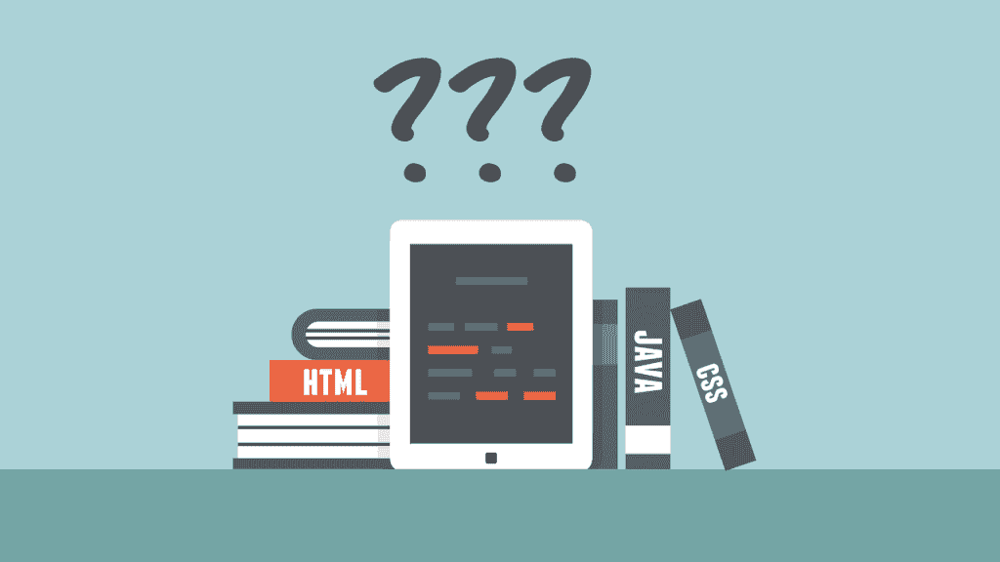
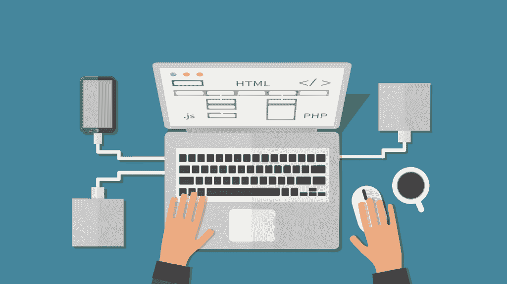

# 应该学什么编程语言？

> 原文：<https://simpleprogrammer.com/learn-programming-language/>

刚进入软件开发领域的程序员向我提出的最常见的问题之一是，他们应该学习哪种编程语言。

对于一些有抱负的开发人员来说，这个问题最终成为他们永远无法逾越的绊脚石。

我指导过很多开发人员，他们总是事后批评自己或者改变主意，从一种编程语言跳到另一种编程语言，总是担心做出错误的决定。他们强调“我应该学什么编程？”

如果你对此感到压力，那么这篇文章是给你的。

首先，我要消除一些疑虑；然后，我会给你一些真正的实际考虑选择你的第一个编程语言学习。

### **实际的语言并不那么重要**

是的，你没看错。你学什么语言并不像你想象的那么重要。

我这样说有几个原因，但其中一个主要原因是因为许多编程语言在本质上都非常相似。是的，语法不同。是的，编程语言可能看起来不同。他们甚至可能有完全不同的特征。

然而，从本质上讲，所有编程语言的共同点比您最初所想的要多。**几乎所有的编程语言都会有:**

*   **分支的基本结构**
*   **循环的基本结构**
*   **调用方法或程序**
*   **一种在高层组织代码的方法**

许多编程语言如此相似，以至于如果你知道一种语言，你几乎已经知道另一种语言了。C#和 Java 是很好的例子。JavaScript 与这两者非常相似。

学习你的第一门编程语言总是最困难的。然而，一旦你学会了一门编程语言，学习第二门就更容易了。在你掌握了两种或更多种编程语言之后，每一种额外的编程语言都会变得容易得多。

如果你甚至不太了解一门编程语言——或者根本不了解——可能很难相信这些说法，但是**在我的职业生涯中，我已经学会了至少 10 种不同的编程语言******。我可以向你保证，第一个和第二个是最难的。****

****编程语言不仅比您想象的更相似，而且您还可以轻松地切换到不同的编程语言，并在以后学习它。****

****这意味着，即使你学习了一种编程语言，并决定它不是正确的，或者你得到了一份工作，你会使用不同的编程语言，这不是一件大事。你已经完成了学习你的第一门编程语言的艰苦工作。****

****你可能还会发现，许多开发人员的工作——尤其是在像微软或谷歌这样的大公司——并不要求你懂一门特定的编程语言。我甚至参加过很多面试，在面试中我被要求用**任何我觉得最舒服的语言**来解决一个编程问题。没有任何限制，也没有我绝对需要了解的特定语言。****

### ******选择编程语言的考虑事项******

********

 ****Therefore, I really don’t think it matters all that much what programming language you decide to learn first when you're looking to [become a software developer](https://simpleprogrammer.com/how-to-become-a-software-developer/), but if you are still having some trouble making a decision, **here’s a list of 5 things to consider:**

*   **工作前景和未来**
*   **您感兴趣的技术**
*   **难度等级**
*   **您可用的资源**
*   **适应性**

### **1。工作前景和未来**

我想说，对你们大多数人来说，**要考虑的最重要的事情是一种特定的编程语言可能会帮助你们得到什么工作**以及这种语言的未来是什么。

现在，对于大多数流行的编程语言来说，在任何给定的时间都会有大量的工作机会。不同的编程语言的受欢迎程度可能会有升有降，但是如果你关心工作的可获得性，你可能想要考虑一种主要的、受欢迎的编程语言。

在我写这本书的时候，我认为最流行的编程语言是:

*   **C#**
*   **Java**
*   **Python**
*   **红宝石**
*   **JavaScript**
*   **C++**
*   **PHP**

对于用这些语言之一编程的开发人员来说，并不缺少工作。

也就是说，根据你在世界上的居住地，如果你不愿意搬迁，你可能需要更有选择性。例如，如果你住在阿肯色州的某个小镇，那里只有一家科技公司，而这家科技公司用 Java 做所有的事情，我建议你[学习一些 Java](https://www.youtube.com/watch?v=OrUL2zCNBXM) 。我想对大多数人来说不会这样，但是如果是你，我想你的决定很容易。

如果你愿意搬迁或者打算做自由编程，你可能会 [**专攻一种更古怪且不太广泛使用的语言**](https://simpleprogrammer.com/2014/04/28/well-biggest-mistake-make-software-development-career/) 并且在一个专家很少的领域做得很好。但是，如果你刚刚开始，我会试着坚持一些更主流的东西。

除了工作前景之外，另一个需要考虑的因素是你正在考虑的编程语言的前景。

在写这本书的时候，Objective-C 可能不是入门语言的好选择，原因很简单，因为大多数 iOS 开发者正在转向 Swift，而苹果正在大力投资于 [Swift 编程语言](http://www.amazon.com/exec/obidos/ASIN/0134398017/makithecompsi-20)。

如果你已经在用 Objective-C 编程，我不会担心；仍然会有大量的工作和遗留的 Objective-C 应用程序需要维护。这可能不是未来的最佳选择。当然，我们都没有水晶球，所以很难预测哪些语言会流行，哪些不会。

不久前，我预言了 JavaScript 的死亡。这并没有发生。我刚刚参加了一个会议，其中一位发言者是 Objective-C 的共同发明人，Objective-C 在 20 世纪 80 年代初首次出现。

演讲者 Tom Love 写了一本书，他在书中基本上说 JavaScript 语言已经死了。在写这本书的时候，它是世界上最常用的五种编程语言之一。(听说自称是三号。)

关键是，你永远不知道会发生什么。

Ruby 花了好几年才流行起来。JavaScript 可以说是有史以来设计最差的语言之一，最初用于在网页上制作小弹出框或警告框；现在它是一种非常流行的语言。

所以，不要试图猜测未来，除非你有一个水晶球。在这种情况下，忘记编程。华尔街是你应该去的地方。

### **2。您感兴趣的技术**

选择编程语言时，一个很好的考虑因素就是你对什么技术感兴趣。如果你从一项技术开始，编程语言的选择可能会更容易。

我知道很多开发者对开发 Android 应用感兴趣，因为他们热爱这项技术。对大多数人来说，Java 是有意义的，因为它是开发 Android 应用程序的本地语言。(不过，你也可以用许多其他语言开发 Android 应用程序，比如 C#、Ruby，甚至 JavaScript。)

根据你最感兴趣的东西来选择你的第一门语言绝对没有坏处，因为学习你的第一门编程语言可能会很困难。你对所学的东西越感兴趣，越兴奋，就越容易坚持下去，越容易度过学习曲线中的困难部分。

我真的很想开发一个 iOS 应用程序，因为我刚刚得到了一部 iPhone，我对这项技术感到兴奋。这种兴奋让我更容易学习 Objective-C 和[开发我的第一个 iOS 应用](https://simpleprogrammer.com/2011/06/09/pacemaker-for-iphone-released/)。

如果我没有对这项技术感到兴奋，我可能不会走得很远。

不要害怕根据你感兴趣的东西来选择编程语言。你的热情可以帮助你度过学习过程中的艰难时刻。

### **3。难度等级**

Another major consideration would be difficulty level.

有些编程语言就是比其他语言难学得多。

我通常不建议从学习 C++ 开始，因为与许多其他编程语言相比， [C++相当难学](https://www.youtube.com/watch?v=sXr2gRk8nco)。C++让你处理内存和指针的管理，以及相当多的其他讨厌的结构，这些结构会让初学者陷入一个循环。这是一门很棒的语言——仍然是我最喜欢的语言之一——但不是最容易学的。

像 C#、 [**、Lua**](https://simpleprogrammer.com/2013/12/03/beginning-lua/) **、Python、Ruby 或 PHP 这样的语言开始会容易得多。甚至有专门为学习编程而定制的初学者语言，像 Scratch 或 Basic。**

如果你真的想学像 C++这样更难的语言，我不想阻止你，但是你至少应该知道你要学的是什么，并决定你是否希望你的第一语言更容易。

### **4。您可用的资源**

您可能还需要考虑学习编程语言有哪些资源。

一些晦涩难懂的编程语言可能没有那么多的书籍、在线视频或其他可用资源，这可能会使它们更难学习。其他更流行的编程语言可能有大量的在线教程、可以报名参加的训练营、书籍和其他资源。所以，一定要了解有多少和哪些资源可供你使用。

不用在电脑上安装任何东西，就可以通过你的网页浏览器在线学习 JavaScript。

虽然这不像以前那样是个大问题，因为有那么多的资源供初学者使用，但这仍然是需要考虑的事情。

你可能还需要考虑哪些资源是你可以利用的，比如电脑或软件。有点难学的编程语言可能是更好的选择，仅仅是因为有多少交互式在线教程。

你可以通过网络浏览器在线学习 JavaScript，而无需在电脑上安装任何东西。

像 C++这样的语言需要下载一些工具和软件，这可能不容易做到，也不容易获得。

至于最后的资源，我会考虑向你认识的人寻求。你能向谁寻求帮助？如果你遇到困难，有人能回答你的问题或帮助你加速学习吗？

我当然不会在选择第一种编程语言时将资源作为最大的考虑因素，但它仍然是您应该考虑的一个因素。

### **5。适应性**

最后说一下适应性。

不同的编程语言将更能适应不同的情况和技术。

例如，C#编程语言，在写这本书的时候，是适应性最强的语言之一，这要感谢像微软和 Xamarin(现在是微软的一部分)这样的公司。如果你学了 C#，你就不仅仅局限于 Windows 或者 web 编程了。**如今，C#几乎可以在每个平台上使用**，因此适应性很强。你可以用 C#写 Linux 和 Mac 的应用，甚至可以写 Android 和 iOS 的应用，完全用 C#。

许多其他编程语言也具有很强的适应性。例如，Ruby 已经被移植到许多不同的平台上，并在相当多的技术领域得到应用。JavaScript 的适应性也很强。你甚至可以用 JavaScript 来控制 Arduino 板，做机器人。看看我的好朋友吴镇男·贝利关于如何做到这一点的文章。)

其他编程语言适应性不强。例如，如果你学习 R 或 Go，你将会更多地受限于这些语言所设计的技术和平台。

越来越多的编程语言——尤其是流行的编程语言——正在被移植到更多的平台上，并在各种不同的技术中使用，但仍有一些不那么通用。

因此，如果你认为你可能今天想成为一名 web 开发人员，明天想做 Android 开发，或者你想涉足一系列不同的平台或技术，**你可能需要考虑你正在尝试学习的语言的适应性。**

### **关于选择编程语言的一些最终想法**

Even though I’ve given you some considerations to take into account when choosing your first programming language, **I want to stress the point that the actual language is not all that important.**

重要的是，你选择某样东西，并坚持足够长的时间，以度过达到熟练程度所需的学习曲线。许多刚刚起步的程序员感到沮丧，因为他们觉得他们没有理解。

我将在下一章“学习你的第一门编程语言”中详细讨论这一点只要坚持到底，你就会精通。我保证。很容易感到无聊，或者认为你学错了语言，所以不断地转换语言，但是——相信我——这不是一个好主意。

最后，考虑一下这个。当我第一次开始编程时，深入了解一门语言是程序员应该具备的最重要的技能之一。我会翻阅 C++书籍，努力学习这门语言的每一个细节。如今，这一技能已经不再重要。

今天的编程是在更高的层次上完成的。今天的编程更多的是利用库和框架，而不是语言特性。

当然，了解一门编程语言很重要——并且擅长它——但是绝对精通不再像以前那样是一项有价值的技能了。这就是为什么我说不要担心那个迫在眉睫的问题，“我应该学习什么编程语言？”。确保你确实学了一门并坚持下去，至少现在是这样。

虽然实际的语言本身并不太重要，但你如何学习它才是最重要的。看看我的课程: [*快速学习任何东西的 10 个步骤*](https://simpleprogrammer.com/products/learn-anything/) *寻找更好的学习方法。*

* * *

****