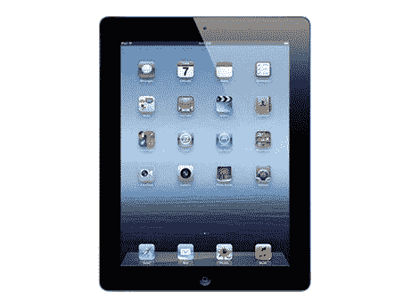
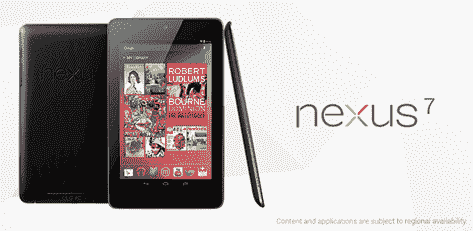

# 学 XNA，赢一台 iPad！

> 原文：<https://simpleprogrammer.com/learn-xna-win-an-ipad/>

为了庆祝我在[plur sight](https://simpleprogrammer.com/pluralsight)上的第 25 门课程，并且因为游戏编程非常有趣，我决定给那些用 XNA 观看我的新课程[2D 游戏编程简介的](https://simpleprogrammer.com/cg25-xna)[plur sight](https://simpleprogrammer.com/pluralsight)订户一些奖品。

## 你会赢得什么

**第一名**

您可以选择全新的 16gb 第三代 WiFi iPad

或者

1 年包月外加订购 [Pluralsight](https://simpleprogrammer.com/pluralsight)

**第二名**

您可以选择全新的 Kindle Fire HD 8GB WiFi

或者

6 个月包月外加订购 [Pluralsight](https://simpleprogrammer.com/pluralsight)

**第三名**

您可以选择全新的谷歌 Nexus 7 8GB

或者

3 个月包月外加订购 [Pluralsight](https://simpleprogrammer.com/pluralsight)

##  [

T4】](http://pluralsight.com/training/Products/Individual)

## Pluralsight 还将为获胜者提供一箱精美的礼品！

甚至可能会有更多的东西等着你，你的游戏一定会在这个博客上得到推广。

## 如何取胜

**第一步:**在推特上关注[我](https://twitter.com/jsonmez)和[复数视线](https://twitter.com/pluralsight)。

**第二步:**在 Pluralsight 上观看我的[用 XNA](https://simpleprogrammer.com/cg25-xna) 课程介绍 2D 游戏编程和/或我的[用一夫一妻制](https://simpleprogrammer.com/monogame-1)进行跨平台游戏开发，并就此发推文。

**第三步:**根据你在课程中学到的知识，制作一个游戏。

请将您完成的游戏的压缩版本发送给我，前 3 名游戏将赢得奖品！

**不要发 EXE！**

**确保你发送的是源代码！**

您可以将您的投稿发送到 gmail dot com 的 john dot sonmez。

请确保尽一切努力获得参赛资格。我想尽可能公平。所以，如果你做了一个很棒的游戏，但是你没有按照说明去做，我不能把这个奖给你，我必须把它给下一个很棒的游戏。T3】

## 竞赛日期和截止日期

所有提交材料必须在美国东部时间 2012 年 11 月 30 日之前完成。

获胜者将于 2012 年 12 月 15 日**宣布。**