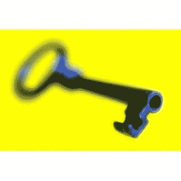
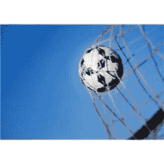

# 学会学习

> 原文：<https://simpleprogrammer.com/learning-to-learn/>

我不擅长很多事情。让我换个说法。我不是天生擅长很多事情。

有很多人比我聪明，处理事情更快，总体来说，他们对我做的几乎所有事情都有更好的天赋。

我坦率地承认，总的来说，我在我的领域和生活中都相当成功。(至少根据我自己衡量成功的标准。)

你可能想知道我怎么会如此没有天赋，却能取得如此大的成就？

我一定是做对了什么。

## 钥匙

我相信帮助我成功并将继续成功的关键是我学会如何学习自我教育的能力。

我发现只有当你对学习过程及其结果拥有自主权时，你才能真正实现学习的真正目标，也就是将知识付诸行动的能力。 

#### 那么什么是学会学习呢？

基本上，它是找出学习某一特定学科的最佳方法。你可以将这与默认的教育模式进行对比，默认的教育模式是依靠别人来教你一门学科。

作为一个整体社会，我们已经接受了这样一种观点，即参加教育机构是学习一门学科的正确途径。虽然学校教育很重要也很好，但它通常不是获取有用的可操作知识的最佳方法。

一个名叫赫伯特·斯潘塞的智者曾经说过

> 教育的伟大目标不是知识，而是行动

很明显，我并不反对通过别人的教学来学习一门学科。我把教书作为我生活的一部分，也许你阅读这篇博客的原因是因为你期望学到一些东西。

我的观点很简单，学习你将实际付诸行动的东西的最有效的方法是自己决定必须学习什么以及如何学习，而不是从别人那里获得完整的处方。其他人可能能够分解主题并帮助你学习，但你最终要对自己的教育负责。

花点时间和我一起说，因为我认为这很重要。

> “我对自己的教育负责。”

这是一个很有力量的短语。当你真正让它沉下心来的时候，你开始意识到，除了你自己，没有人能给你打分。(我不是指“所有的孩子都是特殊的，每个人都在努力，所以给一些孩子 a 和 f 并降低他们的自尊是不公平的”这种方式。)

我的意思是，不管你在大学里是全 a 还是满分 4.0，你最终必须决定你是否学到了东西，或者你只是做了工作。

只有当你对学习过程及其结果拥有自主权时，你才能真正实现学习的真正目标，也就是将知识付诸行动的能力。

## 为什么学会学习很重要

你有没有考虑过教育有多贵？有没有什么神奇的公式能让学院或大学比你自己更有能力定义和传授教育？

当你考虑花费在传统课堂教育上的金钱和时间时，你真的要问这样一个问题:你是否从你宝贵的资源中获得了最大的利益。

我想你会发现，大多数时候，答案是“不”

系统教育的问题在于它不是很有效率。学习某样东西的过程是非常适合个人的。它不像香油或药膏那样容易提炼和涂抹在渴望的年轻学生的额头上。

不仅不同的人有不同的学习风格，而且对他们来说真正重要的东西也各不相同。

让我们在这里完全诚实地说，在大多数正规教育系统中，你所做的大部分是阅读和背诵东西，而不是真正地学习它们。也许你会记住它们足够长的时间去参加一个考试，或者升级到那个学科领域的下一个级别，但是你真的学会了课本上教的大部分东西吗？你真的需要吗？

总的来说，在传统的填鸭式教育中，你的金钱和时间都没有真正物有所值。

尽管如此，我希望我们都同意教育是重要的。

因为教育是如此重要，我们不想浪费金钱或时间去获得它，所以学会如何学习是必不可少的。

有了自学任何你需要知道的东西的能力，你会突然失去束缚你的特定知识领域或技能的约束。

当你能比任何机构更有效地自学一门学科时，你就给了自己也许是一个人在生活中获得成功所能得到的最有价值的礼物之一。

你给了自己做任何你想做的事情的能力。(当然是在时空和物理现实的约束下。)

而一旦你自己也有了这种能力，你也会发现，你将处于一个很好的位置去教别人你所知道的东西。

由于世界上大多数人都不太擅长这种技能，你有一种供不应求的真正价值。如果你能掌握一门学科，找到学习这门学科的途径，并成功地做到了这一点，你就能帮助那些可能还没有像你一样掌握这门技能的人。

## 怎么做

如果我们不真正学会如何学习，所有这些关于学会学习的价值的谈论都是毫无价值的。(快速说三遍。)

我没有尽可能准确地给这个题目起名叫“学会如何学习”，而是决定用“如何做”来表达我的观点。

废话少说，让我们开始吧。

#### 界定主题范围

学习一门学科的第一步，也许是最关键的一步，是确定你想学的学科的范围。

所以很多人跳过这一步，漫无目的地在浩瀚的知识殿堂中徘徊，从来不知道自己在寻找什么。

在确定你想了解的主题的范围时，首先考虑粒度是非常重要的。你希望学习一个主题的粒度将极大地影响要消化的主题的大小或整体范围。

坦率地说……对于一个大的主题，你不可能了解太多细节。(至少在实际时间内不会。)

你基本上必须平衡主题的细节和你想学的东西的整体大小。

例如，既然这是一个编程博客，假设你想学习某项特定的技术。比如说 C#。

你可以大致了解这个主题，学习这门语言的基础知识，以及如何用这门语言构造逻辑语句和编写程序。

您也可以决定想要确切地了解 C#是如何工作的，以及每个关键字在特定环境下的确切行为。这种详细程度当然可以在 [C#语言规范](http://go.microsoft.com/fwlink/?LinkId=199552)中找到。(如果你没有点击那个链接，它会带你去一本 505 页的书，里面有几乎所有 C#语言的技术细节。)

虽然你当然可以学习这种程度的语言细节，但根据你为什么要学习它，而不是试图理解 C#语言的每种情况的每一个方面，选择 C#语言的某个特定方面来学习这种细节可能会更有好处。

再举一个简单的例子。如果你想了解世界历史，你要么想在一个非常高和概括的水平上了解整个世界历史，要么你想选择一个特定的时代和地点。

#### 有目标

接下来你需要的是一个目标。仅仅为了学习而学习是没有意义的。

你的目标可能是用新技术做点什么，或者能够写得很好，甚至能够流利地谈论这个主题。

不过，我鼓励你在选择目标时，确保你的目标是可以明确衡量和限定的。如果你正在学习一项新技术，把用它来建造东西作为目标。哪怕是建成后就要扔掉的东西。它既可以巩固你所学的知识，也可以验证你所选择的主题和范围。

我一直努力的另一个重要目标是教我所学的任何东西。我发现真正学到东西的唯一方法(我的意思是对一个主题有真正深入的了解，一个不会随着时间而消失的知识)是教它。

出席当地的用户群，写一篇博客，告诉你的配偶。(我妻子喜欢听编程语言和技术。有时她甚至会放下手头的工作，只是为了确保自己全神贯注，不会错过我告诉她的所有令人兴奋的事情的任何一个复杂的小细节。)

当你确定一个目标时，确定一个截止日期也很重要。这样做将有助于你细化目标，并重新检查你的主题范围。

学了东西却没有实际应用的能力是没有用的。有了一个实际的截止日期，你就能确保你要完成的事情符合时间表，这对你有用。

重要的一点是至少要为你的学习努力设定一些目标。

#### 寻找资源

当你知道你要学什么，并且对如何衡量你的学习成绩有了一个很好的想法后，你无疑需要找到一些资源来继续你的计划。

在这一步，你还需要开始创建一个大纲或思维导图，或者其他一些组织你在定义范围时决定要学习的东西的方法。一会儿我会详细讨论这个问题。

根据你要学习的主题，可能有大量的可用资源，也可能很少。

通常，开始查找资源的最佳方式是在互联网上搜索。

我们经常被训练成只使用一种媒体作为学习资源，而实际上有很多媒体。考虑一个主题的所有可用资源类型:

*   书
*   录像
*   杂志文章
*   博客
*   播客
*   网页
*   实地专家
*   其他人也想学习这个主题，并且可能已经收集了资源

当你在汇编你可以利用的资源时，你也应该看看别人是如何教授你想学的科目的。

我经常会浏览三到四本书的目录，这些书是关于我正在努力学习的一个主题的，我会根据别人以前如何分解这个主题而得到的整体印象，画出我自己的大纲。

另一个很好的来源是查看实际的大学课程或其他相关课程，看看这些材料是如何分解的。

有时你会发现，尽管只是向某个对此问题有所了解的人请教会是你最好的途径。

这一步结束后，应该会产生一个可操作的计划，该计划概述了您将要覆盖的内容和如何覆盖，以及您将使用的资源的大致想法。

#### 付诸实践

一旦我知道我要学什么，我要从哪里获得信息，我就找到了实际学习的最有效的方法，那就是几乎同时学习和做。

说到学习,“做”是一个非常宽泛的术语，所以你必须自己决定这到底是什么。

如果我正在学习一门新的编程语言或框架，我会通过我自己的例子来创建我所学内容的演示。

与此同时，我可能通过重新组织信息来“做”准备我将要教授的主题的演讲或课程。通过尝试获取我正在获取的信息，并以一种我可以向他人解释的更简单的方式重组它，我强迫自己经历学习的过程，而不仅仅是阅读。

阿尔伯特·爱因斯坦说过

> **如果你不能简单的解释，说明你理解的不够好。**

因此，如果你想“足够好地”理解某件事，就从简单地解释它这个目标出发。

## 更加

在一篇简短的博客文章中，我无法涵盖所有我知道的或我发现的关于学会学习的真理。

关于这个主题可以很容易地写一整本书，但我概述的是我通常做的快速有效学习的基础。

我想简单地谈一下这个主题的其他一些方面，我已经思考过了，但在这篇文章中没有涉及到。

#### 沉浸

学习某样东西的一个极好的技巧是让自己沉浸其中。如果你真的想学习一门编程语言，就开始用这门语言做所有的事情。

如果你想学习使用键盘快捷键而不是鼠标点击，试着取消或限制你的鼠标使用一段时间。

沉浸式学习有些痛苦，但却是学习新材料的有效而快速的方法。

与新手结对编程是沉浸式编程的一个极好的例子。让他们直接参与进来，和了解这个系统的人一起开始编码。

许多外语课也使用这种方法，强迫学生在课堂上只说他们正在学习的语言。

#### 尝试和失败

虽然我认为你的目标不应该是通过尝试和失败来学习知识，但这是智慧的巨大源泉。

在我继续之前，让我清楚地定义这两者之间的区别。

***知识*** 是你所知道的可以用语言表达的东西，主要由事实组成。

***智慧*** 近似于常识。它通常无法用语言表达，也无法通过事实来验证其准确性，因为它是一套规则，支配着你的行为和思维。

如果你可以通过询问某人或查找信息找到问题的答案，你真的不应该尝试用痛苦的方式来学习。

(不要试图通过尝试和失败来通过多项选择测试。)

另一方面，继续利用你所拥有的不完善的知识，并试着把它应用到某些事情上；如果你失败了，找出原因。这个过程将产生有价值的学习。

简而言之，通过尝试和失败来学习可能是好的，但只有当它教会我们以其他方式学不到的东西时。受过教育的失败和毫无准备地摸索人生是有很大区别的。

不一定要摸着炉子才知道炉子是热的，但学习创业的最好方法可能是先失败一次。

#### 技能掌握

到目前为止，我所概述的一切都是建立在获得某一主题的一般知识的基础上，而不是关于在某一艺术或技能上变得更好。

我的意思是，成为一名专业的高尔夫球手和知道很多正确的高尔夫技术是有区别的。

通常，掌握技能的先决条件是获得某一主题的大量知识，但拥有某一主题的大量知识并不能成为专家。

成为更好的程序员也是如此。

你可以学习 10 种不同的编程语言和 20 种不同的技术和框架，但是仅仅拥有所有这些知识并不意味着你擅长应用它们。

古老的格言熟能生巧在这种情况下是恰当的。

经验是不可替代的。经验是通过长时间的实践获得的。(虽然，与此同时，在没有适当知识的情况下练习会使你处于比根本不练习更糟糕的境地。听说过有人不得不放弃高尔夫挥杆吗？)

关于这个话题的更多信息，请查看 Dryfus 的技能习得模型。

## 改变你的想法

自学的关键是能够改变你对学习的看法。你不应该再把自己看作是一个需要被教导的学生，而是一个收集某一主题信息的研究者。

这种思考教育的方式倾向于违背我们许多人被正规教育系统所教导的内容。

站出来宣称自己是自己最好的教育者需要一点勇气，但是这样做的回报是巨大的。

*要了解全部内幕，请查看我的课程[快速学习的 10 个步骤](https://simpleprogrammer.com/store/products/learn-anything-quickly/)*