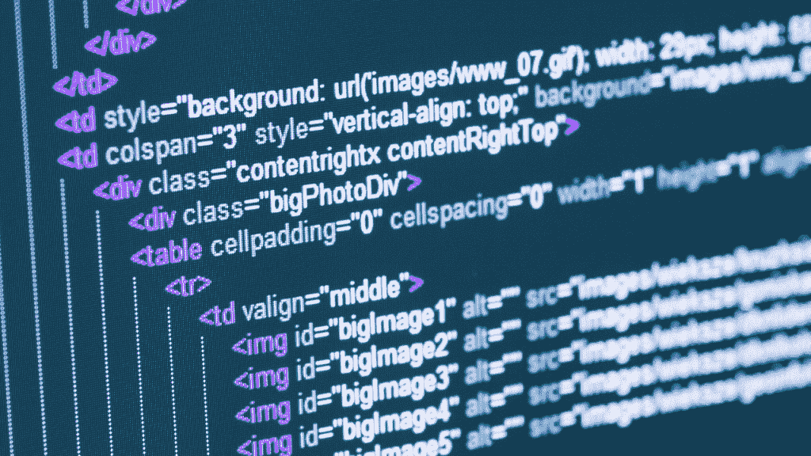
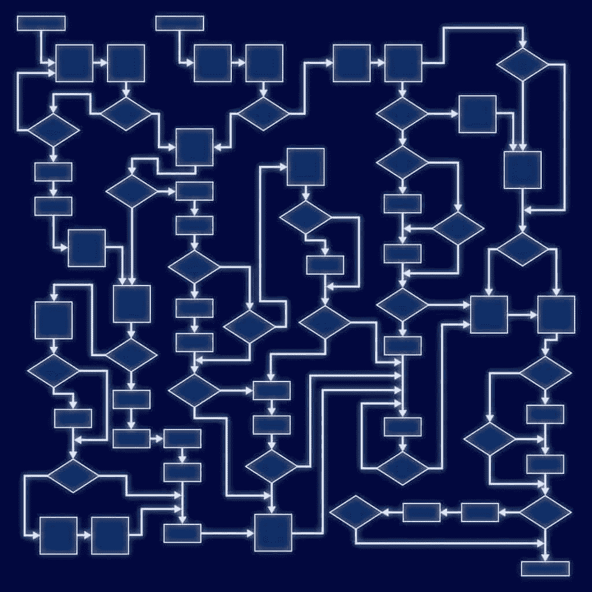

# 学习你的第一门编程语言

> 原文：<https://simpleprogrammer.com/learning-your-first-programming-language/>

好了，你已经决定了你想学什么编程语言，现在你已经准备好学习它了。

你需要做的就是打开一本书开始阅读，对吗？

不完全是。我的意思是，你可以那样做——如果你喜欢挫折的话。

还记得我们讨论过如何通过做来最好地学习**吗？**

这就是本章的计划。

我将向你展示学习你的第一门编程语言的理想方法，不仅仅是学习它，而是变得非常舒适和精通它，如果不是掌握它的话。

学习你的第一门编程语言可能是学习编程最困难的事情，但也不尽然。

大多数程序员——包括我自己——都是通过阅读一本书，尝试一些东西，绞尽脑汁，然后重读一本书，继续尝试，直到它最终“成功”

我要和你分享的是我辅导和教授许多软件开发人员的经验，不仅是学习他们的第一门编程语言，而且还提高了他们使用这门语言的技能。我还带来了自己掌握 C++、C#和 Java 等语言的经验。

基本上，在这一章中，我将向你展示**如果我处在你的位置，并且今天正在学习我的第一门编程语言，我会怎么做。**

## 从查看一个工作应用程序开始

大多数入门程序员，想学编程的时候，就拿起一本书开始读。

虽然有一些优秀的书籍试图以非常实际的方式教你编程，但我认为**最好的起点是通过查看实际工作应用程序的源代码**并试图尽可能多地了解正在发生的事情。

这很难。

会感觉不舒服，但没关系。习惯不舒服的感觉。这是生命中唯一真正的成长方式。

我想让你做的是选择一个开源应用程序——最好是一个流行的、可能设计良好的应用程序——并开始查看源代码。

你可以在 GitHub 上找到很多项目，所以我建议你去那里看看。

这超出了本书的范围，但是如果您可以下载代码并自己构建和运行应用程序，那就更好了。

如果你有一个朋友可以帮助你，那太好了。如果没有，也没关系。

重要的是你**探索代码，感受编程语言的语法是什么样子**，你**尝试阅读代码，看看你是否能理解或理解任何东西**。

如果可能的话，使用应用程序本身，这样你就能感觉到代码和代码做什么之间的关系。

就像我说的，这会让你感觉很不舒服。

你可能会觉得自己什么都不懂。

我再说一遍，没问题。尽你所能，看看你是否能弄清楚一两件事情是如何工作的，或者你可以在代码中做些什么来以某种方式改变功能。

此外，感受一下事物是如何命名和组织的。

假装你是一名考古学家，试图理解一些古代文明的文字。

以这种方式开始，**你将会比大多数程序员有一个很好的开端，他们甚至不知道他们想要学习的编程语言是什么样子的**。

在开始任何旅行之前先了解一下情况总是个好主意。

编程也不例外。

## 找到一些好的资源或书籍，浏览一遍

继续这个主题，在起航前了解情况，下一步不是从头到尾阅读一本编程书，而是**挑选几本书或其他资源——如视频、文章或教程——并浏览它们**。

再说一次，这至少会有点不舒服，因为你看到的大部分东西都没有多大意义。

但是……**这里的想法是确定领域**。你只是想知道你将要学习的东西有多大，以及一般的概念是什么。

当你知道你将要学习什么类型的东西，以及这些概念是如何建立在彼此的基础上时，这些额外的前期工作将会得到回报。

如果你已经参加了我的“[快速学习任何东西的 10 个步骤](http://10stepstolearn.com)”课程，你可能会认识到你在这里所做的事情本质上是获得全局并确定范围。

## 了解如何创建 Hello World

好吧，在这一点上你仍然不是在“读书”或参加培训项目。

如果你想的话，你很快就会这么做的。(如果你遵循这些步骤，你实际上可以不用那样做就能学会一门编程语言。我只用了大约两周的时间学习了围棋和飞镖，只使用了在线文档和一个类似于我们在这里讨论的过程。)

在这一点上，你想做的是**用你正在学习的任何编程语言尽可能地创建最基本的程序**。

还记得我们在“如何发展技术技能”一章中谈到的学习刚刚起步吗？

这是这里的目标。

**你想尽快开始**这样你就可以培养信心和知识，应用你将学到的东西，并立即付诸实践。

你将要开始的是一个非常基础的程序，叫做" [Hello World](http://www.amazon.com/exec/obidos/ASIN/1617290920/makithecompsi-20) "

大多数编程书籍都是从让你创建一个“Hello World”程序开始的，它通常只是将“Hello World”打印到屏幕上。

这里的想法并不是真的要学习太多关于语言的知识，而是**熟悉并测试用你选择的编程语言构建和运行程序**所需的基本工具链。

如果你正在阅读一本关于你的编程语言的书，它应该包含一个你可以创建的“Hello World”程序的例子。

如果没有，就在谷歌上搜索“Hello World +你的编程语言”你应该不难找到一个例子。

通过创建一个“Hello World”程序，你也将学会用你的编程语言编写程序的基本结构。

## 学习基本结构，并用实际问题测试它们

现在，如果你有一本关于编程语言的书或某种教程，你可以开始阅读或通读它。

在这一点上，你正在阅读或消费的东西不应该像你一头扎进去时那么神秘。

你现在要做的是熟悉你正在学习的编程语言的每个基本结构，然后写一些使用这些结构的代码。

你会想尽可能现实地思考与你所学相关的问题或应用，因为当你将一项技能应用于实际问题时，你会更好地理解和记忆它。

下面是大多数编程语言应该包含的一些基本结构的列表:

*   将输出写入屏幕的能力
*   基本数学能力
*   将信息存储为变量
*   将代码组织成函数、方法或模块
*   调用函数或方法
*   布尔逻辑评估的性能
*   转移条件语句(if / else)
*   循环语句

这里有一些好消息。

一旦你知道了这些基本结构以及如何使用它们，你就拥有了用任何语言编程的基础。是的，语法可能不同，但这是编程的核心。

你可能会在这个阶段花费大量的时间。

一次一个地学习你的编程语言的每个结构，并通过实际编写一些代码来应用每个结构。

如果你是独立工作的，你需要确定所有的结构是什么，以及学习它们的顺序。

如果你正在浏览一本书或教程(或者最好是多本书和教程)，路径应该已经为你安排好了，甚至应该有一些例子和挑战任务让你去做。

试着确保你总是理解你正在学习的东西以及如何应用它们。

现在是时候回到你在第一步中看到的原始源代码，看看你还理解了多少。

## 了解语言特性和库的区别

初学编程的人(尤其是使用当今的编程语言的人)经常会犯的一个错误是，知道什么是语言的一部分，什么是语言附带的标准库的一部分。

通常这种区别不是很明显，因为习惯上，你要编写经常使用标准库的代码。

没关系。你将需要知道你正在学习的编程语言中的编程惯例，但是你应该特别小心地试图弄清楚什么是实际语言的一部分，什么是经常与该语言一起使用的库的一部分。

这可能看起来有点吹毛求疵，但我认为这很重要，因为它将带走你此刻可能在脑海中漂浮的混乱的语法，并帮助你分类和组织它，使之更有意义。

你将意识到的是，对于大多数编程语言来说，实际的语言部分本身并不是很大，并且相对容易学习，但是标准库是很大的，了解它们将是更困难的努力。

今天的编程更多的是了解如何使用库和框架，而不是成为语言方面的绝对专家。

这就是为什么这种区分很重要的原因之一。

通过认识到什么不是语言的一部分，而是库的一部分，并学习如何查找库来完成你想在语言中完成的常见任务，你将成为一个更好的程序员。

## 审查现有代码，并通过理解每一行来工作

此时，您应该熟悉正在学习的编程语言的所有主要概念，并且应该已经在实际例子中使用了大多数编程语言特性。

您还应该对语言本身和与语言一起使用的库之间的区别有一个相当好的理解。

你可能仍然对这种语言感到不舒服，或者你真的知道这种语言。

在这个阶段，你可能会觉得你可以理解所有的东西是如何工作的，但是你不知道如何把它们放在一起编写一个真正的应用程序。

许多初学编程的人往往在这个阶段有点停滞不前，并感到沮丧，认为他们永远不会成为一名真正的程序员。

从这里向前推进并确保你的知识没有缺口的最好方法之一是**开始逐行查看现有的代码，确保你完全理解代码中的每一行和每一条语句在做什么**。(即使你不总是明白为什么，能够知道什么仍然是进步。)

您可以获取您在第一步中查看的项目的现有源代码，并开始随机检查项目中的文件。

打开一个文件，仔细检查文件中的每一行代码，确保你完全理解它在做什么。

如果你不明白——会有很多事情你不明白——花点时间想想，查查你不明白的地方。

这是乏味的。这可能会很无聊，但完全值得。

**当你觉得你可以阅读任何一行代码并理解它在做什么的时候——同样，为什么在这个阶段并不重要——你就准备好继续前进了**。

## 建造一些东西……许多东西

现在是真正开始使用编程语言的时候了。

此时，您应该已经编写了一些小程序并利用了该语言的大部分特性，但是一旦您开始实际构建真正的应用程序，您就会对该语言有更好的感觉。

选择一些小的项目想法——没什么大不了的——然后开始构建应用程序。

在这一点上，不要选择任何过于雄心勃勃的东西，也不要试图做任何特定于平台或 UI 密集型的事情。现在，您的应用程序最好将文本打印到屏幕上，并从键盘接受输入。

想法是**构建一些简单的应用程序，专注于利用你正在学习的编程语言和标准库**，而不是平台特性的额外框架——我们将在下一步讨论。

通过这样做，您将建立对编程语言的信心和使用它的能力，并且您将学习使用什么语言结构来达到您试图完成的目标。

这里有一些简单的项目想法，可以帮助你开始:

*   创建一个程序，**通过获取用户的输入来解决一个数学问题**。
*   创建一个**选择你自己的冒险类型的程序**，用户的输入决定接下来会发生什么。
*   创建一个非常简单的基于文本的冒险游戏,在这个游戏中，用户可以发出拿起物体、在房间中移动等命令。
*   创建一个能够从文本文件中读取输入并将输出写入不同文本文件的程序。
*   创建一个聊天机器人,它可以和用户交谈，假装是人类或者给出幽默的回答。

## 将编程语言应用于特定的技术或平台

到目前为止，您应该主要学习和使用您单独选择的编程语言。

这是有意的，因为您需要理解并熟悉编程语言本身及其标准库，然后再添加额外的复杂环境和其他框架来构建现实世界的应用程序。

为了用编程语言创造出有用的东西，你需要将它应用到特定的技术或平台上。

此时，您应该决定完成一些小项目，这些项目需要您在特定平台上使用编程语言。

例如，我们假设你正在学习 Java。

到目前为止，您编写的 Java 代码可以在 Java 可以运行的任何平台上运行，因为您主要使用标准库，只是处理屏幕或文件的输入和输出。

此时，您可能决定使用 Java 来构建一个 Android 应用程序。

你将不得不学习如何构建 Android 应用程序和 Android 框架。(这是利用“[快速学习的 10 个步骤](http://10stepstolearn.com)”计划的好地方。)然而，你已经熟悉了 Java，所以你不会在不知道什么是 Java 或者什么是 Android 的情况下试图一次学习大量的东西。

当然，你可以一起学习 Android 和 Java 事实上，[我参加了一个 Pluralsight 课程，专门教授如何做到这一点](http://shrsl.com/?~cqdz)——但是要真正掌握这门语言并避免混淆，将这门语言从平台或技术中分离出来，然后将它们结合起来可能会容易得多。

现在，你将通过你正在学习的编程语言来发展特定的、专业的技能，这对找工作很有用。

选择你认为将来最有可能使用的平台或技术，并开始用它创建一些小的应用程序。

[我还建议你目前只专注于一种技术或平台](https://www.youtube.com/playlist?list=PLjwWT1Xy3c4W5SK-MGjp_KSFZF2pEMCt8)。以后你总能学到更多。

通过专业化，你不仅会限制你在这一点上必须学习的东西，而且你会让自己在特定的技术上获得更深的知识和能力，这将使你更加自信，并大大增加你的技能的市场价值。

## 用语言解决算法难题掌握它

到现在为止，你应该对你正在学习的编程语言相当熟悉了。

您应该非常了解它，并且在各种不同的应用程序中使用过它。

你应该有一个具体的技术或平台，你已经应用了你的技能，并能自如地使用该技术创建基本的应用程序。

然而，**你可能仍然觉得自己没有掌握编程语言**。

不用担心；这也很正常。

当我第一次学习 C++时，我记得即使我理解了语言的一切，实际上已经使用它创建了几个应用程序，甚至作为一名开发人员编写 C++代码，**我仍然不觉得我真正掌握了语言**。

我觉得我是一个优秀的 C++程序员，但不是伟大的。

我真的很想提高我的 C++技能，但是我不知道怎么做。

然后，[我发现了这个叫 Topcoder 的编码比赛网站。](https://simpleprogrammer.com/2010/04/02/so-you-want-to-become-a-better-programmer-topcoder/)

每周都有一系列新的编程挑战，你可以与其他程序员竞争解决一些相当困难的算法问题。

起初我很可怕。我甚至不能解决最简单的问题。

我会看其他人的解决方案，但我不知道他们是如何想出这个解决方案的，甚至不知道他们的代码是如何工作的。

他们以一种我从未想象过的方式使用 C++。

但是，随着时间的推移，当我不断尝试解决问题，并观察其他人如何解决问题时，我开始变得更好…好得多。

我开始看到某些类型的问题是如何解决的。

我开始真正理解如何利用我以前忽略的 C++特性。

我学会了如何有效地使用标准库和语言特性以及数据结构来解决复杂的问题。

我不仅精通 C++，而且非常擅长。我终于觉得自己好像掌握了这门语言。

这就是我想要你做的。

你不必上 Topcoder 去竞争，但是有很多地方你可以练习解决算法类型的编程问题。

对于这类问题，我已经提到了一个很好的资源，但这里还有一些:

*   Gayle Laakmann McDowell 的《破解编码访谈》
*   乔恩·本特利的《编程珍珠》
*   [项目欧拉](https://projecteuler.net/)
*   [编码](https://codility.com/)
*   [面试蛋糕](https://www.interviewcake.com?utm_source=simpleprogrammer)
*   [Topcoder](https://www.topcoder.com/) (查看算法竞赛的练习室)

**这些问题一开始会极其困难**，那就 ok 了。他们应该是。

你会发现，随着时间的推移，你会开始认识到只有少数几种类型的问题，你会开始能够立即找到解决它们的方法。

起初，你不知道该做什么，就像我说的，没关系——继续尝试。

此外，不要忘记看看其他人是如何解决你正在努力解决的问题的。试着理解他们为什么用他们的方式解决特定的问题。

这是我能够学习如何解决这类问题的最好方法之一。

我会在 Topcoder 上查看顶级程序员的解决方案，我会学到很多东西。

一旦你可以用你正在学习的编程语言解决这些类型的编程问题，你不仅非常接近掌握这门语言，而且当其他候选人汗流浃背的时候，**编码面试对你来说也是小菜一碟。**

在这个阶段，你会吸收大量信息。有好的和坏的方法来做到这一点——查看我的课程[快速学习任何东西的 10 个步骤](https://simpleprogrammer.com/store/products/learn-anything-quickly/)来获得一些提示。

* * *

