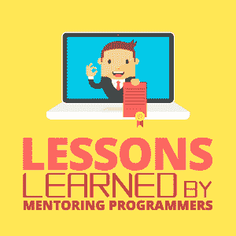

# 指导程序员的经验教训

> 原文：<https://simpleprogrammer.com/lessons-learned-mentoring-programmers/>

Over the last two weeks, I’ve been mentoring programmers on [Exercism.io](https://exercism.io) on the Python language track. I saw the call for mentors on Twitter and wanted to help out.

程序员提交他们对特定练习的解决方案，这些解决方案伴随着测试，他们的工作就是让测试通过。然后，导师——在这个例子中是我——对他们的解决方案提供反馈，他们不断重复，直到导师签字同意。

教别人是一件令人兴奋的事，但我也学到了一些令我惊讶的东西。我想分享这些东西，以帮助其他对指导程序员感兴趣的人拥有像我一样好的导师-学员关系。

## 1.你现在准备好成为一名导师了

我真的不认为我已经准备好成为一名导师。我是说，我有什么资格批评别人的代码？我只是一个自学成才的业余爱好者——我甚至从来没有专业地写过代码。但是在指导了我的前几次练习后，我意识到如果你有正确的方法，就没什么好害怕的。

真的只有两种可能的情况。让我们来看看这两种情况:

1.  在这个特定领域，你指导的人比你知道的少，或者经验比你少。太好了！你可以分享你的知识，帮助他们提高水平，并感觉自己是个了不起的人。
2.  你指导的人知道得更多，经验更丰富，或者提出了你想不到的解决方案。在这种情况下，只要你有礼貌，体贴，遵守下面的规则，一切都会好的。你最终会从他们那里学到新的东西，你会告诉他们他们做得有多好，然后你会继续下一个。

不管是哪种，都没什么好怕的。如果更有经验的学员过于令人生畏，总会有更容易的练习，学员往往是新手。

## 2.你的意见很重要

你的意见对学生来说比你们任何一个人有意识承认的都重要。在过去的几个星期里，我尽我所能去寻找每一份提交材料中我喜欢的部分，并对其进行评论。

“我喜欢你将一些逻辑分解成一个辅助函数，使你的主函数更加清晰。”

“你的解决方案是我所见过的最简洁、但可读性最好的解决方案之一！”

我惊讶于我经常收到这样的回复:

“非常感谢您的反馈，这对我意义重大。”

“我是个新手，对自己的代码不是很有信心，所以这让我很开心。”

*“谢谢！我真的希望我们能再次互动。”*

我展示这些例子并不是为了展示我是一个多么好的导师(#worldsgreatestteacher)。相反，这些例子显示了导师的反馈能产生多大的影响，即使从统计上看，我可能比我指导的人更年轻，经验更少，即使他们知道我只是评论框另一端的一个爱好者。得到别人认为你在某件事情上做得很好的确认总是意义重大。

同样，负面反馈有能力摧毁某人的兴趣和动力。

我认识到，花几分钟时间去发现我的学员工作中的积极方面，并不会让我付出任何代价。我学会了用爱传递反馈，并记住激励学生的最终目标是帮助他们提高自己。不管怎样，仅仅是“导师”这个头衔就让我对他们的学习、情绪和动力产生了惊人的影响。

## 3.格式是最容易注意到的，也是最不重要的

当你看到一个学生的解决方案时，你脑海中会出现一种或多种解决问题的可能方法，你希望看到其中一种方法的某种形式。所有与你做事方式不同的事情都会跃然于你眼前。我的第一个想法是想直接进入他们的代码，然后在做其他事情之前马上修复它。

这也是对学生帮助最少、打击最大的事情，因为他们认为这是吹毛求疵、无用的反馈，只会让导师感觉更好——他们是对的！

因此，我想出的解决方案是克服糟糕格式的烦恼，并努力确保他们理解这个特定练习的重要概念。在我的反馈的最后，一旦其他一切都好了，我可能会提到他们研究了该语言的格式标准，并推荐了 linter 或自动格式化程序。

每次我这样做的时候，他们都很兴奋地学习那些工具和标准，并没有感到沮丧。

## 4.你的方式并不总是唯一的方式

Another side effect of having a few possible solutions in your head is that other methods that *might be* correct may initially look wrong. Always consider whether the criticism you’re providing is the Right Way™ or just a personal preference, and when in doubt, err on the side of personal preference.

导师的意见很有价值，大多数学员肯定会感谢这些额外的信息，但重要的是要让学员清楚你的反馈*何时*只是个人偏好，除非你*确定*你在阻止他们做错也 TM 。

## 5.你没有浪费他们的时间

我不得不有意识地强迫自己不要因为批评或要求修改代码而道歉。我知道这是我的内向，但我的直觉是，他们并不真正关心我的反馈，他们只是想让我签字，这样他们就可以继续下一个练习。我有这种感觉，尽管从来没有一个学员告诉我我在浪费他们的时间！两件事帮助我克服了这种反应。

首先，我知道在 Exercism 上有两种模式:有指导的和独立的。我指导的人*选择了*接受指导。这是他们想要的。如果他们不想被指导，我可以很高兴地告诉他们~~走开~~切换到独立模式。

第二，我使用正确的方式/个人偏好分割作为何时要求另一次迭代的粗略指南，而不是接受他们的解决方案并简单地建议另一次迭代。如果我的反馈阻止了他们做错，我浪费他们时间的感觉就会大大减少。

## 6.使用问题进行协作

提供反馈时，最好假设最好的情况，给学员一个机会来为自己的决定辩护，将我的反馈表述为一个问题，而不是告诉他们他们错了。

我注意到你使用了索引来循环这个列表。你没有用‘枚举’来代替是有原因的吗？”

问这个问题会立即让对话变成导师和学员之间的合作，而不是竞争。这给了他们一个机会来解释他们的思考过程以及他们所想到的不同选择的利弊。它提供了对他们的[解决问题技巧](https://simpleprogrammer.com/coding-problem-solving-skills/)的洞察，并排除了他们已经尝试过的解决方案，这些解决方案不必向他们解释，以便后续的指导可以更加有效。

## 指导是爱

你会注意到，所有这些规则只是指导就是爱这一概念的具体应用。罗伯特·巴伦主教给“爱”下了一个我非常喜欢的定义:**爱是为了对方的利益而愿意为对方做好事**。当你在指导时，如果你牢记你的首要目标是帮助他人理解、学习、激励和成长，你就不会出错。

你不会说得他们无法理解或居高临下，因为你知道那对他们没有帮助。

你会问他们一些关于他们思维过程的问题；在你能有效地指导他们之前，你需要了解他们知道什么。

你会为他们加油，庆祝他们的好决定，因为你想让他们保持学习的热情。

即使他们的工作并不完美，你也会知道什么时候让他们继续前进，因为还有很多东西要学。

你要提供工具和解决方案，而不是挑剔他们的缺点，因为你想帮助他们避免将来出现问题。

指导是爱和希望他人成长，如果这是你的目标，那么你也准备好成为一名导师。