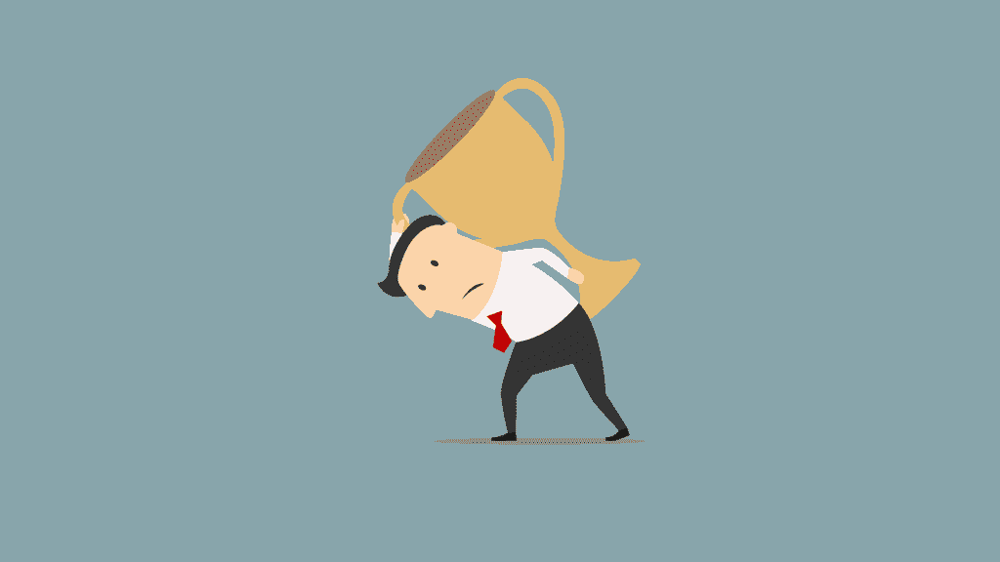
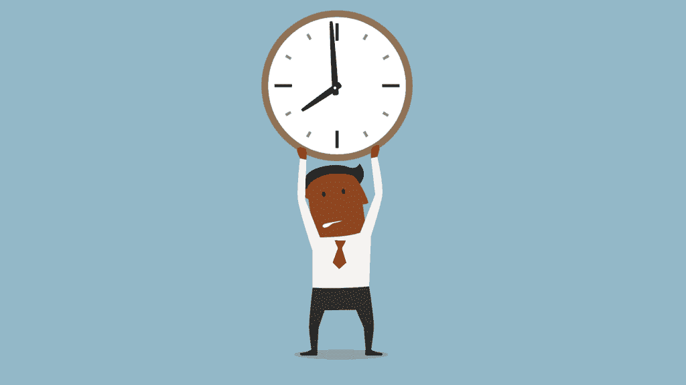

# 充分利用你有限的意志力，成为一名更好的程序员

> 原文：<https://simpleprogrammer.com/limited-willpower/>

我听到的最老生常谈的一句话是，我们都应该更加努力。

如果你没有减肥，那么你应该更加努力。如果你更加努力的话，也许你能编码出那个解决方案。

老实说，我不是一个更努力尝试的粉丝。我告诉你一个小秘密:我一点也不努力。

在过去的两年里，我从一份我讨厌的工作转向了一份我热爱的工作，那就是软件开发人员。我自学了编码，同时也让我的投资增长了 100%，学会了深蹲超过 170 公斤，并赢得了我第一次举重比赛的新手组，我说这些不是为了吹牛。相反，我承认我的意志力有限，并精简了我的思维，这样我就可以事半功倍。

今天我将与你分享我的过程，并解构一些关于生产力的流行神话。

## 摆脱更加努力的神话

自从你开始阅读这篇文章以来，[比尔·盖茨已经赚了将近 1000 美元](https://www.quora.com/How-much-money-does-Bill-Gates-make-per-second)。

那段时间比尔在工作吗？有可能，但是他并不比下一个人更努力。

比尔·盖茨和其他人一样有 24 小时，但他建立了一个庞大的系统，即使他睡觉也能继续给他发工资。西方文化喜欢相信更努力工作可以赚钱，然而比尔·盖茨的思维方式与众不同，这让他可以取得更大的成就。

这类似于任何一个比其他人成就更大的人。他们有一种不同的做事方式，可以得到更好的结果。他们构建的系统类似于一个懒惰的程序员，但不知何故他们最终获利了。怎么会？

说到做事，有四种类型的人:

1.  无所事事的人
2.  做事半途而废的人
3.  以这种方式完成任务的人没有人必须再做一遍
4.  每次被要求时都做得最好的人，却从来没有建造过可以长期完成任务的东西

显然，第三点是对时间的最佳利用，因为这个人已经建立了一个取代所有人的系统——甚至是他们自己。然而，我们总是很快表扬第四位的努力工作者，即使从长远来看，第三位花费的精力和成本最少。

我们程序员本能地知道，计算机更擅长做小的、重复的任务，把人们从不必要的单调中拯救出来。现在，如果你能把这种想法应用到你的意志力上，会怎么样呢？

当谈到软件开发时，我们总是在寻找使项目更容易管理的方法。一个很好的例子是“不重复自己”的简写。DRY 的想法是确保在整个项目中不使用相同的代码。相反，我们使它模块化，所以我们可以在任何地方使用它，而不需要重复工作。

DRY 原则不仅仅适用于我们如何构建软件；我们实际上可以在一生中使用干原则。

## 意志力是有限的

尽管我们总是被告知必须付出巨大的努力才能获得回报，但我们的意志力在一天中逐渐减弱。每个决定都耗费我们的精力。

事实上，人们在晚上会有和白天完全不同的观点。即使像巴拉克·奥巴马这样极其忙碌的人也会限制他们一天中必须做出的决定，这样他们就能在关键时刻最大限度地利用自己。

当我读到像马克·扎克伯格这样的成功企业家做同样的事情时，我想到也许我也应该限制决策。以下是几个关键的方法。

### 自动化你的财务

自动理财是我用钱做的最明智的事情。我一个月花不到一个小时考虑我的钱。它的工作方式如下:

*   发薪日是每月的 25 号
*   我的养老金在打到我的银行账户之前已经从我的薪水里扣除了
*   我所有的账单都通过我的信用卡支付，在发薪日结清
*   投资和储蓄也在第二天被转移
*   剩下的钱都是让我在这个月剩下的时间里自由支配的

光是这种结构就节省了我做大量决定的精力和随之而来的担忧。

通过自动管理你的财务，你不仅消除了做这件事的行为，还消除了财务中的许多情感因素，这释放了大量的精神空间。这种结构对于那些采用[不要重复自己](https://en.wikipedia.org/wiki/Don%27t_repeat_yourself)口号的懒惰程序员来说很有意义，这种口号提倡只写一次代码，这样它就可以在项目中任何需要的地方使用。

### 规划我日历上的一切

我人生中最大的改变之一发生在两年前，当时我把所有事情都放在了谷歌日历上。

这包括我去健身房的次数，和朋友的约会，以及学习小组。这里可以看到一周的示例。这释放了那个阻止我记起在特定时间我必须做什么的精神空间。

我的作息规律被设定在数字石里，这个习惯让我在两年多的时间里，每周坚持去健身房三到四次。

我从来不会错过和朋友的聚会，也不会因为开会迟到，因为我会提前一个月做好计划。

### 外包粗活

每个周末我都把时间花在打包衣服和把它们放进洗衣机里。然后在它们完成后，我会把它们挂起来，这需要一天的时间(也占用了我阳台的空间)。之后，我不得不拿走所有的衣服并叠好。

这个过程很麻烦，更糟糕的是，我做得很糟糕。

所以我做了一些调查，发现我可以雇佣一家服务公司帮我熨衣服和洗衣服，这样每周平均可以节省三个小时。这只需要 18 美元，节省了我三个小时的时间。

这意味着我有更多的时间花在我能挣更多钱的事情上——比如编程或学习一项新技能。我的时间价值超过每小时 6 美元。

我开始寻找其他浪费家庭时间的东西，发现很多我可以消除的，比如打扫卫生。经过一番调查，我找到了一个网站，在那里我可以以每小时 12 美元的价格雇佣一名清洁工。最棒的是清洁工比我做得更好。

烹饪是另一个可能浪费时间的事情。在购买食品杂货、准备食物和之后的打扫卫生之间，很多时间可能会出错。食物很重要，我不能只点外卖，因为我想吃得健康。幸运的是，我所在的城市有一项服务，可以提前为我做 10 份健康的饭菜。这些食物是为运动员设计的，因为有很多运动员，所以我可以带他们去工作。

外包不仅仅包括使用服务。你也可以购买为你工作的机器。像洗碗机和 Roomba 吸尘器这样的东西是天赐之物，可以节省你的时间和精力，让你专注于生活中最重要的事情。

很多这样的事情都需要先花点钱，然后才能得到好处。这就是你必须明白什么更有价值:你的时间还是你的钱。

## 剔除不重要的

有一次，我花了四天时间修复一个影响超过五个人的 bug。

在 100，000 多个访问者中，我在这个完全不影响收入的 bug 上浪费了 5 天。那次经历之后，我意识到最好是关注那些有最大影响的事情。我们的日常生活充满了无助于大局的微小行为。

在由于拼写错误而意外导致奇怪的错误、不断地搜索问题和陷入超级程序员的传奇之间，程序员很难不倾向于[相信我们不够好](https://simpleprogrammer.com/2016/06/09/matter-people-smarter/)。我总是有一种挥之不去的感觉，有人会揭露我其实是个骗子，我不会编程的真相。

尽管有人付钱让我成为一名应该懂代码的程序员，但我总觉得我的知识有差距，总有一些东西我必须学习。有这种感觉的不止我一个。其他程序员也写了关于它的文章。

因为这种不安全感，我们最终会浪费时间去试图实现太多的目标。有时可以学习如何使用闪亮的新 JavaScript 框架或新的后端语言，这种语言有望消除以前语言的痛苦。也有许多针对每种语言和框架的时事通讯和教程，以及大量的书籍和讨论网站。

在这个行业，如果你试图跟上，你将永远是在与九头蛇战斗。砍掉一个头，另一个代替它。我的建议是放弃试图跟上。只学必要的东西。跟上是一场永远赢不了的战斗。我并不是说要放弃努力去跟上，但是不要让自己因为试图跟上可能不相关的信息而处于压力之下。这是太多的信息，可能会分散你的注意力，让你觉得自己很有效率。为了实现深入的工作，我们需要把它当作一种可能的行动威慑。

例如，我花了一年时间用 Ruby 1.9.3 开发应用程序。我们最近升级到了 2.0.0。那一年，Rails 的全新版本已经发布，Ruby 已经升级，我在项目中使用的无数库总共发布了 500 页的更新。这些更新并不会真正影响到我，直到发生了一些事情让我去调查这个问题。

将这些更新视为干扰并消除它们是很重要的。

当我们完全排除电视、新闻、博客、新闻聚合网站和社交媒体等干扰，并采用低信息饮食时，我们就能够[拥抱深度工作，并尝试一次只专注于一项任务](http://www.amazon.com/exec/obidos/ASIN/1455586692/makithecompsi-20)。

## 取代意志力的新习惯

当我们谈论节食或去健身房时，意志力和发挥更多意志力的需要经常出现。很多精神能量都花在了努力不去想最后一个美味的甜甜圈和它所代表的完全满足的梦想上。

食物与我们的潜意识习惯有着内在联系。在查尔斯·杜希格的《习惯的力量》一书中，作者描述了这些习惯如何比意志力更能决定我们的行为。

我们的大脑喜欢习惯，因为它们帮助我们消耗更少的能量。

当你学习一项新技能时，比如骑自行车，大脑会试图找到一种方法，在其膜上“创建一个凹槽”，因此它可以很容易地记住在需要时如何执行任务。

仅在骑自行车时，大脑首先必须学会如何通过上下交替双腿来踩踏板，转向，平衡，换档，并在需要时踩刹车。在学习新技能的情况下，大脑决定将这些任务推给负责习惯的部分。

由于大脑试图让几乎每一个动作都成为习惯，所以了解如何创造这些习惯真的可以帮助人们做他们从未想过可能的事情，比如戒烟或学习编码。

养成习惯有三个步骤:

1.  暗示——这是触发行动的时刻
2.  行动–这是您想要执行的行动/例行程序
3.  行动的回报——这是为了让你的身体更频繁地做这个动作

每天早上醒来，我都会躺在床上，拿出手机浏览脸书。这是我的一个坏习惯。这个习惯的线索是醒来打开我的手机，这个动作是打开脸书，回报是看到我的朋友在做什么而产生的多巴胺。

为了打破这个习惯，我把手机里的 app 卸载了，把手机放在了我的床脚。我被迫起床，现在我吃一点点巧克力来奖励自己起床。

新的线索是闹钟。起床，关掉闹钟，走向厨房。奖励是一点食物。了解了习惯的力量后，我开始思考如何改变我潜意识中的习惯，从而变得更加有效。

由于早上醒来是一件小事，我也把这个例子应用到我生活的其他领域，这带来了巨大的改善。通过将健身房纳入习惯循环，我在健身房变得更加稳定。我还学会了坐下来定期学习，最终找到了一份自学程序员的工作。

了解习惯最大的好处是，你可以用有限的意志力去完成最重要的任务，而这些任务需要最大的脑力。随着一个人在这方面做得越来越好，就越来越容易进入编码的禅境，也越来越容易让自己适应学习新的技能。

## 最后的总结:修正有限的意志力

我们从解决一个突出的问题开始这篇文章。我们了解到，更加努力并不总是会带来更多的结果。比尔·盖茨在他的余生(甚至更长时间)都在享受他早期在微软工作的红利，因为他创造了一个比他自己更大的系统来满足他的需求。

一天中，许多小的选择和行动耗尽了我们的意志力。即使花一点时间决定早上穿什么，也会让你在一天的晚些时候付出代价。

现在想象一下这些决定在一周、一月、一年中花费了我们多少。处理小任务花费的时间开始增加，这就是为什么我们引入系统来应对我们做的常见任务。

这些小小的举动累积起来会造成大量的人才流失。减轻这种人才流失的一些建议包括自动管理你的财务，在你的日历上计划事件，将琐碎的任务外包给别人，以及消除不重要的事情。

在我们减少了精神负荷之后，我们研究了如何创造自动化的习惯。大多数人类行为是由我们的大脑自动完成的。当我们的大脑感觉到奖励即将到来时，它会接受一项新技能，并将其整合到我们身体的肌肉记忆中。

学习如何养成习惯可以带来一系列的好处，比如减少决策疲劳和修复有限的意志力。正如我们已经提到的，要养成一个习惯，我们需要确定我们想要创造的行为，触发一个习惯的线索，最后，奖励我们自己来强化这个行为。养成习惯只是减少决策的另一种方式。

当我第一次构思这篇文章的时候，它应该是关于修复有限的意志力，但是从那以后就转向了完全避免使用意志力。有些人认为意志力可以像肌肉一样训练。你用得越多，你就会得到越好的结果。我确信这是可能的，但是首先避免使用它要容易得多。

例如，当我过去节食的时候，有几天抵制巧克力棒太多了，我什么也做不了。有一天，我有太多的决定要做，抵抗渴望变得太难处理了。巧克力很好吃，但是对我的饮食没有好处。通过减少我必须做的决定的数量和学习更多的习惯，我变得更好地坚持我的饮食。

你也可以通过减少日常琐事的总量，释放更多的认知空间来完成那些能为你的生活和他人增加价值的任务。下次你发现自己在努力实现目标时，试一试。你会失去什么？